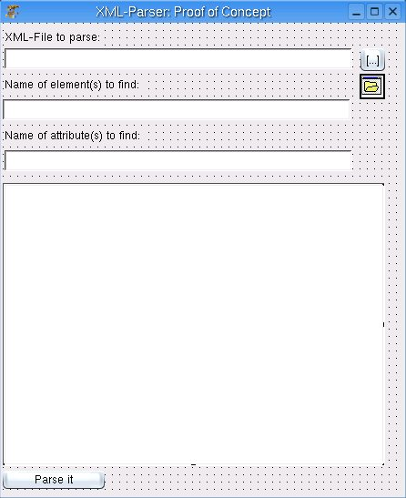
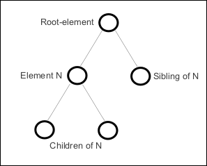
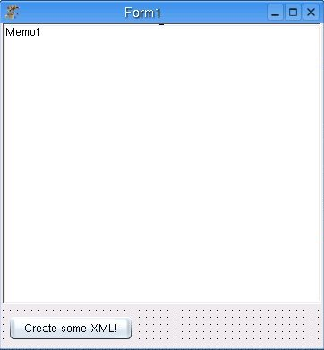
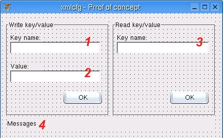

url: http://web.archive.org/web/20071218084833/http://www.thomas-zastrow.de/texte/fpcxml/dom-reading.php

Reading XML-files with the Document Object Model (DOM)


------

*Copyright by [Thomas Zastrow](http://web.archive.org/web/20071218084833/http://www.thomas-zastrow.de/).*

*[Download](http://web.archive.org/web/20071218084833/http://www.thomas-zastrow.de/texte/fpcxml/dom-reading.tar.gz) the code of the example-project*

------

The Document Object Model (DOM) is an official [specification of the W3C](http://web.archive.org/web/20071218084833/http://www.w3.org/DOM/). It describes how to parse an XML-structur and adress elements, attributes and contents. Compared to the SAX-approach it is more comfortable for the user, but also needs more CPU-performance and RAM.

The FPC comes with the Unit dom.pp (fcl/xml/dom.pp). With it's help parsing a XML-file is done with a few lines of code.

After starting Lazarus create a new application and put some widgets on the start-form:



There are three TEdit-fields, one TMemo, two buttons and an OpenFile-dialog.

The first TEdit-field (named XMLFile) takes the name of the XML-file which has to be parsed. The button beside it is for opening the XML-file via file-dialog. The OnClick-Procedure of the button has the code:

```
procedure TForm1.Button1Click(Sender: TObject);beginif opendialog1.execute thenbeginXMLFile.text := opendialog1.filename;end;end;
```

The second TEdit-field takes the name of a XML-Element which has to be find in the XML-file and the third TEdit-field stores the name of an attribute to find. These widgets are renamed to element2find and attribut2find.

The Memo-field (named output) is for storing the output of the parser. And - last not least - the button with the caption "Parse it" will start the parsing.

Additonally in the use-line of the procedure the units XMLRead and DOM has to be included.

The OnClick-procedure of the "Parse it"-button:

```
procedure TForm1.Button2Click(Sender: TObject);var doc:txmldocument;temp:TDomNode;beginoutput.lines.clear;ReadXMLFile(doc, XMLFile.text);temp := doc.DocumentElement;ParseXML(temp);end;
```

ReadXMLFile assigns the whole XML-document to the variable doc. Then the root-element is extracted to temp. The procedure ParseXML will do the properly parsing.


*The relationship of nodes in a XML-structure*

So, ParseXML starts with the root-element of the XML-file. This element will be analysed and - if there are any child-nodes - the procedure will call itself again, now with the child-element as argument.

Step by step - the procedure ParseXML:

```
E:=knoten as TDomElement;N:=E.FirstChild;
```

The actual XML-element - let's call it the context-node - is assigned to E as TDOMElement. N takes the first child of the context-node.

Let's take a look at the while-loop:

```
While (N<>Nil) do...N:=N.NextSibling;
```

It runs through all siblings of the actual context-node. At the end of the loop the next sibling of the actual context-node become the actual context-node.

Again at the beginning of the loop:

```
addToOutput(N);
```

The procdure addToOutput is called with the actual context-node as argument. This procedure is used to build a string which is finally added to the TMemo-widget called "output".
At first, the string s gets the name of the node which was given to output as an argument:

s:= 'Name: ' + N.NodeName;

Remember that on our form is a TEdit-widget called element2find. If the name of the actual node is the same as the text-property of that TEdit-widget - we found the element we were looking for:

```
if N.NodeName = form1.element2find.text thenbegins := s + ' Found element!';end;
```

Looking for the attributes to find (text-property of the TEdit-widget attribut2find) is a little bit more complex:

```
if N.NodeName <> '#text' thenbeginE := N as TDOMElement;i := E.attributes.count;s := s + ' Count Attribute ' + inttostr(i);if E[form1.attribut2find.text]<>'' thens := s + ' Found Attribut';end; {nodename <> text}
```

If the content of a node is just text - there are no more siblings or children - its name is #text. And a text can not have any attributes. Next, the TDOMElement E is assigned to the node. Now the attributes can accessd by the property attributes of E.

The number of attributes is attached to the string s. If the condition of the if-enquiry is true the element has an attribute which name is identically with the text-property of attribut2find.

Back in the procedure ParseXML the next enquiry checks if the context-node has any children:

```
if N.HasChildNodes thenbeginI:= N.childnodes.count;sub := N.FirstChild;addToOutput(sub);
```

If this is the case, the first child of the context-node is assigned to sub. Again the procedure addToOutput is called - now with sub as argument.

Then the recursion starts - if sub again has any cildren, the procedure ParseXML is called again with sub as argument:

```
if sub.haschildnodes thenbeginParseXML(sub);end;
```

At this point, remember that sub was the first child of the actual context-node. Its siblings are left over - so they are handled by a for-loop:

```
for zaehler := 1 to i-1 dobeginsub := sub.NextSibling;addToOutput(sub);form1.refresh;if sub.HasChildNodes thenbeginParseXML(sub);end;end; {for zaehler}
```

Parsing the example-file test.xml produces the following output, searching for the element named two and the attribute a:

```
Name: one Count Attribute 0Name: two Found element! Count Attribute 0Name: #textName: three Count Attribute 2 Found AttributName: child_of_three Count Attribute 0Name: #text
```

That's it.


url: http://web.archive.org/web/20080110091953/http://www.thomas-zastrow.de/texte/fpcxml/dom-writing.php

Creating XML-structures with the Document Object Model


------

*Copyright by [Thomas Zastrow](http://web.archive.org/web/20080110091953/http://www.thomas-zastrow.de/).*

*[Download](http://web.archive.org/web/20080110091953/http://www.thomas-zastrow.de/texte/fpcxml/dom-write.tar.gz) the code of the example-project*

------

This tutorial deals with creating XML-structures. For this purpose you need a new Lazarus-application with a TMemo-widget and a Button on the start-form:



The units DOM and XMLWrite needs to be included in the uses-statement.

Clicking the button will create a simple XML-structures, save it to a file and display the XML-code in the TMemo-field.

Let's have a look at the button's OnClick-procedure:

After creating doc (the new XML-document), N and sub (two TDOMNodes) the root-element (named "root") of the XML-file is created:

```
N := doc.CreateElement('root');doc.Appendchild(N);
```

N is then assigned to the new root-element. sub will be a child of N ("RootsFirstChild"). Adding an attribute to sub is done by the TDOMElement E (AttributeName="SomeValue"). Afterall N is appended by sub:

```
N := doc.DocumentElement;sub := doc.CreateElement('RootsFirstChild');E := sub as TDOMElement;E['AttributeName']:='SomeValue';N.AppendChild(sub);
```

Another child ("RootsSecondChild") is added to root:

```
sub := doc.CreateElement('RootsSecondChild');N.AppendChild(sub);
```

At least, some text should be added to the last node. Text as content of a XML-node is handled like a child-node itself: N is assigned to sub and sub will be the text-content (CreateTextNode('Text-content')). sub is appended to N:

```
N := sub;sub := doc.CreateTextNode('Text-content');N.AppendChild(sub);
```

A few lines complete the procedure. The XML-structure is written to a file ("xml-file.xml"). Finally, this file is displayed in the TMemo-widget:

```
writeXMLFile(doc, 'xml-file.xml');memo1.lines.clear;memo1.lines.loadfromfile('xml-file.xml');doc.free;
```

The whole XML-file:

<?xml version="1.0"?>
<root>
<RootsFirstChild AttributeName="SomeValue"/>
<RootsSecondChild>Text-content</RootsSecondChild>
</root>

```
Text-content
```


url: http://web.archive.org/web/20080110091231/http://www.thomas-zastrow.de/texte/fpcxml/config-xml.php

Using XML for configuration-files


------

*Copyright by [Thomas Zastrow](http://web.archive.org/web/20080110091231/http://www.thomas-zastrow.de/).*

*[Download](http://web.archive.org/web/20080110091231/http://www.thomas-zastrow.de/texte/fpcxml/xml-cfg.tar.gz) the code of the example-project*

------

The FPC comes with an unit called xmlcfg.pp. This unit is specialy designed for reading and writing configuration-data in the form of key-value-pairs. The underlying file-format is XML - but using xmlcfg.pp the programmer hasn't to deal with the complexity of parsing XML-data.

The following little Lazarus-application will show you how to use xmlcfg.

Create a new Lazarus-application and put some widgets on the start-form:



Make sure you have included xmlcfg in the uses-condition!

The red numbers one, two and three are marking TEdit-fields with the names:

- 1: KeyName2write
- 2: Value2write
- 3: KeyName2read

Number 4 is a label-component named messages.


The widgets in the left group called "Write key/value" are for creating a new value in the config-file. The right group ("Read key/value") is for reading a key/value-pair from the config-file.

Now, just enter something as key-value-pair in the two left TEdit-field and click the left "OK"-button. This will create a new XML-file called "myconfig.xml".

myconfig.xml will look something like that:

``

Here the file contains a key "MyName" with the value "Tom".

Take a look at the OnClick-method of the left "OK"-Button:

```
procedure TForm1.Button1Click(Sender: TObject);var cfg: TXMLConfig;s:string;begincfg := TXMLConfig.create('myconfig.xml');cfg.SetValue(KeyName2write.text, Value2write.text);cfg.free;Messages.caption := 'Key/value was saved!';end;
```

The TXMLConfig-component cfg is created and the file "myconfig.xml" is assigned to it. If the file doesn't exist it will be created. Then the key-value-pair (Keyname2write / Value2write) is written to the file using the **Set**Value-procedure of cfg.

Freeing cfg and write a success-message to the label Messages completes the procedure.

Simple, isn't it?

As simple as writing to config-files is reading key/value-pairs from them.

Given the name of a key to the text-property of the TEdit-widget KeyName2read and clicking the second "OK"-button will query the config-file "myconfig.xml" for that key. It's value will be written to the Messages-label. The OnClick-procedure of the second (right) "OK"-button:

```
procedure TForm1.Button2Click(Sender: TObject);var cfg: TXMLConfig;s:string;begincfg := TXMLConfig.create('myconfig.xml');s := cfg.GetValue(Keyname2read.text, '');Messages.caption := 'The value of ' + KeyName2read.text + ': ' + s;cfg.free;end;
```

Again, cfg is created and the file "myconfig.xml" assigned to it. The string s is set to the value of the searched key by the function **Get**Value of cfg. It's then written to Messages and cfg is freed.

**First Remark**

You can also write / read integer- and boolsche-values as content of a key to the config-files.

**Second Remark**

The config-file can have a hierarchical order. Aparted by a "/" the key-value-pairs can be ordered in more detailed categories.

For example, creating the following key/value-pairs:

```
author/tom := chiefauthor/tom/email := chef@thomas-zastrow.de
```

This results in the following XML-file:

``

<?xml version="1.0"?>
<CONFIG>
<author tom="chief">
<tom email="chef@thomas-zastrow.de"/>
</author>
</CONFIG>