**Free Pascal User’s Guide**

_____________________________________________________________________
*User’s Guide for Free Pascal, Version 3.2.0*

*Document version 3.2.0*

*June 2020*

**Authors**:

- Michaël Van Canneyt
- Florian Klämpfl

*Автор перевода: Zoltanleo a.k.a Док*

____________________________________________________________________________

[TOC]

# Глава 1

## Вступление.

### 1.1 Об этом документе.

Это руководство пользователя Free Pascal. Он описывает установку и использование компилятора Free Pascal на различных поддерживаемых платформах. Он не пытается дать исчерпывающий список всех поддерживаемых команд, ни определение языка Pascal. Загляните в [Reference Guide](https://www.freepascal.org/docs-html/current/ref/ref.html) для получения более подробных сведений об этих вещах. Описание возможностей и внутренней работы компилятора см. в [Programmer’s Guide](https://www.freepascal.org/docs-html/current/prog/prog.html). В приложениях этого документа вы найдете списки зарезервированных слов и сообщения об ошибках компилятора (с описаниями).

Этот документ описывает компилятор как он есть/функционирует на момент написания. Сначала обратитесь к файлам README и FAQ, которые распространяются вместе с компилятором. Файлы README и FAQ, в случае конфликта с данным руководством, являются официальными.

### 1.2 О компиляторе.

Free Pascal - это 32- и 64-битный компилятор Pascal. Текущая версия (2.6) может компилировать код для следующих процессоров:

- Intel i386 и выше (i486, семейство Pentium и выше)
- AMD64/x86_64
- PowerPC
- PowerPC64
- SPARC
- ARM
- Процессор m68K поддерживается более старой версией

Компилятор и библиотека времени выполнения доступны для следующих операционных систем:

- DOS

- LINUX

- AMIGA (только для версии 0.99.5)

- WINDOWS

- Mac OS X

- OS/2 (опционально, используя пакет EMX, поэтому он также работает на DOS/Windows)

- FREEBSD

- BEOS

- SOLARIS

- NETBSD

- NETWARE

- OPENBSD

- MorphOS

- Symbian

  

Полный список всегда доступен на сайте Free Pascal.

Free Pascal предназначен для максимально возможной совместимости исходного кода с Turbo Pascal 7.0 и Delphi 7 (хотя эта цель еще не достигнута), но он также расширяет эти языки с помощью таких элементов, как перегрузка операторов. И, в отличие от этих предков, он поддерживает несколько платформ.

Он также отличается от них тем, что вы не можете использовать скомпилированные модули из одной системы для другой, то есть вы не можете использовать скомпилированные модули TP.

Кроме того, для Free Pascal доступна текстовая версия интегрированной среды разработки (IDE). Пользователи, которые предпочитают графическую среду разработки, могут взглянуть на проекты [Lazarus](https://www.lazarus-ide.org) или [MSEIDE](https://mseide-msegui.sourceforge.io).

Free Pascal состоит из нескольких частей:

1. Сама программа компилятора.
2. Библиотека времени выполнения (RTL).
3. Пакеты. Это набор из множества служебных модулей, начиная от всего API-интерфейса Windows 32 и заканчивая обработкой файлов ZIP/BZIP до всего интерфейса GTK-2.
4. Библиотека бесплатных компонентов. Это набор утилит на основе классов, которые предоставляют структуру базы данных, поддержку изображений, веб-поддержку, поддержку XML и многое другое.
5. Программы-утилиты и модули.

Из них вам нужны только первые два, чтобы иметь возможность использовать компилятор. В этом документе мы опишем использование компилятора и утилит. Язык Pascal описан в [Reference Guide](https://www.freepascal.org/docs-html/current/ref/ref.html), а доступные подпрограммы (блоки) описаны в справочных руководствах по RTL и FCL.


### 1.3 Получение дополнительной информации.

 Если документация не дает ответа на ваши вопросы, вы можете получить дополнительную информацию в Интернете по следующим адресам:

- [http://www.freepascal.org/](http://www.freepascal.org/)- это основной сайт. Он также содержит полезные почтовые адреса и ссылки на другие места. Он также содержит инструкции по подписке на *список рассылки*.

- [http://forum.lazarus.freepascal.org/](http://forum.lazarus.freepascal.org/)- это форум, на котором можно публиковать вопросы.


Помимо этого, существуют некоторые зеркала.

Наконец, если вы считаете, что что-то должно быть добавлено в это руководство (вполне возможно), пожалуйста, не стесняйтесь и свяжитесь со мной по адресу [michael@freepascal.org](mailto:michael@freepascal.org).

Давайте продолжим с чего-нибудь полезного.


# Глава 2

## Установка компилятора.

### 2.1 Перед установкой: требования.

#### 2.1.1 Требования к оборудованию

Компилятору нужен хотя бы один из следующих процессоров: 

1. Процессор Intel 80386 или выше. Сопроцессор не требуется, хотя это и замедлит работу вашей программы, если вы будете выполнять вычисления с плавающей запятой без сопроцессора, поскольку будет использоваться эмуляция.
2. Процессор AMD64 или EMT64.
3. Процессор PowerPC.
4. Процессор SPARC.
5. Процессор ARM.
6. Более старые версии FPC существуют для процессора Motorola 68000, но они больше не поддерживаются.

Требования к памяти и диску:

1. 8 мегабайт свободной памяти. Этого достаточно для компиляции небольших программ.

2. Для больших программ (таких как сам компилятор) потребуется не менее 64 МБ. памяти, но рекомендуется 128 МБ. (Обратите внимание, что самим скомпилированным программам не нужно так много памяти.)

3. Не менее 80 МБ свободного дискового пространства. Когда источники установлены, требуется еще 270 МБ.

   

#### 2.1.2 Требования к программному обеспечению

##### Под DOS

Дистрибутив DOS содержит все файлы, необходимые для запуска компилятора и компиляции программ на Pascal. 

##### Под UNIX

В системах UNIX (таких как LINUX) вам необходимо установить следующие программы:

1. GNU **as**, сборщик GNU.

2. GNU **ld**, компоновщик GNU.

3. Необязательно (но настоятельно рекомендуется): GNU **make**. Для легкой перекомпиляции компилятора и библиотеки времени выполнения это необходимо.

##### Под Windows

 Дистрибутивы WINDOWS (32- и 64-битные) содержат все файлы, необходимые для запуска компилятора и компиляции программ на Pascal. Тем не менее, было бы неплохой идеей установить дополнительно инструменты [**mingw32**](https://osdn.net/projects/mingw/releases/p15608)(svn зеркала: [binw32](https://svn.freepascal.org/svn/fpcbuild/trunk/install/binw32/) и [binw64](https://svn.freepascal.org/svn/fpcbuild/trunk/install/binw64/)) или инструмент разработки [**cygwin**](https://www.cygwin.com/). Ссылки на оба эти инструмента можно найти на [https://www.freepascal.org](https://www.freepascal.org/) (*прим.перев*.: так в оригинальном документе. Увы, в настоящее время по этой ссылке я их там не нашел).

##### Под OS/2

Несмотря на то, что в дистрибутив Free Pascal входят все необходимые инструменты, рекомендуется установить расширение EMX, чтобы компилировать и запускать программы с помощью компилятора Free Pascal. Расширение EMX можно найти на: [ftp://hobbes.nmsu.edu/pub/os2/dev/emx/v0.9d](ftp://hobbes.nmsu.edu/pub/os2/dev/emx/v0.9d) 

##### Под Mac OS X

Mac OS X 10.1 or higher is required, and the developer tools or XCode should be installed.

 Требуется Mac OS X 10.1 или выше, и должны быть установлены developer tools (инструменты разработчика) или XCode.


### 2.2 Установка компилятора.

Установка Free Pascal проста, но зависит от платформы. Мы обсудим процесс для каждой платформы отдельно.


#### 2.2.1 Установка под Windows.

Для WINDOWS есть установщик WINDOWS, *setup.exe*. Это обычная программа установки, которая предлагает обычные варианты выбора каталога и какие части дистрибутива вы хотите установить. При необходимости он будет связывать расширения *.pp* или *.pas* с IDE текстового режима. 

Не рекомендуется устанавливать компилятор в каталог с пробелами в имени пути. Некоторые из внешних инструментов не поддерживают имена файлов с пробелами в них, и у вас будут проблемы при создании программ.


#### 2.2.2 Установка под DOS или OS/2.

##### Обязательные этапы установки.

Во-первых, вы должны получить последние дистрибутивы Free Pascal. Они приходят в виде zip-файлов, которые вы должны сначала распаковать, или вы можете скачать компилятор как серию отдельных файлов. Это особенно полезно, если у вас медленное соединение, но также хорошо, если вы хотите установить только некоторые части дистрибутива компилятора. Распространяемые zip-файлы для DOS или OS/2 содержат программу установки INSTALL.EXE. Вы должны запустить эту программу для установки компилятора. 

Экран программы установки DOS или OS/2 выглядит как на рисунке 2.1. 

|        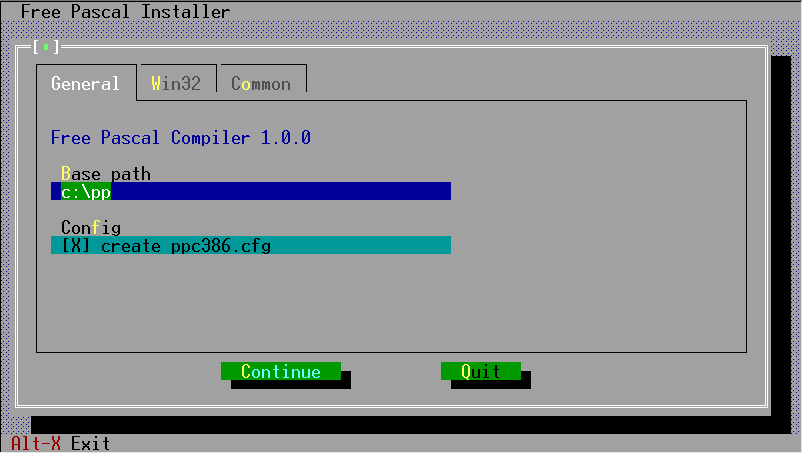        |
| :----------------------------------------: |
| рисунок 2.1: Скрин установки программы DOS |

Программа позволяет выбрать:

- какие компоненты вы хотите установить, например, хотите ли вы установить исходники или нет, хотите ли установить документы или нет. Элементы, которые вы не собирались загружать в виде отдельных файлов, не будут доступны для пометки, то есть вы не можете выбрать их.
- куда вы хотите их установить (по умолчанию это `C:\PP`).

Чтобы запустить Free Pascal из любого каталога в вашей системе, вы должны расширить переменную path так, чтобы она содержала путь к каталогу `C:\PP\BIN`. Обычно это делается в файле *AUTOEXEC.BAT*. Это должно выглядеть примерно так:

```bash
SET PATH=%PATH%;C:\PP\2.6\BIN\i386-DOS
```

для DOS или

```bash
SET PATH=%PATH%;C:\PP\2.6\BIN\i386-OS2
```

для OS/2 (опять же, при условии, что вы установили fpc в папку по умолчанию).

В OS/2 Free Pascal устанавливает некоторые библиотеки из пакета EMX, если они еще не установлены (инсталлятор уведомит вас, если они должны быть установлены). Они расположены в папке 

```bash
C:\PP\DLL
```

Имя этого каталога должно быть добавлено в директиву **LIBPATH** в файле *config.sys*:

```bash
LIBPATH=XXX;C:\PP\DLL
```

Очевидно, что любые существующие каталоги в директиве **LIBPATH** (обозначенные **XXX** в приведенном выше примере) должны быть сохранены.

| 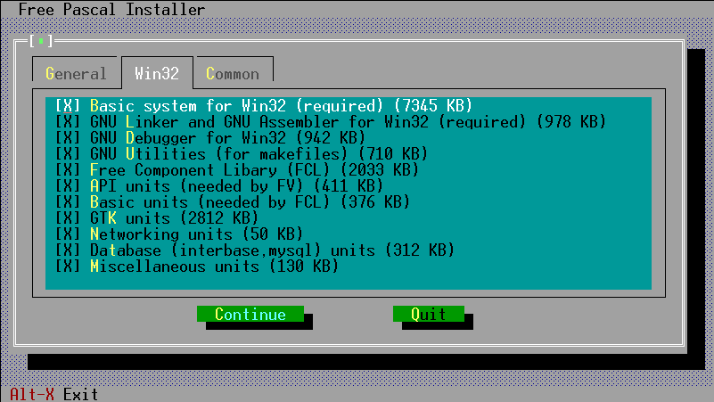 |
| :--------------------------: |
|         Рисунок 2.2          |

##### Дополнительная установка: эмуляция сопроцессора.

Для тех, у кого более старый тип процессора без математического сопроцессора (i387), необходимо установить эмуляцию сопроцессора, поскольку Free Pascal использует сопроцессор для выполнения всех операций с плавающей точкой. 

Установка эмуляции сопроцессора выполняется программой установки (*INSTALL.EXE*) в DOS и WINDOWS.


#### 2.2.3 Установка под Linux.

##### Обязательные этапы установки.

Дистрибутив Free Pascal для LINUX представлен в трех формах:

- версия **tar.gz**, также доступная в виде отдельных файлов
- версия **.rpm** (Red Hat Package Manager) и
- версия **.deb** (Debian).

Если вы используете формат *.rpm*, для установки достаточно

```bash
rpm -i fpc-X.Y.Z-N.ARCH.rpm
```

где **X**.**Y**.**Z** - номер версии файла *.rpm*, а **ARCH** - одна из поддерживаемых архитектур процессора (i386, x86_64 и т.д.).

Если вы используете Debian, для установки достаточно

```bash
dpkg -i fpc-XXX.deb
```

Опять же, здесь **XXX** - номер версии файла *.deb*.


Вам нужен root-доступ для установки этих пакетов. Файл *.tar* позволяет выполнить установку в домашним каталог, если у вас нет прав root.

При загрузке файла *.tar* или отдельных файлов установка более интерактивная. В случае, если вы загрузили файл *.tar*, вы должны сначала распаковать его в произвольный каталог, где у вас есть разрешение на запись, используя следующую команду:

```bash
tar -xvf fpc.tar
```

Подразумевается, что вы заранее скачали файл *fpc.tar* откуда-то из Интернета (реальное имя файла будет иметь определенный номер версии, который мы здесь не упоминаем для простоты понимания процесса установки). 

Когда файл распакуется, у вас появится большое количество файлов архивов и программа-установщик: командный скрипт установки.

Если вы загрузили файлы как отдельные файлы, вы должны как минимум скачать скрипт установки *install.sh* и библиотеки (в *libs.tar.gz*).

Чтобы установить Free Pascal, все, что вам нужно сделать сейчас, это задать в терминале следующую команду:

```bash
./install.sh
```

И тогда вы должны будете ответить на несколько вопросов. Они очень простые, в основном они касаются двух вещей:

1. мест, куда можно устанавливать разные вещи
2. решения, хотите ли вы установить определенные компоненты (например, исходные коды и демо-программы)

Скрипт автоматически определит, какие компоненты присутствуют и могут быть установлены. Он будет предлагать только установить то, что было найдено. Из-за этой функции вы должны сохранять исходные имена при загрузке, так как сценарий ожидает этого.

Если вы запускаете скрипт установки от имени пользователя root, вы можете просто принять все установки по умолчанию. Если вы запускаете не от имени пользователя root, вы должны позаботиться о том, чтобы предоставить программе установки имена каталогов, для которых у вас есть разрешение на запись, поскольку установщик попытается создать указанные вами каталоги. В принципе, вы можете установить компилятор, кудаугодно.

В конце установки инсталлятор сгенерирует файл конфигурации (*fpc.cfg*) для компилятора Free Pascal, в котором будут отражены выбранные вами настройки. Он установит этот файл в каталог `/etc` или в ваш домашний каталог (с именем *.fpc.cfg*), если у вас нет разрешения на запись в каталог `/etc`. Он сделает копию в каталоге, куда вы установили библиотеки.

Компилятор сначала ищет файл *.fpc.cfg* в вашем домашнем каталоге, а затем ищет в каталоге `/etc`.


### 2.3 Необязательные этапы настройки.

На любой платформе после установки компилятора вы можете установить некоторые переменные окружения. Компилятор Free Pascal распознает следующие переменные:

- **PPC_EXEC_PATH** содержит каталог, в котором можно найти файлы поддержки для компилятора.
- **PPC_CONFIG_PATH** указывает альтернативный путь для поиска fpc.cfg.
- **PPC_ERROR_FILE** указывает путь и имя файла определения ошибки.
- **FPCDIR** указывает корневой каталог установки Free Pascal (например: **C:\PP\BIN**)

Однако эти местоположения задаются в примере файла конфигурации, который создается в конце процесса установки, за исключением переменной **PPC_CONFIG_PATH**, которую необходимо установить, если вы не устанавливали компоненты компилятора в местах по умолчанию.


### 2.4 Перед началом компиляции.

Также с Free Pascal распространяется файл *README*. Он содержит последние инструкции по установке Free Pascal, и его всегда следует читать в первую очередь.

Кроме того, информация о платформе и общие вопросы рассматриваются в *FAQ*. Его также следует прочитать прежде, чем сообщать о любой ошибке.


### 2.5 Тестирование компилятора.

После завершения установки и задания необязательных переменных окружения, как описано выше, ваша первая программа может быть скомпилирована. 

В дистрибутив Free Pascal включены некоторые демонстрационные программы, показывающие, что может делать компилятор. Вы можете проверить, правильно ли работает компилятор, попытавшись скомпилировать эти программы.

Компилятором называется файл

- *fpc.exe* под WINDOWS, OS/2 и DOS.
- *fpc* под большинством других операционных систем.

Чтобы скомпилировать программу (например, *demo\text\hello.pp*), скопируйте программу в текущий рабочий каталог и просто напечатайте 

в командной строке. Если у вас нет файла конфигурации, вам может потребоваться указать компилятору, где он может найти модули, например, следующим образом:

```bash
fpc hello
```

в командной строке. Если у вас нет файла конфигурации, вам может потребоваться указать компилятору, где он может найти модули, например, следующим образом:

```bash
fpc -Fuc:\pp\NNN\units\i386-go32v2\rtl hello
```

под DOS и под Linux вы можете набрать

```bash
fpc -Fu/usr/lib/fpc/NNN/units/i386-linux/rtl hello
```

(замените NNN на номер версии Free Pascal, который вы используете). Это, конечно, при условии, что вы установили его в `C:\PP` или `/usr/lib/fpc/NNN`, соответственно. 

Если вы не получили сообщений об ошибках, компилятор сгенерировал исполняемый файл *hello.exe* в DOS, OS/2 или WINDOWS или *hello* (без расширения) в UNIX и большинстве других операционных систем.

Чтобы выполнить программу, просто введите:

```bash
hello
```

или

```bash
./hello
```

в никсах (где текущий каталог обычно отсутствует в **PATH**). Если все прошло хорошо, вы должны увидеть следующее дружеское приветствие:

```bash
Hello world
```


# Глава 3

## Использование компилятора.

Здесь мы опишем основы для компиляции программы и модуля. Более подробное использование компилятора см. в разделе о настройке компилятора и [Programmer’s Guide](https://www.freepascal.org/docs-html/current/prog/prog.html). 

Примеры в этом разделе предполагают, что у вас есть fpc.cfg, который настроен правильно и который содержит по крайней мере настройку пути для модулей RTL. В принципе этот файл генерируется программой установки. Возможно, вам придется проверить, что это в правильном месте. (см. раздел [5.2](###5.2-Использование-файла конфигурации) для получения дополнительной информации об этом.)


### 3.1 Поиск файлов.

Перед тем, как начать компилировать программу или серию модулей, важно знать, где компилятор ищет свои исходные файлы и другие файлы. В этом разделе мы обсудим это и укажем, как на это повлиять.

**Примечание.** Использование прямых слэшей (/) и обратных слэшей (\\) в качестве разделителей каталогов не имеет значения, компилятор преобразует их в любой символ, используемый в текущей операционной системе. Примеры будут приведены с использованием прямого слэша, поскольку это позволяет избежать проблем в системах Unix (таких как Linux).

#### 3.1.1 Файлы командной строки.

Файл, который вы указываете в командной строке, например, в

```bash
FPC foo.pp
```

компилятор будет искать файл ТОЛЬКО в текущем каталоге. Если вы укажете каталог в имени файла:

```bash
fpc subdir/foo.pp
```

то компилятор будет искать *foo.pp* в подкаталоге `subdir` текущего каталога.

В чувствительных к регистру файловых системах (таких как linux и unix) имя этого файла чувствительно к регистру; в других операционных системах (таких как DOS, Windows NT, OS/2) - нет.


#### 3.1.2. Модули файлов

Когда вы компилируете модуль или программу, которой нужны другие модули, компилятор будет искать скомпилированные версии этих модулей следующим образом:

- Он будет выглядеть в текущем каталоге.

- Он будет смотреть в каталоге, где находится исходный файл.

- Он будет искать в каталоге, где находится двоичный файл компилятора.

- Он будет смотреть во всех каталогах, указанных в пути поиска модуля.


Вы можете добавить каталог в путь поиска устройства с помощью опции (**-Fu** (см. раздел [5.1.3](####5.1.3-Опции,-касающиеся-файлов-и-каталогов))). При каждом появлении одной из этих опций каталог вставляется в путь поиска объекта, т.е. последний путь в командной строке будет искаться первым.

Компилятор добавляет несколько путей к пути поиска модуля:

1. Содержимое переменной среды XXUNITS, где XX необходимо заменить одной из поддерживаемых целей: GO32V2, LINUX, WIN32, OS2, BEOS, FREEBSD, SUNOS, DARWIN (фактический список зависит от доступных целей).

2. Стандартная каталог модуля. Этот каталог определяется из переменной среды **FPCDIR**. Если эта переменная не задана, по умолчанию используется следующее:

- в linux:

  ```bash
  /usr/local/lib/fpc/FPCVERSION
  ```

  или

  ```bash
  /usr/lib/fpc/FPCVERSION
  ```

- в других ОС: каталог с бинарником компилятора, с добавленным к нему "./", если он существует. Например, в Windows это будет означать:

```bash
C:\FPC\2.6\units\i386-win32
```

Это при условии, что компилятор был установлен в каталоге

```bash
C:\FPC\2.6
```


После определения этого каталога к пути поиска добавляются следующие пути:

```bash
FPCDIR/units/FPCTARGET
```

```bash
FPCDIR/units/FPCTARGET/rtl
```


Здесь цель должна быть заменена именем цели, для которой вы компилируете: это комбинация процессора и ОС, например, так

```bash
/usr/local/lib/fpc/2.6/units/i386-linux/
```

или при кросс-компиляции

```bash
/usr/local/lib/fpc/2.6/units/i386-win32/
```


Опция **-Fu** принимает один подстановочный знак *****, который будет заменен всеми каталогами, найденными в этом месте, но не самим местоположением. Например, с учетом каталогов

```bash
rtl/units/i386-linux
```
```bash
fcl/units/i386-linux
```
```bash
packages/base
```
```bash
packages/extra 
```

команда

```bash
fpc -Fu"*/units/i386-linux"
```

будет иметь тот же эффект, что и
```bash
fpc -Furtl/units/i386-linux -Fufcl/units/i386-linux
```
поскольку каталоги `rtl` и `fcl` содержат дополнительные подкаталоги  `units/i386-linux`. Каталог пакетов не будет добавлен, так как он не содержит подкаталог `units/i386-linux`.


Следующая команда
```bash
fpc -Fu"units/i386-linux/*"
```
будет соответствовать любому каталогу в каталоге `units/i386-linux`, но не будет совпадать с самим каталогом `units/i386-linux`, поэтому вы должны добавить его вручную, если вы хотите, чтобы компилятор также искал файлы в этом каталоге:

```bash
fpc -Fu"units/i386-linux" -Fu"units/i386-linux/*"
```


Обратите внимание, что (для оптимизации) компилятор удалит любые несуществующие пути из пути поиска, то есть будет проверено существование пути (после раскрытия подстановочного знака ***** и изменения переменной среды).

Вы можете увидеть, какие пути будет искать компилятор, задав компилятору опцию **-vu**.

Обратите внимание, что пути файла модуля, указанные в файле конфигурации, будут добавлены в конце, а пути, указанные в командной строке, будут добавлены в начале.

Представьте себе следующую командную строку:
```bash
fpc -n -Fu/home @cfg -Fu/usr foo.pp
```
Где файл *cfg* имеет следующее содержимое:
```bash
-Fu/etc
```
Это приведет к следующему пути поиска

- Используемый путь модуля: `/home/`
- Используемый путь модуля: `/usr/`
- Используемый путь модуля: `/etc/`
- Используемый путь модуля: `/data/FPC/installed/3.1.1/`


Изменение порядка файлов в командной строке:
```bash
fpc -n -Fu/usr @cfg -Fu/home foo.pp
```
в результате:

- Используемый путь модуля: `/usr/`
- Используемый путь модуля: `/home/`
- Используемый путь модуля: `/etc/`
- Используемый путь модуля: `/data/FPC/installed/3.1.1/`


Перемещение позиции @cfg не изменит путь:

```bash
fpc -n @cfg -Fu/home -Fu/usr foo.pp
```
в результате:
- Используемый путь модуля: `/home/`
- Используемый путь модуля: `/usr/`
- Используемый путь модуля: `/etc/`
- Используемый путь модуля: `/data/FPC/installed/3.1.1/`


В системах, где имена файлов чувствительны к регистру (например, unix и linux), компилятор будет осуществлять:

- поиск исходного имени файла, то есть сохраняет регистр.
- поиск по имени файла все в нижнем регистре.
- поиск по имени файла все в верхнем регистре.


Это необходимо, поскольку Паскаль не зависит от регистра и операторы `uses Unit1` или `uses unit1` должны иметь такой же эффект.

Сначала это будет сделано с расширением *.ppu* (скомпилированный модуль), *.pp*, а затем с расширением *.pas*.

Например, предположим, что файлу *foo.pp* требуется панель инструментов. Тогда команда
```bash
fpc -Fu.. -Fuunits foo.pp
```
скажет компилятору искать панель модулей в следующих местах:

1. В текущем каталоге.
2. В каталоге, где находится бинарный файл компилятора (не в Linux).
3. В родительском каталоге текущего каталога.
4. В подкаталоге `units` текущего каталога
5. В каталоге стандартного модуля.


Кроме того, поиск модулей, имена которых длиннее 8 символов, сначала осуществляется по всей длине имени. Если модуль с таким именем не найден, имя будет усечено до 8 символов, и компилятор снова будет искать в тех же каталогах, но с усеченным именем.

Если компилятор найдет модуль, в котором он нуждается, он будет искать исходный файл этого модуля в том же каталоге, где он нашел модуль. Если он находит исходник модуля, он сравнивает время изменения файла. Если файл-исходник был изменен позже, чем файл модуля, компилятор попытается перекомпилировать модуль посредством этого исходного файла.

Если компилятор не находит скомпилированную версию модуля или когда указана опция -B, то компилятор будет искать исходный файл модуля таким же образом и пытаться перекомпилировать его.

Рекомендуется установить путь поиска модуля в файле конфигурации *fpc.cfg*. Если вы делаете это, вам не нужно указывать путь поиска модуля в командной строке каждый раз, когда вы хотите что-то скомпилировать.


#### 3.1.3 Включаемые файлы.


Если вы включите файл в свой источник с директивой `{$I filename}`, компилятор будет искать его в следующих местах:

1. Он будет смотреть по пути, указанному в имени включаемого файла.
2. Он будет смотреть в каталоге, где находится текущий исходный файл.
3. он будет смотреть во всех каталогах, указанных в пути поиска включаемого файла.


Вы можете добавлять файлы в путь поиска включаемых файлов с помощью опций **-I** (см. раздел [5.1.3](####5.1.3-Опции,-касающиеся-файлов-и-каталогов)) или **-Fi** (см. раздел [5.1.3](####5.1.3-Опции,-касающиеся-файлов-и-каталогов)).

В качестве примера рассмотрим следующую инструкцию include в файле `units/foo.pp`:
```pascal
{$i ../bar.inc}
```
Тогда следующая команда:
```bash
fpc -Iincfiles units/foo.pp
```
заставит компилятор искать в следующих каталогах `bar.inc`:

- Родительский каталог текущего каталога.
- Подкаталог `units` текущего каталога.
- Подкаталог `incfiles` текущего каталога.


#### 3.1.4 Объектные файлы.

Когда вы ссылаетесь на объектные файлы (используя директиву `{$L file.o}`, компилятор будет искать этот файл так же, как он ищет включаемые файлы:

1. Он будет смотреть по пути, указанному в имени файла объекта.
2. Он будет смотреть в каталоге, где находится текущий исходный файл.
3. Он будет смотреть во всех каталогах, указанных в пути поиска объектного файла.

Вы можете добавлять файлы в путь поиска объектных файлов с помощью опции **-Fo** (см. раздел [5.1.3](####5.1.3-Опции,-касающиеся-файлов-и-каталогов)).


#### 3.1.5 Файл конфигурации.

Не все параметры должны быть указаны в командной строке компилятора. Компилятор может использовать файл конфигурации, который может содержать те же параметры, что и в командной строке. В каждой строке файла конфигурации может быть только один параметр командной строки.

Если вы не укажете опцию **-n** (см. раздел [5.1.1](####5.1.1-Общие-параметры)), компилятор будет искать файл конфигурации *fpc.cfg* в следующих местах:

- под Unix (например, Linux)
  1. текущий каталог
  2. ваш домашний каталог, он ищет *.fpc.cfg*
  3. каталог, указанный в переменной окружения **PPC_CONFIG_PATH**
  4. в каталоге `/etc` выше каталога компилятора. Например, если компилятор находится в `/usr/local/bin`, он будет выглядеть в `/usr/local/etc`. См. ниже для получения дополнительной информации об этом пункте
  5. Каталог ``/etc`

- под всеми остальными операционными системами:
  1. текущий каталог
  2. если он установлен, каталог указывается в переменной окружения **PPC_CONFIG_PATH**
  3. каталог, в котором находится компилятор


**Примечание:** обратите внимание, что каталог компилятора определяется местоположением фактического двоичного файла компилятора. Это имеет 2 последствия:

1. Установка по умолчанию в Unix помещает это в `/usr/local/lib/fpc` или `/usr/lib/fpc`. Он помещает несколько символических ссылок в `/usr/local/bin` или `/usr/bin`. Эти символические ссылки не учитываются при поиске файла(ов) конфигурации, поэтому места для поиска файла конфигурации: `/usr/local/lib/fpc/etc` или `/usr/lib/fpc/etc`.

2. Команда `fpc` не является действительным двоичным файлом компилятора. Команда `fpc` выбирает фактический двоичный файл компилятора на основе, например, цель процессора. Фактический двоичный файл компилятора называется *ppcXYZ*.

3. Фактический каталог установки может отличаться: `/usr/local/bin` может быть `/usr/bin`, в зависимости от упаковщика.

   

#### 3.1.6 О длинных именах файлов.

Free Pascal может обрабатывать длинные имена файлов на всех платформах, кроме DOS. В Windows он будет использовать поддержку длинных имен файлов, если она доступна (что не всегда имеет место в более старых версиях Windows).

Если поддержка длинных имен файлов отсутствует, он усекает имена модулей до 8 символов.

Не рекомендуется размещать модули в каталогах, которые содержат пробелы в своих именах, поскольку внешний компоновщик GNU не понимает такие имена файлов.


### 3.2 Компиляция программы.

Компилировать программу очень просто. Предполагая, что у вас есть программный исходник в файле *prog.pp*, вы можете скомпилировать его с помощью следующей команды:
```bash
fpc [options] prog.pp
```

Квадратные скобки [] указывают, что то, что находится между ними, является необязательным.

Если ваш программный файл имеет расширение *.pp* или *.pas*, вы можете опустить это в командной строке, например, в предыдущем примере вы могли набрать:
```bash
fpc [options] prog
```

Если все прошло хорошо, компилятор выдаст исполняемый файл. Вы можете выполнить это прямо сейчас; Вам не нужно больше ничего делать.

Вы заметите, что в вашем каталоге есть еще один файл с расширением *.o*. Он содержит объектный файл для вашей программы. Если вы скомпилировали программу, вы можете удалить объектный файл (*.o*), но не удаляйте его, если вы скомпилировали модуль. Это связано с тем, что объектный файл модуля содержит код модуля и будет связан с любой программой, которая его использует.


### 3.3 Компиляция модуля.

Компиляция модуля принципиально не отличается от компиляции программы. Разница главным образом в том, что в этом случае линкер не вызывается.

Чтобы скомпилировать модуль в файле *foo.pp*, просто введите:

```bash
fpc foo
```

Вспомните замечание о расширениях файлов в предыдущем разделе.

Когда все пройдет хорошо, у вас останется 2 (два) файла:

1. *foo.ppu* - это файл, описывающий модуль, который вы только что скомпилировали.
2. *foo.o* - этот файл содержит актуальный код модуля. Этот файл в конечном итоге окажется в исполняемых файлах.

Оба файла необходимы, если вы планируете использовать модуль для некоторых программ. Так что не удаляйте их. Если вы хотите распространять модуль, вы должны предоставить как *.ppu*, так и *.o* файлы. Один бесполезен без другого.


### 3.4 Модули, библиотеки и умные ссылки.

Компилятор Free Pascal поддерживает умные ссылки и создание библиотек. Однако поведение по умолчанию состоит в том, чтобы скомпилировать каждый модуль в один большой объектный файл, который будет целиком связан с вашей программой. Совместно используемые библиотеки могут создаваться на большинстве платформ, хотя текущий уровень поддержки FPC может отличаться (например, они не поддерживаются для целей GO32v2 и OS2).

Также можно взять существующие модули и собрать их в одну статическую или общую библиотеку (с помощью инструмента **ppumove**, раздел [8.7](###8.7-Программа-ppumove)).


### 3.5 Уменьшение размера вашей программы.

Когда вы создали свою программу, можно уменьшить размер получаемого исполняемого файла. Это возможно, потому что компилятор оставляет в программе много информации, которая, строго говоря, не требуется для выполнения программы.

Избыток информации можно удалить с помощью небольшой программы, которая называется **strip**. Использовать ее просто. Просто введите
```bash
strip prog
```
В командной строке и программа **strip** удалит всю ненужную информацию из вашей программы. Это может привести к уменьшению ее размера до 30%.

Вы можете использовать ключ **-Xs**, чтобы позволить компилятору делать это автоматически во время компиляции программы. (Переключатель не действует при компиляции модулей.)

Другой метод уменьшения размера программы - использование умных ссылок. Обычно модули (включая системный модуль) связаны в целое. Однако возможно скомпилировать модули так, чтобы они могли быть умно связаны. Это означает, что в вашей программе связаны только те функции и процедуры, которые используются фактически, исключая ненужный код. Компилятор включит smartlinking(“умное связывание”) с ключом **-XX** (см. раздел [5.1.4](####5.1.4-Опции,-контролирующие-вид-вывода)). Эта техника полностью описана в  [Programmer’s Guide](https://www.freepascal.org/docs-html/current/prog/prog.html).


# Глава 4

## Проблемы с компиляцией.

### 4.1 Общие проблемы.

**IO-error -2 at ...**: под Linux вы можете получить это сообщение при запуске компилятора. Обычно это означает, что компилятор не находит файл с описанием ошибок. Вы можете исправить эту ошибку с помощью опции **-Fr** (см. раздел [5.1.3](###5.1.3-Опции,-касающиеся-файлов-и-каталогов)) в linux.

**Error: File not found: xxx** или **Error: couldn’t compile unit xxx**: обычно это происходит, когда путь к модулю указан неправильно. Помните, что компилятор ищет модули только в текущем каталоге и в каталоге, где находится сам компилятор. Если вы хотите, чтобы он также поискал модуль где-то еще, вы должны явно указать это, используя опцию **-Fu** (см. раздел [5.1.3](###5.1.3-Опции,-касающиеся-файлов-и-каталогов)). Или вы должны настроить файл конфигурации.


### 4.2 Проблемы, с которыми вы можете столкнуться в DOS.

- **No space in environment**

  Подобное сообщение об ошибке может появиться, если вы вызовете **SET_PP.BAT** в *AUTOEXEC.BAT*.
  Чтобы решить эту проблему, вы должны расширить память вашей среды. Для этого найдите строку в *CONFIG.SYS*, например 
  ```bash
  SHELL=C:\DOS\COMMAND.COM
  ```
  и измените его на следующее:
  ```bash
  SHELL=C:\DOS\COMMAND.COM /E:1024
  ```
  Возможно, вам просто нужно будет указать более высокое значение, если этот параметр уже установлен.

- **Coprocessor missing**
  Если компилятор пишет сообщение об отсутствии сопроцессора, установите эмуляцию сопроцессора.

- **Not enough DPMI memory**
  Если вы хотите использовать компилятор с DPMI, у вас должно быть не менее 7-8 МБ свободной памяти DPMI, но 16 МБ - более реалистичный объем.


# Глава 5

## Конфигурация компилятора.

Вывод компилятора можно контролировать многими способами. Это может быть сделано по существу двумя различными способами:

- Использование параметров командной строки.
- Используя файл конфигурации: *fpc.cfg*.

Компилятор сначала читает файл конфигурации. Только тогда проверяются параметры командной строки. Это создает возможность установить некоторые базовые параметры в файле конфигурации, и в то же время вы все равно можете установить некоторые конкретные параметры при компиляции какого-либо модуля или программы. Сначала мы перечисляем параметры командной строки, а затем объясняем, как указать параметры командной строки в файле конфигурации. Читая это, имейте в виду, что параметры чувствительны к регистру.


### 5.1 Использование параметров командной строки.

Доступные для текущей версии компилятора опции перечислены по категориям. Также см. [Приложение A](#Приложение-A), где приведен список, сгенерированный текущим компилятором.


#### 5.1.1 Общие параметры.

- `-h` Распечатать список всех опций и выйти.
- `-?` То же, что `-h`, ожидание после каждого экрана ввода клавиши ввода.
- `-i` Печать авторских прав и другой информации. Вы можете указать квалификатор как `-i`**xxx**, где **xxx** может быть одним из следующих:
    - `D`: возвращает дату компилятора.
    - `V`: возвращает краткую версию компилятора.
    - `W`: возвращает полную версию компилятора.
    - `SO`: возвращает ОС компилятора.
    - `SP`: возвращает процессор компилятора.
    - `TO`: возвращает целевую ОС.
    - `TP`: возвращает целевой процессор.
    - `a`: возвращает список поддерживаемых целей ABI
    - `c`: возвращает список поддерживаемых наборов команд процессора
    - `f`: возвращает список поддерживаемых наборов команд FPU
    - `i`: возвращает список поддерживаемых режимов встроенного ассемблера
    - `o`: возвращает список поддерживаемых оптимизаций
    - `r`: возвращает список распознанных функций компилятора и RTL
    - `t`: возвращает список поддерживаемых целей
    - `u`: возвращает список поддерживаемых типов микроконтроллеров.
    - `w`: возвращает список поддерживаемых оптимизаций всей программы
- `-l` Распечатать логотип Free Pascal и номер версии.
- `-n` Игнорировать файл конфигурации по умолчанию. Вы по-прежнему можете передать файл конфигурации в качестве параметра командной строки с опцией `@`.
- `-V`**NNN** установить номер версии в **NNN** (добавляет **-NNN** к двоичному имени)


#### 5.1.2 Варианты получения обратной связи.

- `-v`**xxx** Вывод дополнительной информации. **ххх** является комбинацией следующего:
    - `e`: Показать ошибки. Эта опция включена по умолчанию.
    - `i`: Показать некоторую общую информацию.
    - `w`: Выдавать предупреждения.
    - `n`: Выдавать примечания.
    - `h`: Выдавать подсказки.
    - `i`: Выдавать информационные сообщения.
    - `l`: Сообщать количество обработанных строк (каждые 100 строк).
    - `u`: Показать информацию о загружаемых модулях.
    - `t`: Показать имена открываемых файлов.
    - `p`: Писать дерево парсинга (*tree.log*)
    - `q`: Показывать номера сообщений.
    - `c`: Уведомлять о каждой условной обработке.
    - `m`**xxx**: **xxx** - список номеров сообщений, разделенных запятыми, которые не должны отображаться. Эта опция может быть указана несколько раз.
    - `d`: Показать дополнительную информацию об отладке.
    - `0`: (цифра ноль) нет сообщений. Это полезно для переопределения настройки по умолчанию в файле конфигурации.
    - `b`: Показать все объявления процедур в случае ошибки overload(перегруженной) функции.
    - `x`: Показать информацию об исполняемом файле (только для платформы Win32).
    - `r`: Ошибки формата в режиме совместимости RHIDE/GCC.
    - `a`: Показать всю возможную информацию (это то же самое, что указать все параметры).
    - `b`: Заставляет компилятор писать имена файлов, используя полный путь.
    - `v`: Записывать подробную отладочную информацию в файл *fpcdebug.txt*.
    - `s`: Записывать метки времени. В основном для разработчиков компиляторов.
    - `p` Записывать дерево парсинга в файл *tree.log* (предназначено для разработчиков компиляторов.)
    - `z` Записывать сообщения компилятора в стандартную ошибку вместо стандартного вывода.

Разница между фатальной ошибкой/некритичной ошибкой/подсказкой/предупреждением/примечанием заключается в их серьезности:
- **Fatal**(неустранимая ошибка) - компилятор обнаружил ошибку и больше не может продолжать компиляцию. Он остановится сразу. 
- **Error**(некритичная ошибка) - компилятор обнаружил ошибку, но может продолжить компиляцию (самое большее до конца текущего модуля).
- **Warning**(предупреждение) - если есть предупреждение, это означает, что, возможно, есть ошибка, то есть что-то может быть не так в вашем коде.
- **Hint**(подсказка) - выдается, если компилятор считает, что код может быть лучше, но нет никаких подозрений на ошибку.
- **Note**(примечание) - это некоторая заслуживающая внимания информация, но опять же нет ошибок.

Разница между подсказками и примечаниями не очень очевидна. И то, и другое можно игнорировать без особого риска, но всегда следует проверять предупреждения.


#### 5.1.3 Опции, касающиеся файлов и каталогов.

- `-e`**XXX** Указывает **XXX** в качестве каталога, содержащего исполняемые файлы для программ **as** (ассемблер) и **ld** (компоновщик).
- `-Fa`**XYZ** загружает блоки **XYZ** после системного блока, но до загрузки любого другого блока. **XYZ** - это список имен модулей, разделенных запятыми. Это может использоваться только для программ и имеет тот же эффект, как если бы **XYZ** был вставлен в качестве первого элемента в предложении программы.
- `-Fc`**XXX** Установите входную кодовую страницу на **XXX**. Экспериментальный режим. 
- `-FC`**xxx** Установить двоичное имя компилятора RC (компилятор ресурсов) на **xxx**.
- `-Fd` Отключает кеш внутреннего каталога компилятора. По умолчанию компилятор кэширует имена всех файлов в каталоге, как только он ищет один файл в указанном каталоге. Это гарантирует, что в отладочной информации используется правильный регистр всех имен файлов. Это также позволяет создавать скомпилированные файлы с правильным регистром при компиляции в файловых системах с сохранением регистра в ОС, которые также поддерживают файловые системы с учетом регистра. Наконец, это также может повысить производительность. Однако эта функция может вызвать серьезные замедления в сетевых файловых системах, особенно при компиляции тривиальных программ в каталогах, содержащих много файлов, и такие замедления можно устранить, отключив кэш с помощью этого переключателя.
- `-FD` То же, что и `-e`.
- `-Fe`**xxx** Записывать ошибки и т.д. в файл с именем **xxx**.
- `-FE`**xxx** Записать исполняемый файл и модули в каталог **xxx** вместо текущего каталога. Если этот параметр содержит компонент пути и сопровождается параметром `-o` (см. раздел [5.1.4](####5.1.4-Опции,-контролирующие-вид-вывода)), то путь `-o` переопределит параметр пути `-FE`.
- `-Ff`**xxx* Добавить **ххх** к пути фреймворка (только для Darwin).
- `-Fg` ?
- `-Fi`**xxx** Добавить **xxx** к пути поиска включаемого файла.
- `-Fl`**xxx** Добавить **ххх** в путь поиска библиотеки (это также передается компоновщику).
- `-FL`**xxx** (только linux) Использовать **xxx** в качестве динамического компоновщика. По умолчанию используется `/lib/ld-linux.so.2` или `/lib/ld-linux.so.1`, в зависимости от того, какой из них будет найден первым.
- `-Fm`**xxx** Загрузить таблицу преобразования юникода из файла *x.txt* в каталоге, где находится компилятор. Используется только когда действует `-Fc`.
- `-FM`**xxx** Установить каталог, где искать двоичные файлы Unicode, в **xxx**.
- `-Fo`**xxx** Добавить **ххх** в путь поиска объектного файла. Этот путь используется при поиске файлов, которые должны быть связаны с ним.
- `-Fr`**xxx** Укажите **xxx** в качестве файла, который содержит сообщения компилятора. Это заменит встроенные по умолчанию сообщения компилятора на английском языке.
- `-FR`**xxx** установить для линкера ресурса (*.res*) значение **xxx**.
- `-Fu`**xxx** Добавить **ххх** в путь поиска модуля. Объекты сначала ищутся в текущем каталоге. Если они там не найдены, то компилятор ищет их по пути к модулю. Вы всегда должны указывать путь к системному модулю. Путь **xxx** может содержать один подстановочный знак (*), который будет расширен до всех возможных имен каталогов, найденных в этом месте. Обратите внимание, что само местоположение не входит в список. См. раздел [3.1.2](####3.1.2.-Модули-файлов) для получения дополнительной информации об этой опции.
- `-FU`**xxx** Записать модули в каталог *ххх* вместо текущего каталога. Он переопределяет опцию `-FE`.
- `-I`**xxx** Добавить **xxx** к пути поиска включаемого файла. Эта опция имеет тот же эффект, что и `-Fi`.
- `-FW`**xxx** хранить сгенерированную информацию по оптимизации всей программы в файле **xxx**.
- `-Fw`**xxx** Считать всю информацию по оптимизации программы (сохраненную с помощью `-FW`**xxx**) из файла **xxx**.


#### 5.1.4 Опции, контролирующие вид вывода.

Для получения дополнительной информации об этих параметрах см. [Programmer’s Guide](https://www.freepascal.org/docs-html/current/prog/prog.html).

- `-a` Не удалять файлы ассемблера (неприменимо при использовании внутреннего ассемблера). Это также относится к (возможно) сгенерированному пакетному сценарию.

- `-al` Включить строки исходного кода в файл ассемблера в качестве комментариев.

- `-an` Запись информации об узле в файл ассемблера (узлы - это способ, которым компилятор представляет операторы или их части внутри). Это в первую очередь предназначено для отладки кода, сгенерированного компилятором.

- `-ap` Использовать каналы вместо создания временных файлов ассемблера. Это может ускорить компилятор в OS/2 и Linux. Только с ассемблерами (такими как **GNU**, если используется внутренний ассемблер).

- `-ar` Вывести информацию о расположении и выпуске регистра в файле ассемблера. Это в первую очередь предназначено для отладки кода, сгенерированного компилятором.
- `-at` Вывести информацию о временных выделениях и освобождениях памяти в файле ассемблера.

- `-A`**xxx** указать, какой тип ассемблера должен быть сгенерирован. Здесь **ххх** является одним из следующих параметров:
    - `default` - используется встроенный по умолчанию.
    - `as` - сборка с использованием GNU **as**.
    - `gas` - сборка с использованием GNU **gas**.
    - `gas-darwin` - сборка с использованием GNU **gas** для darwin Mach-O64.
    - `nasmcoff` - Coff (Go32v2) файл с использованием **Nasm**.
    - `nasmelf` - Elf32 (linux) файл с использованием **Nasm**.
    - `nasmwin32` - Windows 32-битный файл с использованием **Nasm**.
    - `nasmwin64` - Windows 64-битный файл с использованием **Nasm**.
    - `nasmwdosx` - Windows 32-bit/DOSX файл с использованием **Nasm**.
    - `nasmdarwin` Объектный файл с использованием Nasm.darwin Mach-O64 с использованием GNU **GAS**
    - `macho` - Mach-O (Darwin, Intel 32 бит) с использованием внутренней программы записи.
    - `masm` - объектный файл с использованием Masm (Microsoft).
    - `tasm` - объектный файл с использованием Tasm (Borland).
    - `elf` - Elf32 (linux) с использованием внутреннеей программы записи.
    - `coff` - объектный файл Coff (Go32v2), использующий внутреннюю программу записи двоичных объектов.
    - `pecoff` - объектный файл PECoff (Win32) с использованием внутренней программы записи двоичных объектов.
    - `wasm` - объектный файл с использованием wasm (Watcom).
    - `yasm` - объектный файл, использующий **yasm** (экспериментально).

- `-B` Перекомпилировать все использованные модули, даже если исходники модулей не изменились со времени последней компиляции.

- `-b` Создать информацию о браузере. Эта информация может использоваться интегрированной средой разработки (IDE) для предоставления информации о классах, объектах, процедурах, типах и переменных в модуле.

- `-bl` То же, что и `-b`, но также генерирует информацию о локальных переменных, типах и процедурах.

- `-C3` Включить (или выключить) проверку ошибок IEEE для констант.

- `-Ca`**xxx** Задать ABI (двоичный интерфейс приложения) в **xxx**. Опция `-i` задает возможные значения для **ххх**.

- `-Cb` Создать код с прямым порядком байтов (big-endian).

- `-Cc` Установить соглашение о вызовах по умолчанию, используемое компилятором.

- `-CD` Создать динамическую библиотеку. Это используется для преобразования модулей в динамически подключаемые библиотеки в Linux.
Эмулировать операции с плавающей точкой.

- `-Ce` Эмулировать операции с плавающей точкой.

- `-Cf`**xxx** Задать используемый процессор с плавающей точкой в **xxx**. `fpc -i` перечисляет все возможные значения.

- `-CF`**NN** Установить минимальную точность с плавающей точкой равной **NN**. Возможные значения 32 и 64.

- `-Cg` Включить генерацию кода PIC. Это должно быть необходимо только при создании библиотек в Linux или других никсах.

- `-Ch`**xxx** резервирует **ххх** байтов в куче. **ххх** должен быть в интервале между 1024 и 67107840.

- `-Ci` Создать код проверки ввода/вывода. Если какой-либо код ввода/вывода вашей программы вернет статус ошибки, программа закроется с ошибкой во время выполнения. Какая ошибка генерируется, зависит от ошибки ввода/вывода.

- `-Cn` Пропустить этап связывания.

- `-CN` Генерировать проверки с нулевым указателем (только для AIX).

- `-Co` Создать целочисленный код проверки переполнения. В случае целочисленных ошибок ваша программа сгенерирует ошибку времени выполнения.

- `-CO` Проверка на возможное переполнение целочисленных операций.

- `-Cp`**XXX** Задать тип процессора в **XXX**.

- `-CP`**X**=**N** Задать упаковку для **X** в **N**. **X** может иметь значение **PACKSET**, **PACKENUM** или **PACKRECORDS*, а **N** может иметь значение 1,2,4,8 или быть одним из ключевых слов **DEFAULT(0)** или **NORMAL**. **PACKRECORDS** также поддерживает значения 16 и 32. (см. [Programmer’s Guide](https://www.freepascal.org/docs-html/current/prog/prog.html) для получения дополнительной информации).

- `-Cr` Генерировать код проверки диапазона. Если ваша программа обращается к элементу массива с недопустимым индексом или увеличивает перечисляемый тип за пределы своей области, будет сгенерирована ошибка времени выполнения.

- `-CR` Генерировать проверки при вызове методов верификации  правильности таблицы виртуальных методов для этого объекта.

- `-Cs`**xxx** Задать размер стека в **xxx**.

- `-Ct` Создать код проверки стека. Если ваша программа выполняет ошибочную работу стека, будет сгенерирована ошибка времени выполнения.

- `-CT`**NNN** Конкретные параметры генерации кода:
  
- `cld` Выдать инструкцию CLD перед использованием строковых инструкций x86
  
- `-CX` Создать при записи Smartlink-модуль. Smartlink-модуль будет связывать только те части кода, которые действительно нужны программе. Весь не используемый код не учитывается. Это может привести к существенно меньшим размерам двоичных файлов.

- `-d`**xxx** Задать имя символа **xxx**. Это может быть использовано для условной компиляции частей вашего кода.

- `-D` Создать файл DEF (для OS/2).

- `-Dd` Задать описание исполняемого файла/библиотеки (Windows).

- `-Dv` Задать версию исполняемого файла/библиотеки (Windows).

- `-Dw` PM-приложение (для OS/2)

- `-E` аналогично `-Cn`.

- `-fPIC` аналогично `-Cg`.

- `-g` Генерировать отладочную информацию для отладки с помощью файла *gdb*.

- `-gc` Генерировать проверку для указателей. Это должно использоваться с параметром командной строки `-gh`. Когда этот параметр включен, он будет проверять, что все обращения к указателю находятся в куче.

- `-gg` аналогично `-g`.

- `-gh` Использовать модуль heaptrc (см. [Unit Reference](https://www.freepascal.org/docs-html/current/rtl/index.html)). (Создает отчет об использовании кучи после выхода из программы)

- `-gl` Использовать модуль lineinfo (см. [Unit Reference](https://www.freepascal.org/docs-html/current/rtl/index.html)). (Создает информацию об имени файла/номере строки, если программа завершает работу из-за ошибки.)

- `-go`**XXX** Задать параметры отладочной информации. Один из вариантов - `dwarfsets`: он включает отладочную информацию для формата отладки **dwarf** (это не работает с версиями *gdb* до 6.5). *Stabsabsinclude* указывает компилятору хранить абсолютные/полные пути include-файлов в формате отладки stabs. *Dwarfmethodclassprefix* указывает компилятору префиксировать имена методов в DWARF в виде `class name.item[-gp]`, сохраняя регистр в именах символов формата отладки stabs. По умолчанию - все имена сохраняются в верхнем регистре.

- `-gs` Записать отладочную информацию в формате отладки stabs.

- `-gt` Очищать локальные переменные от мусора. Это записывает случайное значение в локальные переменные при запуске процедуры. Это может быть использовано для обнаружения неинициализированных переменных. t может быть указан несколько раз

- `-gv` Извлечь информацию для valgrind.

- `-gw` Извлечь информацию об отладке dwarf (версия 2).

- `-gw2` Извлечь информацию об отладке dwarf (версия 2).

- `-gw3` Извлечь информацию об отладке dwarf (версия 3).

- `-gw4` Извлечь информацию об отладке dwarf (версия 4, экспериментальная).

- `-k`**xxx** Передать **ххх** компоновщику.

- `-N`**xxx** Выполнить оптимизацию узлов дерева. Здесь **ххх** является одним из
  
    - `u` развернуть петли
    
- `-O`**xxx** Оптимизировать вывод компилятора; **xxx** может иметь одно из следующих значений:

    **aPARAM=VALUE**
Указывает выравнивание структур и кода. **PARAM** определяет, что должно быть выровнено; **VALUE** определяет границу выравнивания. См.  [Programmer’s Guide](https://www.freepascal.org/docs-html/current/prog/prog.html) для описания возможных значений.

    - `1` Уровень оптимизации 1 (быстрая и удобная для отладчика оптимизация).
    - `2` Уровень оптимизации 2 (-O1 плюс быстрая оптимизация).
    - `3` Уровень оптимизации 3 (-O2 плюс более медленные оптимизации).
    - `4` Уровень оптимизации 4 (-O3 плюс оптимизации, которые могут иметь побочные эффекты).
    - `o`**NNN** Указывает индивидуальные параметры оптимизации: **NNN** может быть одним из
        - `REGVAR` Использовать переменные регистра
        - `UNCERTAIN` Неопределенная оптимизация (используйте с осторожностью)
        - `STACKFRAME` Пропустить кадры стека
        - `PEEPHOLE` Оптимизация глазка
        - `ASMCSE` Устранение общего подвыражения на уровне ассемблера (только для i386, устарело)
        - `LOOPUNROLL` Развернуть (маленькие) петли
        - `TAILREC` Изменить концевую рекурсию на нерекурсивный цикл
        - `CSE` Устранение общего подвыражения
        - `DFA` Включить анализ потока данных
        - `USEEBP` Использовать регистр EBP/RBP для хранения переменных (только для x86)
        - `ORDERFIELDS` Переупорядочить поля экземпляра класса, если это приводит к лучшему выравниванию
        - `FASTMATH` Быстрые математические операции (могут снизить точность с плавающей точкой)
        - `REMOVEEMPTYPROCS` Удалить вызовы пустых процедур.
        - `CONSTPROP` Дублирование констант (экспериментальное, требует `-Oodfa`)

    - `p`**xxx** Выбрать процессор **xxx** для оптимизации. `fpc -i` выводит список всех доступных наборов инструкций процессора.
    - `W`**xxx** Генерировать информацию по оптимизации всей программы для функции **xxx**. `fpc -i` сгенерирует список возможных значений.
    - `w`**xxx** Выполнить информацию по оптимизации всей программы для функции **xxx**. `fpc -i` сгенерирует список возможных значений.
    - `s` Оптимизация по размеру, а не по скорости. Точный эффект некоторых из этих оптимизаций можно найти в [Programmer’s Guide](https://www.freepascal.org/docs-html/current/prog/prog.html).
    
- `-o`**xxx** Использовать **xxx** в качестве имени выходного файла (исполняемого файла). Для использования только с программами. Выходное имя файла может содержать путь, и если он есть, оно переопределит любую предыдущую настройку `-FE`. Если выходное имя файла не содержит пути, параметр `-FE` проявляется.
- `-pg` Создать код профиля для `gprof`. Это определит символ **FPC_PROFILE**, который можно использовать в условных определениях.
- `-PB` Показать двоичный файл компилятора целевого CPU по умолчанию
- `-PP` Показывать целевой процессор по умолчанию
- `-P`**xxx** Установить целевой процессор (arm, avr, i386, jvm, m68k, mips, mipsel, powerpc, powerpc64, sparc, x86_64)
- `-s` Не вызывать ассемблер и компоновщик. Вместо этого компилятор пишет сценарий *PPAS.BAT* в DOS или *ppas.sh* в Linux, который затем может быть выполнен для создания исполняемого файла. Это может быть использовано для ускорения процесса компиляции или для отладки вывода компилятора. Эта опция может принимать дополнительный параметр, в основном используемый для кросс-компиляции. Может иметь одно из следующих значений:
   - `h` Создавать скрипт для связывания на хосте. Сгенерированный скрипт может быть запущен на платформе компиляции (хост-платформа).
   - `t` Создавать скрипт для связи на целевой платформе. Сгенерированный скрипт может быть запущен на целевой платформе (где двоичный файл предназначен для запуска).
   - `r` Пропустить этап выделения регистров (оптимизации будут отключены).
- `-T`**xxx** Указывает целевую операционную систему. **xxx** может быть одним из следующих:

    - **darwin**: Darwin Mac OS/X.
    - **emx**: OS/2 через EMX (и DOS через EMX extender).
    - **FreeBSD**: FreeBSD.
    - **go32v2**: DOS и версия 2  расширения DJ DELORIE.
    - **iphonesim**: симулятор iPhone.
    - **linux**: Linux.
    - **netbsd**: NetBSD.
    - **netware**: модуль Novell Netware (clib).
    - **netwlibc**: модуль Novell Netware (libc).
    - **openbsd**: OpenBSD.
    - **os2**: OS/2 (2.x) с использованием расширения EMX.
    - **sunos**: SunOS/Solaris.
    - **watcom**: Watcom-совместимое расширение DOS
    - **wdosx**: расширение WDOSX.
    - **win32**: 32-битная Windows.
    - **win64**: 64-битная Windows.
    - **wince**: Windows для карманных компьютеров (процессор ARM).

Доступный список целей зависит от фактического двоичного файла компилятора. Используйте `fpc -i`, чтобы получить список целей, поддерживаемых двоичным файлом компилятора.
- `-u`**xxx** Отменить определение символа **xxx**. Это противоположно опции `-d`.
- `-Ur` Генерировать релизные файлы модуля. Эти файлы не будут перекомпилированы, даже когда исходники доступны. Это полезно при создании дистрибутивов. Это также переопределяет опцию `-B` для модулей  режима release.
- `-W` Установить некоторые атрибуты Windows или os/2 сгенерированного двоичного файла. Он(и) могут быть одним из ниже перечисленных:
   - `A` Указать собственного тип приложения (Windows)
   - `b` Создать пакет вместо библиотеки ((Darwin)
   - `B` Создать локализуемое изображение (Windows)
   - `B`**hhh** Установить предпочтительный базовый адрес в **hhh** (шестнадцатеричный адрес)
   - `C` Сгенерировать консольное(+) или графическое приложение (-) приложение.
   - `D` Принудительно использовать файл Def для экспорта.
   - `e` Использовать внешние ресурсы (Darwin)
   - `F` Создать FS-приложение (+) или консольное приложение (-).
   - `G` Создать приложение с графическим интерфейсом (+) или консольное приложение (-).
   - `i` Использовать внутренние (FPC) ресурсы (Darwin)
   - `I` Включить/Выключить использование разделов импорта (Windows)
   - `M`**nnn** Минимальная версия развертывания Mac OS X: **nnn** равно 10.4, 10.5.1, ... (Darwin)
   - `N` Не создавать раздел перемещения.
   - `P`**XXX** Минимальная версия **XXX** iOS (iphonesim) для развертывания: 8.0, 8.0.2 и т.д.
   - `R` Создать раздел перемещения.
   - `T` Создать TOOL-приложение (+) или консольное приложение (-).
   - `X` Включить использование исполняемого стека (Linux)

- `-X`**x** Указать исполняемые параметры. Это сообщает компилятору, какой тип исполняемого файла должен быть сгенерирован. Параметр **x** может быть одним из следующих:

    - `c`:(только linux) Связь с библиотекой C. Вы должны использовать это только тогда, когда вы начинаете портировать Free Pascal в другую операционную систему.
    - `d`: Не использовать стандартный путь к библиотеке. Это необходимо для кросс-компиляции, чтобы избежать связи с библиотеками платформы хоста.
    - `D`: Связь с динамическими библиотеками (определяет символ **FPC_LINK_DYNAMIC**)
    - `e`: Использовать внешний (GNU) компоновщик.
    - `f`: Подстановка имени библиотеки **pthread** для линковки (BSD).
    - `g`: Создать отладочную информацию в отдельном файле и добавить раздел отладочных ссылок в исполняемый файл.
    - `i`: Использовать внутренний линкер.
    - `LA`: Определить подстановку имен библиотек для стадии связывания.
    - `LO`: Определить порядок связывания библиотек.
    - `LD`: Исключить порядок по умолчанию для стандартных библиотек.
    - `M`**XXX**: установить имя подпрограммы ввода программы. По умолчанию используется значение «main».
    - `m`: Создать map-файл компоновщика.
    - `n`: Использовать собственный компоновщик целевой системы вместо GNU **ld** (Solaris, AIX)
    - `p`**XXX**: Искать двоичный файл компилятора сначала в каталоге **XXX**(только для команд fpc).
    - `P`**XXX**: Добавить имена binutils к **XXX** для кросс-компиляции.
    - `r`**XXX**: Задать путь к библиотеке в **XXX**.
    - `R`**xxx**: Добавить **xxx** ко всем путям поиска компоновщика (используется для кросс-компиляции).
    - `s`: Убрать символы из исполняемого файла.
    - `S`: Ссылка на статические модули (задается символом **FPC_LINK_STATIC**).
    - `t`: Статическая ссылка (передает параметр `-static` компоновщику).
    - `v`: Создать таблицу для вызовов виртуального входа.
    - `X`: Ссылка на смарт-линкованный модуль (задается символом **FPC_LINK_SMART**).


#### 5.1.5 Опции, касающиеся исходников (языковые опции).

Для получения дополнительной информации об этих параметрах см. [Programmer’s Guide](https://www.freepascal.org/docs-html/current/prog/prog.html).

- `-Mmode` Задает языковой режим в режим, который может быть одним из следующих:
    - `Delphi` Попытка быть совместимым с Delphi. Это более строгий режим, чем `objfpc`, поскольку некоторые расширения Free Pascal отключены.
    - `fpc` Диалект Free Pascal (по умолчанию).
    - `macpas` Попытка быть совместимыми с диалектами Macintosh Pascal.
    - `objfpc` Включает некоторые расширения Delphi. Это отличается от режима Delphi, поскольку некоторые конструкции Free Pascal все еще доступны.
    - `tp` Попытка быть совместимым с TP/BP 7.0. Это означает отсутствие всяческих более поздних фишек вроде перегрузки функций и т.д.
    - `ISO` В этом режиме компилятор соответствует требованиям уровня 0 и уровня 1 стандарта ISO/IEC 7185.

- `-Mfeature` Выбирает языковые особенности функций языка. Начиная с FPC версии 2.3.1, ключ командной строки `-M` может использоваться для выбора отдельных языковых функций. В этом случае функция является одним из следующих ключевых слов:

    - `CLASS` Используются классы объектного паскаля.
    - `OBJPAS` Автоматически включает модуль ObjPas.
    - `RESULT` Включает идентификатор Result для результатов функции.
    - `PCHARTOSTRING` Разрешает автоматическое преобразование нуль-детерминированных строк с нулевым символом в конце,
    - `CVAR` Разрешает использование ключевого слова CVAR.
    - `NESTEDCOMMENTS` Разрешает использование вложенных комментариев.
    - `CLASSICPROCVARS` Используйте классические процедурные переменные.
    - `MACPROCVARS` Используются процедурные переменные в стиле Mac.
    - `REPEATFORWARD` Реализация и предварительная декларация должны полностью совпадать.
    - `POINTERTOPROCVAR` Разрешить тихое преобразование указателей в процедурные переменные.
    - `AUTODEREF` Автоматическая (тихая) разыменование типизированных указателей.
    - `INITFINAL` Разрешить использование секций Initialization и Finalization
    - `ANSISTRINGS` Разрешить использование ansistrings.
    - `OUT` Разрешить использование типа параметра out.
    - `DEFAULTPARAMETERS` Разрешить использование значений параметров по умолчанию.
    - `HINTDIRECTIVE` Поддержка директив подсказок (deprecated, platform и т.д.).
    - `DUPLICATELOCALS` Разрешить аргументы метода с тем же именем, что и свойства в классах.
    - `PROPERTIES` Разрешить использование глобальных свойств.
    - `ALLOWINLINE` Разрешить  inline-процедуры.
    - `EXCEPTIONS` Разрешить использование исключений.
    - `OBJECTIVEC1` Разрешить использование objective C версии 1.
    - `OBJECTIVEC2` Разрешить использование objective C версии 2.
    - `NESTEDPROCVARS` Разрешить присваивать локальные процедуры вложенным процедурным переменным и определять встроенные типы процедурных переменных, которые всегда могут принимать локальные процедуры, в объявлениях параметров.
    - `NONLOCALGOTO` Разрешить оператору GOTO выходить за пределы локальной области видимости (как ISO Pascal).
    - `ADVANCEDRECORDS` Разрешить использование расширенных записей (записей с методами/свойствами)
    - `ISOUNARYMINUS` Обрабатывать унарный минус как в ISO Pascal: тот же уровень приоритета, что и двоичный минус/плюс.
Ключевое слово может сопровождаться знаком плюс или минус, чтобы включить или отключить функцию.

- `-R`**xxx** Указать, какой тип ассемблера вы используете в кодовых блоках ассемблера asm. Здесь ххх является одним из следующих:
    - `att` блоки asm содержат ассемблер в стиле AT&T. Это стиль используется по умолчанию.
    - `intel` блоки asm содержат ассемблер в стиле Intel.
    - `default` использовать ассемблер по умолчанию для указанной цели.
    - `direct` блоки asm должны быть скопированы как есть в ассемблере с заменой только определенных переменных.

- `-S2` Включить расширения Delphi 2 (режим objfpc). Устаревший, используйте вместо этого `-Mobjfpc`.
- `-Sa` Включать операторы `assert` в скомпилированный код. Если вы пропустите эту опцию, операторы assert будут проигнорированы.
- `-Sc` Поддержка операторов в стиле C, т.е. `*=`, `+=`, `/=` и `-=`.
- `-Sd` Попытка Delphi-совместимости. Устаревший, используйте вместо этого `-Mdelphi`.
- `-SeN` Компилятор останавливается после N-й ошибки. Обычно компилятор пытается продолжить компиляцию после ошибки, пока не будет достигнуто 50 ошибок или не будет достигнута фатальная ошибка, а затем он остановится. С этим переключателем компилятор остановится после N-й ошибки (если N опущено, предполагается значение по умолчанию 1). Вместо числа также можно указать один из `n`, `h` или `w`. В этом случае компилятор будет рассматривать заметки, подсказки или предупреждения как ошибки и останавливаться при их обнаружении.

- `-Sf` Включить определенные функции в компиляторе и RTL. Это позволяет лучше контролировать доступные языковые функции, чем переключатель режима. Возможные значения:

    - `HEAP` Разрешить использование кучи памяти.
    - `INITFINAL` Initialization/finalization.
    - `RTTI` Разрешить использование RTTI.
    - `CLASSES` Разрешить использование классов.
    - `EXCEPTIONS` Разрешить использование исключений.
    - `EXITCODE` Разрешить использование кода выхода для приложений.
    - `ANSISTRINGS` Разрешить использование ansistring.
    - `WIDESTRINGS` Разрешить использование widestring.
    - `TEXTIO` Разрешить использование стандартного ввода-вывода текстового файла Pascal.
    - `CONSOLEIO` Разрешить использование стандартного ввода-вывода консоли Pascal (текстовый файл).
    - `FILEIO` Позволяет использовать стандартный ввод/вывод двоичного файла Pascal.
    - `RANDOM` Разрешить использование функции Random().
    - `VARIANTS` Разрешить использование variants.
    - `OBJECTS` Разрешить использование объектов в стиле TP.
    - `DYNARRAYS` Разрешить использование динамических массивов.
    - `THREADING` Разрешить использование потоков.
    - `COMMANDARGS` Разрешить использование аргументов командной строки.
    - `PROCESSES` Разрешить использование процессов.
    - `STACKCHECK` Включить проверку стека.
    - `DYNLIBS` Разрешить использование динамически загружаемых библиотек в системном модуле.
    - `SOFTFPU` Разрешить (включить) использование программных операций с плавающей точкой.
    - `OBJECTIVEC1` Разрешить использование подпрограмм поддержки Objective C.
    - `RESOURCES` Разрешить использование ресурсов.
    - `UNICODESTRING` Разрешить использование строк Unicode.

- `-Sg` Поддержка команды label и goto. По умолчанию они не поддерживаются. Вы также должны указать эту опцию, если вы используете метки в инструкциях ассемблера. (если вы используете сборщик в стиле AT & T)
- `-Sh` Использовать ansistring по умолчанию для строк. Если указана эта опция, компилятор будет интерпретировать ключевое слово string как ANSISTRING. В противном случае это должна быть  SHORTSTRING (стиль TP).
- `-Si` поддержка C ++ в стиле INLINE.
- `-SI`**XXX** Установить стиль интерфейса на **XXX**. Здесь **XXX** является одним из:
- 
    - `COM` COM-совместимые интерфейсы (подсчет ссылок, наследуется от IUnknown).
    - `CORBA` Интерфейсы без подсчета ссылок.

- `-Sk` Загрузить модуль совместимости Kylix (`fpcylix`). 
- `-Sm` Поддержка макросов в стиле C. 
- `-So` попытка совместимости с Borland TP 7.0. Устаревший ключ, используйте вместо этого `-Mtp`. 
- `-Ss` Имя конструкторов должно быть `init`, имя деструкторов должно быть `done`. 
- `-St` Разрешить ключевое слово `static` в объектах. 
- `-Sv` Поддержка векторной обработки (использует расширения вектора процессора, если доступны) 
- `-Sx` Включить ключевые слова exception (как по умолчанию в режиме Delphi/Objfpc). Это помечает все ключевые слова, связанные с исключениями, как ключевые слова(keywords), также как это делается в Turbo Pascal или в режиме FPC. Это можно использовать для проверки кода, который должен быть как можно более независимым от режима. 
- `-Sy` `@pointer` возвращает типизированный указатель, это то же самое, что и опция `$T+`. 
- `-Un` Не проверять имя модуля. Обычно имя модуля совпадает с именем файла. Эта опция позволяет им быть разными.
- `-Us` компилировать системный модуль. Эта опция заставляет компилятор задавать только некоторые очень простые типы.


### 5.2 Использование файла конфигурации.

Использование файла конфигурации *fpc.cfg* является альтернативой параметрам командной строки. Когда файл конфигурации найден, он читается, и строки в нем обрабатываются так, как если бы вы ввели их в качестве параметров в командной строке: указывайте по одному параметру в каждой строке файла конфигурации. Они будут обработаны компилятором перед параметрами, которые вы введете уже в командной строке.

Вы можете указывать комментарии в файле конфигурации с помощью символа `#`. Все символы в строке после # будут игнорироваться.

Алгоритм определения того, какой файл используется в качестве файла конфигурации, описан в разделе [3.1.5](####3.1.5-Файл-конфигурации).

Когда компилятор завершает чтение файла конфигурации, он продолжает обрабатывать параметры командной строки.

Один из параметров командной строки позволяет указать второй файл конфигурации: указание `@foo` в командной строке откроет файл *foo* и прочитает дополнительные параметры оттуда. Когда компилятор завершил чтение этого файла, он продолжит обрабатывать командную строку.


#### 5.2.1 Условная обработка файла конфигурации.

В дополнение к замене подстановки, файл конфигурации допускает тип предварительной обработки. Он понимает следующие директивы, которые вы должны поместить, начиная с первого столбца строки:

- `#CFGDIR`
- `#IFDEF`
- `#IFNDEF`
- `#ELSE`
- `#ENDIF`
- `#DEFINE`
- `#UNDEF`
- `#WRITE`
- `#INCLUDE`
- `#SECTION`

Они работают так же, как их `{$...}`-аналоги в исходном коде Pascal. Все определения по умолчанию, используемые для компиляции исходного кода, также задаются при обработке файла конфигурации. Например, если целевой компилятор представляет собой платформу linux, совместимую с Intel 80x86, то при интерпретации файла конфигурации будут определены как cpu86, так и linux. Для определения возможных значений по умолчанию при компиляции обратитесь к Приложению G [Programmer’s Guide](https://www.freepascal.org/docs-html/current/prog/progap7.html#x333-349000G)

Далее следует описание различных директив.


#### 5.2.2 #CFGDIR.

Синтаксис:
```bash
#CFGDIR /path/to/config/dir
```
Задает каталог, в котором компилятор ищет файлы конфигурации, которые он включает через директиву `#INCLUDE`. Путь может содержать обычные подстановки, которые будут заменены соответствующими значениями. Подставленные значения - это значения в тот момент, когда встречается директива `#CFGDIR`.


#### 5.2.3 #IFDEF.

Синтаксис:
```bash
#IFDEF name
```
Строки, следующие за `#IFDEF`, доступны только для чтения, если ключевое слово `name`, следующее за ним, определено.

Они читаются до тех пор, пока не встретятся ключевые слова `#ELSE` или `#ENDIF`, после чего возобновится нормальная обработка.

Пример :
```bash
#IFDEF VER2_6_0 
-Fu/usr/lib/fpc/2.6.0/linuxunits
#ENDIF
```

В приведенном выше примере */usr/lib/fpc/2.6.0/linuxunits* будет добавлен в PATH, если вы компилируете версию 2.6.0 компилятора.


#### 5.2.4 #IFNDEF.

Синтаксис:
```bash
#IFNDEF name
```
Строки, следующие за `#IFNDEF`, доступны только для чтения, если ключевое слово `name` после него не определено.

Они читаются до тех пор, пока не встретятся ключевые слова `#ELSE` или `#ENDIF`, после чего возобновится нормальная обработка.

Пример:
```bash
#IFNDEF VER2_6_0
-Fu/usr/lib/fpc/2.6.0/linuxunits
#ENDIF
```
В приведенном выше примере `/usr/lib/fpc/2.6.0/linuxunits` будет добавлен в PATH, если вы НЕ компилируете версию 2.6.0 компилятора.


#### 5.2.5 #ELSE.

Синтаксис:
```bash
#ELSE
```
`#ELSE` можно указать после директивы `#IFDEF` или `#IFNDEF` в качестве альтернативы. Строки, следующие за `#ELSE`, доступны только для чтения, если предыдущие `#IFDEF` или `#IFNDEF` не были приняты.

Они пропускаются до тех пор, пока не встретится ключевое слово `#ENDIF`, после чего возобновится нормальная обработка.

Пример :
```bash
#IFDEF VER2_6_2
-Fu/usr/lib/fpc/2.6.2/linuxunits
#ELSE
-Fu/usr/lib/fpc/2.6.0/linuxunits
#ENDIF
```
В приведенном выше примере */usr/lib/fpc/2.6.2/linuxunits* будет добавлен в PATH, только если вы компилируете версию 2.6.2 компилятора, в противном случае в PATH будет добавлен */usr/lib/fpc/2.6.0/linuxunits*.


#### 5.2.6 #ENDIF.

Синтаксис:
```bash
#ENDIF
```
`#ENDIF` отмечает конец блока, который начинается с `#IF(N)DEF`, возможно, с `#ELSE` между ними.


#### 5.2.7 #DEFINE.

Синтаксис:
```bush
#DEFINE name
```
`#DEFINE` определяет новое ключевое слово `name`. Это имеет тот же эффект, что и опция командной строки `-dname`.


#### 5.2.8 #UNDEF.

Синтаксис:
```bash
#UNDEF name
```
`#UNDEF` отменяет определение ключевого слова `name`, если оно существует. Это имеет тот же эффект, что и опция командной строки `-uname`.


#### 5.2.9 #WRITE.

Синтаксис:
```bash
#WRITE Message Text
```
`#WRITE` записывает `Message Text` на экран. Это может быть полезно для отображения предупреждений, если установлены определенные параметры.

Пример:
```bash
#IFDEF DEBUG
#WRITE Setting debugging ON...
-g
#ENDIF
```
Если `DEBUG` определен, то получится строка:
```bash
Setting debugging ON...
```
и затем включит отладочную информацию в компиляторе.


#### 5.2.10 #INCLUDE.

Синтаксис:
```bash
#INCLUDE filename
```
`#INCLUDE` дает указание компилятору прочитать содержимое `filename` прежде, чем продолжить обработку параметров в текущем файле.

Это может быть полезно, если вы хотите иметь конкретный файл конфигурации для проекта (или, под LINUX, в вашем домашнем каталоге), но все же хотите иметь глобальные параметры, которые задаются в глобальном файле конфигурации.

Пример:
```bash
#IFDEF LINUX
  #INCLUDE /etc/fpc.cfg
#ELSE
  #IFDEF GO32V2
  #INCLUDE c:\pp\bin\fpc.cfg  
  #ENDIF
#ENDIF
```
Это включит */etc/fpc.cfg*, если вы работаете на машине с LINUX или включит *c:\pp\bin\fpc.cfg* на машине с DOS.


#### 5.2.11 #SECTION.

Синтаксис:
```bash
#SECTION name
```
Директива `#SECTION` действует как и директива `#IFDEF`, только для нее не требуется директива `#ENDIF`. Специальное имя `COMMON` всегда существует, то есть строки, следующие  после `#SECTION COMMON`, читаются всегда.


### 5.3 Подстановка переменных в путях.

Чтобы избежать необходимости слишком часто редактировать файлы конфигурации, компилятор позволяет вставлять некоторые переменные в пути, которые вы указываете для компилятора. Они указаны следующим образом:
```bash
$VARNAME
```
Выше будет произведена замена на значение переменной `VARNAME`.

Обычно распознается набор имен переменных, только предопределенных компилятором. В дополнение к этим именам переменных, предопределенных компилятором, можно использовать следующие обозначения
```bash
$ENVVAR$
```
для подстановки значений переменной среды. Компилятор извлечет значение `ENVVAR` из среды и заменит `$ENVVAR$` этим значением.

Компилятор определяет следующие имена переменных:
- `FPCFULLVERSION` заменяется строкой версии компилятора.
- `FPCVERSION` заменяется строкой версии компилятора.
- `FPCDATE` заменяется датой компилятора.
- `FPCTARGET` заменяется целью компилятора (комбинация CPU-OS)
- `FPCCPU` заменяется целевым процессором компилятора.
- `FPCOS` заменяется целевой ОС компилятора.

Кроме того, под Windows распознаются следующие специальные переменные:
- `LOCAL_APPDATA` Обычно каталог  *Local settings/Application Data* (Локальные настройки  Данные приложения) в домашнем каталоге пользователя.
- `APPDATA` Обычно каталог  *Application Data* (Данные приложения) в домашнем каталоге пользователя.
- `COMMON_APPDATA` Обычно каталог *Application Data* в каталоге *All users* (Все пользователи).
- `PERSONAL` Обычно каталог *My documents* (Мои документы) пользователя.
- `PROGRAM_FILES` Обычно каталог *Program files* (Программные файлы) на системном диске
- `PROGRAM_FILES_COMMON` Обычно это каталог *Common files* (Общие файлы) в каталоге программных файлов.
- `PROFILE` Домашний каталог пользователя.

Их значения могут варьироваться в зависимости от установки, они извлекаются из операционной системы.
Если ни одно из предопределенных имен переменных не было найдено, а имя шаблона заканчивается на `$`, то используется переменная среды с тем же именем:

```bash
-Fu$HOME$/FPC/currentversion/
```
Это будет относиться к каталогу `FPC/currentversion` в домашнем каталоге пользователя в Unix (`HOME` - это переменная среды, которая содержит местоположение пользовательского каталога). 

Итак, замените одну из вышеуказанных переменных, просто вставьте их с префиксом `$`, как показано ниже:

```bash
-Fu/usr/lib/fpc/$FPCVERSION/rtl/$FPCOS
```
Это эквивалентно
```bash
-Fu/usr/lib/fpc/2.6.2/rtl/linux
```
если версия компилятора 2.6.2 и целевая ОС - linux. 

Эти замены действительны в командной строке, а также в файле конфигурации. 

В командной строке linux вы должны быть осторожны, избегая `$`, поскольку в противном случае оболочка попытается расширить переменную для вас, что может привести к нежелательным последствиям.


# Глава 6

## IDE.

IDE (^eng^ **I**ntegrated **D**evelopment **E**nvironment, или ^рус^ Интегрированная Среда Разработки) обеспечивает удобный пользовательский интерфейс для компилятора. Она содержит редактор с подсветкой синтаксиса, отладчик, браузер символов и т.д. IDE - это приложение в текстовом режиме, которое одинаково выглядит и работает во всех поддерживаемых операционных системах. Она смоделирована после IDE Turbo Pascal, поэтому многие люди должны чувствовать себя комфортно, используя его.

В настоящее время IDE доступна для DOS, Windows и Linux.


### 6.1 Первые шаги в IDE.

#### 6.1.1 Запуск IDE.

Среда IDE запускается путем ввода команды: 
```bash
fp 
```
в командной строке. Ее также можно запустить из графического интерфейса пользователя, такого как Windows. 

**Примечание:** в Windows можно переключаться между оконным и полноэкранным режимом, нажав `<Alt>+<Enter>`.


#### 6.1.2 Параметры командной строки IDE.

При запуске IDE параметры командной строки могут быть переданы: 
```bash
fp [-option] [-option] ... <file name> ... 
```
Ключ `option` является одним из следующих переключателей (символы параметров не чувствительны к регистру):

- `-N` (только для DOS) Не использовать длинные имена файлов. Windows 95 и более поздние версии Windows предоставляют интерфейс приложениям DOS для доступа к длинным именам файлов. IDE использует этот интерфейс по умолчанию для доступа к файлам. При определенных обстоятельствах это может привести к проблемам. Этот переключатель предписывает IDE не использовать длинные имена файлов.
- `-Cfilename` Читать параметры IDE из `filename`. Между `filename` и ключом `-C` не должно быть пробелов.
- `-F` использовать альтернативные графические символы. Это можно использовать для запуска IDE в linux в X-term или через сеанс telnet.
- `-S` Отключить мышь. Когда эта опция используется, использование мыши отключено, даже если мышь присутствует.
- `-Tttyname` (только Linux/Unix) Отправляет вывод программы на tty ttyname. Это исключает необходимость постоянного переключения между выводом программы и IDE.

Файлы, указанные в командной строке, загружаются в окна редактирования автоматически. 

**Примечание:** в DOS/Win32 первым символом параметра командной строки может быть символ `/` вместо символа `-`. Таким образом, `/S` эквивалентно `-S`.


#### 6.1.3 Экран IDE.

После запуска экран IDE может выглядеть как на рисунке (6.1).

| Рисунок 6.1.3.1: Экран IDE сразу после запуска (Windows) |
| :------------------------------------------------------: |
|         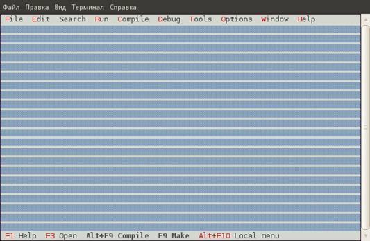         |

|    Рисунок 6.1.3.2: Экран IDE сразу после запуска (Linux)    |
| :----------------------------------------------------------: |
| 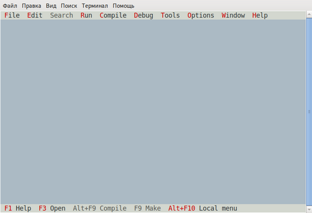 |


В верхней части экрана отображается *строка меню*, в нижней части - *строка состояния*. Пустое пространство между ними называется *рабочим столом*.

Строка состояния отображает сочетания клавиш для часто используемых команд и обеспечивает быстрый доступ к этим командам посредством мыши. По правому краю строки состояния отображается текущий объем неиспользованной памяти. Это только отображение, поскольку среда IDE пытается выделить больше памяти из операционной системы, если ей ее не хватает.

Меню обеспечивает доступ ко всем функциям среды IDE, а в правой части меню отображаются часы.

Из IDE можно выйти, выбрав в меню `«Файл — Выход»` (что означает выбор пункта `«Выход»` в меню `«Файл»`) или нажав `<Alt>+<X>`.

**Примечание:** если в текущем каталоге обнаружен файл *fp.ans*, он загружается и используется для рисования фона. Этот файл должен содержать команды рисования ANSI для рисования на экране.


### 6.2 Навигация в IDE.

В IDE можно перемещаться как с помощью клавиатуры, так и с помощью мыши, если система оснащена мышью.


#### 6.2.1 Использование клавиатуры.

Все функциональные возможности IDE доступны через использование клавиатуры.
- Она используется для набора текста и навигации по источникам.
- Команды редактирования, такие как копирование и вставка текста.
- Перемещение и изменение размеров окон.
- Ее можно использовать для доступа к меню, нажав `<ALT>` и соответствующую выделенную букву меню, или нажав `<F10>` и перемещаясь по меню с помощью клавиш со стрелками. Более подробную информацию о меню можно найти в разделе [6.4](###6.4-Меню).
- Многие команды в среде IDE связаны с ярлыками, то есть при наборе специальной комбинации клавиш команда будет выполнена немедленно.

**Примечание:**
- При работе в Linux X-Term или в сеансе telnet комбинация клавиш с `<Alt>` может быть недоступна. Чтобы исправить это, сначала может быть нажата комбинация `<Ctrl>+<Z>`. Это означает, что, например, `<Alt>+<X>` можно заменить на `<Ctrl>+<Z>+<X>`.
- Кроме того, вы можете попробовать комбинацию клавиш `<ESC>+<X>` для `<Alt>+<X>` при работе на Linux.
- Полный список всех сочетаний клавиш можно найти в разделе [6.14](###6.14-Сочетания-клавиш).


#### 6.2.2 Использование мыши.

Если система оснащена мышью, ее можно использовать для работы с IDE. Левая кнопка используется для выбора пунктов меню, нажатия кнопок, выбора текстовых блоков и т.д.

Правая кнопка мыши используется для доступа к локальному меню, если оно доступно. Удерживая нажатой клавишу `<Ctrl>` или `<Alt>` и нажимая правую кнопку, вы выполните предопределенные пользовательские функции. См. раздел [6.12.4](####6.12.4-Клавиатура-и-мышь).

**Примечание:**
1. Иногда в руководстве используется термин «перетаскивание мышью». Это означает, что мышь перемещается, пока нажата левая кнопка мыши.
2. Действие кнопок мыши может быть отменено, то есть действия левой кнопки мыши могут быть назначены правой кнопке мыши и наоборот (см. раздел [6.12.4](####6.12.4-Клавиатура-и-мышь) для получения дополнительной информации о том, как отменить действия кнопок мыши.). Во всем руководстве предполагается, что действия кнопок мыши не отменяются.
3. Мышь не всегда доступна, даже если она установлена:
    - IDE работает под Linux через соединение telnet с компьютера с Windows.
    - IDE работает под Linux в X-термине под X-windows. В этом случае это зависит от программы терминала: под Konsole (терминал KDE) он работает.
4. В Windows консоль имеет параметр «Быстрое редактирование», позволяющий копировать текст в буфер обмена, выбрав текст в окне консоли. Если этот режим включен, работать мышь не будет. Параметр «Быстрое редактирование» должен быть отключен в свойствах окна консоли, чтобы среда IDE могла получать события мыши.


#### 6.2.3 Навигация в диалогах.

Диалоги обычно содержат много элементов, таких как кнопки, поля редактирования, поля заметок, списки и т.д. Чтобы активировать одно из этих полей, выберите один из следующих методов:
1. Нажмите на элемент с помощью мыши.
2. Нажимайте клавишу `<Tab>`, пока фокус не достигнет элемента.
3. Нажмите выделенную букву на ярлыке элемента. Если в данный момент фокус находится на элементе, который позволяет редактировать, тогда `<Alt>` следует нажимать одновременно с выделенной буквой. Для кнопки будет выполнено действие, связанное с кнопкой.

Внутри полей редактирования, списков и заметок навигация осуществляется с помощью обычных команд клавиш со стрелками.


### 6.3 Окно.

В настоящее время работа с оконными приложениями не должна быть проблемой для большинства пользователей Windows и Linux. Тем не менее, в следующем разделе описывается, как работают окна, чтобы извлечь максимальную выгоду из Free Pascal IDE.


6.3.1 Основное окно.

Общее окно IDE показано на рисунке 6.3.1.1

|                Рисунок 6.3.1.1 Общее окно IDE                |
| :----------------------------------------------------------: |
| 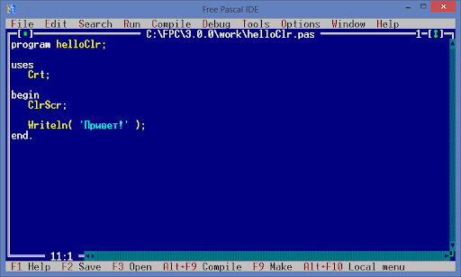 |

Окно окружено так называемой рамой, белой двойной линией вокруг окна.

В верхней части окна отображаются 4 вещи:
- В верхнем левом углу окна отображается значок закрытия. При нажатии окно будет закрыто.
- Его также можно закрыть, нажав Alt-F3 или выбрав пункт меню `<Window—Close>`(Окно - Закрыть). Все открытые окна можно закрыть, выбрав пункт меню `<Window—Close all>`(Окно - Закрыть все). В середине отображается заголовок окна.
- Почти в правом верхнем углу номер виден. Этот номер идентифицирует окно редактора, и нажатие `<Alt>+<Number>` перейдет в это окно. Только первые 9 окон получат такой номер.
- В верхнем правом углу видна маленькая зеленая стрелка. Нажатие на эту стрелку увеличивает окно, чтобы оно покрыло весь рабочий стол. Нажатие на эту стрелку в увеличенном окне восстановит старый размер окна. Нажатие клавиши `<F5>` имеет тот же эффект, что и нажатие на эту стрелку. Этого же эффекта можно достичь с помощью пункта меню `<Window—Zoom>`(Окно - Масштаб). Окна и диалоги, размер которых нельзя изменить, также нельзя увеличить.

Правый край и нижний край окна содержат полосы прокрутки. Их можно использовать для прокрутки содержимого окна с помощью мыши. Стрелки на концах полос прокрутки можно нажимать для прокрутки содержимого построчно. Нажатие на пунктирную область между стрелками и прямоугольником голубого цвета прокручивает содержимое окна постранично. Перетаскивая прямоугольник, содержимое можно прокручивать непрерывно.

Звездочка и цифры в левом нижнем углу окна отображают информацию о содержимом окна. Они объяснены в разделе о редакторе, см. раздел [6.5](###6.5-Редактирование-текста.).


#### 6.3.2 Изменение размеров и перемещение окон.

Окно можно перемещать и изменять размер с помощью мыши и клавиатуры.

Чтобы переместить окно: 
- используя мышь, щелкните строку заголовка и перетащите окно мышью.
- с помощью клавиатуры перейдите в режим изменения размера/перемещения, нажав `<Ctrl>+<F5>` или выбрав пункт меню `<Window—Size/Move>`(Окно - Размер/Переместить). Рамка окна изменится на зеленый, чтобы указать, что IDE находится в режиме изменения размера/перемещения. Теперь клавиши курсора можно использовать для перемещения окна. Нажмите `<Enter>`, чтобы выйти из режима изменения размера/перемещения. В этом случае окно сохранит свой размер и положение. Кроме того, нажатие клавиши `<Esc>` восстановит старую позицию.

Чтобы изменить размер окна:
- используя мышь, щелкните в правом нижнем углу окна и перетащите его.
- с помощью клавиатуры перейдите в режим размер/перемещение, нажав `<Ctrl<+<F5>` или выбрав пункт меню `Window—Size/Move`(Окно - Размер/Переместить). Рамка окна изменится на зеленый, чтобы указать, что IDE находится в режиме размера/перемещения. Теперь, удерживая клавишу `<SHIFT>`, нажмите одну из клавиш курсора, чтобы изменить размер окна. Нажмите `<Enter>`, чтобы выйти из режима изменения размера/перемещения. Нажатие `<Esc>` восстановит старый размер.

Не все окна могут быть изменены. Это относится, например, к *диалоговым окнам* (раздел [6.3.4](####6.3.4-Диалоговые-окна)). 

Окно также может быть скрыто. Чтобы скрыть окно, можно использовать комбинацию клавиш `<Ctrl>+<F6>` или выбрать меню `<Window—Hide>`(Окно - Скрыть). Чтобы восстановить скрытое окно, необходимо выбрать его из списка окон. Более подробную информацию о списке окон можно найти в следующем разделе.


#### 6.3.3 Работа с несколькими окнами.  

При работе с более крупными проектами вполне вероятно, что на рабочем столе появится несколько окон. Однако только одно из этих окон будет активным окном; все остальные окна будут неактивными. 

Неактивное окно обозначается серой рамкой. Неактивное окно можно сделать активным одним из нескольких способов:
- используя мышь, активируйте окно, нажав на него.
- при использовании клавиатуры нажатие `<F6>` будет проходить через все открытые окна. Чтобы активировать ранее активированное окно, можно использовать `<Shift>+<F6>`.
- пункт меню `Window—Next`(Окно - Далее) можно использовать для активации следующего окна в списке окон, тогда как Окно | Предыдущий выберет предыдущее окно.
Если у окна есть номер в правом верхнем углу, его можно активировать, нажав Alt- <число>.
Нажатие Alt-0 вызовет диалог со всеми доступными окнами, который позволяет быстро активировать окна, у которых нет номера.

Окна могут быть упорядочены и размещены на рабочем столе IDE путем масштабирования и изменения их размера с помощью мыши или клавиатуры. Это трудоемкая задача, особенно сложная с клавиатурой. Вместо этого можно использовать пункты меню «Окно-плитка» и «Окно-каскад»:
Плитка будет равномерно распределять все пространство рабочего стола между всеми окнами с изменяемым размером.
Каскад ставит все окна в каскадное расположение. В очень редких случаях экран IDE может запутаться. В этом случае весь экран IDE можно обновить, выбрав пункт меню «Окно - Обновить отображение».


#### 6.3.4 Диалоговые окна.

Во многих случаях в среде IDE отображается диалоговое окно для получения пользовательского ввода. Основное отличие от обычных окон состоит в том, что другие окна не могут быть активированы, когда диалог активен. Также меню недоступно во время диалога. Такое поведение называется модальным. Чтобы активировать другое окно, модальное окно или диалог должны быть закрыты в первую очередь.

Типичное диалоговое окно показано на рисунке (6.3.4.1).

|           рисунок 6.3.4.1 Типичное диалоговое окно           |
| :----------------------------------------------------------: |
| 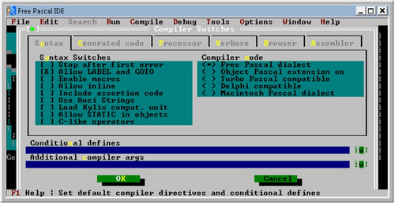 |


### 6.4 Меню.

Главное меню (серая полоска в верхней части IDE) обеспечивает доступ ко всем функциям IDE. Он также содержит часы, отображающие текущее время. Меню всегда доступно, кроме случаев, когда открыто диалоговое окно. Если диалоговое окно открыто, оно должно быть сначала закрыто для доступа к меню.

В некоторых окнах также доступно локальное меню. Локальное меню появляется там, где находится курсор, и предоставляет дополнительные команды, которые зависят от контекста.


#### 6.4.1 Доступ к меню.

Доступ к меню можно получить несколькими способами:
1. с помощью мыши при выборе пункта меню. Курсор мыши должен быть расположен над нужным пунктом меню, затем щелчок левой кнопкой мыши выберет его.
2. нажитием `<F10>`. Это переключит фокус IDE на меню. Для навигации в меню могут быть использованы клавиши со стрелками. Клавиша `<Enter>` должна использоваться для выбора пунктов.
3. для прямого доступа к элементам меню может использоваться `<Alt>+<подсвеченная буква меню>` для выбора пункта меню. Впоследствии пункты подменю можно выбрать нажатием выделенной буквы, но без `<Alt>`. Например, `<Alt>+<S>` `<G>` - это быстрый способ отобразить диалог перехода к строке.

Каждый пункт меню поясняется коротким текстом в строке состояния.

Когда доступно локальное меню, к нему можно обратиться, нажав правую кнопку мыши или `<Alt>+<F10>`.

Чтобы выйти из любого меню без каких-либо действий, дважды нажмите клавишу `<ESC>`.

Далее описаны все пункты меню и их действия.


#### 6.4.2 Меню File.

Меню `File`(Файл) содержит все пункты меню, которые позволяют пользователю загружать и сохранять файлы, а также выходить из IDE.
- `New`(Новый) Открывает новое пустое окно редактора.
- `New from template`(Создать из шаблона) Запрашивает использование шаблона, спрашивая заполнение любых параметров, а затем запускает новое окно редактора с шаблоном.
- `Open(F3)`(Открыть)  Представляет диалоговое окно выбора файла и открывает выбранный файл в новом окне редактора.
- `Print`(Печать) Распечатывает содержимое текущего окна редактирования.
- `Print setup`(Настройка печати) Настраивает свойства принтера. 
- `Reload`(Перезагрузка) Перезагружает файл с диска.
- `Save(F2)`(Сохранить) Сохраняет содержимое текущего окна редактирования с текущим именем файла. Если текущее окно редактирования еще не имеет имени файла, открывается диалоговое окно для ввода нового имени файла.
- `Save as`(Сохранить как) Предоставляет диалог, в котором можно ввести имя файла. Содержимое текущего окна затем сохраняется в это новое имя файла, а имя файла сохраняется для дальнейших действий сохранения.
- `Save all`(Сохранить все) Сохраняет содержимое всех окон редактирования.
- `Change dir`(Cменить каталог) Предоставляет диалоговое окно, в котором можно выбрать каталог. Текущий рабочий каталог затем изменяется на выбранный каталог.
- `Command shell`(Командная оболочка) Запускает командную оболочку. После выхода из оболочки работа среды возобновляется. Какая командная оболочка выполняется, зависит от системы.
- `Exit(ALT-X)` (Выход)  Выход из IDE. Если в редакторе есть несохраненные файлы, в среде IDE будет предложено сохранить эти файлы.

Под меню `Exit`(Выход) отображаются некоторые имена недавно использованных файлов. Эти записи могут быть использованы для быстрой перезагрузки этих файлов в редакторе.


#### 6.4.3 Меню Edit.

Меню `Edit`(Редактировать) содержит записи для доступа к буферу обмена и отмены или повторения действий редактирования. Большинство из этих функций имеют сочетания клавиш, связанные с ними.
- `Undo(ALT-BKSP)`(Отменить) Отменяет эффект последнего действия редактирования. Действия редактирования хранятся в буфере. Выбор этого механизма будет перемещаться назад через этот буфер, то есть возможно несколько уровней отмены. Тем не менее, произвольно выбранные варианты не воспроизводятся.
- `Redo`(Повторить) Повторяет последнее действие, которое было только что отменено при отмене. `Redo` может повторить несколько отмененных действий.
- `Cut(Shift-DEL)`(Вырезать) Удаляет выделенный текст из окна и копирует его в буфер обмена. Любое предыдущее содержимое буфера обмена затирается. Новое содержимое буфера обмена доступно для вставки в другом месте.
`Copy(Ctrl-INS)`(Копировать) Копирует текущий выбор в буфер обмена. Любое предыдущее содержимое буфера обмена затирается. Новое содержимое буфера обмена доступно для вставки в другом месте.
- `Copy (Shift-INS)`(Вставить) Вставляет текущее содержимое буфера обмена в текст в позиции курсора. Содержимое буфера обмена остается прежним.
- `Clear(Ctrl-DEL)`(Очистить) Очищает (т.е. удаляет) текущий выбор.
- `Select All`(Выбрать все) Выбирает весь текст в текущем окне. Выбранный текст может быть затем вырезан или скопирован в буфер обмена.
- `Unselect` (Отменить выбор) Отменяет выбор.
- `Show clipboard`(Показать буфер обмена) Открывает окно, в котором отображается текущее содержимое буфера обмена.

При запуске IDE под Windows в меню `Edit`(Редактировать) есть две дополнительные записи. В среде IDE имеется отдельный буфер обмена, который не разделяет его содержимое с буфером обмена Windows. Для доступа к буферу обмена Windows также существуют следующие две записи:
- `Copy to Windows`(Копировать в Windows) Скопировать выделенную область в буфер обмена Windows.
- `Paste from Windows`(Вставить из Windows) Вставляет содержимое буфера обмена Windows (если оно содержит текст) в окне редактирования в текущей позиции курсора.


#### 6.4.4 Меню Search.

Меню `Search`(Поиск) обеспечивает доступ к диалогам поиска и замены, а также к браузеру символов в среде IDE.
- `Find(Ctrl-Q F)`(Найти) Представляет диалоговое окно поиска. Можно ввести текст для поиска, и когда диалоговое окно закрывается, введенный текст ищется в активном окне. Если текст найден, он будет выбран.
- `Replace(Ctrl-Q A)`(Заменить) Представляет диалог поиска и замены. После закрытия диалога текст поиска будет заменен текстом замены в активном окне.
- `Search again (CTRL-L)`(Искать заново) Повторяет последний поиск или поиск и замену действия, используя те же параметры.
- `Go to line number (Alt-G)`(Перейти к номеру строки) Запрашивает номер строки, а затем переходит к этому номеру строки.
Когда программа и модули скомпилированы с информацией для просмотра, включаются также следующие пункты меню:
- `Find procedure`(Поиск процедуры) Еще не реализована.
- `Objects`(Объекты) Запрашивает имя объекта и открывает окно просмотра для этого объекта.
- `Modules`(Модули) Запрашивает имя модуля и открывает окно просмотра для этого модуля.
- `Globals`(Общий) Запрашивает имя глобального символа и открывает окно просмотра для этого глобального символа. 
- `Symbol`(Символ) Открывает окно со всеми известными символами, в котором можно выбрать символ. После выбора символа открывается окно просмотра этого символа.


#### 6.4.5 Меню Run.

Меню `Run`(Выполнить) содержит все записи, связанные с запуском программы.
- `Run (Ctrl-F9)`(Выполнить) Если исходные коды были изменены, компилируется программа. Если компиляция прошла успешно, программа выполняется. Если первичный файл был задан, то он используется для определения, какую программу выполнять. См. раздел [6.4.6](####6.4.6-Меню-Compile) для получения дополнительной информации о том, как задать первичный файл.
- `Step over (F8)`(Шаг вперед) Запускает программу, пока не будет достигнута следующая строка исходника. Если будут сделаны какие-либо вызовы процедур, они также будут выполнены полностью.
- `Trace into (F7)`(Трассировка вглубь) Если текущая строка содержит вызов другой процедуры, процесс остановится в точке входа вызываемой процедуры.
- `Goto cursor (F4)`(Курсор перехода) Выполняет программу, пока точка выполнения не совпадет со строкой, в которой находится курсор.
- `Until return`(До возврата) Запускает текущую процедуру до ее выхода.
- `Run directory`(Каталог запуска) Задает рабочий каталог, в который нужно перейти при выполнении программы.
- `Parameters`(Параметры) Позволяет вводить параметры, которые будут переданы программе при ее выполнении.
- `Program reset(Ctrl-F2)`(Сброс программы) Если программа запускается или отлаживается, сеанс отладки прерывается, а запущенная программа уничтожается.


#### 6.4.6 Меню Compile.

Меню `Compile`(Компиляция) содержит все записи, связанные с компиляцией программы или модуля.
- `Compile (Alt-F9)`(Компилировать) Компилирует содержимое активного окна независимо от настроек основного файла.
- `Make (F9)`(Сделать) Компилирует содержимое активного окна и любые файлы, от которых зависит модуль или программа и которые были изменены с момента последней компиляции. Если основной файл был задан, вместо этого компилируется основной файл.
- `Build`(Сборка) Компилирует содержимое активного окна и любые файлы, от которых зависит модуль или программа, независимо от того, были ли они изменены или нет. Если основной файл был задан, основной файл компилируется вместо этого.
- `Target`(Цель) Устанавливает целевую операционную систему, для которой программа должна быть скомпилирована.
- `Primary file`(Основной файл) Задает основной файл. Если он задан, любая команда запуска или компиляции будет действовать на основной файл, а не на активное окно. Основной файл не нужно загружать в IDE, чтобы это имело эффект.
- `Clear primary file`(Очистить основной файл) Очищает основной файл. После этой команды любое действие запуска или компиляции будет действовать в активном окне.
- `Compiler messages (F12)`(Сообщения компилятора) Отображает окно сообщений компилятора. В этом окне будут отображаться сообщения, сгенерированные компилятором во время самой последней компиляции.


#### 6.4.7 Меню Debug.

Меню `Debug`(Отладка) содержит пункты меню, помогающие в отладке программы, такие как установка точек останова и наблюдения.
- `Output`(Выходные данные) Показывает вывод программы пользователя в окне.
- `User screen (Alt-F5)`(Экран пользователя) Переключение на экран в том виде, в котором он был оставлен запущенной программой в последний раз.
- `Add watch (Ctrl-F7)`(Добавить отслеживание) Добавляет отслеживание. Отслеживание - это выражение, которое может быть оценено средой IDE и будет показано в специальном окне. Обычно это содержимое некоторой переменной.
- `Watches`(Отслеживание) Показывает текущий список отслеживания в отдельном окне.
- `Breakpoint (Ctrl-F8)`(Точка останова) Устанавливает точку останова на текущей строке. При отладке выполнение программы остановится на этой точке останова.
- `Breakpoint list`(Список точек останова) Показывает текущий список точек останова в отдельном окне.
- `Evaluate Call stack (Ctrl-F3)`(Оценить стек вызовов) Показывает стек вызовов. Стек вызовов - это список адресов (и имен файлов, и номеров строк, если эта информация была скомпилирована) процедур, которые в данный момент вызываются запущенной программой.
- `Disassemble`(Дисассемблирование) Показывает стек вызовов.
- `Registers`(Регистры) Показывает текущее содержимое регистров процессора.
- `Floating point unit`(Модуль с плавающей точкой) Показывает текущее содержимое регистров FPU.
- `Vector unit`(Модуль вектора) Показывает текущее содержимое регистров MMX (или эквивалентных).
- `GDB window`(Окно отладчика GDB) Показывает консоль отладчика GDB. Это может быть использовано для непосредственного взаимодействия с отладчиком; здесь можно ввести произвольные команды GDB, и результат будет показан в окне.


#### 6.4.8 Меню Tools.

Меню `Tools`(Инструменты) определяет некоторые стандартные инструменты. Если пользователь определяет новые инструменты, они также добавляются в это меню.
- `Messages (F11)`(Сообщения) Показывает окно сообщений. Это окно содержит выходные данные одного из инструментов. Для получения дополнительной информации см. раздел [6.10.1](####6.10.1-Окно-сообщений).
- `Goto next (Alt-F8)`(Перейти к следующему) Переход к следующему сообщению.
- `Goto previous (Alt-F7)`(Перейти к предыдущему) Переход к предыдущему сообщению.
- `Grep (SHIFT-F2)` Запрашивает регулярное выражение и параметры для `grep`, а затем выполняет `grep` с заданным выражением и параметрами. Чтобы это работало, программа grep должна быть установлена в системе и находиться в каталоге, который находится в PATH. Для получения дополнительной информации см. раздел [6.10.2](####6.10.2-Grep).
- `Calculator`(Калькулятор) Отображает калькулятора. Для получения дополнительной информации см. раздел [6.10.4](####6.10.4-Калькулятор).
- `ASCII table`(Таблица ASCII) Отображает таблицу ASCII. Для получения дополнительной информации см. раздел [6.10.3](####6.10.3-Таблица ASCII).


#### 6.4.9 Меню Options.

Меню `Options`(Параметры) является точкой входа для всех диалогов, которые используются для установки параметров компилятора и IDE, а также пользовательских настроек.
- `Mode`(Режим) Представляет диалоговое окно для установки текущего режима компилятора. Текущий режим отображается справа от пункта меню. Для получения дополнительной информации см. раздел [6.11.8](####6.11.8-Режимы-переключения).
- `Compiler`(Компилятор) Представляет диалоговое окно, которое можно использовать для установки общих параметров компилятора. Эти параметры будут использоваться при компиляции программы или модуля.
- `Memory sizes`(Размеры памяти) Представляет диалоговое окно, в котором можно задать размер стека и размер кучи для программы. Эти параметры будут использоваться при компиляции программы.
- `Linker`(Компоновщик) Представляет диалоговое окно, в котором можно установить некоторые параметры компоновщика. Эти параметры будут использоваться при компиляции программы или библиотеки.
- `Debugger`(Отладчик) Представляет диалог, в котором можно установить параметры отладки. Эти параметры используются при компиляции модулей или программ. Обратите внимание, что отладчик не будет работать, если для программы не сгенерирована отладочная информация.
- `Directories`(Каталоги) Представляет диалог, в котором можно установить различные каталоги, необходимые компилятору. Эти каталоги будут использоваться при компиляции программы или модуля.
- `Browser`(Браузер) Представляет диалог, в котором можно установить параметры браузера. Параметры браузера влияют на поведение браузера символов в среде IDE.
Инструменты Представляет диалог для настройки меню инструментов. Для получения дополнительной информации см. раздел [6.10.5](####6.10.5-Добавление-новых-инструментов).
- `Environment`(Окружение) Представляет диалоговое окно для настройки поведения среды IDE. Подменю представлено с различными аспектами IDE:
    - `Preferences`(Предпочтения) Общие предпочтения, например, сохранять ли файлы автоматически или нет, и какие файлы следует сохранять. Режим видео также можно установить здесь.
    - `Editor`(Редактор) Управляет различными аспектами окон редактирования.
    - `CodeComplete`(Автозавершение кода) Используется для установки слов, которые могут быть автоматически завершены при наборе текста в окнах редактора.
    `Codetemplates`(Шаблоны кода) Используется для определения шаблонов кода, которые можно вставить в окно редактирования.
    `Desktop`(Рабочий стол) Используется для управления поведением рабочего стола, т.е. некоторые функции могут быть включены или выключены.
    `Keyboard & Mouse`(Клавиатура и мышь) Может использоваться для выбора соглашения cut/copy/paste, управления действиями мыши и назначения команд различным действиям мыши.
    `Learn keys`(Изучение клавиш) Позволяет среде IDE изучать нажатия клавиш для назначения различным командам. Это полезно в основном на Linux и Unix-подобных платформах, где фактические ключи, отправляемые в IDE, зависят от эмуляции терминала.
- `Open`(Открыть) Представляет диалоговое окно, в котором можно выбрать файл, содержащий настройки редактора. После закрытия диалога файл настроек будет прочитан и настройки будут применены.
- `Save`(Сохранить) Сохраняет текущие параметры в файле по умолчанию.
- `Save as Saves`(Сохранить как) Сохраняет текущие параметры в альтернативном файле. Откроется диалоговое окно выбора файла, в котором можно указать альтернативный файл настроек.

Обратите внимание, что параметры не сохраняются автоматически. Они должны быть сохранены в явном виде с помощью команды `Options—Save`(Параметры — Сохранить).


#### 6.4.10 Меню Window.

Меню `Window`(Окно) предоставляет доступ к некоторым функциям окна. Более подробную информацию обо всех этих функциях можно найти в разделе [6.3](###6.3-Окно).
- `Tile`(Плитка) Отображение всех открытых окон на рабочем столе плиткой.
- `Cascade`(Каскад) Отображение всех открытых окон на рабочем столе каскадом.
- `Close all`(Закрыть все) Закрывает все открытые окна.
- `Size/move (Ctrl-F5)`(Размер/перемещение) Переводит IDE в режим изменения размера/перемещения; после этой команды активное окно может быть перемещено и изменено с помощью клавиш со стрелками.
- `Zoom (F5)`(Масштаб) Увеличение или уменьшение текущего окна.
- `Next (F6)`(Далее) Активирует следующее окно в списке окон.
- `Previous (SHIFT-F6)`(Предыдущий) Активирует предыдущее окно в списке окон.
- `Hide (Ctrl-F6)`(Скрыть) Скрывает активное окно.
- `Close (ALT-F3)`(Закрыть) Закрывает активное окно.
- `List (Alt-0)`(Список) Показывает список открытых окон. Оттуда окно может быть активировано, закрыто, показано и скрыто.
- `Refresh display`(Обновить дисплей) Перерисовывает экран.


6.4.11 Меню Help.

Меню `Help`(Справка) предоставляет точки входа для всех функций справки в среде IDE, а также средства для настройки справочной системы.
- `Contents`(Содержание) Показывает содержание справки.
- `Index (SHIFT-F1)`(Индекс) Перейти к справке Index.
- `Topic search (CTRL-F1)`(Поиск по теме) Переход к теме, связанной с выделенным в данный момент текстом.
- `Previous topic (ALT-F1)`(Предыдущая тема) Переход к ранее посещенной теме.
- `Using help`(Использование справки) Отображение справки по использованию справочной системы.
- `Files`(Файлы) Позволяет настроить меню справки. С помощью этого пункта меню файлы справки могут быть добавлены в справочную систему.
- `About`(О программе) Отображает информацию об IDE. См. раздел [6.13.3](####6.13.3-Диалог-about) для получения дополнительной информации.


### 6.5 Редактирование текста.

В этом разделе объясняются основы редактирования (исходного) текста. В этом отношении IDE работает, как и многие другие текстовые редакторы, поэтому в основном будут объяснены отличительные особенности IDE.


#### 6.5.1 Режимы вставки.

Обычно IDE находится в режиме вставки. Это означает, что любой набранный текст будет вставлен перед текстом, который присутствует после курсора.
В режиме перезаписи любой набранный текст заменит существующий текст.
В режиме вставки курсор представляет собой плоскую мигающую линию. Если среда IDE находится в режиме перезаписи, курсор представляет собой куб с высотой в одну строку. Переключение между режимом вставки и режимом перезаписи происходит с помощью клавиши вставки или клавиши `<Ctrl>+<V>`.


#### 6.5.2 Блоки.

IDE обрабатывает выделенный текст так же, как Turbo Pascal IDE. Это немного отличается от способа, которым, например, приложения Windows обрабатывают выделенный текст. 

Текст можно выделить тремя способами:
    1. С использованием мышь, перетаскивая мышку на существующий текст, выделив его.
    2. С помощью клавиатуры, нажав `<Ctrl-K>+<B>`, чтобы отметить начало выделенного текста, и `<Ctrl-K>+<K>`, чтобы отметить конец выделенного текста.
    3. С использованием клавиатуры, удерживая нажатой клавишу `<Shift>` во время навигации с помощью клавиш курсора.

Есть также несколько специальных команд выбора:
    1. Текущая строка может быть выбрана с помощью `<Ctrl-K>+<L>`.
    2. Текущее слово можно выбрать с помощью `<Ctrl-K>+<T>`.

В Free Pascal IDE выделенный текст является постоянным. После выбора диапазона текста курсор можно переместить, и выделение не будет уничтожено; следовательно, термин «блок» больше подходит для выбора и будет использоваться отныне ...

В одном блоке можно выполнить несколько команд:
    - Переместить блок в позицию курсора (`<Ctrl-K>+<V>`).
    - Скопировать блок в местоположение курсора (`<Ctrl-K>+<C>`).
    - Удалить блок (`<Ctrl-K>+<Y>`).
    - Записать блок в файл (`<Ctrl-K>+<W>`).
    - Прочесть содержимое файла в блок (`<Ctrl-K>+<R>`). Если блок уже существует, этот блок не заменяется этой командой. Файл вставляется в текущей позиции курсора, а затем вставленный текст выделяется.
    - Сделать отступ для блока (`<Ctrl-K>+<I>`).
    - Отменить отступ блока (`<Ctrl-K>+<U>`).
    - Распечатать содержимое блока (`<Ctrl-K>+<P>`).

При поиске и замене поиск может быть ограничен содержимым блока.


#### 6.5.3 Настройка закладок.

В среде IDE есть функция, позволяющая установить закладку в текущей позиции курсора. Позже курсор можно вернуть в эту позицию, нажав сочетание клавиш.

Можно установить до 9 закладок на исходный файл; они устанавливаются с помощью `<Ctrl-K>+<Number>` (где `number` - номер закладки). Чтобы перейти к ранее установленной закладке, нажмите `<Ctrl-Q>+<Number>`.

**Примечание**. В настоящее время закладки не сохраняются при выходе из среды IDE. Это может измениться в будущих реализациях IDE.


#### 6.5.4 Переход к исходной строке.

Можно перейти непосредственно к конкретной строке источника. Для этого откройте диалоговое окно `Goto line number`(Перейти к строке) в меню `Search—Goto line number`(Поиск - номер строки перехода).

В появившемся диалоговом окне можно ввести номер строки, к которой должна перейти IDE. Диалог перехода к строке показан на рисунке 6.4

|                 Рисунок 6.4 Диалог goto line                 |
| :----------------------------------------------------------: |
| 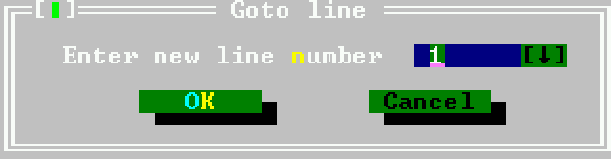 |


#### 6.5.5 Подсветка синтаксиса.

В среде IDE предусмотрена возможность подсветки синтаксиса, т.е. цвет некоторых элементов Pascal может быть установлен. Когда текст вводится в окне редактора, IDE попытается распознать элементы и соответственно установить цвет текста.
Подсветка синтаксиса может быть настроена в диалоге настроек цвета с помощью пункта меню `Options—Environment—Colors`(Параметры—Среда—Цвета). В диалоговом окне цветов должна быть выбрана группа `Syntax`(Синтаксис). Затем список элементов будет отображать различные синтаксические элементы, которые можно раскрасить:

- `Whitespace`(Пробел) Пустой текст между словами. Обратите внимание, что для пробелов будет использоваться только цвет фона.
- `Comments`(Комментарии) Все стили комментариев в Free Pascal.
- `Reserved words`(Зарезервированные слова) Все зарезервированные слова Free Pascal (см. также  [Reference Guide](https://www.freepascal.org/docs-html/current/ref/ref.html)).
- `Strings`(Строки) Постоянные строковые выражения.
- `Numbers`(Числа) Числа в десятичной записи.
- `Hex numbers`(Шестнадцатеричные числа) Числа в шестнадцатеричной записи.
- `Assembler`(Ассемблер) Любые ассемблерные блоки.
- `Symbols`(Символы)  Распознанные символы (переменные, типы). 
- `Directives`(Директивы) Директивы компилятора.
- `Tabs`(Вкладки) Символы табуляции в источнике могут иметь другой цвет, чем другие пробелы.

Редактор использует некоторые настройки по умолчанию, но эксперименты - лучший способ найти подходящую цветовую схему. Хорошая цветовая схема помогает обнаруживать ошибки в источниках, поскольку ошибки приводят к неправильной подсветке синтаксиса.


#### 6.5.6 Автозавершение кода.

Автозавершение кода означает, что редактор попытается угадать текст по мере его ввода. Это делается путем проверки того, какой текст набирается, и как только набранный текст может быть использован для идентификации ключевого слова в списке ключевых слов, ключевое слово будет представлено в небольшом цветном поле под напечатанным текстом. Нажатие клавиши `<Enter>` завершит слово в тексте.

Пока нет завершения кода для заполнения аргументов функции или выбора методов объекта, как, например, Lazarus или Delphi IDE.

Завершение кода можно настроить в диалоговом окне «Завершение кода», доступном через пункт меню `Options—Preferences—Codecomplete`(Параметры — Предпочтения — Автозавершение кода). Список ключевых слов, которые можно автоматически завершить, можно сохранить здесь. Диалог завершения кода показан на рисунке (6.5).

|       Рисунок 6.5 Диалоговое окно автозавершения кода        |
| :----------------------------------------------------------: |
| 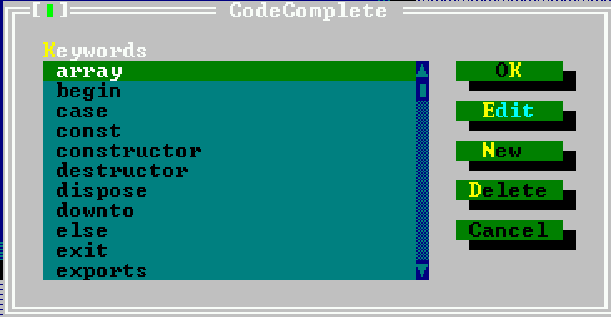 |


Диалог показывает в алфавитном порядке определенные в настоящее время ключевые слова, которые доступны для автозавершения. Доступны следующие кнопки:

- `ОК` Сохраняет все изменения и закрывает диалог.
- `Edit`(Изменить) Открывает диалоговое окно, которое позволяет редактировать выделенное в данный момент ключевое слово.
- `New`(Новое) Открывается диалоговое окно, в котором можно ввести новое ключевое слово, которое будет добавлено в список.
- `Delete`(Удалить) Удаляет текущее выделенное ключевое слово из списка.
- `Cancel`(Отмена) Отменяет все изменения и закрывает диалог.

Все ключевые слова сохранены и доступны при следующем запуске IDE. Дубликаты имен не допускаются. Если будет сделана попытка добавить повторяющееся имя в список, появится ошибка.


#### 6.5.7 Шаблоны кода.

Шаблоны кода - это способ вставки больших кусков кода одновременно. Каждый шаблон кода идентифицируется уникальным именем. Это имя можно использовать для вставки связанного фрагмента кода в текст.

Например, имя шаблона `ifthen` может быть связано со следующим фрагментом кода:
```pascal
if | then  
  begin  
  end
```
Шаблон кода можно вставить, введя его имя и нажав `<Ctrl-J>`, когда курсор расположен сразу после имени шаблона.

Если перед курсором нет имени шаблона, появится диалоговое окно, позволяющее выбрать шаблон.

Если в шаблоне кода присутствует вертикальная черта (`|`), на него помещается курсор и вертикальная черта удаляется. В приведенном выше примере курсор будет расположен между `if` и `then`, готовым ввести выражение.

Шаблоны кода можно добавлять и редактировать в диалоге шаблонов кода, доступном через пункт меню `Options—Environment—CodeTemplates`(Параметры—Среда—Шаблоны кода). Диалог шаблонов кода показан на рисунке (6.6).

|          Рисунок 6.6 Диалоговое окно шаблонов кода           |
| :----------------------------------------------------------: |
| 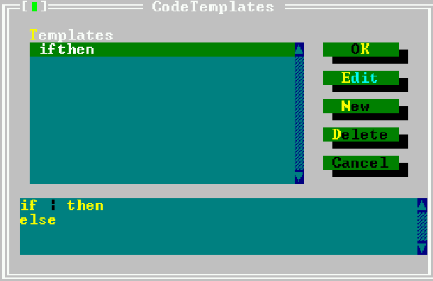 |

В верхнем списке в диалоге шаблонов кода отображаются имена всех известных шаблонов. В нижней половине диалогового окна отображается текст, связанный с выделенным в данный момент шаблоном кода. Доступны следующие кнопки:

- `ОК` Сохраняет все изменения и закрывает диалог.
- `Edit`(Редактировать) Всплывающее диалоговое окно, которое позволяет редактировать выделенный в данный момент шаблон кода. И имя, и текст могут быть отредактированы.
- `New`(Новый) Открывается диалоговое окно, в котором можно ввести новый шаблон кода, который будет добавлен в список. Имя должно быть введено для нового шаблона.
- `Delete`(Удалить) Удаляет выделенный в данный момент шаблон кода из списка.
- `Cancel`(Отмена) Отменяет все изменения и закрывает диалог.

Все шаблоны сохраняются и будут доступны при следующем запуске IDE.

**Примечание:** дубликаты не допускаются. Если попытаться добавить повторяющееся имя в список, произойдет ошибка.


### 6.6 Поиск и замена.

Среда IDE позволяет искать текст в активном окне редактора. Для поиска текста можно выполнить одно из следующих действий:
1. Выберите `Search—Find`(Поиск-Найти) в меню.
2. Нажмите `<Ctrl-Q>+<F>`.

После этого появится диалоговое окно, показанное на рисунке (6.7), и можно будет ввести следующие параметры:

|  Рисунок 6.7 Диалоговое окно поиска  |
| :----------------------------------: |
| 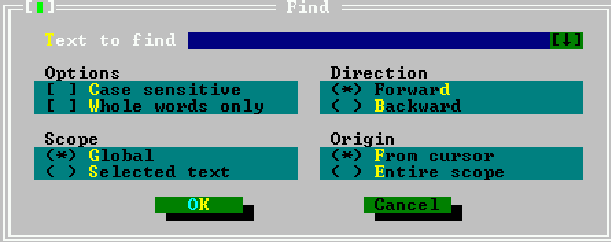 |

- `Text to find`(Текст для поиска) Если блок был активен при запуске диалога, предлагается первая строка этого блока.
- `Case sensitive`(Регистрозависимый) Если этот флажок установлен, поиск чувствителен к регистру.
- `Whole words only`(Только целые слова) Если этот флажок установлен, текст для поиска должен определяться в искомом тексте как полное слово.
- `Direction`(Направление поиска) Направление, в котором должен выполняться поиск, начиная с указанного источника.
- `Scope`(Область) Указывает, должен ли поиск выполняться по всему файлу или только по выделенному тексту.
- `Origin`(Источник) Указывает, должен ли поиск начинаться с позиции курсора или с начала области.

После закрытия диалога поиск выполняется с использованием заданных параметров.

Поиск можно повторить (используя те же параметры) одним из двух способов:
1. Выбрать `Search—Search again`(Поиск-Поиск снова) в меню.
2. Нажать `<Ctrl-L>`.

Также возможно заменить вхождения текста другим текстом. Это можно сделать аналогично поиску текста:
1. Выбрать `Search—Replace`(Поиск-Заменить) в меню.
2. Нажать `<Ctrl-Q>+<A>`.

Появится диалоговое окно, похожее на диалоговое окно поиска, как показано на рисунке (6.8).

| Рисунок 6.8 Диалоговое окно замены текста |
| :---------------------------------------: |
|   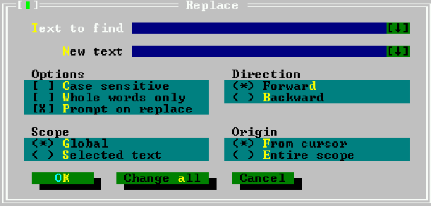   |


В этом диалоговом окне, в дополнение к возможностям диалогового окна поиска, можно ввести следующие вещи:
- `New text`(Новый текст) Текст, который заменит найденный текст.
- `Prompt on replace`(Запрос на замену) Перед заменой IDE запросит подтверждение.

Если диалоговое окно закрывается с помощью кнопки "ОК" , будет заменено только следующее вхождение поискового текста. Если диалоговое окно закрывается с помощью кнопки "Change All"(Заменить все), будут заменены все вхождения поискового текста.


### 6.7 Обозреватель символов.

Обозреватель символов позволяет искать все вхождения символа. Символ может быть переменной, типом, процедурой или константой, встречающейся в программе или источниках.

Чтобы включить браузер символов, программа или модуль должны быть скомпилированы с информацией браузера. Это можно сделать, установив параметры информации о браузере в диалоговом окне параметров компилятора.

Среда IDE позволяет просматривать несколько типов символов:
- `Procedures`(Процедуры) Позволяет быстро перейти к определению или реализации процедуры.
- `Objects`(Объекты) Быстрый поиск объекта.
- `Modules`(Модули) Просмотр модуля.
- `Globals`(Глобально) Просмотр любого глобального символа.
- `Arbitrary`(Произвольный символ) Просмотр произвольного символа.

Во всех случаях сначала должен быть выбран символ для просмотра. После этого появится окно просмотра. В окне просмотра отображаются все места, где встречался символ. Выбор местоположения и нажатие клавиши пробела приведет к тому, что редактор перейдет к этому месту; строка, содержащая символ, будет выделена.

Если местоположение находится в исходном файле, который еще не отображается, откроется новое окно с загруженным исходным файлом.

После того, как желаемое местоположение было достигнуто, окно браузера можно закрыть обычными командами.

Поведение браузера можно настроить с помощью диалогового окна параметров браузера, используя меню `Options—Browser`(Параметры—Браузер). Диалог настроек браузера выглядит как рисунок (6.9).

| Рисунок 6.9 Диалоговое окно настроек обозревателя |
| :-----------------------------------------------: |
|     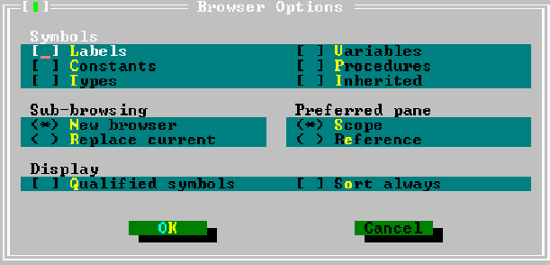     |

Следующие параметры могут быть установлены в диалоговом окне параметров браузера:

- `Symbols`(Символы) Здесь можно выбрать типы символов, отображаемых в браузере:
    - `Labels`(Метки) Показываются метки.
    - `Constants`(Константы) Показываются константы.
    - `Types`(Типы) Показываются типы.
    - `Variables`(Переменные) Показываются переменные.
    - `Procedures`(Процедуры) Показываются процедуры.
    - `Inherited`(Унаследованный)
- `Sub-browsing`(Дополнительный просмотр) Определяет, что должен делать браузер при отображении элементов сложного символа, такого как запись или класс:
    - `New browser`(Новый браузер) Члены отображаются в новом окне браузера.
    - `Replace current`(Заменить текущий) Содержимое текущего окна заменяется элементами выбранного сложного символа.
- `Preferred pane`(Предпочтительная панель) Указывает, какая панель отображается в браузере при ее первом открытии:
    - `Scope`(Объем)
    - `Reference`(Ссылка)
- `Display`(Отображение) Определяет, как браузер должен отображать символы:
    - `Qualified symbols`(Подходящие символы)
    - `Sort always`(Сортировать всегда) Сортирует символы в окне браузера.


### 6.8 Запуск программ.
Скомпилированная программа может быть запущена прямо из IDE. Это можно сделать одним из нескольких способов:

1. выбрать меню `Run—Run`(Выполнить - Запустить) или
2. нажать `<Ctrl-F9>`.

Если параметры командной строки должны быть переданы в программу, они могут быть заданы через меню `Run—Parameters`(Выполнить - Опции). Окно диалога параметров программы выглядит как рисунок (6.10).

| Рисунок 6.10 Окно диалога параметров программы  |
| :---------------------------------------------: |
| 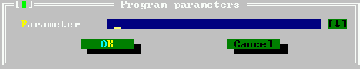 |

После запуска программы она продолжит работать до тех пор, пока:

1. программа не завершится нормально,
2. не произойдет ошибка,
3. не встретится точка останова, или
4. программа не будет прервана пользователем.

Последний вариант возможен, только если программа скомпилирована с отладочной информацией.

В качестве альтернативы, можно расположить курсор где-нибудь в исходном файле и запускать программу до тех пор, пока выполнение не достигнет строки исходника, где расположен курсор. Это может быть сделано, если:

1. выбрать меню `Run — Goto Cursor` (Запуск - Перейти к курсору),
2. нажать `<F4>`.

Опять же, это возможно, только если программа была скомпилирована с отладочной информацией.
Программа также может выполняться построчно. Нажатие `<F8>` выполнит следующую строку программы. Если программа еще не запущена, она будет запущена. Повторное нажатие клавиши `<F8>` будет запускать программу построчно, а в среде IDE будет отображаться строка, которая будет выполнена в окне редактора. Если где-то в коде происходит вызов подпрограммы, то нажатие клавиши `<F8>` приведет к выполнению всей подпрограммы, прежде чем управление вернется в IDE. Если код подпрограммы также должен быть пропущен, тогда вместо него следует использовать `<F7>`. Использование `<F7>` приведет к тому, что IDE будет выполнять построчно любую встречаемую подпрограмму.
Если подпрограмма выполняется пошагово, то меню `Run—Until return`(Выполнить - до возврата) будет запускать программу до конца текущей подпрограммы.
Если программа должна быть остановлена до того, как она закончит свою работу сама, это можно сделать посредством:

1. выбора в меню `Run—Program reset`(Выполнить - сброс программы), или
2. нажатия `<Ctrl-F2>`.

Запущенная программа будет прервана.


### 6.9 Отладка программ.

Чтобы отладить программу, она должна быть скомпилирована с отладочной информацией. Компиляция программы с отладочной информацией позволяет:

1. Выполнять программу построчно.
2. Запускать программу до определенной точки (точки останова).
3. Проверять содержимое переменных или областей памяти во время работы программы.

#### 6.9.1 Использование точек останова.

Точки останова приведут к остановке работающей программы, когда выполнение достигнет строки, где была установлена точка останова. В этот момент управление возвращается в IDE, и можно продолжить выполнение.
Чтобы установить точку останова на текущей строке источника, используйте пункт меню `Debug—Breakpoint`(Отладка - точка останова) или нажмите `<Ctrl-F8>`.
Список текущих точек останова можно получить через меню `Debug—Breakpoint list`(Отладка - Список точек останова). Окно списка точек останова показано на рисунке (6.11).

| Рисунок 6.11 Окна списка точек останова |
| :-------------------------------------: |
| 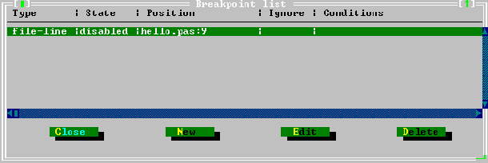  |

В окне списка точек останова можно выполнить следующие действия:

- `New`(Новый) Показывает диалоговое окно свойств точки останова, где можно ввести свойства для новой точки останова.
- `Edit`(Редактировать) Отображает диалоговое окно свойств точки останова, в котором можно изменить свойства выделенной точки останова.
- `Delete`(Удалить) Удаляет выделенную точку останова.

Диалог можно закрыть кнопкой `Close`(Закрыть). Диалог свойств точки останова показан на рисунке (6.12)

| Рисунок 6.12 Диалоговое окно свойств точек останова |
| :-------------------------------------------------: |
|       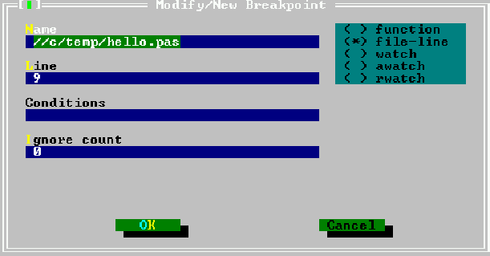        |


#### 6.9.2 Использование механизма слежения.

Когда отладочная информация компилируется в программе, можно использовать механизм слежения. Механизм слежения - это выражения, которые могут быть оценены средой IDE и показаны в отдельном окне. Когда выполнение программы останавливается (например, в точке останова), все отслеживаемые выражения будут оценены с показом их текущего значения.
Установка новых объектов слежения может быть выполнена с помощью команды меню `Debug — Add watch`(Отладка - Добавить слежение) или нажатием `<Ctrl-F7>`. Когда это будет сделано, появится диалоговое окно свойств объектов слежения и можно будет ввести новое выражение. Диалог свойств часов показан на рисунке (6.13).

| Рисунок 6.13 Диалоговое окно свойств объектов слежения |
| :----------------------------------------------------: |
|       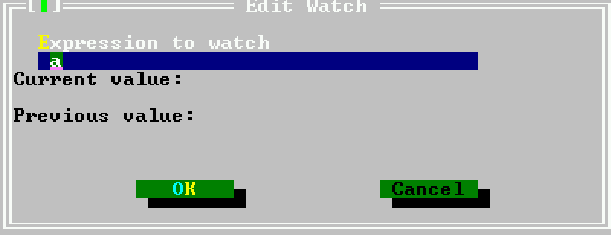        |

В диалоговом окне можно ввести выражение. Показываются любые возможное предыдущее и текущее значения.
**Примечание**: поскольку в среде IDE для отладки используется GDB, на FreeBSD необходимо вводить все выражения в ВЕРХНЕМ РЕГИСТРЕ.
Список объектов слежения и их текущие значения доступны в окне слежения, которое можно открыть с помощью меню `Debug—Watches`(Отладка - Отслеживание). Окно списка объектов слежения показано на рисунке (6.14).

|          Рисунок 6.14 Окно списка объектов слежения          |
| :----------------------------------------------------------: |
| 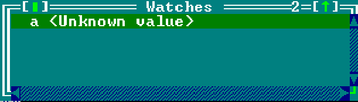 |


Нажатие `Enter` или пробела покажет диалог свойств объектов слежения для текущих выделенных объектов слежения в окне слежения.
Список объектов слежения обновляется всякий раз, когда среда IDE возобновляет управление при отладке программы.


#### 6.9.3 Стек вызовов.

Стек вызовов помогает в отображении потока программы. Он показывает список процедур, которые вызываются в данный момент, в обратном порядке. Окно стека вызовов можно отобразить с помощью меню `Debug — Call Stack`(Отладка - Стек вызовов). Оно покажет адрес или имя процедуры всех активных в настоящее время процедур с их именами и адресами. Если были переданы параметры, они также будут показаны. Стек вызовов показан на рисунке (6.15).

|               Рисунок 6.15 Окно стека вызовов                |
| :----------------------------------------------------------: |
| 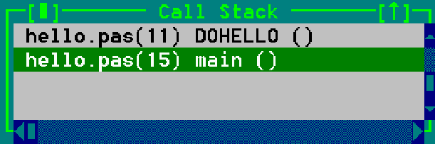 |

При нажатии клавиши пробела в окне стека вызовов строка, соответствующая вызову, будет выделена в окне редактирования.


#### 6.9.4 Окно GDB.

Окно GDB обеспечивает прямое взаимодействие с отладчиком GDB. В нем команды GDB можно вводить так же, как в GDB. Ответ GDB будет показан в окне.
Дополнительную информацию об использовании GDB можно найти в разделе [10.2](###10.2-Использование-gdb-для-отладки-вашей-программы.), но окончательная ссылка, конечно же, на само [руководство по GDB](https://www.gnu.org/software/gdb/documentation). Окно GDB показано на рисунке (6.16).

|                    Рисунок 6.16 Окно GBD                     |
| :----------------------------------------------------------: |
| 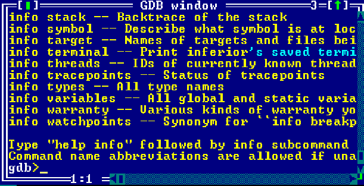 |


### 6.10 Использование инструментов.

Меню `Tools`(Инструменты) обеспечивает легкий доступ к внешним инструментам. В нем также есть три предопределенных инструмента для программистов: таблица ASCII, инструмент grep и калькулятор. Вывод внешних инструментов также доступен через это меню.

#### 6.10.1 Окно сообщений.

Вывод внешних утилит перенаправляется IDE и будет отображаться в окне сообщений. Окно сообщений отображается автоматически, если был запущен внешний инструмент. Окно сообщений также можно отобразить вручную, выбрав пункт меню `Tools—Messages`(Инструменты - Сообщения) или нажав клавишу `<F11>`. Окно сообщений показано на рисунке (6.17).

|    Рисунок 6.17 Окно сообщений     |
| :--------------------------------: |
| 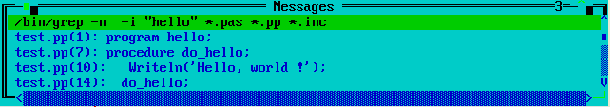 |

Если выходные данные инструмента содержат имена файлов и номера строк, окно сообщений можно использовать для навигации по источнику, как в окне просмотра:

1. Нажатие Enter или двойной щелчок на строке вывода приведет к переходу к указанной строке источника и закроет окно сообщений.
2. Нажатие клавиши пробела приведет к переходу к указанной исходной строке, но оставит окно сообщений открытым, с фокусом на нем. Это позволяет быстро выбрать другую строку сообщения с помощью клавиш со стрелками и перейти в другое место в источниках.

Алгоритм, который извлекает имена файлов и номера строк из выходных данных инструмента, довольно сложен, но в некоторых случаях он может дать сбой (предложения по улучшению или, что еще лучше, патчи, улучшающие алгоритм, всегда приветствуются).

#### 6.10.2 Grep.

Один внешний инструмент в меню `Tools`(Инструменты) уже предопределен: пункт меню для вызова утилиты `grep` (`Tools—Grep`(Инструменты - Grep) или `<Shift-F2>`). `Grep` ищет данную строку в файлах и возвращает строки, содержащие эту строку. Строка поиска может быть даже регулярным выражением. Для работы этого пункта меню должна быть установлена программа [`grep`](https://www.gnu.org/software/grep), поскольку она не распространяется с Free Pascal. 

Окно сообщений, показанное на рисунке (6.17) в предыдущем разделе, показывает вывод типичного сеанса `grep`. Окно сообщений может использоваться в сочетании с `grep` для поиска особых случаев в тексте.

`Grep` поддерживает регулярные выражения. Регулярное выражение - это строка со специальными символами, которые описывают целый класс выражений. Командная строка в dos или linux имеет ограниченную поддержку регулярных выражений: ввод `ls *.pas` (или `dir *.pas`) для получения списка всех файлов Pascal в каталоге. `*.pas` - это нечто похожее на регулярное выражение. Он использует подстановочный знак для описания целого класса строк: тех, которые заканчиваются на «.pas». Регулярные выражения предлагают гораздо больше: например, `[A-Z] [0-9] +` описывает все строки, которые начинаются с заглавной буквы, за которой следуют одна или несколько цифр.

В сферу действия данного руководства не входит подробное описание регулярных выражений. Пользователи системы linux могут получить больше информации о `grep`, используя `man grep` в командной строке.


#### 6.10.3 Таблица ASCII.

Меню инструментов также предоставляет таблицу ASCII (`Tools — ASCII table`(Инструменты - таблица ASCII). Таблицу ASCII можно использовать для поиска кодов ASCII, а также для вставки символов в окно, которое было активным при вызове таблицы.

Чтобы открыть ASCII-код символа в таблице, наведите курсор на этот символ или щелкните его мышью. Десятичные и шестнадцатеричные значения символа показаны внизу в окне таблицы ASCII.

Чтобы вставить символ в окно редактора:

1. с использованием мыши, дважды щелкните ей по символу, или,
2. с использованием клавиатуры, нажмите `<Enter>`, когда на символе находится курсор.

Это особенно полезно для вставки графических символов в константу.

Таблица ASCII остается активной, пока другое окно не будет явно активировано; таким образом, несколько символов могут быть вставлены одновременно. Таблица ASCII показана на рисунке (6.18).

|             Рисунок 6.18 Таблица символов ASCII              |
| :----------------------------------------------------------: |
|  |


#### 6.10.4 Калькулятор.

Калькулятор позволяет проводить быстрые вычисления, не покидая IDE. Это простой калькулятор, поскольку он не заботится о приоритетах операторов, а брекетинг операций (пока) не поддерживается.

Результат вычислений можно вставить в текст с помощью нажатия клавиши `<Ctrl-Enter>`. Диалог калькулятора показан на рисунке (6.19).

|          Рисунок 6.19 Диалоговое окно калькулятора           |
| :----------------------------------------------------------: |
| 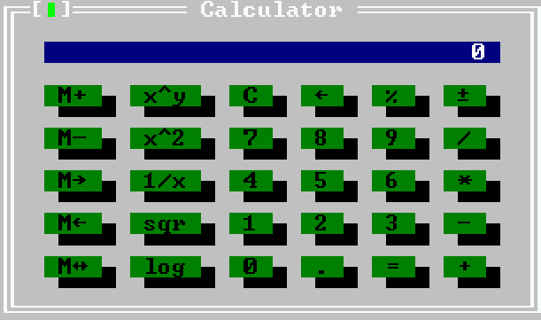 |

Калькулятор поддерживает все основные математические операции, такие как сложение, вычитание, деление и умножение. Они сведены в таблицу (6.1).

**Таблица 6.1 Основные математические операции**

| Операция                             | Кнопка |    Клавиша    |
| ------------------------------------ | :----: | :-----------: |
| Сложение двух чисел                  |   +    |     `<+>`     |
| Вычитание двух чисел                 |   -    |     `<->`     |
| Умножение двух чисел                 |   *    |     `<*>`     |
| Деление двух чисел                   |   /    |     `</>`     |
| Удаление последнего введенного числа |  <--   | `<Backspace>` |
| Очистить дисплей                     |   С    |     `<С>`     |
| Изменение знака                      |   +    |               |
| Вычисление процента                  |   %    |     `<%>`     |
| Получение результата операции        |   =    |   `<Enter>`   |


Но также поддерживаются более сложные математические операции, такие как возведение в степень и логарифмы. Расширенные математические операции показаны в таблице (6.2).

**Таблица 6.2 Расширенные математические операции**

| Операция                          | Кнопка | Клавиша |
| --------------------------------- | :----: | :-----: |
| Возведение в степень              |  x^y   |         |
| Вычисление обратного значения     |  1/x   |         |
| Вычисление квадратного корня      |  sqr   |         |
| Вычисление натурального логарифма |  log   |         |
| Возведение в квадрат              |  x^2   |         |


Как и многие калькуляторы, калькулятор в IDE также поддерживает сохранение одного значения в памяти, и с этим значением памяти можно выполнить несколько операций. Доступные операции перечислены в таблице (6.3).

**Таблица 6.3 Расширенные команды калькулятора**

| Операция                                  | Кнопка | Клавиша |
| ----------------------------------------- | :----: | :-----: |
| Добавление отображаемого числа в память   |   М+   |         |
| Вычитание отображаемого числа из памяти   |   М-   |         |
| Перемещение содержимого памяти на дисплей |  М-->  |         |
| Перемещение содержимого дисплея в память  |  M<--  |         |
| Возведение в квадрат                      |  x^2   |         |
| Обмен содержимым между памятью и дисплеем | M<-->  |         |


#### 6.10.5 Добавление новых инструментов.

Меню инструментов может быть расширено любой внешней программой, ориентированной на командную строку. Вывод такой программы будет перехвачен и отображен в окне сообщений.

Добавление инструмента в меню инструментов можно выполнить с помощью меню `Options—Tools`(Параметры - Инструменты). Это покажет диалог инструментов. Диалог инструментов показан на рисунке (6.20).

| Рисунок 6.20 Диалоговое окно настроек инструментов |
| :------------------------------------------------: |
|     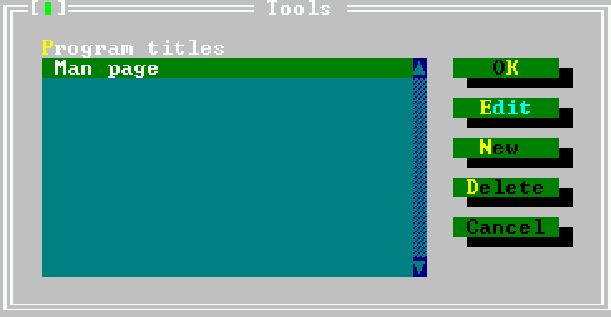      |


В диалоговом окне инструментов доступны следующие действия:
- `New`(Новый) Показывает диалоговое окно свойств инструмента, в котором можно ввести свойства нового инструмента.
- `Edit`(Редактировать) Отображение диалогового окна свойств инструмента, в котором можно редактировать свойства выделенного инструмента.
- `Delete`(Удалить) Удаляет выделенный в данный момент инструмент.
- `Cancel`(Отмена) Отменяет все изменения и закрывает диалог.
- `OK` Сохраняет все изменения и закрывает диалог.

Определения инструментов записывабются в файл конфигурации рабочего стола. Таким образом, если не включено автоматическое сохранение файла рабочего стола, файл рабочего стола следует сохранять явно после закрытия диалогового окна.


#### 6.10.6 Мета-параметры.

При указании командной строки для вызываемого инструмента можно использовать мета-параметры. Мета-параметры являются переменными и заменяются их содержимым перед передачей командной строки в инструмент.
- `$CAP` Записывает выходные данные инструмента.
- `$CAP_MSG()` Захватывает вывод инструмента и помещает его в окно сообщений.
- `$CAP_EDIT()` Захватывает выходные данные инструмента и помещает его в отдельное окно редактора.
- `$COL` Заменяется на столбец курсора в активном окне редактора. Если активного окна нет или активное окно является диалоговым окном, оно заменяется на 0.
- `$CONFIG` Заменяется полным именем файла текущей конфигурации.
- `$DIR()` Заменяется полным каталогом аргумента имени файла, включая конечный разделитель каталогов, например 
```bash
$DIR('d:\data\myfile.pas')
```
вернет `d:\data\`.
- `$DRIVE()` Заменяется буквой диска аргумента имени файла, например 
```bash
$DRIVE('d:\data\myfile.pas')
```
вернет `d:`.
- `$EDNAME` Заменяется на полное имя файла в активном окне редактирования. Если нет активного окна редактирования, это пустая строка.
- `$EXENAME` Заменяется на исполняемое имя, которое будет создано, если будет использована команда make. (т. е. из настройки «Основной файл» или активного окна редактирования).
- `$EXT()` Заменяется расширением аргумента имени файла. Расширение включает в себя точку, например
```bash
$EXT('d:\data\myfile.pas') 
```
вернет `.pas`.
- `$LINE` Заменяется на номер строки курсора в активном окне редактирования. Если окно редактирования отсутствует или активно, это 0.
- `$NAME()` Заменяется частью имени (исключая расширение и точку) аргумента имени файла, например

```bash
$NAME('d:\data\myfile.pas') 
```
вернет `myfile`.
- `$NAMEEXT()` Заменяется на часть имени и расширения аргумента имени файла, например

```bash
$NAMEEXT('d:\data\myfile.pas')
```
вернет `myfile.pas`.
- `$NOSWAP` ничего не делает в IDE; это предусмотрено только для совместимости с Turbo Pascal.
- `$PROMPT()` отображает диалоговое окно, которое позволяет редактировать все аргументы, которые идут после него. Аргументы, которые появляются перед ключевым словом `$PROMPT`, не доступны для редактирования. `$PROMPT()` также может принимать необязательный аргумент имени файла. Если fhuevtyn присутствует, `$PROMPT()` загрузит описание диалога из аргумента имени файла. Например. 
```bash
$PROMPT(cvsco.tdf) 
```
проанализирует файл `cvsco.tdf`, создаст с ним диалог и отобразит его. После закрытия диалога информация, введенная пользователем, используется для построения командной строки инструмента. См. раздел [6.10.7](####6.10.7-Создание-диалогового-окна-командной-строки.) для получения дополнительной информации о том, как создать описание диалога.
- `$SAVE` Перед выполнением команды активное окно редактора сохраняется, даже если оно не было изменено.
- `$SAVE_ALL` Перед выполнением команды все несохраненные файлы редактора сохраняются без запроса.
- `$SAVE_CUR` Перед выполнением команды содержимое активного окна редактора сохраняется без запроса изменения.
- `$SAVE_PROMPT` Перед выполнением команды отображается диалоговое окно с вопросом, следует ли сохранять несохраненные файлы перед выполнением команды.
- `$WRITEMSG()` Записывает выходные данные проанализированного инструмента в файл с именем, указанным в аргументе.


#### 6.10.7 Создание диалогового окна командной строки.

При определении инструмента, можно показать диалоговое окно пользователю, запрашивая дополнительные аргументы, используя макрос-команду `$PROMPT(filename)`. Дистрибутив Free Pascal содержит несколько готовых диалогов, таких как `grep`, `cvs checkout` и `cvs check in`. Файлы для этих диалогов находятся в двоичном каталоге и имеют расширение `.tdf`.

В этом разделе объясняется формат файла для файла описания диалога. Формат этого файла напоминает `.INI`-файл Windows, где каждый раздел в файле описывает элемент (или элемент управления) в диалоговом окне. Кнопка «ОК» и «Отмена» добавляются в конец диалогового окна автоматически, поэтому их не следует указывать в определении диалога.

Раздел `Main` - специальный раздел. Он описывает, как результат диалога будет передан в командную строку, и общий размер диалога.

**Примечание**. Ключевые слова, содержащие строковое значение, должны обрамлять строковое значение двойными кавычками, навроде
```pascal
Title = "Dialog title"
```
Раздел `Main` должен содержать следующие ключевые слова:
- `Title` Заголовок диалога. Он появится в заголовке окна диалога. Строка должна быть заключена в кавычки.
- `Size` Размер диалога, он имеет формат `(Cols,Rows)`, поэтому `Size=(59,9)` означает, что диалог имеет ширину 59 символов и высоту 9 строк. Этот размер не включает границу диалога.
- `CommandLine` указывает, как командная строка будет передана программе, на основе записей, сделанных в диалоговом окне. Текст, введенный здесь, будет передан после замены некоторых метапеременных их значениями. Элемент метапеременной - это имя некоторого элемента управления в диалоговом окне, заключенное в символы процента (`%`). Имя элемента управления будет заменено текстом, связанным с элементом управления. Рассмотрим следующий пример: 
```bash
CommandLine = "- n% l%% v%% i%% w%% searchstr%% filemask%" 
```
Здесь значения, связанные с элементами управления с именами `l`, `v`, `i`, `w` и `searchstr` и `filemask`, будут вставляется в строку командной строки.
- `Default` Имя элемента управления, который является элементом управления по умолчанию, то есть элементом управления, который должен иметь фокус при открытии диалога.

Ниже приведен пример корректного раздела `Main`:
```ini
[Main]  
Title="GNU Grep"  
Size=(56,9)  
CommandLine="-n %l% %v% %i% %w% %searchstr% %filemask%"  
Default="searchstr"
```
После раздела `Main` должен быть указан раздел для каждого элемента управления, который должен отображаться в диалоговом окне. Каждый раздел имеет имя элемента управления, который он описывает, как в следующем примере:
```ini
[CaseSensitive]  
Type=CheckBox  
Name="~C~ase sensitive"  
Origin=(2,6)  
Size=(25,1)  
Default=On  
On="-i"
```
Каждый раздел элемента управления должен иметь как минимум следующие ключевые слова, связанные с ним:
- `Type` Тип элемента управления. Возможные значения:
    - `Label` Простая текстовая метка, которая будет отображаться в диалоговом окне. Элемент управления может быть связан с этим ярлыком, поэтому он будет сфокусирован, когда пользователь нажимает подсвеченную букву в заголовке ярлыка (если есть).
    - `InputLine` Поле редактирования, в которое можно ввести текст.
    - `CheckBox` Флажок, который может быть включен или выключен.

- `Origin` Указывает, где элемент управления должен находиться в диалоговом окне. Начало координат указано как (слева, сверху), а верхний левый угол диалогового окна имеет координаты (1,1) (не считая фрейма).
- `Size` Указывает размер элемента управления, который должен быть указан как (Cols, Rows).
С каждым элементом управления связаны определенные ключевые слова; они будут описаны ниже.
С меткой (`Type=Label`) связаны следующие дополнительные ключевые слова:
    - `Text` Текст, отображаемый в метке. Если одна из букв должна быть выделена, чтобы ее можно было использовать в качестве ярлыка, она должна быть заключена в символы тильды (`˜`). Например, в 
```ini
Text="~T~ext to find"
```
`T` будет подсвечен.
    - `Link` Имя элемента управления в диалоговом окне, которое может быть указано. Если указано, нажатие на выделенную букву метки в сочетании с клавишей `<Alt>` приведет к фокусированию на указанном здесь элементе управления.

Метка не вносит вклад в текст командной строки; она предназначена только для информационных и навигационных целей. Ниже приведен пример раздела описания метки:
```ini
[label2]  
Type=Label  
Origin=(2,3)  
Size=(22,1)  
Text="File ~m~ask"  
Link="filemask"
```

Элемент редактирования (`Type=InputLine`) позволяет вводить произвольный текст. Текст элемента управления для редактирования будет вставлен в командную строку, если на него есть ссылка. В разделе управления строкой ввода можно указать следующее ключевое слово:
    - `Value` Можно указать стандартное значение (текст) для элемента управления редактированием. Это значение будет заполнено, когда появится диалоговое окно.

Ниже приведен пример раздела строки ввода:
```ini
[filemask]  
Type=InputLine  
Origin=(2,4)  
Size=(22,1)  
Value="*.pas *.pp *.inc"
```

Элемент управления checkbox (`Type=CheckBox`) представляет флажок, который может находиться в одном из двух состояний: включен или выключен. С каждым из этих состояний может быть связано значение, которое будет передано в командную строку. В разделе типа флажка могут отображаться следующие ключевые слова:
    - `Name` Текст, который появляется после флажка. Если в нем есть выделенная буква, эта буква может быть использована для установки или снятия флажка с использованием комбинации `<Alt>-`буква`.
    - `Default` Указывает, установлен ли флажок или нет при появлении диалогового окна (значение включено или выключено).
    - `On` Текст, связанный с этим флажком, если он находится в отмеченном состоянии.
    - `Off` Текст, связанный с этим флажком, если он находится в непомеченном состоянии.

Ниже приведен пример правильного описания флажка:
```ini
[i]  
Type=CheckBox  
Name="~C~ase sensitive"  
Origin=(2,6)  
Size=(25,1)  
Default=On  
On="-i"
```
Если флажок помечен, то значение `-i` будет добавлено в командную строку инструмента. Если он не помечен, никакое значение не будет добавлено.


### 6.11 Управление проектами и опции компилятора.

Управление проектами в Pascal намного проще, чем в C. Компилятор знает из исходника, какие модули, исходники и т.д. ему нужны. Таким образом, Free Pascal IDE не требуется полнофункциональный менеджер проектов, как предлагают некоторые среды разработки на Си. Тем не менее в IDE есть некоторые настройки, которые применяются к проектам.


#### 6.11.1 Основной файл.

Без первичного файла IDE компилирует/запускает исходник активного окна при запуске программы. Если указан первичный файл, IDE всегда компилирует/запускает этот исходник, даже если другое окно исходника активно. С помощью пункта меню `Compile—Primary file...`(Компиляция — Основной файл ...) можно открыть диалоговое окно файла, в котором можно выбрать основной файл. Только пункт меню `Compile—Compile`(Компиляция - Компилировать) компилирует активное окно независимо от выбора первичного файла. Это полезно, если редактируется большой проект, и нужно проверять только синтаксис текущего исходника.

Пункт меню `Compiler—Clear primary file`(Компилятор - Очистить основной файл) восстанавливает поведение IDE по умолчанию, то есть команды *compile* и *run* применяются к активному окну.


#### 6.11.2 Диалог каталога.

В диалоговом окне каталогов можно указать каталоги, в которых компилятор должен искать модули, библиотеки, объектные файлы. Там также указано, где должны храниться выходные файлы. Можно ввести несколько каталогов (кроме выходного), разделенных точкой с запятой. Диалог каталогов показан на рисунке (6.21).

|     Рисунок 6.21 Диалоговое окно конфигурации каталогов      |
| :----------------------------------------------------------: |
| 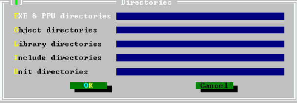 |


Можно указать следующие каталоги:
- `EXE & PPU directories` Указывает, куда будут идти скомпилированные модули и исполняемые файлы. (ключ `-FE` в командной строке (см. раздел [5.1.3](####5.1.3-Опции,-касающиеся-файлов-и-каталогов.)))
- `Object directories` Указывает, где компилятор ищет внешние объектные файлы. (`-Fo` в командной строке (см. раздел [5.1.3](####5.1.3-Опции,-касающиеся-файлов-и-каталогов.)))
- `Library directories` Указывает, где компилятор (точнее, компоновщик) ищет внешние библиотеки. (`-Fl` в командной строке(см. раздел [5.1.3](####5.1.3-Опции,-касающиеся-файлов-и-каталогов.)))
- `Include directories` Указывает, где компилятор будет искать включаемые файлы, включенные в директиву `{$i}` (`-Fi` или `-I` в командной строке (см. раздел [5.1.3](####5.1.3-Опции,-касающиеся-файлов-и-каталогов.)))
- `Unit directories` Указывает, где компилятор будет искать скомпилированные модули. Компилятор всегда смотрит первым в текущем каталоге, а также в некоторых стандартных каталогах. (`-Fu` в командной строке (см. раздел [5.1.3](####5.1.3-Опции,-касающиеся-файлов-и-каталогов.)))


#### 6.11.3 Целевая операционная система.

Пункт меню «Скомпилировать - Target» позволяет указать целевую операционную систему, для которой будут скомпилированы исходные коды. Изменение цели не влияет на переключатели или каталоги компилятора. Это влияет на некоторые определения, заданные компилятором. Настройки здесь соответствуют опции в командной строке `-T` (см. раздел [5.1.4](####5.1.4-Опции,-контролирующие-вид-вывода.)). Пример диалогового окна цели компиляции показан на рисунке (6.22): на самом деле диалоговое окно будет отображать только те цели, которые фактически поддерживает IDE.

|         Рисунок 6.22 Диалоговое окно цели компиляции         |
| :----------------------------------------------------------: |
|  |


Можно установить следующие цели (список зависит от платформы, для которой была скомпилирована среда):
- `Dos (go32v1)` Этот переключатель со временем исчезнет, так как эта цель больше не поддерживается.
- `Dos (go32v2)` Компиляция под DOS, используя версию 2 расширителя Go32.
- `FreeBSD` Компиляция под FreeBSD.
- `Linux` Компиляция под Linux.
- `OS/2` Компиляция под OS/2 (с использованием расширителя EMX).
- `Windows` Компиляция под Windows.

Текущая выбранная целевая операционная система отображается в пункте меню `Target`(Цель) в меню `Compile`(Компиляция). Первоначально будет установлена цель той операционной системы, для которой была скомпилирована среда.


#### 6.11.4 Опции компилятора.

Меню `Options—Compiler`(Параметры - Компилятор) позволяет настроить параметры, которые влияют на поведение компиляторов. При выборе этого пункта меню появляется диалоговое окно с несколькими вкладками. Есть шесть вкладок:
- `Syntax` Здесь можно установить параметры, которые влияют на различные синтаксические аспекты кода. Они в основном соответствуют опции `-S` в командной строке (раздел [5.1.5](####5.1.5-Опции,-касающиеся-исходников-(языковые опции).)).
- `Code generation` Эти параметры управляют сгенерированным кодом; они в основном касаются параметров командной строки `-C` и `-X`.
- `Verbose` Она устанавливает "многословность" компилятора при компиляции. Сообщения компилятора отображаются в окне сообщений компилятора (можно вызвать с помощью `<F12>`).
- `Browser` Опции, касающиеся генерируемой браузером информации. Информация браузера должна быть сгенерирована для работы браузера символов.
- `Assembler` Параметры, касающиеся чтения ассемблерных блоков (`-R` в командной строке) и сгенерированного ассемблером кода (`-A` в командной строке)
- `Processor` Здесь можно выбрать целевой процессор.

На каждой вкладке есть два поля ввода: первое для задания условий и второе для дополнительных аргументов компилятора. Символы и аргументы должны быть разделены точками с запятой.
Вкладка синтаксиса в диалоговом окне параметров компилятора показана на рисунке (6.23).

|   Рисунок 6.23 Вкладка настроек синтаксиса    |
| :-------------------------------------------: |
| 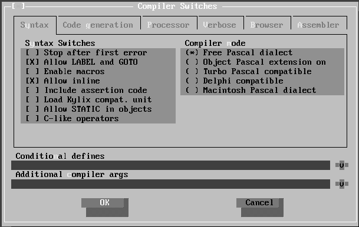 |

В диалоговом окне параметров синтаксиса можно установить следующие параметры:

- `Stop after first error` Если помечено, компилятор останавливается после первой ошибки. Обычно компилятор продолжает компиляцию до фатальной ошибки. (`-Se` в командной строке (см. раздел [5.1.5](####5.1.5-Опции,-касающиеся-исходников-(языковые опции).)))
- `Allow label and goto` Разрешает использование объявлений меток и операторов goto (`-Sg` в командной строке (см. раздел [5.1.5](####5.1.5-Опции,-касающиеся-исходников-(языковые опции).))).
- `Enable macros` Разрешает использование макросов (`-Sm` в командной строке  (см. раздел [5.1.5](####5.1.5-Опции,-касающиеся-исходников-(языковые опции).))).
- `Allow inline` Разрешает использование встроенных функций (`-Sc` в командной строке (см. раздел [5.1.5](####5.1.5-Опции,-касающиеся-исходников-(языковые опции).))).
- `Include assertion code` Включает операторы `Assert` в код.
- `Load kylix compat. unit` Загружает модуль совместимости Kylix.
- `Allow STATIC in objects` Разрешает модификатор `Static` для методов объекта (`-St` в командной строке (см. раздел [5.1.5](####5.1.5-Опции,-касающиеся-исходников-(языковые опции).)))
- `C-like operators` Позволяет использовать некоторые расширенные операторы, такие как `+=`, `-=` и т.д. (`-Sc` в командной строке (см. раздел [5.1.5](####5.1.5-Опции,-касающиеся-исходников-(языковые опции).))).
- `Compiler mode` выбирает подходящий режим компилятора:
    - `Free Pascal Dialect` Стандартный режим компилятора Free Pascal (FPC).
    - `Object pascal extensions on` Включает использование классов и исключений (`-Sd` в командной строке (см. раздел [5.1.5](####5.1.5-Опции,-касающиеся-исходников-(языковые опции).))).
    - `Turbo pascal compatible` Пробует быть более совместимым с Turbo Pascal (`-So` в командной строке (см. раздел [5.1.5](####5.1.5-Опции,-касающиеся-исходников-(языковые опции).))).
    - `Delphi compatible` Пробует быть более совместимыми с Delphi (`-Sd` в командной строке (см. раздел [5.1.5](####5.1.5-Опции,-касающиеся-исходников-(языковые опции).))).
    - `Macintosh Pascal dialect` Пробует быть совместимым с Macintosh Pascal.

Вкладка генерации кода в диалоге параметров компилятора показана на рисунке (6.24).

|   Рисунок 6.24 Вкладка настроек генерации кода   |
| :----------------------------------------------: |
| 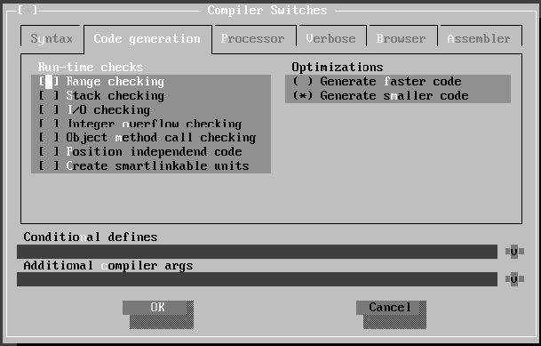 |

В диалоговом окне генерации кода можно установить следующие параметры:
- `Run-time checks` Управляет тем, какой код проверки во время выполнения генерируется. Если такая проверка не удалась, генерируется ошибка во время выполнения. Может быть сгенерирован следующий код проверки :
    - `Range checking`(Проверка диапазона) Проверяет результаты операций перечисления и подмножества (опция командной строки `-Cr` (см. раздел [5.1.4](####5.1.4-Опции,-контролирующие-вид-вывода.))).
    - `Stack checking`(Проверка стека) Проверяет, не достигнут ли предел стека (опция командной строки `-Cs` (см. раздел [5.1.4](####5.1.4-Опции,-контролирующие-вид-вывода.))).
    `I/O checking`(Проверка ввода-вывода) Проверяет результат операций ввода-вывода (опция командной строки `-Ci` (см. раздел [5.1.4](####5.1.4-Опции,-контролирующие-вид-вывода.))).
    - `Integer overflow checking`(Проверка целочисленного переполнения) Проверяет результат целочисленных операций (параметр командной строки `-Co` (см. раздел [5.1.4](####5.1.4-Опции,-контролирующие-вид-вывода.))).
    - `Object method call checking`(Проверка вызова метода объекта) Проверяет корректность указателя метода перед его вызовом.
    - `Position independent code`(Независимый от позиции код) Генерирует PIC-код (Position-independent code).
    - `Create smartlinkable units` Создание смарт-связываемых блоков.

- `Optimizations` Какую оптимизацию следует использовать при компиляции:
    - `Generate faster code`(Генерировать быстрейший код) Соответствует параметру командной строки `-OG`.
    - `Generate smaller code`(Генерировать меньший код) Соответствует параметру командной строки `-Og`.

Более подробную информацию об этих переключателях можно найти в разделе [5.1.4](####5.1.4-Опции,-контролирующие-вид-вывода.).
Вкладка процессора диалогового окна параметров компилятора показана на рисунке (6.25).
В диалоговом окне процессора можно указать целевой процессор. Компилятор может использовать разные оптимизации для разных процессоров.

|   Рисунок 6.25 Вкладка выбора процессора   |
| :----------------------------------------: |
| 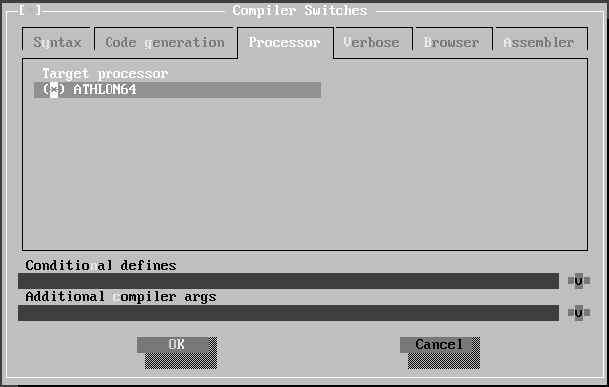 |

Подробная вкладка диалога параметров компилятора показана на рисунке (6.26).

|       Рисунок 6.26 Вкладка настроек вывода       |
| :----------------------------------------------: |
| 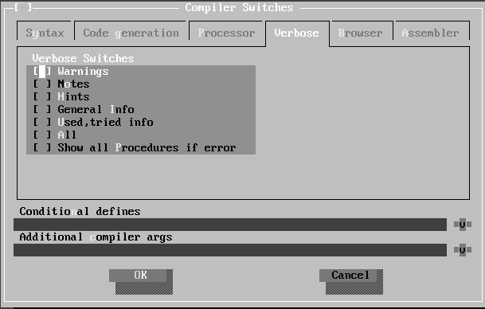 |

В этом диалоговом окне можно установить следующие параметры многословия (в командной строке: -v (см. раздел [5.1.2](####5.1.2-Варианты-получения-обратной-связи.))):

- `Warnings` Генерирует предупреждения. Соответствует `-vw` в командной строке.
- `Notes` Создание заметок. Соответствует `-vn` в командной строке.
- `Hints` Генерация подсказок. Соответствует `-vh` в командной строке.
- `General info` Генерация общей информации. Соответствует `-vi` в командной строке.
- `Used tried info` Создание информации об используемых и проверенных файлах. Соответствует `-vut` в командной строке.
- `All` Включает полную детализацию. Соответствует `-va` в командной строке.
- `Show all procedures if error` Если возникает ошибка при использовании перегруженной процедуры, показываются все процедуры. Соответствует `-vb` в командной строке.

Вкладка браузера диалога параметров компилятора показана на рисунке (6.27).

|     Рисунок 6.27 Вкладка настроек браузера     |
| :--------------------------------------------: |
| 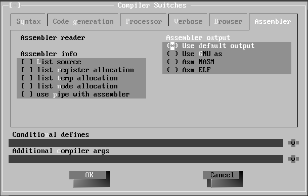 |


В этом диалоговом окне можно настроить параметры браузера:

- `No browser`(по умолчанию) Компилятор не генерирует информацию о браузере.
- `Only global browser` Информация о браузере генерируется только для глобальных символов, то есть символов, определенных не в процедуре/функции (`-b` в командной строке)
- `Local and global browser` Информация о браузере генерируется для всех символов, то есть также для символов, которые определены в процедурах или функциях (`-bl` в командной строке)

**Примечание**. Если информация о браузере не создается, браузер символов в среде IDE не будет работать.

Вкладка ассемблера диалогового окна параметров компилятора показана на рисунке (6.28). Фактическое диалоговое окно может отличаться, поскольку оно зависит от целевого процессора, для которого была скомпилирована среда IDE.

|           Рисунок 6.28 Вкладка настроек ассемблера           |
| :----------------------------------------------------------: |
| 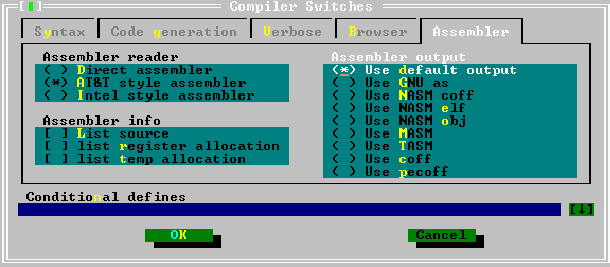 |

В этом диалоговом окне могут быть установлены параметры чтения и записи на ассемблере:

- `Assembler reader` Позволяет установить стиль блоков ассемблера в исходном коде:
    - `AT&T assembler` Ассемблер пишется в стиле `AT&T`-ассемблера (`-Ratt` в командной строке).
    - `Intel style assembler`Ассемблер пишется в стиле Intel-ассемблера (`-Rintel` в командной строке).

**Примечание**: эта опция глобальная, но локально стиль ассемблера можно изменить с помощью директив компилятора.

- `Assembler info` При записи файлов на ассемблере эта опция решает, какая дополнительная информация записывается в файл на ассемблере в комментариях:
    - `List source` Исходные строки записываются в файлы ассемблера вместе с сгенерированным ассемблером (`-al` в командной строке).
    `List register allocation` Информация о внутреннем резервировании/освобождении регистров компилятора записывается в файл ассемблера (`-ar` в командной строке).
    - `List temp allocation` Резервирование/освобождение временного регистра записывается в файл ассемблера (`-at` в командной строке).
    - `List node allocation` Резервирование/освобождение узла записывается в файл ассемблера. (`-an` в командной строке).
    - `use pipe with assembler` Использует именованный канал в системах Unix при передаче кода ассемблера внешнему ассемблеру.

Последние три из этих опций в основном полезны для отладки самого компилятора, необходимость в их использовании редка.

- `Assembler output` Эта опция сообщает компилятору, какой вывод ассемблера должен быть сгенерирован.
    - `Use default output`(Использовать вывод по умолчанию) Это зависит от цели.
    - `Use GNU as` Сборка с использованием `gnu as` (`-Aas` в командной строке).
    - `Use NASM coff` Создается coff NASM-асемблер (go32v2, `-Anasmcoff` в командной строке)
    - `Use NASM elf` Создается NASM elf-ассемблер (linux, `-Anasmelf` в командной строке).
    - `Use NASM obj` Создается NASM obj-ассемблер (`-Anasmobj` в командной строке).
    - `Use MASM` Создается MASM-ассемблер (ассемблер Microsoft, `-Amasm` в командной строке).
    - `Use TASM` Создается TASM-ассемблер(Turbo Assembler, `-Atasm` в командной строке).
    - `Use coff` Записываются двоичные файлы coff напрямую, используя внутренний ассемблер (go32v2, `-Acoff` в командной строке).
    - `Use pecoff` Записываются двоичные файлы pecoff в файлы напрямую, используя встроенную программу записи (Win32).


#### 6.11.5 Параметры компоновщика.

Параметры компоновщика можно установить в меню `Options—Linker`(Параметры — Компоновщик». Это позволяет определить, как связываются библиотеки и модули, и как должен вызываться компоновщик. Диалоговое окно параметров компоновщика показано на рисунке (6.29).

|      Рисунок 6.29 Диалоговое окно настроек компоновщика      |
| :----------------------------------------------------------: |
| 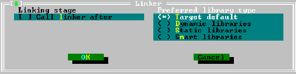 |

Могут быть установлены следующие параметры:

- `Call linker after` Если эта опция установлена, тогда пишется скрипт, который вызывает линкер. Это соответствует опции `-s` в командной строке (см. раздел [5.1.4](####5.1.4-Опции,-контролирующие-вид-вывода.)).
- `Only link to static library` Используются только статические библиотеки.
- `Preferred library type` С помощью этой опции можно установить тип библиотеки, с которой нужно осуществлять связывание:
    - `Target default`(Целевая по умолчанию) Это зависит от платформы.
    - `Dynamic libraries` Попытаться связать модули в динамических библиотеках (опция `-XD` в командной строке)
    - `Static libraries` Попытаться связать модули  в статических библиотеках (опция `-XS` в командной строке)
    - `Smart libraries` Попытаться связать модули в умно-связанных библиотеках (опция `-XX` в командной строке)


#### 6.11.6 Размеры памяти.

Диалог размеров памяти (доступный через `options—Memory sizes`(Опции — Размеры памяти) позволяет вводить размеры памяти для проекта. Диалоговое окно размеров памяти показан на рисунке (6.30).

|         Рисунок 6.30 Диалоговое окно размеров памяти         |
| :----------------------------------------------------------: |
| 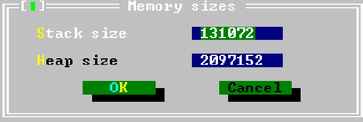 |

Можно задать следующие размеры:

- `Stack size` Устанавливает размер стека в байтах (опция `-Cs` в командной строке). Этот размер может игнорироваться в некоторых системах.
- `Heap size` Устанавливает размер кучи в байтах (опция `-Ch` в командной строке). Обратите внимание, что куча растет динамически настолько, насколько позволяет ОС.


#### 6.11.7 Параметры отладки.

В диалоговом окне параметров отладки (доступном через `Options—Debugger`(Параметры — Отладчик) можно задать некоторые параметры для включения отладочной информации в двоичный файл; в этом диалоговом окне также можно добавить дополнительные параметры компилятора. Диалог параметров отладки показан на рисунке (6.31).

|       Рисунок 6.31 Диалоговое окно настройки отладчика       |
| :----------------------------------------------------------: |
| 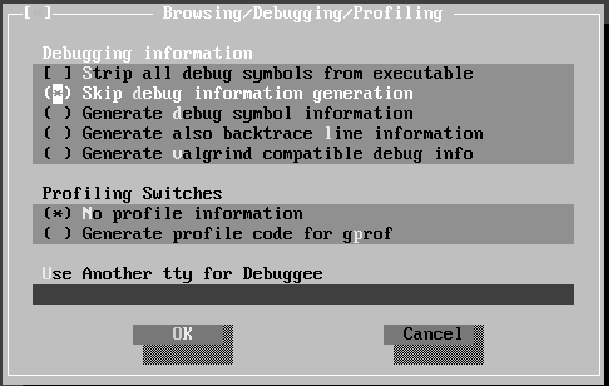 |


Могут быть установлены следующие параметры:

- `Debugging information` Сообщает компилятору, какую отладочную информацию следует компилировать. Можно выбрать один из следующих параметров:
    - `Strip all debug symbols from executable` Удалит всю отладочную и символьную информацию из двоичного файла. (опция `-Xs` в командной строке).
    - `Skip debug information generation` Исключит генерацию отладочной информации вообще.
    - `Generate debug symbol information` Включает отладочную информацию в двоичный файл (опция `-g` в командной строке). Обратите внимание, что никакая отладочная информация для модулей в библиотеке времени выполнения не будет включена, если не доступна версия RTL, скомпилированная с отладочной информацией. Отладочную информацию будут содержать модули, относящиеся только к текущему проекту.
    - `Generate also backtrace line information` Будет произведена компиляция с информацией об отладке и дополнительно в двоичный файл будет включен модуль `lineinfo`, так что в случае ошибки обратная трассировка будет содержать имена файлов и номера строк процедур в стеке вызовов (опция `-gl` в командной строке).
    - `Generate valgrind compatible debug info` Генерируется отладочная информация, которую можно прочитать с помощью valgrind (инструмент проверки памяти).
- `Profiling switches` Сообщает компилятору, должен ли код профиля включаться в двоичный файл.
    - `No profile information` Не имеет никакого эффекта, так как это задано по умолчанию.
    - `Generate Profile code for gprof` Если этот флажок установлен, код профилирования включается в двоичный файл (опция `-p` в командной строке).
- `Use another TTY for Debuggee` Будет предпринята попытка перенаправить вывод отлаживаемой программы в другое окно (терминал), имя файла которого следует ввести здесь.


#### 6.11.8 Режимы переключения.

Среда IDE позволяет сохранить набор настроек компилятора под общим именем. Он предоставляет 3 имени, под которыми могут быть сохранены ключи:

- `Normal` Для нормальной (быстрой) компиляции.
- `Debug` Для отладки, предназначен для установки большинства переключателей отладки. Также полезно для установки условного определения, например, разрешить включение некоторого кода отладки.
- `Release` Для компиляции финальной версии программы, двоичный файл должен быть очищен от отладочной информации, и должны быть использованы оптимизации.

Выбор одного из этих режимов загрузит параметры компилятора такими, какими они были сохранены в последний раз, когда выбранный режим был активен, то есть отдельные настройки не задаются и не сбрасываются.

При настройке и сохранении параметров компилятора сначала убедитесь, что вы выбрали правильный режим переключения; не имеет смысла устанавливать параметры отладки, пока активен переключатель `Release`. Диалог режима переключения показан на рисунке (6.32).

|      Рисунок 6.32 Диалоговое окно переключателя режимов      |
| :----------------------------------------------------------: |
| 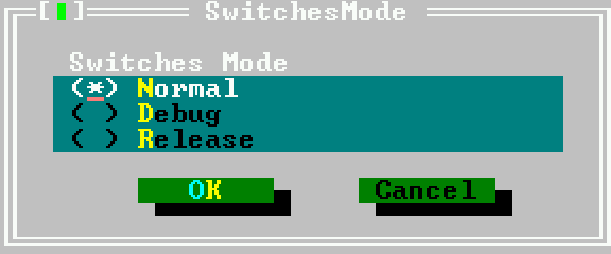 |


### 6.12 Настройка IDE.

IDE настраивается в широком диапазоне параметров: можно изменять цвета, разрешение экрана. Настройки конфигурации могут быть доступны через подменю `Environment` в меню `Options`.

#### 6.12.1 Предпочтения.
Диалог настроек вызывается с помощью пункта меню `Options—Environment—Preferences`(Параметры — Среда — Настройки)». Диалог настроек показан на рисунке (6.33).

|          Рисунок 6.33 Диалог настроек предпочтений           |
| :----------------------------------------------------------: |
| 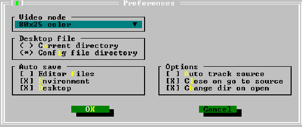 |


- `Video mode` Раскрывающийся список в верхней части диалогового окна позволяет выбрать режим видео. Доступные режимы видео зависят от системы, в которой работает IDE.
**Примечание**:
    1. Режим видео должен быть выбран нажатием пробела или кликом мыши. Если раскрывающийся список остается раскрытым при выходе из диалогового окна, новый режим видео не будет применяться.
    2. Для DOS версии IDE следует отметить следующее: при использовании режимов VESA частота обновления дисплея может быть очень низкой. На старых графических картах (1998 и ранее) можно использовать драйвер **UniVBE** от **SciTech5** (*прим.перев.*: SciTech Software больше не поддерживает *Display Doctor*, но последняя версия SDD 6.53 доступна [здесь](http://arcadecontrols.com/arcade_downloads.shtml#Drivers)).

- `Desktop File` Указывает, где хранится файл рабочего стола: текущий каталог или каталог, в котором был найден файл конфигурации.
- `Auto save` Здесь можно указать, какие файлы будут сохраняться при запуске программы или при выходе из среды IDE:
    - `Editor files` Будет сохранено cодержимое всех открытых окон редактирования.
    - `Environment` Будут сохранены текущие настройки среды.
    - `Desktop` Будет сохранен файл рабочего стола со всеми настройками рабочего стола (открытые окна, списки истории, точки останова и т.д.).

- `Options` Некоторые особые варианты поведения среды IDE можно указать здесь:
    - `Auto track source`
    - `Close on go to source` Когда этот флажок установлен, окно сообщений закрывается, когда выполняется действие `go to source line`(перейти к исходной строке).
    - `Change dir on open` Когда файл открыт, каталог этого файла становится текущим рабочим каталогом.


#### 6.12.2 Рабочий стол.

Диалоговое окно настроек рабочего стола позволяет указать, какие элементы рабочего стола сохраняются между сеансами, т.е. они сохраняются при выходе из среды IDE и снова восстанавливаются при следующем запуске среды IDE. Они сохраняются в файле `fp.dsk`. Диалоговое окно настроек рабочего стола показано на рисунке (6.34).

|     Рисунок 6.34 Диалоговое окно настроек рабочего стола     |
| :----------------------------------------------------------: |
| 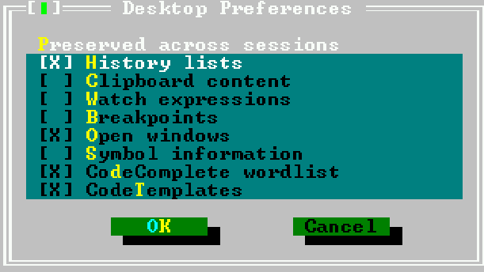 |

Следующие элементы могут быть сохранены и восстановлены в сеансах IDE:

- `History lists` Большинство полей ввода имеют список истории, в котором предыдущие записи сохраняются и могут быть выбраны. Когда этот параметр установлен, эти записи сохраняются в файле рабочего стола. По умолчанию включен.
- `Clipboard content` Если этот флажок установлен, содержимое буфера обмена также сохраняется на диск. По умолчанию выключен.
- `Watch expressions` При установленном флажке все выражения отслеживания сохраняются в файле рабочего стола. По умолчанию выключен.
- `Breakpoints` Если этот флажок установлен, все точки останова с их свойствами сохраняются в файле рабочего стола. По умолчанию выключен.
- `Open windows` Если установлен этот флажок, список файлов в открытых окнах редактора сохраняется в файле рабочего стола, и окна будут восстановлены при следующем запуске IDE. По умолчанию включен.
- `Symbol information` Если этот флажок установлен, информация для браузера символов сохраняется в файле рабочего стола. По умолчанию выключен.
- `CodeComplete wordlist` Если этот флажок установлен, список слов автозавершения кода сохраняется. По умолчанию включен.
- `CodeTemplates` Когда этот флажок установлен, определенные шаблоны кода сохраняются. По умолчанию включен.

**Примечание**: Формат файла рабочего стола изменяется между версиями редактора. Поэтому при установке новой версии может потребоваться удалить файлы `fp.dsk` везде, где их ищет среда IDE.


#### 6.12.3 Редактор.

В этом диалоговом окне можно установить несколько аспектов поведения окна редактора. Диалог настроек редактора показан на рисунке (6.35). Обратите внимание, что некоторые из этих параметров влияют только на вновь открываемые окна, а не на уже открытые (например, вертикальные блоки, выделение столбца/строки).

| Рисунок 6.35 Диалоговое окно настроек окна редактора |
| :--------------------------------------------------: |
|              |


Следующие элементы могут быть установлены в диалоге настроек редактора:

- `Create backup files` При каждом сохранении файла редактора создается резервная копия старого файла. По умолчанию включен.
- `Insert mode` Начнинать с режима вставки.
- `Auto indent mode` "Умный" отступ включен. Это означает, что нажатие клавиши `Enter` поместит курсор на следующую строку в том же столбце, где текст начинается с текущей строки. По умолчанию включен.
- `Use tab characters` Когда клавиша табуляции нажата, используется символ табуляции. Обычно при нажатии клавиши табуляции вставляются пробелы. Когда эта опция отмечена, вместо нее будут вставлены символы табуляции. По умолчанию выключен.
- `Backspace unindents` Нажатие клавиши `Bksp` приведет к удалению отступа, если будет достигнуто начало текста в текущей строке, вместо удаления только предыдущего символа. По умолчанию включен.
- `Persistent blocks` Когда сделано выделение текста и курсор перемещен, выделение не уничтожается, то есть выделенный блок остается выделенным. По умолчанию включен.
- `Syntax highlight` Используется подсветка синтаксиса для файлов с расширением, которое указывается в списке расширений подсветки. По умолчанию включен.
- `Block insert cursor` Курсор вставки отображается как блок вместо символа подчеркивания. По умолчанию блоком отображается курсор перезаписи. Эта опция полностью изменяет это поведение. По умолчанию выключен.
- `Vertical blocks` При выборе блоков, охватывающих несколько строк, выборка не содержит полных строк в блоке; вместо этого он содержит строки до столбца, на котором находится курсор. По умолчанию выключен.
- `Highlight column` Если этот флажок установлен, текущий столбец (т.е. столбец, в котором находится курсор) выделяется. По умолчанию выключен.
- `Highlight row` При установленном флажке текущая строка (то есть строка, в которой находится курсор) подсвечивается. По умолчанию выключен.
- `Auto closing brackets` Когда вводится символ открывающей скобки, закрывающая скобка также вставляется сразу. По умолчанию выключен.
- `Keep trailing spaces` При сохранении файла пробелы в конце строк удаляются. Эта опция отключает это поведение; то есть любые конечные пробелы также сохраняются в файл. По умолчанию выключен.
- `Codecomplete enabled` Включает автозавершение кода. По умолчанию включен.
- `Enable folds` Включает свертывание кода. По умолчанию выключен.
- `Tab size` Количество пробелов, которые вставляются при нажатии клавиши табуляции. Значением по умолчанию является 8.
- `Indent size` Число пробелов, в которых блок имеет отступ при вызове функции отступа блока. Значением по умолчанию является 2.
- `Highlight extensions` Когда подсветка синтаксиса включена, список масок файлов, введенный здесь, будет использоваться для определения, какие файлы выделены. Маски файлов должны быть разделены точкой с запятой (`;`). По умолчанию это маски `*.pas`; `*.pp`; `*.inc`.
- `File patterns needing tabs` Некоторые файлы (например, `make`-файлы) нуждаются в символах табуляции вместо пробелов. Здесь можно ввести ряд масок файлов, чтобы указать файлы, для которых всегда будут использоваться символы табуляции. По умолчанию это `make*`; `make*.*`.

**Примечание**. Эти параметры не будут применяться к уже открытым окнам; эти опции будут иметь только новые окна.


#### 6.12.4 Клавиатура и мышь.

Диалоговое окно параметров клавиатуры и мыши вызывается пунктом меню `Options—Environment—Keyboard & Mouse`(Параметры — Среда — Клавиатура и мышь). Это позволяет регулировать поведение клавиатуры и мыши, а также чувствительность мыши. Диалоговое окно параметров клавиатуры и мыши показано на рисунке (6.36).

| Рисунок 6.36 Диалоговое окно настроек клавиатуры и мыши |
| :-----------------------------------------------------: |
|     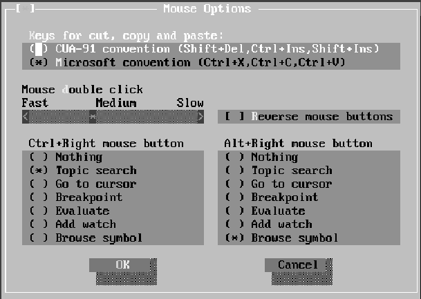     |

- `Keys for copy, cut and paste` Задает ключи, которые будут использоваться для операций с буфером обмена:

    - Соглашение CUA-91 (`<Shift+Del>`, `<Ctrl+Ins>`, `<Shift+Ins>`)
    - Соглашение Microsoft (`<Ctrl+X>`, `<Ctrl+C>`, `<Ctrl+V>`)

- `Mouse double click` С помощью ползунка можно настроить скорость двойного щелчка. `Fast` означает, что время между двумя щелчками должно быть очень малым; `slow` означает, что время между двумя щелчками мыши может быть довольно продолжительным.
- `Reverse mouse buttons` Поведение левой и правой кнопок мыши можно поменять, установив флажок; это особенно полезно для левшей.
- `Ctrl+Right mouse button` Назначает действие щелчку правой кнопкой мыши с удерживаемой нажатой клавишей `<Ctrl>`.
- `Alt+right mouse button` Назначает действие нажатию правой кнопки мыши с удерживаемой нажатой клавишей `<Alt>`.

Следующие действия могут быть назначены `<Ctrl+Right mouse button>` или `<Alt+right mouse button>`:

- `Nothing` С событие мне связаны никакие действия.
- `Topic search` В указателе справки ищется ключевое слово под курсором мыши.
- `Go to cursor` Программа выполняется до строки, в которой находится курсор мыши.
- `Breakpoint` Задает точку останова в позиции курсора мыши.
- `Evaluate` Посмотреть значение переменной под курсором мыши.
- `Add watch` Добавляет переменную под курсором мыши в список отслеживания.
- `Browse symbol` Символ под курсором мыши отображается в браузере.


### 6.13 Справочная система.

Более подробную информацию о том, как обрабатывать IDE, или об использовании различных вызовов в RTL, а также объяснения синтаксиса операторов Pascal, можно найти в справочной системе. Справочная система активируется нажатием клавиши `<F1>`.


#### 6.13.1 Навигация в справочной системе.

Справочная система содержит гиперссылки; это уязвимые места, которые ведут к другой теме в справочной системе. Они помечены другим цветом. Гиперссылки можно активировать одним из двух способов:

1. непосредственно щелкнув мышью по нужной
2. с помощью клавиш `<Tab>` и `<Shift-Tab>` перемещаться между различными гиперссылками на странице, а затем нажимать клавишу `<Enter>`, чтобы активировать нужную вам ссылку.

При нажатии `<Shift-F1>` отображается содержимое справочной системы. Чтобы вернуться к предыдущему разделу справки, нажмите `<Alt-F1>`. Это также сработает, если окно справки не отображается на рабочем столе; окно помощи будет активировано.


#### 6.13.2 Работа с файлами справки.

В среде IDE есть справочная система, которая может отображать следующие форматы файлов:

- `TPH` Формат справки для просмотра справки `Turbo Pascal`.
- `INF` Формат справки `OS/2`.
- `NG` Формат справки `Norton Guide`.
- `HTML` HTML-файлы.

В будущем может быть добавлено еще несколько форматов. Однако указанные выше форматы должны охватывать уже широкий спектр доступных файлов справки.

**Примечание**: в отношении поддержки файлов HTML следует отметить следующее:

1. Программа просмотра HTML справочной системы ограничена, она может обрабатывать только самые основные файлы HTML (исключая графику), поскольку она предназначена только для отображения файлов справки Free Pascal(*... но не стесняйтесь улучшать его и посылать исправления команде разработчиков Free Pascal ...*).
2. Когда средство просмотра справки HTML встречает графический файл, оно пытается найти файл с тем же именем, но с расширением `.ans`; если этот файл будет найден, он будет интерпретирован как файл с escape-последовательностями ANSI, и они будут использоваться для отображения текстового изображения. Отображение диалоговых окон IDE в файлах справки IDE выполняется следующим образом.

Пункт меню `Help—Files`(Справка - Файлы) позволяет добавлять и удалять файлы справки из списка файлов в оглавлении справки. Диалог файлов справки показан на рисунке (6.37).

| Рисунок 6.37 Диалоговое окно файлов справки |
| :-----------------------------------------: |
|  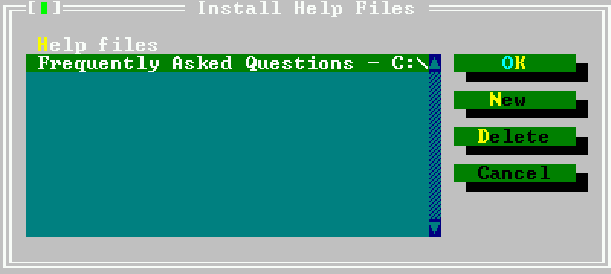   |


В диалоговом окне перечислены файлы, которые будут представлены в окне оглавления справочной системы. Каждая запись имеет небольшой описательный заголовок и имя файла рядом с ним. При добавлении файлов справки доступны следующие действия:

- `New` Добавляет новый файл. IDE отобразит подсказку, в которой необходимо указать местоположение файла справки. Если добавленный файл является HTML-файлом, отобразится диалоговое окно с запросом заголовка. Этот заголовок будет включен в содержание справки.
- `Delete` Удаляет выделенный в данный момент файл из справочной системы. Он не удаляется с жесткого диска; удаляется только запись справочной системы.
- `Cancel` Отменяет все изменения и закрывает диалог.
- `OK` Сохраняет изменения и закрывает диалог.

Документацию Free Pascal в формате HTML можно добавить в справочную систему IDE. Таким образом, документацию можно просматривать из среды IDE. Если Free Pascal был установлен с помощью установщика, установщик должен был добавить документацию FPC в список файлов справки, если документация также была установлена.

#### 6.13.3 Диалог "О программе".

Диалоговое окно "О программе", доступное через `Help—About...`(Справка - О программе...), показывает некоторую информацию об IDE, такую как номер версии, дата ее создания, какой компилятор и отладчик она использует. При сообщении об ошибках в IDE, пожалуйста, используйте информацию, предоставленную этим диалогом, чтобы определить версию IDE, которая была использована.

Оно также отображает некоторую информацию об авторских правах.


### 6.14 Сочетания клавиш.

Многие сочетания клавиш, используемые в среде IDE, совместимы с `WordStar` и должны быть хорошо известны пользователям `Turbo Pascal`.
Ниже приведены следующие таблицы:

1. В таблице (6.4) перечислены некоторые комбинации клавиш для обработки окон IDE и справки.
2. В таблице (6.5) представлены комбинации клавиш для компиляции, запуска и отладки программы.
3. В таблице (6.6) описаны навигационные клавиши.
4. В таблице (6.7) перечислены ключи редактирования.
5. В таблице (6.8) перечислены все сочетания клавиш блока.
6. В таблице (6.9) представлены все комбинации клавиш, изменяющие выбор.
7. В таблице (6.10) представлены некоторые общие комбинации клавиш, которые не вписываются в предыдущие категории.


**Таблица 6.4: Общая**

| Команда                              | Сочетание клавиш | Альтернативное сочетание клавиш |
| ------------------------------------ | ---------------- | ------------------------------- |
| Справка                              | `F1`             |                                 |
| Перейти к последнему разделу справки | `Alt-F`          |                                 |
| Искать в справке слово под курсором  | `Ctrl-F1`        |                                 |
| Справочный указатель                 | `Shift-F1`       |                                 |
| Закрыть активное окно                | `Alt-F3`         |                                 |
| Увеличить/уменьшить окно             | `F5`             |                                 |
| Переместить/увеличить активное окно  | `Ctrl-F5`        |                                 |
| Переключиться на следующее окно      | `F6`             |                                 |
| Переключиться на предыдущее окно     | `Shift-F6`       |                                 |
| Меню                                 | `F10`            |                                 |
| Местное меню                         | `Alt-F10`        |                                 |
| Список окон                          | `Alt-0`          |                                 |
| Активировать другое окно             | `Alt-<число>`    |                                 |
| Вызвать утилиту `grep`               | `Shift-F2`       |                                 |
| Выход из IDE                         | `Alt-X`          |                                 |


**Таблица 6.5: Компилятор** 

| Команда                                     | Сочетание клавиш | Альтернативное сочетание клавиш |
| ------------------------------------------- | ---------------- | ------------------------------- |
| Сбросить отладчик/программу                 | `Ctrl-F2`        |                                 |
| Показать стек вызовов                       | `Ctrl-F3`        |                                 |
| Запустите до курсора                        | `F4`             |                                 |
| Переключиться на экран пользователя         | `Alt-F5`         |                                 |
| Проследить в                                | `F7`             |                                 |
| Добавить отслеживание                       | `Ctrl-F7`        |                                 |
| Сделать шаг                                 | `F8`             |                                 |
| Установить точку останова на текущей строке | `Ctrl-F8`        |                                 |
| Собрать программу                           | `F9`             |                                 |
| Запустить                                   | `Ctrl-F9`        |                                 |
| Компилировать активный исходный файл        | `Alt-F9`         |                                 |
| Сообщения                                   | `F11`            |                                 |
| Сообщения компилятора                       | `F12`            |                                 |


**Таблица 6.6: Навигация по тексту**

| Команда                                            | Сочетание клавиш      | Альтернативное сочетание клавиш |
| -------------------------------------------------- | --------------------- | ------------------------------- |
| Символ влево                                       | `стрелка влево`       | `Ctrl-S`                        |
| Символ вправо                                      | `стрелка вправо`      | `Ctrl-S`                        |
| Строка вверх                                       | `стрелка верх`        | `Ctrl-E`                        |
| Строка вниз                                        | `стрелка вниз`        | `Ctrl-X`                        |
| Слово влево                                        | `Ctrl-стрелка влево`  | `Ctrl-A`                        |
| Слово вправо                                       | `Ctrl-стрелка вправо` | `Ctrl-F`                        |
| Прокрутка на одну строку вверх                     | `Ctrl-W`              |                                 |
| Прокрутка на одну строку вниз                      | `Ctrl-Z`              |                                 |
| Страница вверх                                     | `PageUp`              | `Ctrl-R`                        |
| Страница вниз                                      | `PageDown`            |                                 |
| Начало строки                                      | `Home`                | `Ctrl-Q-S`                      |
| Конец строки                                       | `End`                 | `Ctrl-Q-D`                      |
| Первая строка окна                                 | `Ctrl-Home`           | `Ctrl-Q-E`                      |
| Последняя строка окна                              | `Ctrl-End`            | `Ctrl-Q-X`                      |
| Первая строка файла                                | `Ctrl-PageUp`         | `Ctrl-Q-R`                      |
| Последняя строка файла                             | `Ctrl-PageDown`       | `Ctrl-Q-C`                      |
| Последняя позиция курсора                          | `Ctrl-Q-P`            |                                 |
| Найти соответствующий разделитель блоков           | `Ctrl-Q-[`            |                                 |
| Найти последний соответствующий разделитель блоков | `Ctrl-Q-]`            |                                 |


**Таблица 6.7: Редактирование**

| Команда                      | Сочетание клавиш | Альтернативное сочетание клавиш |
| ---------------------------- | ---------------- | ------------------------------- |
| Удалить символ               | `Del`            | `Ctrl-G`                        |
| Удалить символ слева         | `Backspace`      | `Ctrl-H`                        |
| Удалить строку               | `Ctrl-Y`         |                                 |
| Удалить до конца строки      | `Ctrl-Q-Y`       |                                 |
| Удалить слово                | `Ctrl-T`         |                                 |
| Вставить строку              | `Ctrl-N`         |                                 |
| Переключить на режим вставки | `Insert`         | `Ctrl-V`                        |


**Таблица 6.8: Команды работы с блоком**

| Команда                                            | Сочетание клавиш | Альтернативное сочетание клавиш |
| -------------------------------------------------- | ---------------- | ------------------------------- |
| Перейти к началу выделенного текста                | `Ctrl-Q-B`       |                                 |
| Перейти к концу выделенного текста                 | `Ctrl-Q-K`       |                                 |
| Выделить текущую строку                            | `Ctrl-K-L`       |                                 |
| Печатать выделенный текст                          | `Ctrl-K-P`       |                                 |
| Выделить текущее слово                             | `Ctrl-K-T`       |                                 |
| Удалить выделенный текст                           | `Ctrl-Del`       | `Ctrl-K-Y`                      |
| Копировать выделенный текст в позицию курсора      | `Ctrl-K-C`       |                                 |
| Переместить выделенный текст в позицию курсора     | `Ctrl-K-V`       |                                 |
| Копировать выделенный текст в буфер обмена         | `Ctrl-Ins`       |                                 |
| Переместить выделенный текст в буфер обмена        | `Shift-Del`      |                                 |
| Отступ блока вправо на один столбец                | `Ctrl-K-I`       |                                 |
| Отступ блока влево на один столбец                 | `Ctrl-K-U`       |                                 |
| Вставить текст из буфера обмена                    | `Shift-Insert`   |                                 |
| Вставить файл                                      | `Ctrl-K-R`       |                                 |
| Записать выбранный текст в файл                    | `Ctrl-K-W`       |                                 |
| Перевести символы текущего блока в верхний регистр | `Ctrl-K-N`       |                                 |
| Перевести символы текущего блока в нижний регистр  | `Ctrl-K-O`       |                                 |
| Перевести символы слова в верхний регистр          | `Ctrl-K-F`       |                                 |
| Перевести символы слова в нижний регистр           | `Ctrl-K-E`       |                                 |


**Таблица 6.9: Изменение выделенного**

| Команда                                                   | Сочетание клавиш            | Альтернативное сочетание клавиш |
| --------------------------------------------------------- | --------------------------- | ------------------------------- |
| Отметить начало выделенного текста                        | `Ctrl-K-B`                  |                                 |
| Отметить конец выделенного текста                         | `Ctrl-K-K`                  |                                 |
| Убрать выделение                                          | `Ctrl-K-Y`                  |                                 |
| Расширить выделение на один символ влево                  | `Shift-стрелка слево`       |                                 |
| Расширить выделение на один символ вправо                 | `Shift-стрелка вправо`      |                                 |
| Расширить выделение до начала строки                      | `Shift-Home`                |                                 |
| Расширить выделение до конца строки                       | `Shift-End`                 |                                 |
| Расширить выделение до того же столбца в последней строке | `Shift-стрелка вверх`       |                                 |
| Расширить выделение до того же столбца в следующей строке | `Shift-стрелка вниз`        |                                 |
| Расширить выделение до конца строки                       | `Shift-End`                 |                                 |
| Расширить выделение на одно слово влево                   | `Ctrl-Shift-стрелка влево`  |                                 |
| Расширить выделение на одно слово вправо                  | `Ctrl-Shift-стрелка вправо` |                                 |
| Расширить выбор на одну страницу вверх                    | `Shift-PageUp`              |                                 |
| Расширить выбор на одну страницу вниз                     | `Shift-PageDown`            |                                 |
| Расширить выделение до начала файла                       | `Ctrl-Shift-Home`           | `Ctrl-Shift-PageUp`             |
| Расширить выделение до конца файла                        | `Ctrl-Shift-End`            | `Ctrl-Shift-PageUp`             |


**Таблица 6.10: Разные команды**

| Команда                   | Сочетание клавиш                   | Альтернативное сочетание клавиш |
| ------------------------- | ---------------------------------- | ------------------------------- |
| Сохранить файл            | `F2`                               | `Ctrl-K-S`                      |
| Открыть файл              | `F3`                               |                                 |
| Поиск                     | `Ctrl-Q-F`                         |                                 |
| Искать снова              | `Ctrl-L`                           |                                 |
| Поиск и замена            | `Ctrl-Q-A`                         |                                 |
| Установить закладку       | `Ctrl-K-n (где n может быть 0..9)` |                                 |
| Перейти к закладке        | `Ctrl-Q-n (где n может быть 0..9)` |                                 |
| Undo(Отмена)              | `Alt-Backspace`                    |                                 |
| Открыть файл под курсором | `Ctrl-Enter`                       |                                 |


# Глава 7.

## Портирование и переносимый код.

### 7.1 Режимы компилятора Free Pascal.

Команда разработчиков Free Pascal пытается создать компилятор, который может скомпилировать как можно больше кода, созданного для компиляторов Turbo Pascal, Delphi или Mac Pascal: это должно обеспечить максимально простое портирование кода, написанного для одного из этих компиляторов.
В то же время разработчики Free Pascal представили множество расширений в языке Object Pascal. Чтобы согласовать эти разные цели и убедиться, что люди могут создавать код, который все еще может быть скомпилирован компиляторами Turbo Pascal и Delphi, у компилятора есть понятие `compiler modes`(режимы компилятора). В определенном режиме компилятор имеет определенные включенные или выключенные функции. Это позволяет ввести режим совместимости, в котором разрешены только те функции, которые поддерживаются оригинальным компилятором. В настоящее время поддерживается 5 режимов:

- `FPC` Это оригинальный режим компилятора Free Pascal: здесь поддерживаются все языковые конструкции, кроме классов, интерфейсов и исключений. В этом режиме поддерживаются объекты. Это режим компилятора по умолчанию.
- `OBJFPC` Это тот же режим, что и режим `FPC`, но он также включает классы, интерфейсы и исключения.
- `TP` Режим совместимости c Turbo Pascal. В этом режиме компилятор пытается максимально близко имитировать компилятор Turbo Pascal. Очевидно, что может быть скомпилирован только 32-битный или 64-битный код.
- `DELPHI` Режим Delphi-совместимости. В этом режиме компилятор старается максимально походить на компилятор Delphi: реализованы большинство функций Delphi 7 и выше.
- `DELPHIUNICODE` Режим Delphi-совместимости. В этом режиме компилятор старается максимально походить на компилятор Delphi: реализованы все функции Delphi 2009 и выше. В этом режиме тип `string` эквивалентен типу `unicode string`.
- `MACPAS` Режим совместимости с Mac Pascal. В этом режиме компилятор пытается разрешить все конструкции, которые реализованы в Mac pascal. В частности, он пытается скомпилировать универсальные интерфейсы.
- `ISO` Стандарт ISO Pascal, режим ISO 7185. В этом режиме компилятор соответствует требованиям уровня 0 и уровня 1 ISO/IEC 7185.
- `ExtendedPascal` Стандартный Extended Pascal, режим ISO 10206. В этом режиме компилятор соответствует требованиям уровня 0 и уровня 1 ISO/IEC 10206.

Режим компилятора может быть установлен отдельно для каждого модуля: каждый модуль может иметь свой собственный режим компилятора, и можно использовать модули, которые были скомпилированы в разных режимах. Режим можно установить одним из двух способов:

1. В командной строке с ключом `-M`.
2. В исходном файле с директивой `{$ MODE}`.

Оба способа принимают имя режима в качестве аргумента. Если исходный файл модуля или программы не указывает режим, используется режим, указанный в командной строке. Если в исходном файле указан режим, он переопределяет режим, указанный в командной строке.
Таким образом, компилируем модуль с ключом `-M` следующим образом:
```bash
fpc -MOBJFPC myunit
```
это то же самое, что иметь следующую директиву mode в модуле:
```pascal
{$MODE OBJFPC}
Unit myunit;
```
Директива `MODE` всегда должна быть расположена перед разделом `uses` интерфейсной части модуля или разделом `uses` программы, поскольку установка режима может привести к загрузке дополнительного модуля в качестве первого загружаемого модуля.

Обратите внимание, что директива `{$ MODE}` является глобальной директивой, то есть она действительна для всего модуля; можно указать только одну директиву.

Режим не влияет на доступность модулей: могут использоваться все доступные модули, независимо от режима, используемого для компиляции текущего модуля или программы.


### 7.2 Turbo Pascal.

Free Pascal был изначально разработан так, чтобы быть максимально близким к Turbo Pascal. Есть, конечно, ограничения. Некоторые из них связаны с тем, что Turbo Pascal был разработан для 16-битных архитектур, тогда как Free Pascal является 32-битным/64-битным компилятором. Другие ограничения проистекают из того факта, что Free Pascal работает более, чем на одной операционной системе.

В целом мы можем сказать, что если вы сохраните свой программный код близким к ANSI Pascal, у вас не возникнет проблем при переносе с Turbo Pascal или даже Delphi на Free Pascal. В значительной степени поддерживаются конструкции, определенные Turbo Pascal. Это тем более, если вы используете ключи `-Mtp` или `-MObjfpc`.

В следующих разделах мы перечислим конструкции Turbo Pascal и Delphi, которые не поддерживаются во Free Pascal, и перечислим, каким образом Free Pascal расширяет Turbo Pascal.


#### 7.2.1 Вещи, которые не будут работать.

Здесь мы приводим список вещей, которые определены/разрешены в Turbo Pascal, но не поддерживаются Free Pascal. Где возможно, мы указываем причину.

1. Дублирующие метки регистра допускаются в Turbo Pascal, но не в Free Pascal. На самом деле это ошибка в Turbo Pascal, поэтому ее поддержка не будет реализована в Free Pascal.
2. В Turbo Pascal списки параметров ранее определенных функций и процедур не обязательно должны совпадать. В Free Pascal это условие обязательно. Причиной этого является механизм перегрузки функций Free Pascal. Однако опция `-M` (см. раздел [5.1.5](####5.1.5- Опции,-касающиеся-исходников-(языковые-опции).)) отменяет это ограничение.
3. Переменные Turbo Pascal `MEM`, `MEMW`, `MEML` и `PORT` для доступа к памяти и портам в модуле `system` недоступны. Это связано с операционной системой. Под  DOS и модуль `system`, и модуль `extender` (GO32) реализуют конструкцию `mem`. В Linux модуль `ports` реализует такую же конструкцию для переменной Ports.
4. Turbo Pascal позволяет создавать имена процедур и переменных, используя слова, которые не разрешены в этой роли в Free Pascal. Это связано с тем, что в Free Pascal (и Delphi) зарезервированы определенные слова, которые не зарезервированы в Turbo Pascal, например: `PROTECTED`, `PUBLIC`, `PUBLISHED`, `TRY`, `FINALLY`, `EXCEPT`, `RAISE`. Использование ключа `-Mtp` решит эту проблему, если вы захотите скомпилировать код Turbo Pascal, который использует эти слова (см. раздел [Приложение B](#Приложение-B.) для просмотра списка всех зарезервированных слов).
5. Зарезервированные слова Turbo Pascal `FAR`, `NEAR` игнорируются. Это потому, что их назначение было ограничено 16-битной средой, а Free Pascal - это 32-битный/64-битный компилятор.
6. Директива `INTERPUPT` Turbo Pascal будет работать только для цели Free Pascal DOS. Другие операционные системы не позволяют обрабатывать прерывания пользовательскими программами.
7. По умолчанию компилятор Free Pascal использует синтаксис ассемблера `AT&T`. Это в основном потому, что Free Pascal использует `gnu AS`. Тем не менее, другие формы ассемблера доступны. Для получения дополнительной информации см. [Programmer’s Guide](https://www.freepascal.org/docs-html/current/prog/prog.html).
8. Turbo Pascal'евский Turbo Vision доступен во Free Pascal под названием FreeVision, которое должно быть почти на 100% совместимо с Turbo Vision.
9. Turbo Pascal'евский 'overlay'-модуль недоступен. Он и не требуется, поскольку Free Pascal является 32/64-битным компилятором, поэтому размер программы не должен быть проблемой.
10. Параметры командной строки компилятора различны.
11. Переключатели и директивы компилятора в основном одинаковы, но существуют некоторые дополнительные.
12. Модули не являются двоично-совместимыми. Это означает, что вы не можете использовать файл модуля `.tpu`, созданный Turbo Pascal, в проекте Free Pascal.
13. Структура Free Pascal TextRec (для внутреннего описания файлов) не совместима в двоичном формате с TP или Delphi.
14. Во Free Pascal множества по умолчанию занимают 4 байта; это означает, что некоторые приведения типов, которые были возможны в Turbo Pascal, больше невозможны в Free Pascal. Тем не менее, есть переключатель для установки размера множества, см. [Programmer’s Guide](https://www.freepascal.org/docs-html/current/prog/prog.html) для получения дополнительной информации.
15. Файл открывается только для вывода (используя `fmOutput`), когда он открывается с помощью `Rewrite`. Для того, чтобы иметь возможность читать из него, он должен быть перечитан с помощью `Reset`.
16. Деструкторы Turbo Pascal допускают параметры. Это не разрешено в Free Pascal: по умолчанию в Free Pascal деструкторы не могут иметь параметры. Это ограничение можно снять с помощью ключа `-So`.
17. Турбо Паскаль допускает более одного деструктора для объекта. В Free Pascal может быть только один деструктор. Это ограничение также можно снять с помощью ключа `-So`.
18. Порядок, в котором оцениваются выражения, не обязательно одинаков. В следующем выражении:
```pascal
а: = g(2) + f(3);
```
не гарантируется, что g(2) будет оцениваться до f(3).
19. В Free Pascal вам необходимо использовать оператор адресации `@` при назначении процедурных переменных.

    


#### 7.2.2. Вещи, которые являются дополнительными.

Здесь мы приводим список вещей, которые возможны в Free Pascal, но которых не было в Turbo Pascal или Delphi.

1. Функции Free Pascal также могут возвращать сложные типы, такие как записи и массивы.
2. В Free Pascal вы можете использовать возвращаемое значение функции в самой функции как переменную. Например:
```pascal
function a : longint;  
begin  
   a:=12;  
   while a>4 do  
     begin  
        {...}  
     end;  
end;
```
Приведенный выше пример будет работать с TP, но компилятор предполагает, что `a>4` является вызовом рекурсии. Если вызов рекурсии - действительно то, что вам нужно, вы должны добавить `()` после имени функции:
```pascal
function a : longint;  
begin  
   a:=12;  
   { это вызов рекурсии }  
   if a()>4 then  
     begin  
        {...}  
     end;  
end;
```
3. В Free Pascal есть частичная поддержка конструкций Delphi (см. [Programmer’s Guide](https://www.freepascal.org/docs-html/current/prog/prog.html) для получения дополнительной информации об этом).
4. Free Pascal'евский `Exit` принимает возвращаемое значение для функций.
```pascal
function a : longint;  
begin  
   a:=12;  
   if a>4 then  
     begin  
        exit(a*67); {function result upon exit is a*67 }  
     end;  
end;
```
5. Free Pascal поддерживает функцию перегрузки. То есть вы можете определить множество функций с одинаковыми именами, но с разными аргументами. Например:
```pascal
procedure DoSomething (a : longint);  
begin  
{...}  
end;  
 
procedure DoSomething (a : real);  
begin  
{...}  
end;
```
Затем вы можете вызвать процедуру `DoSomething` с аргументом типа `Longint` или `Real`.
Эта особенность приводит к тому, что ранее объявленная функция всегда должна определяться с полностью одинаковым заголовком:
```pascal
procedure x (v : longint); forward;  
{...}  
 
procedure x;{ Это перегрузит ранее объявленную х}  
begin  
{...}  
end;
```
Эта конструкция будет генерировать ошибку компилятора, потому что компилятор не нашел определения ` procedure x (v: longint);`. Вместо этого вы должны определить свою процедуру `x` как:
```pascal
procedure x (v : longint);  
{ Это правильно определяет ранее объявленную х}  
begin  
{...}  
end;
```
Параметр командной строки `-So` (см. раздел [5.1.5](####5.1.5- Опции,-касающиеся-исходников-(языковые-опции).)) отключает перегрузку. Когда вы используете его, вышеизложенное будет скомпилировано, как в Turbo Pascal.
6. Перегрузка оператора. Free Pascal позволяет перегрузить оператор, например, Вы можете определить оператор `+` для матриц.
7. В файловых системах FAT16 и FAT32 поддерживаются длинные имена файлов.


#### 7.2.3 Режим совместимости с Turbo Pascal.

Когда вы компилируете программу с ключом `-Mtp`, компилятор попытается имитировать компилятор Turbo Pascal следующими способами:

- Назначение процедурной переменной не требует оператора `@`. Одно из различий между Turbo Pascal и Free Pascal заключается в том, что последний требует, чтобы вы указали оператор адреса при присваивании значения процедурной переменной. В режиме совместимости с Turbo Pascal этого не требуется.
- Перегрузка процедур отключена. Если перегрузка процедуры отключена, заголовок функции не должен повторять заголовок функции.
- Процедуры, определенные заранее (т.н. forward declaration), не нуждаются в полном списке параметров, когда они только задаются. Из-за функции перегрузки процедур Free Pascal вы всегда должны указывать список параметров функции при ее определении, даже если она была объявлена ранее с помощью `Forward`. В режиме совместимости с Turbo Pascal перегрузка функций отсутствует; следовательно, вы можете опустить список параметров:
```pascal
Procedure a (L : Longint); Forward;  
...  
 
Procedure a ; { Нет необходимости повторять (L : Longint) }  
begin  
 ...  
end;  
```
- Рекурсивные вызовы функций обрабатываются по-разному. Рассмотрим следующий пример:
```pascal
Function expr : Longint;  
begin  
  ...  
  Expr:=L:  
  Writeln (Expr);  
  ...  
end;
```
В режиме совместимости с Turbo Pascal функция будет вызываться рекурсивно при обработке оператора `writeln`. В Free Pascal результат функции будет напечатан. Чтобы рекурсивно вызывать функцию в Free Pascal, вам нужно реализовать ее следующим образом:
```pascal
Function expr : Longint;  
begin  
  ...  
  Expr:=L:  
  Writeln (Expr());  
  ...  
end;
```
- Вы не можете назначать процедурные переменные нетипизированным указателям; поэтому следующее выражение неверно:
```pascal
a: Procedure;  
   b: Pointer;  
begin  
   b := a; // будет сгенерирована ошибка.
```
- Оператор `@` вводится при применении к процедурам.
- Вы не можете вкладывать комментарии.

**Примечание**: Функции `MemAvail` и `MaxAvail` больше не доступны в Free Pascal, начиная с версии 2.0. Причина этой несовместимости заключается в следующем:
В современных операционных системах (DOS'овское расширение GO32V2 подпадает под определение «современный», поскольку он может использовать выгружаемую память и работать в многозадачных средах) идея «Доступной свободной памяти» недействительна для приложения. Причины:

1. Один цикл процессора после того, как приложение спросило ОС, сколько памяти свободно, другое приложение, возможно, выделило все.
2. Непонятно, что означает «свободная память»: включает ли она память подкачки, включает ли она кэш-память диска (кэш-память диска может увеличиваться и уменьшаться в современных ОС), включает ли она память, выделенную для других приложений, но которая можно поменять местами и т.д.

Поэтому программы, использующие функции `MemAvail` и `MaxAvail`, должны быть переписаны так, чтобы они больше не использовали эти функции, потому что это больше не имеет смысла в современных ОС. Есть 3 варианта:

1. Использовать исключения для обнаружения ошибок нехватки памяти.
2. Установить для глобальной переменной «ReturnNilIfGrowHeapFails» значение `True` и после каждого выделения проверять, отличается ли указатель от `Nil`.
3. Не париться и просто объявить фиктивную функцию `MaxAvail`, которая всегда возвращает `High(LongInt)` (или некоторую другую константу).


#### 7.2.4 Примечание о длинных именах файлов под DOS.

В Windows 95 и выше уже поддерживаются длинные имена файлов. Компиляция для цели Windows гарантирует, что длинные имена файлов поддерживаются во всех функциях, которые каким-либо образом обращаются к файлу или диску.

Более того, Free Pascal поддерживает использование длинных имен файлов в модуле `system` и модуле `dos` также для исполняемых файлов go32v2. Модуль `system` содержит логическую переменную `LFNsupport`. Если установлено значение `True`, то все функции модуля `system` и модуля `dos` будут использовать длинные имена файлов, если они доступны. Это справедливо для Windows 95 и 98, но не для Windows NT или Windows 2000. Модуль `system` проверит это, вызвав DOS'овскую функцию `71A0h` и проверив, поддерживаются ли длинные имена файлов на `диске C:`.

Можно отключить поддержку длинных имен файлов, установив для переменной `LFNSupport` значение `False`; но в целом рекомендуется компилировать программы, которым требуются длинные имена файлов, как родные приложения Windows.


### 7.3 Портирование кода Delphi.

Портирование кода Delphi должно быть довольно безболезненным. Режим компилятора Delphi пытается максимально точно имитировать Delphi. Этот режим можно включить с помощью ключа командной строки `-Mdelphi` или вставив следующий код в исходные тексты перед предложением модуля или программы:
- `{$IFDEF FPC}`
- `{$MODE DELPHI}`
- `{$ENDIF FPC}`

Это гарантирует, что код все еще будет компилироваться как с Delphi, так и с FPC.

Тем не менее, есть некоторые вещи, которые не будут работать. Совместимость с Delphi является относительно полной до Delphi 7. Новые конструкции в более высоких версиях Delphi (в частности, версии, которые работают с .NET) не поддерживаются.


#### 7.3.1 Отсутствующие языковые конструкции.

На уровне языковой совместимости FPC очень совместим с Delphi: он может скомпилировать большую часть `FreeCLX`, бесплатной библиотеки Widget, поставляемой с Delphi 6, Delphi 7 и Kylix.

В настоящее время отсутствуют только языковые конструкции:
1. `Dynamic`-методы на самом деле такие же, как и `virtual`.
2. `Const` для параметра в процедуре не обязательно означает, что переменная или значение передаются по ссылке.
3. Пакеты не поддерживаются.

Существуют некоторые встроенные конструкции ассемблера, которые не поддерживаются, и, поскольку Free Pascal разработан независимым от платформы, маловероятно, что эти конструкции будут поддерживаться в будущем.
Обратите внимание, что переключатель режима `-Mobjfpc` в значительной степени совместим с Delphi, но более строг, чем Delphi. Наиболее заметные различия:

1. Параметры или локальные переменные методов не могут иметь те же имена, что и свойства класса, в котором они реализованы.
2. Оператор адреса необходим при назначении процедурных переменных (или обработчиков событий).
3. `AnsiStrings` не включены по умолчанию.
4. Функции `Hi`/`Lo` в Delphi всегда оцениваются с помощью аргумента `word`, в FPC есть несколько перегруженных версий этих функций, и поэтому для определения вызываемой перегрузки используется фактический тип передаваемой переменной. Это может привести к другим результатам.


#### 7.3.2 Отсутствующие Call/API-несовместимости.

Delphi тесно связан с Windows. Из-за этого в API появилось много Windows-измов (например, поиск и открытие файлов, загрузка библиотек).
Free Pascal был спроектирован так, чтобы быть переносимым, поэтому отсутствуют вещи, характерные только для Windows, хотя команда Free Pascal пытается минимизировать это. Ниже приведены основные моменты, которые следует учитывать:

- По умолчанию Free Pascal генерирует консольные приложения. Это означает, что вы должны явно включить тип приложения с графическим интерфейсом для Windows: `{$ APPTYPE GUI}`
- Модуль Windows обеспечивает доступ к большей части основного Win32 API. Некоторые вызовы могут иметь разные списки параметров: вместо объявления параметра как переданного по ссылке (`var`), используется указатель (как в `C`). В большинстве случаев Free Pascal предоставляет перегруженные версии таких вызовов.
- Widestrings. Управление широкими строками не является автоматическим в Free Pascal, так как различные платформы имеют разные способы работы с кодировками широких строк и многобайтовыми наборами символов. FPC поддерживает `Widestrings`, но может не использовать ту же кодировку, что и в Windows. Обратите внимание, что для правильного управления широкими строками вам необходимо включить модуль `cwstring` на платформах Unix/linux: этот модуль инициализирует менеджер широких строк с необходимыми обратными вызовами, которые используют библиотеку `C` для реализации всех необходимых функций широких строк.
- Потоки: На данный момент Free Pascal не предлагает встроенное управление потоками на всех платформах; в Unix связь с библиотекой `С` необходима для обеспечения управления потоками в приложении FPC. Это означает, что для включения потоков в Unix должен быть включен модуль `cthreads`.
- Примером, который часто цитируют, является вызов `SetLastOSError`. Это не поддерживается и никогда не будет поддерживаться.
- Чувствительные к регистру имена файлов: Pascal является регистроНЕзависимым языком, поэтому раздел uses также должен быть регистроНЕзависимым. Free Pascal обеспечивает регистроНЕзависимые имена файлов также поиском имени файла в нижнем регистре. Kylix не делает этого, поэтому это может создать проблемы, если в пути находятся две версии одного и того же имени в разных оболочках.
- RTTI НЕ хранится так же, как для Delphi. Формат в основном совместим, но может отличаться. Это не должно быть проблемой, если используется API модуля `TypeInfo` и не предпринимается прямой доступ к информации RTTI.
- По умолчанию множества имеют иной размер, чем в Delphi, но размер множества можно указать с помощью директив или параметров командной строки.
- Аналогично, перечислимые типы (энумераторы) по умолчанию имеют иной размер, чем в Delphi. Здесь снова размер может быть указан с помощью директив или параметров командной строки.
- В общем, не следует делать предположений о внутренней структуре сложных типов, таких как записи, объекты, классы и связанная с ними структура. Например, формат таблицы VMT отличается, выравнивание полей в записи может быть другим и т.д.
- То же самое верно для базовых типов: на других процессорах старшие и младшие байты слова или целого числа могут не находиться в том же месте, что и на процессоре Intel (порядок байтов различен).
- Имена локальных переменных и аргументов методов могут не совпадать с именем свойства или поля класса: это плохая практика, так как может возникнуть путаница относительно того, какое из этих двух значений имеется в виду.


#### 7.3.3 Режим совместимости с Delphi.

Включение режима совместимости Dephi имеет следующий эффект:
1. Включена поддержка классов, исключений и потоков.
2. `objpas` загружается как первый модуль. Этот модуль переопределяет некоторые основные типы: например, 32-разрядное целое число.
3. Оператор адреса (`@`) больше не требуется для установки обработчиков событий (т.е. присваивания процедурным переменным или свойствам).
4. Имена локальных переменных и параметров методов в классах могут совпадать с именами свойств или полей класса.
5. Ключевое слово `String` подразумевает `AnsiString` по умолчанию.
6. Перегрузка оператора отключена.


#### 7.3.4 Наилучшие советы для портирования.

При обнаружении различий в вызовах Delphi/FPC лучше всего не вставлять операторы `IFDEF` при каждом различии, а создавать отдельный модуль, который используется только при компиляции с FPC. Отсутствующие/несовместимые вызовы могут быть реализованы в этом модуле. Это сделает код более читабельным и простым в обслуживании.

Если обнаружена разница в языковой конструкции, необходимо связаться с командой Free Pascal и сообщить об ошибке.


### 7.4 Написание переносимого кода.

Free Pascal предназначен для кроссплатформенности. Это означает, что базовые модули RTL могут использоваться на всех платформах, а компилятор ведет себя одинаково на всех платформах (насколько это возможно). Язык Object Pascal одинаков на всех платформах. Тем не менее, FPC поставляется с множеством устройств, которые не являются переносимыми, но предоставляют доступ ко всем возможностям, которые предоставляет платформа.
Ниже приведены некоторые рекомендации, которые следует учитывать при написании переносимого кода:

- Избегайте платформо-специфичных модулей. Модуль `system`, объекты и классы, а также модуль `SysUtils` гарантированно работают во всех системах. Так же как и модуль `dos`, но это устарело.
- Избегайте прямого доступа к оборудованию. Ограниченный, консоле-подобный  доступ к оборудованию доступен для большинства платформ в модулях видео, мыши и клавиатуры.
- Не используйте жестко прописанные соглашения о именах файлов. Смотрите ниже для получения дополнительной информации об этом.
- Не делайте предположений о внутреннем представлении типов. Различные процессоры хранят информацию по-разному («порядок следования байтов»).
- Если требуется платформо-зависимая функциональность, лучше всего выделить ее в одном модуле. Затем усилия по переносу будут ограничены повторной реализацией этого модуля для новой платформы.
- Не используйте ассемблер, если вам не нужно. Ассемблер зависит от процессора. Некоторые инструкции не будут работать даже на одном семействе процессоров.
- Не думайте, что указатели и целые числа имеют одинаковый размер. Они могут что-то делать на 32-битном процессоре Intel, но не обязательно будут делать это на других процессорах. Тип PtrInt - это псевдоним для целочисленного типа, размер которого совпадает с размером указателя. SizeInt используется для всех вопросов, связанных с размером.

Модуль `system` содержит некоторые константы, которые описывают доступ к файлам в системе:
- `AllFilesMask` - маска файла, которая возвращает все файлы в каталоге. Это `*` на Unix-подобных платформах и `*.*` на DOS и Windows-подобных платформах.
- `LineEnding` Символ или строка, которые описывают маркер конца строки, используемый на текущей платформе. Обычно это один из символов `#10`, `#13#10` или `#13`.
- `LFNSupport` Логическое значение, которое указывает, поддерживает ли система длинные имена файлов (т.е. не ограничивается именами файлов MS-DOS 8.3).
- `DirectorySeparator` Символ, который действует как разделитель между частями каталога пути.
- `DriveSeparator` В системах, которые поддерживают буквы дисков, этот символ используется для отделения индикации диска от пути.
- `PathSeparator` Символ, используемый для разделения элементов в списке (в частности, `PATH`).
- `maxExitCode` Максимальное значение для кода выхода процесса.
- `MaxPathLen` Максимальная длина имени файла, включая путь.
- `FileNameCaseSensitive` Логическое значение, указывающее, обрабатываются ли имена файлов с учетом регистра.
- `FileNameCasePreserving` Логическое значение, указывающее, сохраняется ли регистр в именах файлов при создании или переименовании.
- `UnusedHandle` Значение, используемое для указания неиспользуемого/недействительного дескриптора файла.
- `StdInputHandle` Значение стандартного дескриптора входного файла. Это не всегда 0 (ноль), как это обычно бывает в Unix.
- `StdOutputHandle` Значение стандартного дескриптора выходного файла. Это не всегда 1, как это обычно бывает в Unix.
- `StdErrorHandle` Значение стандартного дескриптора выходного файла диагностики. Это не всегда 2, как это обычно бывает в Unix.
- `CtrlZMarksEOF` Логическое значение, указывающее, отмечает ли символ `#26` конец файла (старое соглашение MS-DOS).

Для облегчения написания кода переносимой файловой системы подпрограммы файлов Free Pascal в модулях `system` и `sysutils` обрабатывают общие символы разделителя каталогов (`/` и `\`) как эквивалентные. Это означает, что если вы используете `/` в системе Windows, она будет преобразована в обратную косую черту, и наоборот.
Эта функция управляется 2 (предварительно инициализированными) переменными в модуле `system`:
- `AllowDirectorySeparators` Набор символов, которые при использовании в именах файлов рассматриваются как разделители каталогов. Они преобразуются в символ `DirectorySeparator`.
- `AllowDriveSeparators` Набор символов, которые при использовании в именах файлов обрабатываются как символы разделителя диска. Они преобразуются в символ `DriveSeparator`.


# Глава 8.

## Утилиты, которые идут с Free Pascal.

Помимо компилятора и библиотеки времени исполнения, Free Pascal поставляется с некоторыми служебными программами и модулями. Мы перечислим их здесь.


### 8.1 Демо-программы и примеры.

Набор демонстрационных программ входит в комплект поставки Free Pascal. Эти программы не имеют другой цели, кроме демонстрации возможностей Free Pascal. Они расположены в каталоге */demo/* исходников.

Все примеры программ, упомянутых в документации, доступны. Проверьте каталоги, которые находятся в том же каталоге, что и демонстрационный каталог. Названия этих каталогов оканчиваются на `-ex`. Там вы найдете все примеры исходников.


### 8.2 fpcmake.

`fpcmake` - это программа-конструктор `make`-файлов Free Pascal.

Он читает файл конфигурации `Makefile.fpc` и преобразует его в `Makefile`, подходящий для чтения `GNU make` для компиляции ваших проектов. По функциональности он аналогичен `GNU autoconf` или `Imake` для создания X-проектов.

`fpcmake` принимает имена файлов или описания файлов `makefile` в качестве аргументов командной строки. Для каждого из этих файлов он создаст `Makefile` в том же каталоге, где находится файл, перезаписывая любой другой существующий файл.

Если не задано ни одной опции, он просто пытается прочитать файл `Makefile.fpc` в текущем каталоге и пытается создать из него `make`-файл. Любой ранее созданный `Makefile` будет удален.

Формат файла конфигурации `fpcmake` подробно описан в [Programmer’s Guide
](https://www.freepascal.org/docs-html/current/prog/prog.html).


### 8.3 fpdoc - программа-генератор документации модулей Pascal.

`fpdoc` - это программа, которая генерирует документацию с перекрестными ссылками для объекта. Он генерирует документацию для каждого идентификатора, найденного в разделе интерфейса устройства. Сгенерированная документация может быть во многих форматах, например `HTML`, `RTF`, `Text`, `man page` и `LaTeX`. В отличие от других инструментов документации, документация может быть в отдельном файле (в формате `XML`), поэтому исходники не загромождаются документацией. Сопутствующая ей программа `makeskel` создает пустой XML-файл с записями для всех идентификаторов или может обновить существующий XML-файл, добавив записи для новых идентификаторов.

`fpdo`c и `makeskel` описаны в [FPDoc Reference Guide](https://www.freepascal.org/docs-html/current/fpdoc/fpdoc.html).


### h2pas - преобразователь заголовков C в модули Паскаль.

`h2pas` пытается преобразовать файл заголовка `C` в модуль Pascal. Он может обрабатывать большинство конструкций `C`, которые можно найти в заголовочном файле `C`, и пытаться преобразовать их в аналоги Pascal.

Смотрите ниже (конструкции) для полного описания того, что переводчик может обрабатывать. Модуль с объявлениями Pascal может затем использоваться для доступа к коду, написанному на `C`.

Выходные данные программы `h2pas` записываются в файл с тем же именем, что и заголовочный файл `C`, который использовался в качестве входных данных, но с расширением `.pp`. Выходной файл, создаваемый `h2pas`, может быть настроен несколькими способами с помощью многих параметры.

#### 8.4.1 Опции.

Вывод `h2pas` можно контролировать с помощью следующих параметров:
- `-d` использовать директиву `external`; для всех процедур и объявлений функций.
- `-D` Использовать директиву `external libname name` 'func_name' для объявлений функций и процедур.
- `-e` Выдать серию констант вместо сущности перечислимого типа для конструкции C `enum`.
- `-i` Создать `inc`-файл вместо модуля (опускает заголовок модуля).
- `-l` `libname` указывает имя библиотеки для объявлений внешних функций.
- `-o` `outfile` указывает имя выходного файла. По умолчанию это имя входного файла с расширением, замененным на `.pp`
- `-p` Использовать букву `P` перед параметрами типа TPointer вместо `^`
- `-s` Убрать комментарии из входного файла. По умолчанию комментарии преобразуются в комментарии, но они могут быть смещены, так как комментарий обрабатывается сканером.
- `-t` добавить имена типов `typedef` к букве `T` (используется для соблюдения соглашения Borland о том, что все типы должны быть определены с помощью `T`).
- `-v` Заменить параметры с указателем на вызов параметров по ссылке. Используйте с осторожностью, потому что некоторые вызовы могут ожидать указатель `Nil`.
- `-w` Заголовочный файл - это заголовочный файл win32 (добавляется поддержка некоторых специальных макросов).
- `-x` Обрабатывать `SYS_TRAP` заголовочных файлов PalmOS.


#### 8.4.2. Конструкции.

Принимаются следующие объявления и операторы `С`:

- `defines` Определения изменяются на константы Паскаля, если они являются простыми определениями. Макросы изменяются - где это возможно - на функции; однако аргументы являются целыми числами, поэтому они должны быть изменены вручную. Простые выражения в операторах определения распознаются, как и большинство арифметических операторов: сложение, вычитание, умножение, деление, логические операторы, операторы сравнения, операторы сдвига. Конструкция C `( A ? B : C) ` также распознается и переводится в конструкцию Pascal с оператором `IF` (это глючит, однако).
- `preprocessor statements` Команды условной предобработки распознаются и преобразуются в эквивалентные директивы компилятора Pascal. Специальный 
```c
#ifdef __cplusplus
```
также распознается и удаляется.
- `typedef` Оператор `typedef` заменяется на оператор типа Pascal. Признаются следующие основные типы :
    - `char` изменяется на `char`
    - `float` изменяется на `real` (=`double` в Free Pascal)
    - `int` изменяется на `longint`
    - `long` изменяется на `longint`
    - `long int` изменяется на `longint`
    - `short` изменяется на `integer`
    - `unsigned` изменяется на `cardinal`
    - `unsigned char` изменяется на `byte`
    - `unsigned int` изменяется на `cardinal`
    - `unsigned long int` изменяется на `cardinal`
    - `unsigned short` изменяется на `word`
    - `void` игнорируется

Эти типы также изменяются, если они появляются в аргументах функции или процедуры.


### 8.5 h2paspp - препроцессор для h2pas.

`h2paspp` можно использовать как простой препроцессор для `h2pas`. Он удаляет некоторые конструкции, с которыми `h2pas` испытывает трудности. `h2paspp` читает один или несколько файлов заголовков `C` и предварительно обрабатывает их, записывая результат в файлы с тем же именем, что и у оригиналов. Он не принимает все предварительно обработанные токены `C`, но заботится о следующих директивах препроцессора:

- `#define symbol` Определяет новый символ `symbol`. Обратите внимание, что макросы не поддерживаются.
- `#if symbol` Текст, следующий за этой директивой, включается, если `symbol` определен.
- `#ifdef symbol` Текст, следующий за этой директивой, включается, если `symbol` определен.
- `#ifndef symbol` Текст, следующий за этой директивой, включается, если `symbol` не определен.
- `#include filename` Директивы `include` удаляются, если не была задана опция `-I`, в этом случае файл `include` включается и записывается в выходной файл.
- `#undef symbol` Символ `symbol` не определен.


#### 8.5.1 Использование.

`h2paspp` принимает одно или несколько имен файлов и предварительно обрабатывает их. Он будет читать входные данные и записывать выходные данные в файл с тем же именем, если не указана опция `-o`, и в этом случае файл записывается в указанный файл. Обратите внимание, что можно указать только одно выходное имя файла.


#### 8.5.2 Опции.

`h2paspp` имеет небольшое количество опций для управления своим поведением:
- `-dsymbol` Определяет символ `symbol` перед началом обработки.
- `-h` выдает небольшой текст справки.
- `-I` Включает `include`-файлы вместо сброса оператора `include`.
- `-ooutfile` Если задана эта опция, вывод будет записан в файл с именем `outfile`. Обратите внимание, что может быть предоставлен только один выходной файл.


### 8.6  Программа ppudump.

`ppudump` - это программа, которая показывает содержимое модуля Free Pascal. Распространяется вместе с компилятором. Вы можете просто выполнить следующую команду
```bash
ppudump [опции] foo.ppu
```
для отображения содержимого модуля `foo.ppu`. Вы можете указать несколько файлов в командной строке.

Опции могут быть использованы для изменения детализации дисплея. По умолчанию отображается вся доступная информация. Вы можете установить уровень детализации, используя опцию `-V`**xxx**. Здесь **ххх** представляет собой комбинацию следующих букв:

- `h`: Показать информацию заголовка.
- `i`: Показать информацию об интерфейсе.
- `m`: Показать информацию о реализации.
- `d`: Показать только определения (интерфейс).
- `s`: Показать только символы (интерфейс).
- `b`: Показать информацию о браузере.
- `a`: Показать все (по умолчанию, если опция `-V` отсутствует).


### 8.7 Программа ppumove.

`ppumove` - это программа для создания общих или статических библиотек из нескольких модулей. Это можно сравнить с программой `tpumove`, которая поставляется с Turbo Pascal.

Она распространяется в двоичном виде вместе с компилятором.
Ее использование очень просто:
```bash
ppumove [options] unit1.ppu unit2.ppu ... unitn.ppu
```
где `options` это комбинация:
- `-b`: Создать пакетный файл, который будет содержать команды внешнего связывания и архивирования, которые должны быть выполнены. Имя этого пакетного файла: pmove.sh в Linux (и Unix-подобных операционных системах) и `pmove.bat` в Windows и dos.
- `-d xxx`: установить каталог, в который нужно поместить выходные файлы, как **xxx**.
- `-e xxx`: установить расширение файлов перемещенных модулей на **xxx**. По умолчанию это `.ppl`. Вам не нужно указывать точку.
- `-o xxx`: установить имя выходного файла, то есть имя файла, содержащего все единицы измерения. Этот параметр является обязательным при использовании нескольких файлов. В Linux `ppumove` добавит это имя к *lib*, если его там еще нет, и добавит расширение, соответствующее типу библиотеки.
- `-q`: Работать тихо.
- `-s`: сделать статическую библиотеку вместо динамической; по умолчанию динамическая библиотека создается в Linux.
- `-w`: уведомить `ppumove`, что он работает под Windows NT. Это изменит имена компоновщика и программы архивирования на `ldw` и `arw` соответственно.
`-h` или `- ?`: Показать краткую справку.

Действие программы `ppumove` заключается в следующем: она берет каждый из файлов модулей и изменяет его так, чтобы компилятор знал, что он должен искать код модуля в библиотеке. Новые файлы модулей будут иметь расширение `.ppl`; это можно изменить с помощью опции `-e`. Затем он объединит все объектные файлы модулей в одну библиотеку, статическую или динамическую, в зависимости от наличия опции `-s`.

Имя этой библиотеки должно быть установлено с опцией `-o`. При необходимости префикс *lib* будет добавлен в linux. Для статических библиотек будет установлено расширение `.a`, для общих библиотек расширения: `.so` в linux и `.dll` в Windows NT и OS/2.

Как пример, следующая команда
```bash
./ppumove -o both -e ppl ppu.ppu timer.ppu
```
сгенерирует следующий вывод под linux:
```bash
PPU-Mover Version 2.1.1  
Copyright (c) 1998-2007 by the Free Pascal Development Team  
 
Processing ppu.ppu... Done.  
Processing timer.ppu... Done.  
Linking timer.o ppu.o  
Done.
```
И он выдаст следующие файлы:
1. `libboth.so`: разделяемая библиотека, содержащая код из `ppu.o` и `timer.o`. Под Windows NT этот файл будет называться `both.dll`.
2. `timer.ppl`: файл модуля, который говорит компилятору Free Pascal искать код таймера в библиотеке.
3. `ppu.ppl`: файл модуля, который говорит компилятору Free Pascal искать код `ppu` в библиотеке.

Затем вы можете использовать или распространять файлы `libboth.so`, `timer.ppl` и `ppu.ppl`.


### 8.8 ptop - программа изящного переформатирования исходников Pascal.

#### 8.8.1 Программа ptop.

`ptop` - это средство для улучшения исходного кода, написанное *Peter Grogono* на основе древнего симпатичного принтера *Ledgard*, *Hueras* и *Singer*, модернизированного командой Free Pascal (объекты, потоки, конфигурируемость и т. д.).

Эта конфигурируемость и тщательный дизайн «снизу вверх» являются преимуществами этой программы по сравнению с разнообразными устройствами для улучшения исходного кода Turbo Pascal, например `SIMTEL`.

Программа довольно проста в управлении:
```bash
ptop ”[-v] [-i indent] [-b bufsize ][-c optsfile] infile outfile”
```
Параметр `infile` - это файл Pascal, который нужно обработать, и он будет записан в `outfile`, перезаписывая существующий `outfile`, если он существует.

Некоторые параметры изменяют поведение `ptop`:
- `-h` Пишет обзор возможных параметров и синтаксиса командной строки.
- `-c ptop.cfg` Считывает некоторые данные конфигурации из файла конфигурации вместо использования внутренних значений по умолчанию. Файл конфигурации не требуется, программа может работать без него. Смотрите также `-g`.
- `-i ident` Устанавливает количество отступов, используемых для `BEGIN END;` и других блоков.
- `-b bufsize` Устанавливает размер буфера потоковой передачи равным `bufsize`. По умолчанию установлено значение `255`; `0` считается недействительным и игнорируется.
- `-v` Делает ее "многословной". В настоящее время выводится только количество прочитанных/записанных строк и некоторые сообщения об ошибках.
- `-g ptop.cfg` Записать настройки конфигурации `ptop` по умолчанию в файл «ptop.cfg». Содержимое этого файла может быть изменено на ваше усмотрение, и его можно использовать с опцией `-c`.


#### 8.8.2. Файл конфигурации ptop.

Создание и распространение файла конфигурации для `ptop` не требуется, если только вы не хотите изменить стандартное поведение `ptop`. Файл конфигурации никогда не загружается предварительно, поэтому, если вы хотите использовать его, всегда указывайте его с параметром `-c ptop.cfg`.
Структура файла конфигурации `ptop` представляет собой простой строительный блок, повторяемый несколько (20-30) раз для каждого ключевого слова Pascal, известного программе `ptop` (см. файл конфигурации по умолчанию или исходный файл `ptopu.pp`, чтобы узнать, какие ключевые слова известны).
Основной строительный блок файла конфигурации состоит из одной или двух строк, описывающих, как `ptop` должен реагировать на определенное ключевое слово. Сначала идет строка без квадратных скобок в следующем формате:
```ini
keyword=option1,option2,option3,...
```
Если одним из параметров является «dindonkey» (см. далее ниже), необходима вторая строка - в квадратных скобках: 
```ini
[keyword]=otherkeyword1,otherkeyword2,otherkeyword3,...
```
Как видите, блок содержит два типа идентификаторов: `keywords` (keyword и otherkeyword1..3 в примере выше) и `options`, (option1..3 выше).

`Keywords` - это встроенные действительные структурные идентификаторы Pascal, такие как `BEGIN`, `END`, `CASE`, `IF`, `THEN`, `ELSE`, `IMPLEMENTATION`. Файл конфигурации по умолчанию перечисляет большинство из них.

Помимо реальных ключевых слов Pascal, некоторые другие кодовые слова используются для операторов и выражений комментариев, как в таблице (8.1).

**Таблица 8.1: Ключевые слова для операторов**

| Название кодового слова | Оператор                         |
| ----------------------- | -------------------------------- |
| casevar                 | : в кейсе (неравное «двоеточие») |
| becomes                 | :=                               |
| delphicomment           | //                               |
| opencomment             | { или (*                         |
| closecomment            | } или *)                         |
| semicolon               | ;                                |
| colon                   | :                                |
| equals                  | =                                |
| openparen               | [                                |
| closeparen              | ]                                |
| period                  | .                                |


Опции кодовых слов определяют действия, которые необходимо выполнить, когда ключевое слово перед знаком равенства найдено, как указано в таблице (8.2).


**Таблица 8.2: Возможные опции**

| Опция      | Что делает                                                   |
| ---------- | ------------------------------------------------------------ |
| crsupp     | Подавить вывод CR (возврат каретки) перед ключевым словом.   |
| crbefore   | Принудительно выводить CR (возврат каретки) перед ключевым словом (не используйте с crsupp.) |
| blinbefore | Пустая строка перед ключевым словом                          |
| dindonkey  | Отступ по связанным ключевым словам (см. ниже)               |
| dindent    | Deindent (всегда)                                            |
| spbef      | Пробел перед                                                 |
| spaft      | Пробел после                                                 |
| gobsym     | Печатает символы, которые следуют за ключевым словом, но не влияют на макет, печатает до появления терминаторов (терминаторы жестко закодированы в pptop, все еще нуждаются в изменении) |
| inbytab    | Отступ по таб                                                |
| crafter    | Принудительно выводить CR (возврат каретки) после ключевого слова. |
| upper      | Печатает все ключевое слово заглавными буквами               |
| lower      | Печатает все ключевое слово строчными буквами                |
| capital    | Ключевое слово с большой буквы: 1-я заглавная, остальные строчные. |


Опция `dindonkey`, приведенная в таблице (8.2), требует дополнительного пояснения. `Dindonkey` является сокращением `DeINDent ON associated KEYword`(Зависит от связанных ключевых слов). Когда она присутствует в качестве опции в первой строке, тогда требуется вторая строка в квадратных скобках. Отступ будет выполнен, когда в исходнике встретятся любые другие ключевые слова, перечисленные во второй строке.

Пример: строки
```ini
else=crbefore,dindonkey,inbytab,upper  
[else]=if,then,else
```
означают следующее:
- Ключевое слово, о котором этот блок, - `else`, потому что оно находится слева от обоих знаков равенства.
- Опция `crbefore` сигнализирует не разрешать другой код (например, пробелы) перед ключевым словом `ELSE` в той же строке.
- Опция `dindonkey` позволяет сделать отступ, если парсер находит любое из ключевых слов в строке в квадратных скобках (`if`,`then`,`else`).
- Опция `inbytab` означает отступ для вкладки. 
- Опция `upper` переводит ключевое слово в верхний регистр (`else` или `Else` становится `ELSE`)

Попробуйте поиграть с файлом кофигурации шаг за шагом, пока не достигнете нужного эффекта. Конфигурируемость и возможности `ptop` довольно велики. Например. Мне нравятся все ключевые слова в верхнем регистре вместо столько заглавных букв, поэтому я заменил все слова с заглавными буквами в файле по умолчанию на слова в верхнем регистре.

`ptop` все еще находится в разработке программного обеспечения. Поэтому имеет смысл визуально проверить сгенерированный источник и попытаться скомпилировать его, чтобы посмотреть, не было ли в `ptop` ошибок.


#### 8.8.3 Модуль PtoPU.

Исходный код `PtoP`-программы удобно разделить на два файла: один - это модуль, содержащий объект, который фактически украшает исходник, другой - оболочка, построенная вокруг этого объекта, поэтому его можно использовать из командной строки. Эта конструкция позволяет включать объект в программу (например, IDE) и использовать его возможности для форматирования кода.

Объект находится в моудле `PtoPU` и объявляется следующим образом:
```pascal
  TPrettyPrinter=Object(TObject)  
      Indent : Integer;    { Сколько символов для отступа? }  
      InS    : PStream;  
      OutS   : PStream;  
      DiagS  : PStream;  
      CfgS : PStream;  
      Constructor Create;  
      Function PrettyPrint : Boolean;  
    end;
```
Использовать этот объект очень просто. Процедура выглядит следующим образом:
1. Создается объект, используя его конструктор.
2. Задается поток `InS`. Это открытый поток, из которого будет считываться исходник Pascal. Это обязательный шаг.
3. Задается поток `OutS`. Это открытый поток, в который будет записан украшенный Паскаль источник. Это обязательный шаг.
4. Задается поток `DiagS`. Любая диагностическая информация будет записана в этот поток. Этот шаг не является обязательным. Если вы не установили это, никакая диагностическая информация не пишется.
5. Задается поток `CfgS`. Конфигурация читается из этого потока. (см. предыдущий раздел для получения дополнительной информации о конфигурации). Этот шаг не является обязательным. Если вы не установили это, используется конфигурация по умолчанию.
6. Задается переменная `Indent`. Это количество пробелов, используемых при отступе. Символы табуляции не используются в программе. Этот шаг не является обязательным. Переменная `indent` инициализируется как 2.
7. Вызывается `PrettyPrint`. Это позволит красиво напечатать исходный код в `InS` и записать результат в `OutS`. Функция возвращает `True`, если ошибок не было, иначе `False`.

Итак, минимальная процедура будет выглядеть так:
```pascal
Procedure CleanUpCode;  
 
var  
  Ins,OutS : PBufStream;  
  PPRinter : TPrettyPrinter;  
 
begin  
  Ins:=New(PBufStream,Init(’ugly.pp’,StopenRead,TheBufSize));  
  OutS:=New(PBufStream,Init(’beauty.pp’,StCreate,TheBufSize));  
  PPrinter.Create;  
  PPrinter.Ins:=Ins;  
  PPrinter.outS:=OutS;  
  PPrinter.PrettyPrint;  
end;
```
Использование потоков памяти позволяет очень быстро форматировать код, что особенно подходит для редакторов.


### 8.9 Программа rstconv.

Программа `rstconv` преобразует файлы строк ресурсов, сгенерированные компилятором (при использовании разделов строк ресурсов), в файлы `.po`, которые могут быть поняты программой `GNU msgfmt`.

  Его использование очень просто; он принимает следующие опции:
- `-i file` Использовать указанный файл вместо стандартного ввода в качестве входного файла. Эта опция не обязательна.
- `-o file` Записать вывод в указанный файл. Эта опция обязательна.
- `-f format` Укажите формат вывода. На данный момент поддерживается только один выходной формат: po для `GNU gettext` `.po`. Это формат по умолчанию.

Например:
```bash
rstconv -i resdemo.rst -o resdemo.po
```
преобразует файл `resdemo.rst` в `resdemo.po`.

Более подробную информацию об утилите `rstconv` можно найти в [Programmer’s Guide](https://www.freepascal.org/docs-html/current/prog/prog.html), в главе о строках ресурсов.


### 8.10 Программа unitdiff.

#### 8.10.1 Синопсис.

`unitdiff` показывает различия между двумя разделами интерфейса модуля.
```bash
unitdiff [--disable-arguments] [--disable-private] [--disable-protected]  
[--help] [--lang=language] [--list] [--output=filename] [--sparse]  
file1 file2
```

#### 8.10.2 Описание и использование.

`Unitdiff` сканирует один или два исходных файла модуля Free Pascal и либо перечисляет все доступные идентификаторы, либо описывает различия в идентификаторах между двумя модулями.

Вы можете вызвать `unitdiff` с именем входного файла в качестве единственного обязательного аргумента. Затем он просто перечислит все доступные идентификаторы.

Обычная практика - вызвать `unitdiff` с двумя аргументами:
```bash
unitdiff input1 input2
```
Вызванный таким образом, он покажет разницу в интерфейсе между двумя модулями или выведет список доступных идентификаторов в обоих модулях. Вывод `unitdiff` будет идти на стандартный вывод по умолчанию.


#### 8.10.3 Опции.

Большинство параметров `unitdiff` не являются обязательными. Значения по умолчанию будут использоваться в большинстве случаев.
- `–Disable-arguments` Не проверять аргументы функций и процедур. Действие по умолчанию - проверять их.
- `–Disable-private` Не проверять приватные поля или методы классов. Действие по умолчанию - проверять их.
- `–Disable-protected` Не проверять защищенные поля или методы классов. Действие по умолчанию - проверять их.
- `–Help` Выдать короткий текст справки и выйти.
- `–lang=language` Установить язык для выходного файла. В основном это будет устанавливать строки, используемые для заголовков в различных частях файлов документации (по умолчанию они на английском языке). В настоящее время допустимы следующие варианты:
    - de: немецкий
    - fr: французский
    - nl: голландский
- `–List` Отображать только список доступных идентификаторов для устройства или устройств. Если в командной строке указан только один модуль, эта опция принимается автоматически.
- `–output=filename` Указать, куда должен идти вывод. Действие по умолчанию - отправить вывод, отправленный на стандартный вывод (экран).
- `–Sarse` Включить режим разрежения. Выводить только имена идентификаторов. Не выводить типы или описания типов. По умолчанию описания типов также пишутся.


# Глава 9.
## Модули, которые идут в комплекте с Free Pascal.

Здесь мы перечислим модули, которые идут с распространяемым Free Pascal. Поскольку в поставляемом модуле для каждой операционной системы есть различия, мы сначала опишем общие, а затем опишем те, которые относятся к конкретной операционной системе.


### 9.1 Стандартные модули.

Следующие модули являются стандартными и предназначены для переноса на все платформы, поддерживаемые Free Pascal. Также приведем краткое описание каждого модуля.
- `charset` Модуль, обеспечивающий отображение наборов символов.
- `cmem` При использовании этого модуля менеджер памяти Free Pascal заменяется менеджером памяти библиотеки `C`.
- `crt` Этот модуль похож на модуль с тем же названием Turbo Pascal. Он реализует запись в консоль в цвете, перемещение текстового курсора и чтение с клавиатуры.
- `dos` Этот модуль предоставляет основные процедуры для доступа к операционной системе. Это включает в себя поиск файлов, доступ к переменным среды, получение версии операционной системы, получение и установку системного времени. Следует отметить, что некоторые из этих подпрограмм дублируются по функциональности в модуле `sysutils`.
- `dynlibs` Обеспечивает кроссплатформенный доступ к загрузке динамических библиотек.
- `getopts` Этот модуль предоставляет вам механизм обработки аргументов командной строки `gnu getopts`. Он также поддерживает длинные опции.
- `graph` *Этот модуль устарел*. Этот модуль обеспечивает базовую обработку графики, с процедурами рисования линий на экране, отображения текста и т.д. Он обеспечивает те же функции, что и модуль Turbo Pascal.
- `heaptrc` модуль, который отлаживает использование кучи. Когда программа завершает работу, она выводит сводную информацию об использованной памяти и выводит сводную информацию об неосвобожденных блоках памяти (если есть). Вы не должны включать этот модуль напрямую, вместо этого используйте ключ командной строки `-gh`.
- `keyboard` обеспечивает базовые процедуры обработки клавиатуры независимо от платформы и поддерживает написание пользовательских драйверов.
- `macpas` Данный модуль реализует несколько функций, доступных только в режиме `MACPAS`. Этот модуль не должен включаться самостоятельно; он автоматически включается при использовании режима `MACPAS`.
- `math` Этот модуль содержит общие математические процедуры (тригонометрические функции, логарифмы и т. д.), а также более сложные (суммирование массивов, функции нормализации и т. д.).
- `matrix` Модуль, обеспечивающий процедуры манипулирования матрицей.
- `mmx` Этот модуль обеспечивает поддержку расширений `mmx` в вашем коде.
- `mouse` Обеспечивает базовые процедуры обработки мыши независимо от платформы и поддерживает написание пользовательских драйверов.
- `objects` Этот модуль предоставляет базовый объект для стандартных объектов Turbo Pascal. Он также реализует объекты потоков `File` и `Memory`, а также отсортированные и несортированные коллекции и строковые потоки.
- `objpas` Используется для совместимости с Delphi. Вы никогда не должны загружать этот модуль явно; он автоматически загружается, если вы запрашиваете режим `Delphi`.
- `printer` Этот модуль предоставляет все необходимое для элементарного доступа к принтеру с использованием стандартных процедур ввода/вывода.
- `sockets` Этот модуль дает программисту доступ к сокетам и программированию TCP/IP.
- `strings` Этот модуль предоставляет базовые процедуры обработки строк для типа `pchar`, сравнимые с аналогичными процедурами в стандартных библиотеках `C`.
- `system` Этот модуль доступен для всех поддерживаемых платформ. Он включает в себя, помимо прочего, основные процедуры ввода-вывода файлов, процедуры управления памятью, все вспомогательные процедуры компилятора и службы каталогов.
- `strutils` Предлагает множество расширенных процедур обработки строк.
- `dateutils` Предлагает множество расширенных процедур обработки даты/времени практически для любой даты и времени.
- `sysutils` Альтернативная реализация модуля `sysutils` в Delphi. Он включает в себя процедуры доступа к файлам ввода/вывода, которые занимаются блокировкой файлов, процедурами обработки даты и строк, поиском файлов, процедурами преобразования даты и строк.
- `typinfo` Предоставляет функции для доступа к информации о типе во время выполнения, как в Delphi.
- `variants` Предоставляет базовую обработку вариантного типа.
- `video` Обеспечивает базовую обработку экрана независимо от платформы и поддерживает написание пользовательских драйверов.


### 9.2 Под DOS.

- `emu387` Этот модуль обеспечивает поддержку эмулятора сопроцессора.
- `go32` Этот модуль обеспечивает доступ к возможностям экстендера GO32.
- `ports` Это реализует различные конструкции `port[]` для низкоуровневого ввода/вывода.


### 9.3 Под Windows.

- `wincrt` Это реализует консоль в стандартном окне графического интерфейса, в отличие от модуля `crt`, который предназначен только для консоли Windows.
- `Windows` Этот модуль обеспечивает доступ ко всем вызовам Win32 API. Были предприняты усилия, чтобы убедиться, что он совместим с версией Delphi этого модуля, поэтому код для Delphi легко переносится на Free Pascal.
- `opengl` Предоставляет доступ к низкоуровневым функциям opengl в Windows.
- `winmouse` Предоставляет доступ к мышке в Windows.
- `ole2` Предоставляет доступ к возможностям OLE Windows.
- `winsock` Предоставляет доступ к Windows-сокетам API Winsock.
- `Jedi windows header translations` Модули, содержащие переводы заголовков API-интерфейсов библиотеки Jedi, также распространяются вместе с Free Pascal. Имена этих модулей начинаются с `jw`, за которым следует имя конкретного API.


### 9.4 Под Linux и BSD-подобные платформы.

- `baseunix` Основные операции Unix, в основном подмножество спецификации POSIX. Использование этого модуля должно обеспечить переносимость в большинстве систем Unix.
- `clocale` Этот модуль инициализирует настройки интернационализации в модуле `sysutils` настройками, полученными через библиотеку `C`.
- `cthreads` Этот модуль должен быть указан как первый или второй модуль в предложении использования вашей программы: он будет использовать реализацию потоков Posix, чтобы включить потоки в вашей программе FPC.
- `cwstring` Если используются процедуры с widestring, то этот модуль должен быть вставлен как один из первых модулей в предложении использования вашей программы: он инициализирует диспетчер widestring в системном модуле с подпрограммами, которые используют функции библиотеки `C` для обработки преобразований Widestring и других операции сширокими строками.
- `errors` Возвращает строку, описывающую код ошибки операционной системы.
- `Libc` Это интерфейс к `GLibc` в системе linux I386. Он не будет работать для других платформ и, как правило, предоставляется для совместимости с Kylix.
- `ports` Это реализует различные конструкции `port[]`. Они предназначены только для совместимости, и их не рекомендуется широко использовать. Программы, использующие эту конструкцию, должны запускаться как `root` или `setuid root`, и представляют серьезную угрозу безопасности вашей системы.
- `termio` Процедуры управления терминалом, которые совместимы с процедурами библиотеки `C`.
- `Unix` Расширенные операции Unix.
- `unixtype` Все типы, обычно используемые на платформах Unix.


### 9.5 Под OS/2.

- `doscalls` Интерфейс для `doscalls.dll`.
- `dive` Интерфейс для `dive.dll`.
- `emx` Предоставляет доступ к расширению EMX.
- `pm*` Интерфейсные модули для функций Presentation Manager (PM) (GUI).
- `viocalls` Интерфейс для библиотеки обработки экрана `viocalls.dll`.
- `moucalls` Интерфейс библиотеки `moucalls.dll` для работы с мышью.
- `kbdcalls` Интерфейс для библиотеки обработки клавиатуры `kbdcalls.dll`.
- `moncalls` Интерфейс для библиотеки обработки мониторинга `moncalls.dll`.
- `winsock` Предоставляет доступ к (эмулированному) интерфейсу Windows Windows API Winsock.
- `ports` Это реализует различные конструкции `port[]` для низкоуровневого ввода/вывода.


### 9.6 Доступность модуля.

Доступность стандартного модуля для каждой из поддерживаемых платформ приведена в разделе FAQ/База знаний.


# Глава 10.
## Отладка ваших программ.

Free Pascal поддерживает отладочную информацию для отладчика `gnu gdb` или его производных `Insight` на win32 или `ddd` на linux. Он может писать 2 вида отладочной информации:
- `stabs` Старый формат отладочной информации.
- `dwarf` Новый формат отладочной информации.

Оба понимаются GDB.

В этой главе кратко описывается, как использовать эту функцию. Однако она не пытается полностью описать отладчик gnu. Для получения дополнительной информации о работе отладчика gnu см. "Руководство пользователя GDB".

Free Pascal также поддерживает `gprof`, `gnu profiler` (см. раздел [10.4](###10.4-Поддержка-gprof,-профайлера-GNU.) для получения дополнительной информации о профайлере).


### 10.1 Компиляция вашей программы с поддержкой отладчика.

Прежде всего, вы должны быть уверены, что компилятор собирает проект с поддержкой отладки. К сожалению, нет способа проверить это во время выполнения, кроме как попыткой скомпилировать программу с поддержкой отладки.

Чтобы скомпилировать программу с поддержкой отладки, просто укажите параметр `-g` в командной строке следующим образом:
```bash
fpc -g hello.pp
```
Это включит отладочную информацию в исполняемый файл, сгенерированный из исходного кода вашей программы. Вы заметите, что из-за этого размер исполняемого файла существенно увеличивается (Хорошая причина не включать отладочную информацию в исполняемый файл, который вы планируете распространять).

Обратите внимание, что приведенное выше будет включать только отладочную информацию *для кода, который был сгенерирован* при компиляции `hello.pp`. Это означает, что если вы использовали некоторые модули (например, модуль `system`), которые не были скомпилированы с поддержкой отладки, то поддержка кода для этих модулей не будет доступна.

Есть 2 решения этой проблемы.
1. Перекомпилируйте все модули вручную с помощью опции `-g`.
2. Укажите параметр «build» (`-B`) при компиляции с поддержкой отладки. Это перекомпилирует все модули и вставит отладочную информацию в каждый из них.

Второй вариант может иметь нежелательные побочные эффекты. Может случиться так, что некоторые модули не будут найдены или неправильно скомпилированы из-за отсутствия условий и т.д.

Если все прошло хорошо, исполняемый файл теперь будет содержать необходимую информацию, с помощью которой вы можете отладить его с помощью `gnu gdb`.


### 10.2 Использование gdb для отладки вашей программы.

Чтобы использовать `gdb` для отладки вашей программы, вы можете запустить отладчик и дать ему в качестве опции полное имя вашей программы:
```bash
gdb hello
```
или, под DOS
```bash
gdb hello.exe
```
Это запустит отладчик, и отладчик немедленно начнет загружать вашу программу в память, при этом пока не запуская программу. Вместо этого вам представляется следующее (более или менее) сообщение, за которым следует приглашение gdb '(gdb)':
```bash
GNU gdb 6.6.50.20070726-cvs  
Copyright (C) 2007 Free Software Foundation, Inc.  
GDB is free software, covered by the GNU General Public License, and you are  
welcome to change it and/or distribute copies of it under certain conditions.  
Type "show copying" to see the conditions.  
There is absolutely no warranty for GDB.  Type "show warranty" for details.  
This GDB was configured as "x86_64-suse-linux".  
(gdb)
```
Конечно, фактическое строка-приглашение будет зависеть от вашей операционной системы и установленной версии GDB.

Для запуска программы вы можете использовать команду запуска. При желании вы можете указать параметры командной строки, которые затем будут переданы вашей программе, например:
```bash
(gdb) run -option -anotheroption needed_argument
```
Если ваша программа работает без проблем, GDB сообщит вам об этом и вернет код выхода вашей программы. Если код выхода был равен нулю, то отображается сообщение 'Program exited normally'(Программа вышла нормально).

Если что-то пошло не так (ошибка сегментации или что-то подобное), GDB остановит выполнение вашей программы и сообщит вам об этом соответствующим сообщением. Затем вы можете использовать другие команды GDB, чтобы увидеть, что произошло. В качестве альтернативы вы можете дать команду `gdb` остановиться в определенной точке вашей программы с помощью команды `break`.

Вот краткий список команд GDB, которые вам могут понадобиться при отладке вашей программы:
- `quit` Выход из отладчика.
- `kill` Остановливает запущенную программу.
- `help` Предоставляет помощь по всем командам GDB.
- `file` Загружает новую программу в отладчик.
- `directory` Добавляет новый каталог в путь поиска для исходных файлов.
    - **Примечание**. Моя копия gdb требует явного добавления '`.`' в пути поиска. В противном случае она не находит исхоники.
- `list` Список исходников программы блоками по 10 строк. В качестве опции вы можете указать номер строки или имя функции.
- `break` Устанавливает точку останова в указанной строке или функции.
- `awatch` Установливает точку наблюдения для выражения. Точка наблюдения останавливает выполнение вашей программы всякий раз, когда значение выражения либо читается, либо записывается.

В [приложении E](#Приложение-Е.) представлен пример файла инициализации для GDB. Это дает хорошие результаты при отладке программ Free Pascal.

Для получения дополнительной информации обратитесь к Руководству пользователя GDB или используйте функцию справки в GDB.

В текстовом режиме IDE и Lazarus оба используют GDB в качестве отладочного бэкэнда. Может быть предпочтительнее использовать это, так как они скрывают большую часть деталей отладчика в простом в использовании пользовательском интерфейсе.


### 10.3 Предупреждения при отладке с помощью GDB.

Есть некоторые особенности Free Pascal, о которых вы должны знать при использовании `gdb`. Мы перечислим основные из них здесь:

1. Free Pascal генерирует информацию для GDB заглавными буквами. Это является следствием того факта, что Паскаль является регистронезависимым языком. Поэтому, когда вы ссылаетесь на переменную или функцию, вам нужно указывать ее имя в верхнем регистре.

   Например, если вы хотите посмотреть значение счетчика переменных цикла, вы должны набрать

```pascal
watch COUNT
```
Или, если вы хотите остановить, когда вызывается определенная функция (например, `MyFunction`), введите
```pascal
break MYFUNCTION
```
2. GDB не знает множеств.

3. GDB не знает строк. Строки представлены в GDB в виде записей с полем длины и массивом char, содержащим строку. 

   Вы также можете использовать следующую пользовательскую функцию для печати строк:

```pascal
define pst  
set $pos=&$arg0  
set $strlen = {byte}$pos  
print {char}&$arg0.st@($strlen+1)  
end  
 
document pst  
  Print out a Pascal string  
end
```
Если вы вставите его в файл gdb.ini, вы можете посмотреть строку с помощью этой функции. В [приложении E](#Приложение-Е.) есть пример `gdb.ini`.

4. С объектами сложно работать, в основном потому, что GDB ориентирован на `C` и `C++`. Обходной путь, реализованный в Free Pascal, заключается в том, что методы объекта представляются в виде функций с дополнительным параметром `this` (все в нижнем регистре!). Имя этой функции представляет собой объединение типа объекта и имени функции, разделенных двумя символами подчеркивания.

Например, метод `TPoint.Draw` будет преобразован в `TPOINT__DRAW`, и вы можете остановиться на этом, используя:
```pascal
break TPOINT__DRAW
```
5. Глобальные перегруженные функции путают GDB, потому что они имеют одинаковые имена. Таким образом, вы не можете установить точку останова для перегруженной функции, если вы не знаете ее номер строки, и в этом случае вы можете установить точку останова для номера начальной строки функции.


### 10.4 Поддержка gprof, профайлера GNU.

Вы можете компилировать свои программы с поддержкой профилирования. Для этого вам просто нужно использовать ключ компилятора `-pg`. Компилятор вставит необходимый материал для профилирования.

Когда вы это сделаете, вы можете запустить вашу программу так, как вы это обычно делаете:
```bash
yourexe
```
, где 'yourexe' - это имя вашего исполняемого файла.

Когда ваша программа завершает работу, создается файл с именем `gmon.out`. Затем вы можете запустить профилировщик, чтобы увидеть вывод. Вы можете извлечь выгоду из перенаправления вывода в файл, потому что выводимого текста может быть довольно много:
```bash
gprof yourexe > profile.log
```
**Подсказка**: вы можете использовать опцию `--flat`, чтобы уменьшить объем вывода `gprof`. Тогда он будет только выводить информацию о времени.

Для получения дополнительной информации о `gnu profiler gprof`, см. его руководство.


### 10.5 Обнаружение утечек памяти кучи.

Free Pascal имеет встроенный механизм для обнаружения утечек памяти. Для диспетчера памяти есть подключаемый модуль, который анализирует распределение/освобождение памяти и распечатывает отчет об использовании памяти после выхода из программы.

Модуль, который делает это, называется `heaptrc`. Не включайте этот модуль в пункт об использовании напрямую. Вместо этого поставьте ключ `-gh` в компилятор, и он автоматически включит модуль в нужное место.

После выхода из программы вы получите отчет, похожий на этот:
```pascal
Marked memory at 0040FA50 invalid  
Wrong size : 128 allocated 64 freed  
  0x00408708  
  0x0040CB49  
  0x0040C481  
Call trace for block 0x0040FA50 size 128  
  0x0040CB3D  
  0x0040C481
```
Вывод модуля `heaptrc` настраивается путем установки некоторых переменных. Вывод также может быть настроен с использованием переменных среды.

Вы можете найти более подробную информацию об использовании модуля `heaptrc` в [Unit Reference](https://www.freepascal.org/docs-html/current/rtl/index.html).


### 10.6 Номера строк в трассировках ошибок в run-time.

Обычно, когда возникает ошибка во время выполнения, вам предоставляется список адресов, представляющих обратный след стека вызовов, то есть адреса всех процедур, которые были вызваны при возникновении ошибки во время выполнения.

Этот список не очень информативен, поэтому существует модуль, который генерирует имена файлов и номера строк вызываемых процедур, используя адреса обратной трассировки стека. Этот модуль называется `lineinfo`.

Вы можете использовать этот модуль, задав опцию `-gl` для компилятора. Модуль будет автоматически подключен. Также возможно явно использовать модуль в разделе `uses`, но вы должны убедиться, что вы компилируете свою программу с отладочной информацией.

Вот пример программы:
```pascal
program testline;  
 
procedure generateerror255;  
 
begin  
  runerror(255);  
end;  
 
procedure generateanerror;  
 
begin  
  generateerror255;  
end;  
 
begin  
  generateanerror;  
end.
```
При компиляции с ключом `-gl` генерируется следующий вывод:
```pascal
Runtime error 255 at 0x0040BDE5  
  0x0040BDE5  GENERATEERROR255,  line 6 of testline.pp  
  0x0040BDF0  GENERATEANERROR,  line 13 of testline.pp  
  0x0040BE0C  main,  line 17 of testline.pp  
  0x0040B7B1
```
Это более информативно, чем обычное сообщение. Убедитесь, что все используемые вами модули скомпилированы с отладочной информацией, потому что в противном случае номер строки и имя файла могут быть не найдены.


### 10.7 Объединение heaptrc и lineinfo.

Если вы объедините информацию `lineinfo` и информацию `heaptrc`, то выходные данные модуля `heaptrc` будут содержать имена файлов и номера строк процедур, которые выполняются в обратной трассировке стека.

В таком случае вывод будет выглядеть примерно так:
```pascal
Marked memory at 00410DA0 invalid  
Wrong size : 128 allocated 64 freed  
  0x004094B8  
  0x0040D8F9  main,  line 25 of heapex.pp  
  0x0040D231  
Call trace for block 0x00410DA0 size 128  
  0x0040D8ED  main,  line 23 of heapex.pp  
  0x0040D231
```
Если встречаются строки без имени файла/номера строки, это означает, что есть модуль, в который не включена отладочная информация (в приведенном выше случае - сам вызов `getmem`).


# Приложение A.
## Алфавитный список параметров командной строки.

Ниже приведен алфавитный список всех параметров командной строки, сгенерированных компилятором:

```bash
Free Pascal Compiler version 3.3.1 [2020/02/05] for x86_64  
Copyright (c) 1993-2020 by Florian Klaempfl and others  
/home/michael/FPC/installed/3.3.1/ppcx64 [options] <inputfile> [options] 
Поставьте +(плюс) после булевой опции переключателя, чтобы включить его, -(минус) чтобы отключить его.
@<x> Чтение параметров компилятора из <x> в дополнение к стандартному fpc.cfg 
-a Компилятор не удаляет сгенерированный файл ассемблера. 
    -a5 Не генерировать большие файлы Obj COFF для GNU Binutils старше 2.25 (Windows, NativeNT) 
    -al Список строк исходного кода в файле ассемблера 
    -an Вывести информацию об узле в файл ассемблера (-dEXTDEBUG компилятор) 
    -ao Добавить дополнительную опцию к внешнему вызову ассемблера (игнорируется для внутреннего) 
    -ap Использовать каналы вместо создания временных файлов ассемблера 
    -ar Вывести список информации о выделении/освобождении регистров в файле ассемблера 
    -at Вывести список информации о временном выделении/освобождении регистров в файле ассемблера 
-A<x> Формат вывода: 
    -Adefault Использовать ассемблер по умолчанию 
    -Aas Сборка с использованием GNU AS 
    -Agas Сборка с использованием GNU GAS 
    -Agas-darwin Сборка darwin Mach-O64 с использованием GNU GAS 
    -Amasm Объектный файл Win64 с использованием ml64 (Microsoft) 
    -Apecoff PE-COFF(Win64) с использованием внутренней программы записи 
    -Aelf ELF(Linux-64bit) с использованием внутренней программы записи 
    -Ayasm Сборка с использованием Yasm (экспериментальная) 
    -Anasm Сборка с использованием Nasm (экспериментальная) 
    -Anasmwin64 Сборка объектного файла Win64 с использованием Nasm (экспериментальная) 
    -Anasmelf Assemble Linux-64-битный объектный файл с использованием Nasm (экспериментальный) 
    -Anasmdarwin Assemble darwin macho64 объектный файл с использованием Nasm (экспериментальный)
-b Создать информацию о браузере 
    -bl Создать информацию о локальных символах
-B Собрать все модули 
-C<x> Параметры генерации кода: 
    -C3 Включить проверку на наличие ошибок в IEE 
    -Ca<x> Выбрать ABI; возможные значения см. в fpc -i или fpc -ia. 
    -Cb Создать код для варианта целевой архитектуры с прямым порядком байтов 
    -Cc<x> Установить для соглашения о вызовах по умолчанию значение <x> 
    -CD Создать также динамическую библиотеку (не поддерживается) 
    -Ce Компиляция с эмулируемыми кодами операций с плавающей точкой 
    -CE Генерировать код FPU, который может вызывать исключения 
    -Cf<x> Выбрать набор команд fpu для использования; возможные значения см. в fpc -i или fpc -if 
    -CF<x> Минимальная точность с плавающей запятой (по умолчанию, 32, 64) 
    -Cg Генерировать код PIC 
    -Ch<n> [, m] <n> байт мин. размер кучи (между 1023 и 67107840) и дополнительно [м] максимальный размер кучи 
    -Ci IO-проверка 
    -Cn Пропустить этап связывания 
    -Co Проверить переполнение целочисленных операций 
    -CO Проверить возможное переполнение целочисленных операций 
    -Cp<x> Выбрать набор инструкций; см. fpc -i или fpc -ic для возможных значений 
    -CP<x>=<y> настройки упаковки 
        -CPPACKSET=<y> <y> установить распределение: 0, 1 или DEFAULT или NORMAL, 2, 4 и 8 
        -CPPACKENUM=<y> <y> упаковка перечислений: 0, 1, 2 и 4 или DEFAULT или NORMAL 
        -CPPACKRECORD=<y> <y> упаковка записей: 0 или DEFAULT или NORMAL, 1, 2, 4, 8, 16 и 32 
    -Cr Проверка диапазона 
    -CR Проверить правильность вызова метода объекта 
    -Cs<n> Установить размер проверки стека равным <n> 
    -Ct Проверка стека (только для тестирования, см. Руководство) 
    -CT<x> Параметры генерации кода, специфичные для цели 
        -CTcld Выделяет инструкцию CLD перед использованием инструкции x86 строки
    -CX Создать также библиотеку со ссылками
-d<x> Определяет символ <x> 
    -D Создать файл DEF 
    -Dd<x> Установить описание в <x> 
    -Dv<x> Установить версию DLL в <x> 
-e<x> Установить путь к исполняемому файлу 
-E То же, что -Cn 
-fPIC То же, что и -Cg 
-F<x> Задать имена и пути к файлам: 
    -Fa <x> [, y] (для программы) загрузить модули <x> и [y] перед анализом uses 
    -Fc<x> Установить входную кодовую страницу в значение <x> 
    -FC<x> Установить двоичное имя скрипта ресурсов компилятора в <x> 
    -Fd Отключить кэш внутреннего каталога компилятора. 
    -FD<x> Установить каталог, где искать утилиты компилятора. 
    -Fe<x> Перенаправить вывод ошибок в <x> 
    -Ff<x> Добавить <x> в каркас пути (только для Darwin) 
    -FE<x> Установить путь вывода exe/unit в <x> 
    -Fi<x> Добавить <x> во включаемые пути 
    -Fl<x> Добавить <x> в путь к библиотеке 
    -FL<x> Использовать <x> в качестве динамического компоновщика 
    -Fm<x> Загрузить таблицу преобразования юникода из <x>.txt в каталог компилятора
    -FM<x> Установить каталог, где будет производится поиск двоичных файлов Юникода 
    -FN<x> Добавить <x> в список областей применения по умолчанию (пространства имен) 
    -Fo<x> Добавить <x> в путь объекта 
    -Fr<x> Загрузить файл сообщений об ошибках <x> 
    -FR<x> Установить для компоновщика ресурса (.res) значение <x> 
    -Fu<x> Добавить <x> к пути модуля 
    -FU<x> Установить путь вывода модуля в <x>, переопределяет -FE 
    -FW<x> Сохранить сгенерированную программой обратную связь по оптимизации в <x> 
    -Fw<x> Загрузить ранее сохраненную обратную связь по оптимизации всей программы из <x>
-g Генерировать отладочную информацию (формат по умолчанию для цели) 
    -gc Генерировать проверки для указателей (экспериментально, доступно только для некоторых целей, может генерировать ложные срабатывания) 
    -gh Использовать модуль heaptrace (для отладки утечки/повреждения памяти) 
    -gl Использовать модуль lineinfo (показать дополнительную информацию с обратной трассировкой) 
    -gm Генерировать отладочную информацию Microsoft CodeView (экспериментально) 
    -go<x> Задать параметры отладочной информации 
        -godwarfsets Включить тип отладочной информации DWARF 'set' (не работает для gdb < 6.5)
        -gostabsabsincludes Сохранять абсолютные/полные включаемые пути к файлам в Stabs
        -godwarfmethodclassprefix Прибавлять имена методов в DWARF с именем класса 
        -godwarfcpp Имитировать отладочную информацию C++ в DWARF 
        -godwarfomflinnum Генерировать информацию о номере строки в записях OMF LINNUM в формате MS LINK в дополнение к отладочной информации DWARF (совместимость отладчика/компоновщика OpenWarcom) 
    -gp Сохранить случай в символьные имена stabs 
    -gs Генерировать отладочную информацию Stabs 
    -gt Заполнять мусором локальные переменные (для обнаружения неинициализированных использований; многократное 't' изменяет "мусорное" значение) 
    -gv Генерирует программы, отслеживаемые с помощью Valgrind 
    -gw Генерирует отладочную информацию DWARFv2 (аналогично -gw2) 
    -gw2 Генерирует отладочную информацию DWARFv2 
    -gw3 Генерирует отладочную информацию DWARFv3 
    -gw4 Генерирует отладочную информацию DWARFv4 (экспериментальная)
-i Информация 
    -iD Возвращает дату компилятора 
    -iSO Возвращает ОС компилятора 
    -iSP Возвращает хост-процессор компилятора 
    -iTO Возвращает целевую ОС 
    -iTP Возвращает целевой процессор 
    -iV Возвращает короткую версию компилятора 
    -iW Возвращает полную версию компилятора 
    -ia Возвращает список поддерживаемых целей ABI 
    -ic Возвращает список поддерживаемых наборов команд процессора 
    -if Возвращает список поддерживаемых наборов команд FPU 
    -ii Возвращает список поддерживаемых режимов встроенного ассемблера 
    -io Возвращает список поддерживаемых оптимизаций 
    -ir Возвращает список распознанных функций компилятора и RTL 
    -it Возвращает список поддерживаемых целей 
    -iu Возвращает список поддерживаемых типов микроконтроллеров 
    -iw Возвращает список поддерживаемых оптимизаций всей программы 
-I<x> Добавить <x> во включаемый путь 
-k<x> Передать <x> компоновщику 
-l Записывать лог
-M<x> Задать режим языка <x>/включить переключатель режима <x> 
    -Mfpc Свободный диалект Pascal (по умолчанию) 
    -Mobjfpc Режим FPC с поддержкой Object Pascal 
    -Mdelphi Режим совместимости Delphi 7  
    -Mpp Режим совместимости TP/BP 7.0 
    -Mmacpas Режим совместимости диалекта Macintosh Pascal
    -Miso режим ISO 7185 
    -Mextendedpascal Режим ISO 10206 
    -Mdelphiunicode Режимы совместимости Delphi 2009 и более поздние. 
    Каждый режим (как указано выше) включает свой набор переключателей режимов по умолчанию. Другие переключатели режимов отключены и должны быть переключены с одного на другой. 
-M<x> - Отключить переключатель режимов <x> 
-n Не читать файлы конфигурации по умолчанию. 
-O<x> Изменить имя создаваемого исполняемого файла на <x>
-O<x> Оптимизация: 
    -O- Отключить оптимизацию 
    -O1 Оптимизация уровня 1 (быстрая и удобная для отладчика) 
    -O2 Оптимизация уровня 2 (-O1 + быстрая оптимизация) 
    -O3 Оптимизация уровня 3 (-O2 + медленная оптимизация) 
    -O4 Уровень 4 оптимизации (-O3 + оптимизации, которые могут иметь неожиданные побочные эффекты) 
    -Oa<x>=<y> Установить выравнивание 
    -Oo[NO]<x> Включить или отключить оптимизации; см. fpc -i или fpc -io для просмотра возможных значений 
    -Op<x> Установить целевой процессор для оптимизации; см. fpc -i или fpc -ic для просмотра возможных значений 
    -OW<x> Генерировать обратную связь по оптимизации всей программы для оптимизации <x>; возможные значения смотрите в fpc -i или fpc -iw 
    -Ow<x> Выполнить оптимизацию всей программы <x>; см. fpc -i или fpc -iw для просмотра возможных значений 
    -Os Оптимизация по размеру, а не по скорости
-pg Создать код профиля для gprof (определяет FPC_PROFILE) 
-R<x> Стиль чтения ассемблера: 
    -Rdefault Использовать ассемблер по умолчанию для цели 
    -Ratt Чтение ассемблера стиля AT&T 
    -Rintel Чтение ассемблера стиля Intel 
-S<x> Параметры синтаксиса: 
    -S2 То же, что и -Mobjfpc 
    -Sc Поддерживать операторы, такие как C (*=,+=,/= и -=) 
    -Sa Включить утверждения 
    -Sd То же, что и -Mdelphi 
    -Se<x> Параметры ошибок. <x> представляет собой комбинацию следующего: 
        <n> : компилятор останавливается после ошибок <n> (по умолчанию 1) 
        w : компилятор также останавливается после предупреждений 
        n : компилятор также останавливается после примечаний 
        h : компилятор также останавливается после подсказок 
    -Sf Включение определенных функций в компиляторе и RTL; см. fpc -i или fpc -ir для просмотра возможных значений) 
    -Sg Включить LABEL и GOTO (по умолчанию в -Mtp и -Mdelphi) 
    -Sh Использовать строки с подсчетом ссылок (по умолчанию - ansistring) вместо коротких строк 
    -Si Включить встраивание процедур/функций, объявленных как «inline» 
    -Sj Позволяет записывать типизированные константы (по умолчанию во всех режимах) 
    -Sk Загрузить модуль fpcylix 
    -SI<x> Установить стиль интерфейса на <x> 
        -SIcom COM-совместимый интерфейс (по умолчанию) 
        -SIcorba CORBA-совместимый интерфейс 
    -Sm Поддержка макросов, таких как C (global) 
    -So То же, что и -Mtp 
    -Sr Прозрачные имена файлов в режиме ISO 
    -Ss Имя конструктора должно быть init (должен быть выполнен деструктор) 
    -Sv Поддержка векторной обработки (используются расширения вектора ЦП, если они доступны) 
    -Sx Включить ключевые слова исключений (по умолчанию в режимах Delphi/ObjFPC) 
    -Sy @<pointer> возвращает типизированный указатель, так же как $T+
-s Не вызывать ассемблер и компоновщик 
    -sh Создать сценарий для ссылки на хост 
    -st Создать сценарий для ссылки на цель 
    -sr Пропустить этап выделения регистра (используется с -alr) 
-T<x> Целевая операционная система: 
    -Taros AROS 
    -Tdarwin Darwin/Mac OS X 
    -Tragonfly DragonFly BSD 
    -Tembedded встраиваемая 
    -Freebsd FreeBSD 
    -Tiphonesim iPhoneSimulator 
    -Tlinux Linux 
    -Tnetbsd NetBSD 
    -Topenbsd OpenBSD 
    -Tsolaris Solaris 
    -Twin64 Win64 (64-разрядные системы Windows)
-u<x> Отмечает определение символа <x> 
-U Параметры модуля: 
    -Un Не проверять, совпадает ли имя модуля с именем файла 
    -Ur Создавать релизные модули файлов (никогда не перекомпилируется автоматически) 
    -Us Компилировать модуль system 
-v<x> выводить подробную информацию. <x> представляет собой комбинацию следующих букв:
    e : показать ошибки (по умолчанию)    0 : ничего не показывать (кроме ошибок) 
    w : показать предупреждения           u : показать информацию об устройстве 
    n : показать примечания               t : показать проверенные/использованные файлы 
    h : показать подсказки                c : Показать условные обозначения 
    i : Показать общую информацию         d : Показать отладочную информацию 
    l : Показать номера строк             r : Режим совместимости с Rhide/GCC 
    s : Показать временные метки          q : Показать номера сообщений 
    a : Показать все                      x : Показать информацию о запущенных инструментах 
    b : Записать файл имена сообщений     p : писать tree.log с разбором дерева 
       с полным путем 				     v : записать fpcdebug.txt с 
    z: записать вывод в stderr                 подробной отладочной информацией 
    m<x>,<y>: не показывать сообщения с номерами <x> и <у>
-W<x> Целевые параметры (цели) 
    -WA Указать приложение собственного типа (Windows) 
    -Wb Создать пакет вместо библиотеки (Darwin) 
    -WB Создать перемещаемый образ (Windows) 
    -WB<x> Установить базу изображения в <x> (Windows) 
    -WC Указать тип консоли приложения (Windows) 
    -WD Использовать DEFFILE для экспорта функций DLL или EXE (Windows) 
    -We использовать внешние ресурсы (Darwin) 
    -WG Указать приложение графического типа (Windows) 
    -Wi Использовать внутренние ресурсы (Darwin) 
    -WI Включить/отключить использование разделов импорта (Windows) 
    -WM<x> Минимальная версия развертывания Mac OS X: 10.4, 10.5.1, ... (Darwin) 
    -WN Не генерировать код перемещения , необходим для отладки (Windows) 
    -WP<x> Минимальная версия развертывания iOS: 8.0, 8.0.2, ... (iphonesim) 
    -WR Создать код перемещения (Windows) 
    -WX Включить исполняемый стек (Linux)
-X Параметры исполняемого файла: 
    -X9 Создать линкерный скрипт для GNU Binutils ld старше версии 2.19.1 (Linux) 
    -Xc Передать --shared/-dynamic для компоновщика (BeOS, Darwin, FreeBSD, Linux) 
    -Xd Не искать путь по умолчанию для библиотеки (иногда требуется для кросс-компиляции, когда не используется -XR) 
    -Xe Использовать внешний компоновщик 
    -Xf Заменить имя библиотеки pthread для связывания (BSD) 
    -Xg Создать debuginfo в отдельном файле и добавить раздел отладочной ссылки в исполняемый файл 
    -XD Попытаться связать модули динамически (определяет FPC_LINK_DYNAMIC) 
    -Xi Использовать внутренний компоновщик 
    -XLA Определить библиотеку подстановки для связования 
    -XLO Определить порядок связывания библиотек 
    -XLD Исключить умолчательный порядок стандартных библиотек 
    -Xm Создать карту ссылок 
    -XM<x> Установить "шаблонное" имя главного модуля программы (по умолчанию 'main') 
    -Xn  использовать собственный компоновщик целевой ОС вместо GNU ld (Solaris, AIX) 
    -XP<x> добавлять к началу имени binutils префикс <x> 
    -Xr<x> Задать rlink-path компоновщика значение <x> (необходимо для кросс-компиляции, для получения дополнительной информации см. руководство по ld) (BeOS, Linux) 
    -XR<x> Добавить <x> ко всем путям поиска компоновщика (BeOS, Darwin, FreeBSD, Linux, Mac OS, Solaris) 
    -Xs Убрать все символы из исполняемого файла 
    -XS Попытаться статически связать модули (по умолчанию определяет FPC_LINK_STATIC) 
    -Xt Связать со статическими библиотеками (-static передается компоновщику) 
    -Xv Создать таблицу для вызовов виртуального входа 
    -XV Использовать VLink в качестве внешнего компоновщика (по умолчанию для Amiga, MorphOS) 
    -XX Попытаться использовать модули smartlink (определяет FPC_LINK_SMART) 
-? Показать эту справку 
-h Показывать эту справку без ожидания
```


# Приложение B.

## Алфавитный список зарезервированных слов.
```pascal
absolute  
abstract  
and  
array  
as  
asm  
assembler  
begin  
break  
case  
cdecl  
class  
const  
constructor  
continue  
cppclass  
deprecated  
destructor  
div  
do  
downto  
else  
end  
except  
exit  
export  
exports  
external  
experimental  
fail  
false  
far  
file  
finally  
for  
forward  
function  
goto  
if  
implementation  
in  
index  
inherited  
initialization  
inline  
interface  
interrupt  
is  
label  
library  
mod  
name  
near  
nil  
not  
object  
of  
on  
operator  
or  
otherwise  
packed  
popstack  
private  
procedure  
program  
property  
protected  
public  
raise  
record  
reintroduce  
repeat  
self  
set  
shl  
shr  
stdcall  
string  
then  
to  
true  
try  
type  
unimplemented  
unit  
until  
uses  
var  
virtual  
while  
with  
xor
```


# Приложение C.
## Сообщения компилятора.

Это приложение предназначено для перечисления всех сообщений компилятора. Список сообщений генерируется из самого исходника компилятора и должен быть довольно полным. На данный момент в списке нет только ошибок ассемблера.

Для объяснения того, как управлять сообщениями, раздел [5.1.2](####5.1.2-Варианты-получения-обратной-связи.).

### C.1 Общие сообщения компилятора.

В этом разделе приведены сообщения компилятора, которые не являются фатальными, но отображают полезную информацию. Количество таких сообщений можно контролировать с помощью различных параметров уровня детализации `-v`.

- `Compiler: arg1` Когда используется ключ `-vt`, эта строка сообщает вам, какой компилятор используется.
- `Compiler OS: arg1` Когда используется ключ `-vd`, в этой строке указывается исходная операционная система.
- `Info: Target OS: arg1` Когда используется ключ `-vd`, эта строка сообщает вам, какова целевая операционная система.
- `Using executable path: arg1` Когда используется ключ `-vt`, эта строка сообщает вам, где компилятор ищет свои двоичные файлы.
- `Using unit path: arg1` Когда используется ключ `-vt`, эта строка сообщает вам, где компилятор ищет скомпилированные модули. Вы можете установить этот путь с опцией `-Fu`.
- `Using include path: arg1` Когда используется ключ `-vt`, эта строка сообщает вам, где компилятор ищет свои включаемые файлы (файлы, используемые в выражениях `{$I xxx}`). Вы можете установить этот путь с опцией `-Fi`.
- `Using library path: arg1` Когда используется ключ `-vt`, эта строка сообщает вам, где компилятор ищет библиотеки. Вы можете установить этот путь с опцией `-Fl`.
- `Using object path: arg1` Когда используется ключ `-vt`, эта строка сообщает вам, где компилятор ищет объектные файлы, на которые вы ссылаетесь (файлы, используемые в выражениях `{$L xxx}`). Вы можете установить этот путь с опцией `-Fo`.
- `Info: arg1 lines compiled, arg2 secarg3` Когда используется ключ `-vi`, компилятор сообщает количество скомпилированных строк и время, необходимое для их компиляции (в реальном времени, а не во время программы).
- `Fatal: No memory left` Компилятору не хватает памяти для компиляции вашей программы. Есть несколько средств для этого:
    - Если вы используете опцию компиляции, попробуйте скомпилировать разные модули вручную.
    - Если вы собираете огромную программу, разбейте ее на модули и скомпилируйте их отдельно.
    - Если предыдущие два способа не работают, перекомпилируйте компилятор с большей кучей (для этого вы можете использовать опцию `-Ch` (см. раздел [5.1.4](####5.1.4-Опции,-контролирующие-вид-вывода.))).
- `Info: Writing Resource String Table file: arg1` Это сообщение отображается, когда компилятор записывает файл таблицы строк ресурсов, содержащий все строки ресурсов для программы.
- `Error: Writing Resource String Table file: arg1` Это сообщение отображается, когда компилятор обнаруживает ошибку при записи файла таблицы строк ресурсов.
- `Info: Fatal:` префикс для фатальных ошибок. 
- `Info: Error:` префикс для ошибок.
- `Info: Warning:` префикс для предупреждений.
- `Info: Note:` префикс для заметок/примечаний.
- `Info: Hint:` Префикс для подсказок.
- `Error: Path "arg1" does not exist` Указанный путь не существует.
- `Fatal: Compilation aborted` Компиляция прервана.
- `bytes code` Размер сгенерированного исполняемого кода в байтах.
- `bytes data` Размер сгенерированных программных данных в байтах.
- `Info: arg1 warning(s) issued` Общее количество предупреждений, выданных во время компиляции.
- `Info: arg1 hint(s) issued` Общее количество подсказок, выпущенных во время компиляции.
- `Info: arg1 note(s) issued` Общее количество примечаний, выпущенных во время компиляции.
- `Fatal: I/O error: arg1` Во время компиляции произошла ошибка ввода-вывода, которая не позволяет продолжить компиляцию.
- `Fatal: Operating system error: arg1` Во время компиляции произошла ошибка операционной системы, которая не позволяет продолжить компиляцию.
- `Error: Compilation raised exception internally` Компиляция была прервана из-за генерации исключения.
- `Using unit scope: arg1` Когда используется ключ `-vt`, эта строка сообщает вам, какие области измерения (пространства имен) компилятор использует при поиске модулей. Вы можете добавить область действия модуля с опцией `-FN`.


### C.2 Сканер сообщений.

В этом разделе перечислены сообщения, которые выдает сканер. Сканер заботится о лексической структуре файла паскаля, то есть пытается найти зарезервированные слова, строки и т.д. Он также заботится о директивах и обработке условной компиляции.

- `Fatal: Unexpected end of file` Обычно это происходит в одном из следующих случаев:
    - Исходный файл заканчивается до финального оператора `end`. Это происходит в основном, когда начальные и конечные операторы не сбалансированы;
    - Включаемый файл заканчивается в середине инструкции.
    - Комментарий не был закрыт.
- `Fatal: String exceeds line` В строке отсутствует закрывающее значение, поэтому она занимает несколько строк.
- `Fatal: illegal character "arg1" (arg2)` Недопустимый символ во входном файле.
- `Fatal: Syntax error, ”arg1” expected but ”arg2” found` Это указывает на то, что компилятор ожидал токен, отличный от того, который вы ввели. Это может произойти почти везде, где возможно допустить ошибку в языке Паскаль.
- `Start reading includefile arg1` Как только вы предоставите ключ `-vt`, компилятор сообщит вам, когда он начнет читать включенный файл.
- `Warning: Comment level arg1 found` Когда используется ключ `-vw`, компилятор предупреждает вас, если находит вложенные комментарии. Вложенные комментарии недопустимы в Turbo Pascal и Delphi и могут быть возможным источником ошибок.
- `Note: Ignored compiler switch "arg1"` При включенном `-vn` компилятор предупреждает, игнорирует ли он переключатель.
- `Warning: Illegal compiler switch ”arg1”` Вы включили переключатель компилятора (т.е. `{$ ...}`), который компилятор не распознает.
- `Warning: Misplaced global compiler switch, ignored` Переключатель компилятора не установлен. Он должен быть расположен в начале компилируемого модуля перед разделом uses или любым объявлением.
- `Error: Illegal char constant` Это происходит, когда вы указываете символ с его кодом `ASCII`, как в `#96`, но число является недопустимым или находится вне диапазона.
- `Fatal: Cannot open file "arg1"` Free Pascal не может найти исходный файл программы или модуля, указанный вами в командной строке.
- `Fatal: Cannot open include file "arg1"` Free Pascal не может найти исходный файл, указанный вами в выражении `{$include ..}`.
- `Error: Illegal record alignment specifier ”arg1”` Вы указываете `{$PACKRECORDS n}` или `{$ALIGN n}` с недопустимым значением для `n`. Для `$PACKRECORDS` допустимыми выравниваниями являются `1`, `2`, `4`, `8`, `16`, `32`, `C`, `NORMAL`, `DEFAULT`, а для `$ALIGN` действительными выравниваниями являются `1`, `2`, `4`, `8`, `16`, `32`, `ON`, `OFF`. В режиме MacPas `$ALIGN` также поддерживает `MAC68K`, `POWER` и `RESET`.
- `Error: Illegal enum minimum-size specifier ”arg1”` Вы указываете `{$PACKENUM n}` с недопустимым значением для `n`. Только `1`,`2`,`4`, `NORMAL` или `DEFAULT` действительны здесь.
- `Error: $ENDIF expected for arg1 arg2 defined in arg3 line arg4` Ваши операторы условной компиляции не сбалансированы.
- `Error: Syntax error while parsing a conditional compiling expression` В выражении, следующим за директивами компилятора `{$if ..}`, `{$ifc }` или `{$setc}`, есть ошибка.
- `Error: Evaluating a conditional compiling expression` В выражении, следующим за директивами компилятора `{$if ..}`, `ifcorsetc`, есть ошибка.
- `Warning: Macro contents are limited to 255 characters in length` Содержимое макроса не может быть длиннее 255 символов.
- `Error: ENDIF without IF(N)DEF` Ваши операторы `{$IFDEF ..}` и `{$ENDIF}` не сбалансированы.
- `Fatal: User defined: arg1` Произошла определенная пользователем неустранимая ошибка. См. также [Programmer’s Guide](https://www.freepascal.org/docs-html/current/prog/prog.html).
- `Error: User defined: arg1` Произошла ошибка, определенная пользователем. См. также [Programmer’s Guide](https://www.freepascal.org/docs-html/current/prog/prog.html).
- `Warning: User defined: arg1` Произошло определенное пользователем предупреждение. См. также [Programmer’s Guide](https://www.freepascal.org/docs-html/current/prog/prog.html).
- `Note: User defined: arg1` Обнаружена пользовательская заметка. См. также [Programmer’s Guide](https://www.freepascal.org/docs-html/current/prog/prog.html).
- `Hint: User defined: arg1` Была обнаружена подсказка, определенная пользователем. См. также [Programmer’s Guide](https://www.freepascal.org/docs-html/current/prog/prog.html).
- `Info: User defined: arg1` Найдена информация, определенная пользователем. См. также [Programmer’s Guide](https://www.freepascal.org/docs-html/current/prog/prog.html).
- `Error: Keyword redefined as macro has no effect` Вы не можете переопределить ключевые слова с помощью макросов.
- `Fatal: Macro buffer overflow while reading or expanding a macro` Ваш макрос или его результат слишком длинны для компилятора.
- `Warning: Expanding of macros exceeds a depth of 16.` При развертывании макроса макросы были вложены до уровня 16. Компилятор не будет расширяться дальше, поскольку это может быть признаком того, что используется рекурсия.
- `Warning: compiler switches are not supported in // styled comments` Переключатели компилятора должны быть в обычных комментариях в стиле Pascal.
- `Handling switch "arg1"` Когда вы устанавливаете отладочную информацию (`-vd`), компилятор сообщает вам о том, что он оценивает операторы условной компиляции.
- `ENDIF arg1 found` Когда вы включаете условные сообщения (`-vc`), компилятор сообщает вам, где он встречает условные операторы.
- `IFDEF arg1 found, arg2` Когда вы включаете условные сообщения (`-vc`), компилятор сообщает вам, где он встречает условные операторы.
- `IFOPT arg1 found, arg2` Когда вы включаете условные сообщения (`-vc`), компилятор сообщает вам, где он встречает условные операторы.
- `IF arg1 found, arg2` Когда вы включаете условные сообщения (`-vc`), компилятор сообщает вам, где он встречает условные операторы.
- `IFNDEF arg1 found, arg2` Когда вы включаете условные сообщения (`-vc`), компилятор сообщает вам, где он встречает условные операторы.
- `ELSE arg1 found, arg2` Когда вы включаете условные сообщения (`-vc`), компилятор сообщает вам, где он встречает условные операторы.
- `Skipping until...` Когда вы включаете условные сообщения (`-vc`), компилятор сообщает вам, где он встречает условные операторы, и пропускает ли он или компилирует части.
- `Info: Press ¡return¿ to continue` Когда используется ключ `-vi`, компилятор останавливает компиляцию и ожидает нажатия клавиши `Enter`, когда встречает директиву `{$STOP}`.
- `Warning: Unsupported switch "arg1"` Когда включены предупреждения (`-vw`), компилятор предупреждает вас о неподдерживаемых переключателях. Это означает, что переключатель используется в Delphi или Turbo Pascal, но не в Free Pascal.
- `Warning: Illegal compiler directive ”arg1”` Когда включены предупреждения (`-vw`), компилятор предупреждает вас о нераспознанных переключателях. Список распознанных переключателей см. [Programmer’s Guide](https://www.freepascal.org/docs-html/current/prog/prog.html).
- `Back in arg1` Когда вы используете ключ `-vt`, компилятор сообщает вам, когда он завершил чтение включаемого файла.
- `Warning: Unsupported application type: ”arg1”` Это предупреждение появляется, если вы указываете неизвестный тип приложения с помощью директивы `{$APPTYPE}`.
- `Warning: APPTYPE is not supported by the target OS` Директива `{$APPTYPE}` поддерживается только некоторыми операционными системами.
- `Warning: DESCRIPTION is not supported by the target OS` Директива `{$DESCRIPTION}` не поддерживается в этой целевой ОС.
- `Note: VERSION is not supported by target OS` Директива `{$VERSION}` не поддерживается в этой целевой ОС.
- `Note: VERSION only for exes or DLLs` Директива `{$VERSION}` используется только для исполняемых файлов или источников DLL.
- `Warning: Wrong format for VERSION directive "arg1"` Формат директивы `{$VERSION}` - `majorversion.minorversion`, где `majorversion` и `minorversion` - это слова.
- `Error: Illegal assembler style specified "arg1"` Когда вы указываете режим ассемблера с помощью директивы `{$ASMMODE xxx}`, компилятор не распознает указанный вами режим.
- `Warning: ASM reader switch is not possible inside asm statement, ”arg1” will be effective only for next` Переключение с одного считывателя на ассемблер на другой внутри блока ассемблера невозможно. Новый cчитыватель будет использоваться только для следующих операторов ассемблера.
- `Error: Wrong switch toggle, use ON/OFF or +/-` Вам нужно использовать `ON`/`OFF` или `+`/`-` для переключения ключей.
- `Error: Resource files are not supported for this target` Цель, для которой вы компилируете, не поддерживает файлы ресурсов.
- `Warning: Include environment "arg1" not found in environment` Включенная переменная среды не может быть найдена в среде; вместо этого она будет заменена пустой строкой.
- `Error: Illegal value for FPU register limit` Допустимые значения для этой директивы: `0..8` и `NORMAL`/`DEFAULT`.
- `Warning: Only one resource file is supported for this target` Цель, для которой вы компилируете, поддерживает только один файл ресурсов. Используется первый найденный файл ресурсов, остальные отбрасываются.
- `Warning: Macro support has been turned off` Обнаружено объявление макросов, но поддержка макросов в настоящее время отключена, поэтому объявление будет игнорироваться. Чтобы включить поддержку макросов, необходимо при компиляции использовать ключ `-Sm` в командной строке или добавить `{$MACRO ON}` в исходный код.
- `Error: Illegal interface type specified. Valids are COM, CORBA or DEFAULT.` Указанный тип интерфейса не поддерживается.
- `Warning: APPID is only supported for PalmOS` Директива `{$APPID}` поддерживается только для цели PalmOS.
- `Warning: APPNAME is only supported for PalmOS` Директива `{$APPNAME}` поддерживается только для цели PalmOS.
- `Error: Constant strings cannot be longer than 255 chars` Одна строковая константа может содержать не более 255 символов. Попробуйте разбить строку на несколько более мелких частей и объединить их с помощью оператора `+`.
- `Fatal: Including include files exceeds a depth of 16.` При включении включаемых файлов файлы были вложены до уровня 16. Компилятор не будет расширяться, поскольку это может быть признаком того, что используется рекурсия.
- `Fatal: Too many levels of PUSH` Максимум 20 уровней. Эта ошибка возникает только в режиме MacPas.
- `Error: A POP without a preceding PUSH` Эта ошибка возникает только в режиме MacPas.
- `Error: Macro or compile time variable ”arg1” does not have any value` Таким образом, выражение условного времени компиляции не может быть оценено.
- `Error: Wrong switch toggle, use ON/OFF/DEFAULT or +/-/*` Вам нужно использовать `ON`/`OFF`/`DEFAULT` или `+`/`-`/`*` для переключения ключа.
- `Error: Mode switch "arg1" not allowed here` Переключатель режима уже обнаружен, или, в случае опции `-Mmacpas`, переключатель режима происходит после UNIT.
- `Error: Compile time variable or macro "arg1" is not defined.` Таким образом, выражение времени условной компиляции не может быть оценено. Только в режиме MacPas.
- `Error: UTF-8 code greater than 65535 found` Free Pascal внутренне обрабатывает строки UTF-8 как widestrings, т.е. коды символов ограничены 65535.
- `Error: Malformed UTF-8 string` Данная строка не является допустимой строкой UTF-8.
- `UTF-8 signature found, using UTF-8 encoding` Компилятор обнаружил подпись кодировки UTF-8 (`$ef`, `$bb`, `$bf`) в начале файла, поэтому он интерпретирует ее как файл UTF-8.
- `Error: Compile time expression: Wanted arg1 but got arg2 at arg3` Проверка типа выражения времени компиляции не удалась.
- `Note: APPTYPE is not supported by the target OS` Директива `{$APPTYPE}` поддерживается только некоторыми операционными системами.
- `Error: Illegal optimization specified "arg1"` Вы указали оптимизацию с помощью директивы `{$OPTIMIZATION xxx}`, и компилятор не распознал указанную вами оптимизацию.
- `Warning: SETPEFLAGS is not supported by the target OS` Директива `{$SETPEFLAGS}` не поддерживается целевой ОС.
- `Warning: IMAGEBASE is not supported by the target OS` Директива `{$IMAGEBASE}` не поддерживается целевой ОС.
- `Warning: MINSTACKSIZE is not supported by the target OS` Директива `{$MINSTACKSIZE}` не поддерживается целевой ОС.
- `Warning: MAXSTACKSIZE is not supported by the target OS` Директива `{$MAXSTACKSIZE}` не поддерживается целевой ОС.
- `Error: Illegal state ”arg1” for $WARN directive` Только `ON` и `OFF` могут использоваться как состояния с директивой компилятора `{$WARN}`.
- `Error: Illegal set packing value` Только `0`, `1`, `2`, `4`, `8`, `DEFAULT` и `NORMAL` допускаются в качестве параметров набора пакетов.
- `Warning: PIC directive or switch ignored` Некоторые цели, такие как Windows, не поддерживают и не нуждаются в PIC, поэтому директива PIC и переключатель игнорируются.
- `Warning: The switch "arg1" is not supported by the currently selected target` Некоторые параметры компилятора, такие как `$E`, поддерживаются не всеми объектами.
- `Warning: Framework-related options are only supported for Darwin/Mac OS X` Фреймворки не известны или, по крайней мере, не поддерживаются FPC, в операционных системах, отличных от Darwin/Mac OS X.
- `Error: Illegal minimal floating point constant precision "arg1"` Допустимые минимальные значения точности для констант с плавающей запятой по умолчанию: 32 и 64, что означает соответственно минимальную (обычно 32-битную), 32-битную и 64-битную точность.
- `Warning: Overriding name of "main" procedure multiple times, was previously set to "arg1"` Имя основной процедуры ввода указывается более одного раза. Будет использоваться только последнее имя.
- `Warning: Illegal identifier "arg1" for $WARN directive` Идентификатор не известен директиве компилятора `{$WARN}`.
- `Error: Illegal alignment directive` Директива выравнивания недопустима. Либо тип выравнивания неизвестен, либо значение выравнивания не является степенью двойки.
- `Fatal: It is not possible to include a file that starts with an UTF-8 BOM in a module that uses a different code page` Весь исходный код, который является частью одного объекта компиляции (программа, библиотека, модуль), должен быть закодирован в той же кодовой странице
- `Warning: Directive "arg1" is ignored for the current target platform` Некоторые директивы игнорируются для определенных целей, таких как изменение параметров `packrecords` и `packenum` на управляемых платформах.
- `Warning: Current system codepage "arg1" is not available for the compiler. Switching default codepage back to "arg2".` Текущая системная кодовая страница не известна компилятору. Компилятор скомпилирован с поддержкой нескольких встроенных кодовых страниц. Кодовая страница операционной системы отсутствует в этом списке. Вам нужно будет перекомпилировать компилятор с поддержкой этой кодовой страницы.
- `Warning: SETPEOPTFLAGS is not supported by the target OS` Директива `{$SETPEOPTFLAGS}` не поддерживается целевой ОС.
- `Error: Illegal argument for SETPEFLAGS` Данный аргумент для `SETPEFLAGS` не является ни правильным именованным значением, ни порядковым значением
- `Error: Illegal argument for SETPEOPTFLAGS` Данный аргумент для `SETPEOPTFLAGS` не является ни правильным именованным значением, ни порядковым значением
- `Error: Directive arg1 is not supported on this target` Не все директивы компилятора поддерживаются для всех целей.
- `Warning: The specified stack size is not within the valid range for the platform. Setting the stack size ignored.` Допустимый диапазон размеров стека составляет 1024 - 67107839 для 32-разрядных и 64-разрядных платформ и 1024 - 65520 для 16-разрядных платформ. Кроме того, по соображениям совместимости с Turbo Pascal 7, указание размера стека 65521 на 16-битных платформах фактически устанавливает размер стека равным 65520.
- `Warning: The specified HeapMax value is smaller than the HeapMin value. Setting HeapMax ignored.` Значение HeapMax (если указано) должно быть больше или равно значению `HeapMin`. В противном случае значение `HeapMax` игнорируется.
- `Error: Illegal argument for HUGEPOINTERNORMALIZATION` Единственными допустимыми значениями для `HUGEPOINTERNORMALIZATION` являются `BORLANDC`, `MICROSOFTC` и `WATCOMC`.
- `Error: Illegal assembler CPU instruction set specified "arg1"` Когда вы указываете процессор ассемблера с помощью директивы `{$ASMCPU xxx}`, компилятор не распознает указанный вами процессор.
- `Warning: Specified syscall convention is not useable on this target` Указанное соглашение `syscall`, использующее директиву `{$SYSCALL xxx}`, не может использоваться в текущей целевой системе.
- `Warning: Invalid syscall convention specified` Компилятор не распознал соглашение о системном вызове, указанное в директиве `{$SYSCALL xxx}`.
- `Warning: SETPEUSERVERSION is not supported by the target OS` Директива `{$SETPEUSERVERSION}` не поддерживается целевой ОС.
- `Warning: SETPEOSVERSION is not supported by the target OS` Директива `{$SETPEOSVERSION}` не поддерживается целевой ОС. 
- `Warning: SETPESUBSYSVERSION is not supported by the target OS` Директива `{$SETPESUBSYSVERSION}` не поддерживается целевой ОС.
- `Note: Changed CPU type to be consistent with specified controller`

### C.3 Парсер сообщений.

В этом разделе перечислены все сообщения парсера. Парсер заботится о семантике вашего языка, то есть он определяет, верны ли ваши конструкции Паскаля.

- `Error: Parser - Syntax Error` Обнаружена ошибка в языке Turbo Pascal. Обычно это происходит, когда в исходном файле обнаружен недопустимый символ.
- `Error: INTERRUPT procedure cannot be nested` Процедура прерывания должна быть глобальной.
- `Warning: Procedure type "arg1" ignored` Указанная директива процедуры игнорируется программами FPC.
- `Error: Not all declarations of ”arg1” are declared with OVERLOAD` Если вы хотите использовать перегрузку с помощью директивы `OVERLOAD`, тогда для всех объявлений необходимо указать `OVERLOAD`.
- `Error: Duplicate exported function name "arg1"` Имена экспортируемых функций внутри определенной библиотеки DLL должны быть разными.
- `Error: Duplicate exported function index arg1` Индексы экспортируемой функции внутри определенной библиотеки DLL должны быть разными.
- `Error: Invalid index for exported function` Индекс функции DLL должен находиться в диапазоне `1..$FFFF`.
- `Warning: Relocatable DLL or executable arg1 debug info does not work, disabled` В настоящее время невозможно включить отладочную информацию в перемещаемую DLL.
- `Warning: To allow debugging for win32 code you need to disable relocation with -WN option` Информация об отладке `Stabs` неверна для перемещаемой DLL или EXES. Используйте ключ `-WN`, если вы хотите отлаживать исполняемые файлы win32.
- `Error: Constructor name must be INIT` Вы объявляете конструктор объекта с именем, которое не является `init`, и действует ключ `-Ss`. Смотрите переключатель `-Ss` (раздел [5.1.5](####5.1.5-Опции,-касающиеся-исходников-(языковые-опции).)).
- `Error: Destructor name must be DONE` Вы объявляете деструктор объекта с именем, которое отличается от `done`, и действует ключ `-Ss`. Смотрите переключатель `-Ss` (раздел [5.1.5](####5.1.5-Опции,-касающиеся-исходников-(языковые-опции).)).
- `Error: Procedure type INLINE not supported` Вы попытались скомпилировать программу со вставкой в стиле `C++`-инлайнина и забыли указать параметр `-Si` (раздел [5.1.5](####5.1.5-Опции,-касающиеся-исходников-(языковые-опции).)). Компилятор не поддерживает вставку в стиле `C++`-инлайнинга по умолчанию.
- `Warning: Constructor should be public` Конструкторы должны быть в `public` части объявления объекта (класса).
- `Warning: Destructor should be public` Деструкторы должны быть в `public` части объявления объекта (класса).
- `Note: Class should have one destructor only` Вы можете объявить только один деструктор для класса.
- `Error: Local class definitions are not allowed` Классы должны быть определены глобально. Они не могут быть определены внутри процедуры или функции.
- `Fatal: Anonymous class definitions are not allowed` Обнаружено недопустимое объявление объекта (класса), то есть объект или класс без методов, которые не получены из другого объекта или класса. Например, эту ошибку вызовет:
```pascal
Type o = object  
          a : longint;  
          end;  
```
- `Note: The object ”arg1” has no VMT` Это примечание, указывающее, что у объявленного объекта нет таблицы виртуальных методов.
- `Error: Illegal parameter list` Вы вызываете функцию с параметрами, которые имеют тип, отличный от объявленных параметров функции.
- `Error: Wrong number of parameters specified for call to "arg1"` В списке параметров функции или процедуры имеется ошибка - число параметров неверно.
- `Error: overloaded identifier ”arg1” isn’t a function` Компилятор обнаружил символ с тем же именем, что и перегруженная функция, но это не та функция, которую он может перегрузить.
- `Error: overloaded functions have the same parameter list` Вы объявляете перегруженные функции, но с тем же списком параметров. Перегруженная функция должна иметь как минимум 1 другой параметр в своем объявлении.
- `Error: function header doesn’t match the previous declaration "arg1"` Вы объявили функцию с теми же параметрами, но с другим типом результата или модификаторами функции.
- `Error: function header "arg1" doesn’t match forward : var name changes arg2 =¿ arg3` Вы объявили функцию в части интерфейса или с помощью директивы `forward`, но определили ее с другим списком параметров. 
- `Note: Values in enumeration types have to be ascending` Free Pascal допускает конструкции перечисления, как в `C`. Изучите следующие два объявления:
```pascal
type a = (A_A,A_B,A_E:=6,A_UAS:=200);  
type a = (A_A,A_B,A_E:=6,A_UAS:=4);  
```
Второе объявление приведет к ошибке. Значение A_UAS должно быть выше, чем A_E, то есть не менее 7.
- `Error: With cannot be used for variables in a different segment` `With` хранит переменную локально в стеке, но это невозможно, если переменная принадлежит другому сегменту.
- `Error: function nesting ¿ 31` Вы можете вложить определения функций глубиной только до 31 уровня.
- `Error: range check error while evaluating constants` Константы находятся за пределами допустимого диапазона.
- `Warning: range check error while evaluating constants` Константы находятся за пределами допустимого диапазона.
- `Error: duplicate case label` Вы указываете одну и ту же метку 2 раза в инструкции регистра. 
- `Error: Upper bound of case range is less than lower bound` Верхняя граница регистра регистра меньше нижней границы, и это бесполезно.
- `Error: typed constants of classes or interfaces are not allowed` Вы не можете объявить константу типа `class` или `object`.
- `Error: functions variables of overloaded functions are not allowed` Вы пытаетесь назначить перегруженную функцию процедурной переменной. Это не разрешено
- `Error: string length must be a value from 1 to 255` Длина `shortstring` в Паскале ограничена 255 символами. Вы пытаетесь объявить строку длиной менее 1 или больше 255 символов.
- `Warning: use extended syntax of NEW and DISPOSE for instances of objects` Если у вас есть указатель на объектный тип, то оператор `new(a)` не будет инициализировать объект (т.е. конструктор не вызывается), хотя место в памяти будет выделено. Вы должны выполнить оператор `new(a,init)`. Это выделит пространство и вызовет конструктор объекта.
- `Warning: use of NEW or DISPOSE for untyped pointers is meaningless` Использование NEW или DISPOSE для нетипизированных указателей не имеет смысла.
- `Error: use of NEW or DISPOSE is not possible for untyped pointers` Вы не можете использовать `new(p)` или `dispose(p)`, если `p` является нетипизированным указателем, потому что с нетипизированным указателем не связан размер. Он принят для совместимости в режимах `TP` и `DELPHI`, но компилятор все равно предупредит вас, если найдет такую конструкцию.
- `Error: class identifier expected` Это происходит, когда компилятор сканирует объявление процедуры, которое содержит точку, то есть метод объекта или класса, но тип перед точкой не является известным типом.
- `Error: type identifier not allowed here` Вы не можете использовать тип внутри выражения. 
- `Error: method identifier expected` Этот идентификатор не является методом. Это происходит, когда компилятор сканирует объявление процедуры, которое содержит точку, то есть метод объекта или класса, но имя процедуры не является процедурой этого типа.
- `Error: function header doesn’t match any method of this class "arg1"` Этот идентификатор не является методом. Это происходит, когда компилятор сканирует объявление процедуры, которое содержит точку, то есть метод объекта или класса, но имя процедуры не является процедурой этого типа. 
- `procedure/function arg1` При использовании ключа `-vd` компилятор сообщает, когда он начинает обрабатывать реализацию процедуры или функции.
- `Error: Illegal floating point constant` Компилятор ожидает выражение с плавающей точкой и получает что-то еще. 
- `Error: FAIL can be used in constructors only` Вы используете ключевое слово `fail` вне метода конструктора. 
- `Error: Destructors cannot have parameters` Вы объявляете деструктор со списком параметров. Методы-деструкторы не могут иметь параметров. 
- `Error: Only class methods, class properties and class variables can be referred with class references` Эта ошибка возникает в ситуации, подобной следующей:
```pascal
Type :  
    Tclass = Class of Tobject;  
 
 Var C : TClass;  
 
 begin  
 ...  
 C.free  
```
`Free` не является методом класса и, следовательно, не может быть вызван со ссылкой на класс.
- `Error: Only class methods, class properties and class variables can be accessed in class methods` Вы не можете вызвать метод объекта изнутри метода класса. Следующий код выдаст эту ошибку:
```pascal
class procedure tobject.x;  
 
 begin  
   free 
```
Поскольку `free` - это обычный метод класса, его нельзя вызвать из метода класса.
- `Error: Constant and CASE types do not match` Одна из меток не относится к типу переменной `case`. 
- `Error: The symbol cannot be exported from a library` Вы можете экспортировать процедуры и функции только при написании библиотеки. Вы не можете экспортировать переменные или константы. 
- `Warning: An inherited method is hidden by "arg1"` Метод, который объявлен виртуальным в родительском классе, должен быть переопределен в классе-потомке с помощью директивы `override`. Если вы не укажете директиву `override`, вы скроете родительский метод, но не сможете переопределить его. 
- `Error: There is no method in an ancestor class to be overridden: "arg1"` Вы пытаетесь переопределить виртуальный метод родительского класса, который не существует. 
- `Error: No member is provided to access property` Вы указали директиву `no read` для свойства. 
- `Warning: Stored property directive is not yet implemented` Это сообщение больше не используется, так как директива `stored` была реализована. 
- `Error: Illegal symbol for property access` В директивах `read` или `write` для свойства массива произошла ошибка. Когда вы объявляете свойство `array`, вы можете получить к нему доступ только с помощью процедур и функций. Следующий код может вызвать такую ошибку:
```pascal
tmyobject = class  
   i : integer;  
   property x [i : integer]: integer read I write i;
```
- `Error: Cannot access a protected field of an object here` Поля, которые объявлены в разделе `protected` объявления объекта или класса, не могут быть доступны вне модуля, в котором определен объект, или вне методов дочернего объекта. 
- `Error: Cannot access a private field of an object here` Поля, которые объявлены в разделе `private` объявления объекта или класса, недоступны вне модуля, в котором определен класс. 
- `Error: Overridden methods must have the same return type: "arg2" is overridden by "arg1" which has another return type` Если вы объявляете переопределенные методы в определении класса, они должны иметь одинаковый тип возврата. 
- `Error: EXPORT declared functions cannot be nested` Вы не можете объявить функцию или процедуру внутри функции или процедуры, которая была объявлена как процедура экспорта. 
- `Error: Methods cannot be EXPORTed` Вы не можете объявить процедуру, которая является методом для объекта, как `exported`. 
- `Error: Call by var for arg no. arg1 has to match exactly: Got "arg2" expected "arg3"` При вызове функции, объявленной с параметрами `var`, переменные в вызове функции должны быть абсолютно одинакового типа. Там нет автоматического преобразования типа. 
- `Error: Class isn’t a parent class of the current class` При вызове унаследованных методов вы пытаетесь вызвать метод несвязанного класса. Вы можете вызвать только унаследованный метод родительского класса. 
- `Error: SELF is only allowed in methods` Вы пытаетесь использовать параметр `self` вне метода объекта. Только методы получают параметры `self`. 
- `Error: Methods can be only in other methods called direct with type identifier of the class` Конструкция типа `sometype.somemethod` разрешена только в методе.
- `Error: Illegal use of ’:’` Вы используете формат `:`(двоеточие) 2 раза для выражения, которое не является реальным выражением. 
- `Error: range check error in set constructor or duplicate set element` Объявление набора содержит ошибку. Либо один из элементов находится за пределами диапазона установленного типа, либо два элемента фактически одинаковы. 
- `Error: Pointer to object expected` Вы указали недопустимый тип в выражени `new`. Расширенный синтаксис `new` нуждается в объекте в качестве параметра.
- `Error: Expression must be constructor call` При использовании расширенного синтаксиса `new` необходимо указать метод конструктора объекта, который вы пытаетесь создать. Указанная вами процедура не является конструктором. 
- `Error: Expression must be destructor call` При использовании расширенного синтаксиса `dispose` необходимо указать метод деструктора объекта, которым вы пытаетесь его освободить. Указанная вами процедура не является деструктором.
- `Error: Illegal order of record elements` При объявлении постоянной записи вы указали поля в неправильном порядке. 
- `Error: Expression type must be class or record type, got arg1` С оператором `with` должен иметь аргумент типа `record` или `class`. Вы используете `with` с выражением, которое не относится к этому типу. 
- `Error: Procedures cannot return a value` Во Free Pascal вы можете указать возвращаемое значение для функции при использовании оператора `exit`. Эта ошибка возникает, когда вы пытаетесь сделать это с помощью процедуры. Процедуры не могут возвращать значение. 
- `Error: constructors, destructors and class operators must be methods` Вы объявляете процедуру как деструктор, конструктор или оператор класса, когда процедура не является методом класса. 
- `Error: Operator is not overloaded` Вы пытаетесь использовать перегруженный оператор, когда он не перегружен для этого типа. 
- `Error: Impossible to overload assignment for equal types` Вы не можете перегружать присвоение для типов, которые компилятор считает равными. 
- `Error: Impossible operator overload` Комбинация оператора, аргументов и возвращаемого типа несовместимы. 
- `Error: Re-raise isn’t possible there` Вы пытаетесь повторно вызвать исключение, если оно не разрешено. Вы можете повторно вызывать исключения только в блоке `except`. 
- `Error: The extended syntax of new or dispose isn’t allowed for a class` Вы не можете создать экземпляр класса с расширенным синтаксисом `new`. Для этого должен использоваться конструктор. По той же причине вы не можете вызвать `dispose` для удаления объекта класса, для этого должен использоваться деструктор. 
- `Error: Procedure overloading is switched off` При использовании ключа `-So` перегрузка процедур отключается. Turbo Pascal не поддерживает перегрузку функций.
- `Error: It is not possible to overload this operator. Related overloadable operators (if any) are: arg1` Вы пытаетесь перегрузить оператор, который не может быть перегружен. Могут быть перегружены следующие операторы:
```pascal
+, -, *, /, =, >, <, <=, >=, is, as, in, **, :=
```
- `Error: Comparative operator must return a boolean value` При перегрузке оператора `=` функция должна возвращать логическое значение. 
- `Error: Only virtual methods can be abstract` Вы объявляете метод абстрактным, когда он не объявлен виртуальным. 
- `Fatal: Use of unsupported feature: "arg1"` Вы пытаетесь заставить компилятор сделать то, что он пока не может сделать. 
- `Error: The mix of different kind of objects (class, object, interface, etc) isn’t allowed` Вы не можете получить `objects`, `classes`, `cppclasses` и `interfaces`, перемешанные между собой. Например, класс не может иметь объект в качестве родителя и наоборот. 
- `Warning: Unknown procedure directive had to be ignored: "arg1"` Указанная вами директива процедуры неизвестна. 
- `Error: arg1 can be associated with only one variable` Вы не можете указать более одной переменной перед директивами `absolute`, `export`, `external`, `weakexternal`, `public` и `cvar`. В результате, например, следующая конструкция выдаст эту ошибку:
```pascal
Var Z : Longint;  
     X,Y : Longint absolute Z;
```
- `Error: absolute can only be associated with a var or const` Адрес директивы `absolute` может указывать только на переменную или константу. Поэтому следующий код выдаст эту ошибку:
```pascal
Procedure X;  
 
  var p : longint absolute x;
```
- `Error: Only one variable can be initialized` Вы не можете указать более одной переменной с начальным значением в режиме `Delphi`. 
- `Error: Abstract methods shouldn’t have any definition (with function body)` Абстрактные методы могут быть только объявлены, вы не можете их реализовать. Они должны быть переопределены классом-потомком. 
- `Error: This overloaded function cannot be local (must be exported)` Вы определяете перегруженную функцию в части реализации модуля, но в интерфейсной части модуля нет соответствующего объявления. 
- `Warning: Virtual methods are used without a constructor in "arg1"` Если вы объявляете объекты или классы, которые содержат виртуальные методы, вам нужен конструктор и деструктор для их инициализации. Компилятор обнаружил объект или класс с виртуальными методами, у которых нет пары конструктор/деструктор.
- `Macro defined: arg1` Когда используется ключ `-vc`, компилятор сообщает вам, когда он задает определение макросов. 
- `Macro undefined: arg1` Когда используется ключ `-vc`, компилятор сообщает вам, когда он отменяет определение макросов. 
- `Macro arg1 set to arg2` Когда используется ключ `-vc`, компилятор сообщает вам, какие значения получают макросы. 
- `Info: Compiling arg1` Когда вы включаете информационные сообщения (`-vi`), компилятор сообщает вам, какие модули он перекомпилирует.
- `Parsing interface of unit arg1` Это говорит о том, что началось чтение интерфейса текущего модуля. 
- `Parsing implementation of arg1` Это говорит о том, что чтение кода реализации текущего модуля, библиотеки или запущенной программы. 
- `Compiling arg1 for the second time` Когда вы запрашиваете отладочные сообщения (`-vd`), компилятор сообщает вам, какие модули он перекомпилирует во второй раз. 
- `Error: No property found to override` Вы хотите переопределить свойство родительского класса, которого в родительском классе фактически нет. 
- `Error: Only one default property is allowed` Вы указали свойство ` Default`, но у класса уже есть свойство по умолчанию, а у класса может быть только одно свойство по умолчанию. 
- `Error: The default property must be an array property` Только свойства массива классов могут быть сделаны свойствами `default`. 
- `Error: Virtual constructors are only supported in class object model` В объектах не может быть виртуальных конструкторов. Вы можете иметь их только в классах. 
- `Error: No default property available` Вы пытаетесь получить доступ к свойству класса по умолчанию, но этот класс (или один из его предков) не имеет свойства по умолчанию. 
- `Error: The class cannot have a published section, use the {$M+} switch` Если вы хотите включить раздел `published` в определении класса, вы должны использовать переключатель `{$M+}`, который включает генерацию информации о типе. 
- `Error: Forward declaration of class "arg1" must be resolved here to use the class as ancestor` Чтобы иметь возможность использовать объект в качестве объекта-предка, он должен быть определен первым. Эта ошибка возникает в следующей ситуации:
```pascal
Type ParentClas = Class;  
       ChildClass = Class(ParentClass)  
         ...  
       end;
```
где `ParentClass` объявлен, но не определен.
- `Error: Local operators not supported` Вы не можете перегружать процедуру локально, то есть внутри процедур или определений функций. 
- `Error: Procedure directive "arg1" not allowed in interface section` Эта директива процедуры недопустима в разделе `interface` модуля. Вы можете использовать его только в разделе `implementation`. 
- `Error: Procedure directive "arg1" not allowed in implementation section` Эта директива процедуры не разрешена в разделе `implementation` модуля. Вы можете использовать его только в разделе `interface`. 
- `Error: Procedure directive "arg1" not allowed in procvar declaration` Эта директива процедуры не может быть частью объявления процедурного типа или объявления типа функции. 
- `Error: Function is already declared Public/Forward "arg1"` Вы получите эту ошибку, если функция определена как `forward` дважды. Или, если это происходит сначала в разделе `interface`, и снова как объявление `forward` в разделе `implementation`. 
- `Error: Cannot use both EXPORT and EXTERNAL` Эти две директивы процедуры являются взаимоисключающими. 
- `Hint: "arg1" not yet supported inside inline procedure/function` Встроенные процедуры не поддерживают эту декларацию. 
- `Hint: Inlining disabled` Встраивание процедур отключено. 
- `Info: Writing Browser log arg1` Если информационные сообщения включены, компилятор предупреждает вас, когда он записывает журнал браузера (генерируется с помощью переключателя `{$Y+}`). 
- `Hint: may be pointer dereference is missing` Компилятор считает, что указатель может нуждаться в разыменовании. 
- `Fatal: Selected assembler reader not supported` Выбранный считыватель ассемблера (с `{$ASMMODE xxx}`) не поддерживается. Компилятор может быть скомпилирован с или без поддержки определенного считывателя ассемблера.
- `Error: Procedure directive "arg1" cannot be used with arg2` Вы указали директиву процедуры, которая конфликтует с другими директивами. Например, `cdecl` и `pascal` являются взаимоисключающими. 
- `Error: Calling convention doesn’t match forward` Эта ошибка возникает, когда вы объявляете функцию или процедуру, например, с помощью `cdecl`; но пропустили эту директиву в реализации, или наоборот. Соглашение о вызовах является частью объявления функции и должно повторяться в определении функции. 
- `Error: Property cannot have a default value` Заданные свойства или индексированные свойства не могут иметь значение по умолчанию. 
- `Error: The default value of a property must be constant` Значение объявленного свойства по умолчанию должно быть известно во время компиляции. Указанное вами значение известно только во время выполнения. Это происходит, например, если вы указали имя переменной в качестве значения по умолчанию. 
- `Error: Symbol cannot be published, can be only a class` Только переменные типа класса могут быть в разделе `published` класса, если они не объявлены как свойство. 
- `Error: This kind of property cannot be published` Свойства в разделе `published` не могут быть свойствами массива. Они должны быть перемещены в раздел `published`. Свойства в разделе `published` должны иметь тип `ordinal`, `real`, `string` или `set`. 
- `Error: An import name is required` Для некоторых целей требуется имя для импортируемой процедуры или спецификатор `cdecl`. 
- `Error: Division by zero` Произошло деление на ноль.
- `Error: Invalid floating point operation` Операция над двумя значениями типа `real` привела к переполнению или делению на ноль. 
- `Error: Upper bound of range is less than lower bound` Верхняя граница объявления массива меньше нижней границы, а это невозможно. 
- `Warning: string "arg1" is longer than "arg2"` Размер константной строки больше размера, указанного в определении типа строки. 
- `Error: string length is larger than array of char length` Размер константной строки больше размера, указанного определения `Array[x..y] of char`. 
- `Error: Illegal expression after message directive` Free Pascal поддерживает только целочисленные или строковые значения в качестве констант сообщения.
- `Error: Message handlers can take only one call by ref. parameter` Метод, объявленный с директивой `message` как обработчик сообщения, может принимать только один параметр, который должен быть объявлен как вызов по ссылке. Параметры объявляются как вызов по ссылке с использованием директивы `var`.
- `Error: Duplicate message label: "arg1"` Метка для сообщения используется дважды в одном и том же объекте/классе. 
- `Error: Self can only be an explicit parameter in methods which are message handlers` Параметр `Self` может быть явно передан только методу, который объявлен как обработчик сообщений. 
- `Error: Threadvars can be only static or global` `Threadvars` должен быть статическим или глобальным; Вы не можете объявить поток локальным для процедуры. Локальные переменные всегда локальны для потока, потому что каждый поток имеет свой собственный стек, а локальные переменные хранятся в стеке.
- `Fatal: Direct assembler not supported for binary output format` Вы не можете использовать прямой ассемблер при использовании двоичного модуля записи. Выберите другой выходной формат или используйте другой ассемблерный считыватель. 
- `Warning: Don’t load OBJPAS unit manually, use {$mode objfpc} or {$mode delphi} instead` Вы пытаетесь загрузить модуль `ObjPas` вручную из раздела `uses`. Это не очень хорошая идея. Используйте директивы `{$MODE OBJFPC}` или `{$mode delphi}`, которые загружают модуль автоматически. 
- `Error: OVERRIDE cannot be used in objects` Переопределение не поддерживается для объектов, вместо этого используйте директиву `virtual`, чтобы переопределить метод родительского объекта. 
- `Error: Data types which require initialization/finalization cannot be used in variant records` Некоторые типы данных (например, `ansistring`) нуждаются в коде инициализации/финализации, который неявно генерируется компилятором. Такие типы данных нельзя использовать в вариантной части записи. 
- `Error: Resourcestrings can be only static or global` Строка ресурсов не может быть объявлена локально, только глобально или с использованием директивы `static`. 
- `Error: Exit with argument cannot be used here` Здесь нельзя использовать оператор выхода с аргументом для возвращаемого значения. Это может произойти, например, в блоках `try..except` или `try..finally`. 
- `Error: The type of the storage symbol must be boolean` Если вы указываете символ `storage` в объявлении свойства, это должен быть логический тип. 
- `Error: This symbol isn’t allowed as storage symbol` Этот тип символа нельзя использовать в качестве спецификатора хранилища в объявлении свойства. Вы можете использовать только методы с логическим типом, полями логического класса или логическими константами. 
- `Error: Only classes which are compiled in $M+ mode can be published` Поле с типом класса в разделе `published` класса может быть только классом, который был скомпилирован с директивой `{$M+}` или является производным от такого класса. Обычно такой класс должен быть производным от `TPersistent`.
- `Error: Procedure directive expected` Эта ошибка возникает, если у вас есть директива `{$Calling}` без указания соглашения о вызовах. Это также происходит при объявлении процедуры в константном блоке и использовании вами `;` после объявления процедуры, за которой должна следовать директива процедуры. Правильное объявление: 
```pascal
const  
   p : procedure;stdcall=nil;  
   p : procedure stdcall=nil;
```
- `Error: The value for a property index must be of an ordinal type` Значение, которое вы используете для индексации свойства, должно иметь порядковый тип, например, целочисленный (`integer`) или перечислимый (`enum`) тип. 
- `Error: Procedure name too short to be exported` Длина имени процедуры/функции должна быть не менее 2 символов. Это связано с багом в `dlltool`, которая неправильно анализирует файл `.def` с именем длиной 1 символ. 
- `Error: No DEFFILE entry can be generated for unit global vars` Запись `DEFFILE` не может быть сгенерирована для глобальных переменных модуля.
- `Error: Compile without -WD option` Вам необходимо скомпилировать этот файл без ключа `-WD` в командной строке. 
- `Fatal: You need ObjFpc (-S2) or Delphi (-Sd) mode to compile this module` Вам нужно использовать `{$MODE OBJFPC}` или `{$MODE DELPHI}` для компиляции этого файла. Или используйте соответствующий ключ командной строки, `-Mobjfpc` или `-MDelphi`. 
- `Error: Cannot export with index under arg1` Экспорт функций или процедур с указанным индексом не поддерживается для этой цели. 
- `Error: Exporting of variables is not supported under arg1` Экспорт переменных не поддерживается для этой цели. 
- `Error: Improper GUID syntax` Показанный GUID имеет неправильный синтаксис. Он должен иметь вид 
```pascal
{XXXXXXXX-XXXX-XXXX-XXXX-XXXXXXXXXXXX}
```
, где каждый `X` представляет шестнадцатеричное число. 
- `Warning: Procedure named "arg1" not found that is suitable for implementing the arg2.arg3` Компилятору не удалось найти подходящую процедуру, которая реализует данный метод интерфейса. Процедура с тем же именем найдена, но аргументы не совпадают. 
- `Error: interface identifier expected` Это происходит, когда компилятор сканирует объявление класса, содержащее код отображения имени интерфейсной функции, например: 
```pascal
type  
   TMyObject = class(TObject, IDispatch)  
     function IUnknown.QueryInterface=MyQueryInterface;  
     ....  
```
но в списке наследования перед точкой `interface` не указано.
- `Error: Type "arg1" cannot be used as array index type` Типы, подобные `qword` или `int64`, не допускаются как тип индекса массива. 
- `Error: Con- and destructors are not allowed in interfaces` Объявления конструкторов и деструкторов в интерфейсах недопустимы. В большинстве случаев для создания нового интерфейса может использоваться метод `QueryInterface` из `IUnknown`. 
- `Error: Access specifiers cannot be used in INTERFACEs and OBJCPROTOCOLs` Спецификаторы доступа `public`, `private`, `protected` или `published` не могут использоваться в интерфейсах, протоколах и категориях `Objective-C`, поскольку все методы интерфейса/протокола/категории должны быть публичными. 
- `Error: An interface, helper or Objective-C protocol or category cannot contain fields` Объявления полей недопустимы в интерфейсах, хелперах и протоколах и категориях `Objective C`. Интерфейс/хелпер/протокол/категория может содержать только методы и свойства со спецификаторами чтения/записи метода. 
- `Error: Cannot declare local procedure as EXTERNAL` Объявление локальных процедур внешними невозможно. Локальные процедуры получают скрытые параметры, которые повышают вероятность ошибок. 
- `Warning: Some fields coming before ”arg1” were not initialized` В режиме `Delphi` не все поля типизированной константной записи должны быть инициализированы, но компилятор предупреждает вас при обнаружении таких ситуаций. 
- `Error: Some fields coming before ”arg1” were not initialized` Во всех режимах синтаксиса, кроме режима `Delphi`, нельзя оставлять некоторые поля неинициализированными в середине типизированной константной записи.
- `Warning: Some fields coming after ”arg1” were not initialized` Вы можете оставить некоторые поля в конце типизированной константной записи неинициализированными (компилятор автоматически инициализирует их нулями). Это может быть причиной трудноуловимых проблем. 
- `Error: VarArgs directive (or ’...’ in MacPas) without CDecl/CPPDecl/MWPascal/StdCall and External` Директива `varargs` (или параметр `«...» varargs` в режиме `MacPas`) может использоваться только с процедурами или функциями, которые объявляются с внешним и одним из соглашений о вызове `cdecl`, `cppdecl`, `stdcall` и `mwpascal`. Эта функциональность поддерживается только для обеспечения совместимого интерфейса с функциями `C`, такими как `printf`. 
- `Error: Self must be a normal (call-by-value) parameter` Вы не можете объявить `Self` как параметр `const` или `var`, он всегда должен быть параметром по значению. 
- `Error: Interface "arg1" has no interface identification` Если вы хотите назначить интерфейс константе, то в интерфейсе должно быть задано значение `GUID`. 
- `Error: Unknown class field or method identifier "arg1"` Свойства должны ссылаться на поле или метод в том же классе. 
- `Warning: Overriding calling convention "arg1" with "arg2"` В объявлении процедуры содержаться две директивы, которые определяют соглашение о вызовах. Будет использоваться только последняя директива. 
- `Error: Typed constants of the type "procedure of object" can only be initialized with NIL` Нельзя присвоить адрес метода типизированной константе с типом `procedure of object`, поскольку для такой константы требуется два адреса: адрес метод (который известен во время компиляции) и метод объекта или экземпляра класса, с которым он работает (который не может быть известен во время компиляции).
- `Error: Default value can only be assigned to one parameter` Невозможно указать значение по умолчанию для нескольких параметров одновременно. Недопустимо следующее: 
```pascal
Procedure MyProcedure (A,B : Integer = 0);
```
Вместо этого это должно быть объявлено как: 
```pascal
Procedure MyProcedure (A : Integer = 0; B : Integer = 0);
```
- `Error: Default parameter required for "arg1"` Для указанного параметра требуется значение по умолчанию. 
- `Warning: Use of unsupported feature!` Вы пытаетесь заставить компилятор сделать то, что он пока не может сделать. 
- `Hint: C arrays are passed by reference` Любой массив, переданный функции `C`, передается по указателю (то есть по ссылке). 
- `Error: C array of const must be the last argument` Вы не можете добавить любой другой аргумент после `array of const` для функций `cdecl`, так как размер, помещаемый в стек для этого аргумента, неизвестен. 
- `Hint: Type "arg1" redefinition` Это показатель того, что ранее объявленный тип переопределяется как нечто другое. Это может может быть, а можкт и не быть,  потенциальным источником ошибок. 
- `Warning: cdecl’ared functions have no high parameter` Функции, объявленные с модификатором `cdecl`, не передают дополнительный неявный параметр.
- `Warning: cdecl’ared functions do not support open strings` Открытые строковые параметры не поддерживается для функций, имеющих модификатор `cdecl`. 
- `Error: Cannot initialize variables declared as threadvar` Переменные, объявленные как `threadvar`, не могут быть инициализированы значением по умолчанию. Переменные всегда будут заполнены нулями при запуске нового потока.
- `Error: Message directive is only allowed in Classes` Директива `message` поддерживается только для классовых типов. 
- `Error: Procedure or Function expected` Метод класса может быть указан только для процедур и функций. 
- `Warning: Calling convention directive ignored: "arg1"` Некоторые соглашения о вызовах поддерживаются только определенными процессорами. То есть большинство не-i386 портов поддерживают только стандартное соглашение о вызовах ABI CPU.
- `Error: REINTRODUCE cannot be used in objects` Директива `reintroduce` не поддерживается для объектов, классов `Objective-C` и протоколов `Objective-C`.
- `Error: Each argument must have its own location` Если местоположения для аргументов указаны явно, как того требуют некоторые соглашения о системных вызовах, каждый аргумент должен иметь свое собственное местоположение. Такие вещи, как 
```pascal
procedure p(i,j : longint 'r1');
```
не допускаются 
- `Error: Each argument must have an explicit location` Если один аргумент имеет свое явное местоположение, то и остальные аргументы процедуры должны иметь его. 
- `Error: Unknown argument location` Местоположение, указанное для аргумента, не распознается компилятором. 
- `Error: 32 Bit-Integer or pointer variable expected` Библиотеку `libbase` для MorphOS/AmigaOS можно задавать только как `longint`, `dword` или любую переменную указателя.
- `Error: Goto statements are not allowed between different procedures` Не допускается использование операторов `Goto`, ссылающихся на метки вне текущей процедуры. В следующем примере показана проблема:
```pascal
  procedure p1;  
   label  
     l1;  
 
     procedure p2;  
     begin  
       goto l1; // This goto ISN’T allowed  
     end;  
 
   begin  
     p2  
   l1:  
   end;  
 ...  
```
- `Fatal: Procedure too complex, it requires too many registers` Тело процедуры слишком длинное для компилятора. Вы должны разделить процедуру на несколько меньших процедур. 
- `Error: Illegal expression` Это может произойти при многих обстоятельствах. Обычно при попытке оценить постоянные выражения. 
- `Error: Invalid integer expression` Вы создали выражение, которое не является целым числом, и компилятор ожидает, что результатом будет целое число. 
- `Error: Illegal qualifier` Происходит одно из следующих действий: 
    - Вы пытаетесь получить доступ к полю переменной, которая не является записью. 
    - Вы индексируете переменную, которая не является массивом. 
    - Вы разыменовываете переменную, которая не является указателем.
- `Error: High range limit ¡ low range limit` Вы объявляете поддиапазон, и верхний предел меньше нижнего предела диапазона. 
- `Error: Exit’s parameter must be the name of the procedure it is used in or of a surrounding procedure` Параметр вызова выхода в режиме `macpas` должен быть либо именем текущей подпрограммы, либо одной из ее окружения. 
- `Error: Illegal assignment to for-loop variable "arg1"` Тип переменной цикла `for` должен быть порядковым типом. Переменные цикла не могут быть типом `real` или `string`. Вы также не можете присвоить значения переменным цикла внутри цикла (за исключением режимов `Delphi` и `TP`). Используйте цикл `while` или `repeat` вместо этого, если вам нужно сделать что-то подобное, поскольку эти конструкции были созданы именно для этого. 
- `Error: Cannot declare local variable as EXTERNAL` Объявление локальных переменных как внешних недопустимо. Только глобальные переменные могут ссылаться на внешние переменные. 
- `Error: Procedure is already declared EXTERNAL` Процедура уже объявлена с директивой `EXTERNA`L в интерфейсе или в предварительном объявлении.
- `Warning: Implicit uses of Variants unit` Тип `Variant` задействован в модуле без использования модуля, использующего модуль Variants. Компилятор неявно добавил модуль `Variants` в список использований. Чтобы убрать это предупреждение, модуль `Variants` необходимо добавить в раздел `uses`. 
- `Error: Class and static methods cannot be used in INTERFACES` Класс спецификатора и директива `static` не могут использоваться в интерфейсах, поскольку все методы интерфейса должны быть открытыми. 
- `Error: Overflow in arithmetic operation` Операция с двумя целочисленными значениями вызвала переполнение. 
- `Error: Protected or private expected` `strict` может использоваться только вместе с `protected` или `private`. 
- `Error: SLICE cannot be used outside of parameter list` `slice` можно использовать только для аргументов, принимающих параметр открытого массива.
- `Error: A DISPINTERFACE cannot have a parent class` `DISPINTERFACE` - это специальный тип интерфейса, который не может иметь родительский класс. `Dispinterface` всегда происходит от типа `IDispatch`. 
- `Error: A DISPINTERFACE needs a guid` `DISPINTERFACE` всегда требует идентификации интерфейса (GUID). 
- `Warning: Overridden methods must have a related return type. This code may crash, it depends on a Delphi parser bug ("arg2" is overridden by "arg1" which has another return type)` Если вы объявляете переопределенные методы в определении класса, они должны иметь одинаковый возвращаемый тип. Некоторые версии Delphi позволяют изменять тип возвращаемых методов интерфейса и даже изменять процедуры на функции, но результирующий код может завершиться сбоем в зависимости от используемых типов и способа вызова методов. 
- `Error: Dispatch IDs must be ordinal constants` За ключевым словом `dispid` должна стоять порядковая константа (индекс `dispid`). 
- `Error: The range of the array is too large` Независимо от размера, занимаемого его элементами, массив не может иметь больше, чем элементы `high (ptrint)`. Кроме того, тип диапазона должен быть поддиапазоном `ptrint`.
- `Error: The address cannot be taken of bit packed array elements and record fields` Если вы объявите массив или запись как `packed` в режиме `Mac Pascal` (или как `packed` в любом режиме с `{$bitpacking on}`), он будет упакован в бит уровень. Это означает, что становится невозможным брать адреса отдельных элементов массива или полей записи. Единственное исключение из этого правила - в случае элементов упакованных массивов, размер упакованного которых кратен 8 битам. 
- `Error: Dynamic arrays cannot be packed` Могут быть упакованы только обычные (и, возможно, в будущем также открытые) массивы. 
- `Error: Bit packed array elements and record fields cannot be used as loop variables` Если вы объявите массив или запись как `packed` в режиме `Mac Pascal` (или как `packed` в любом режиме с `{$bitpacking on}`), он будет упакован в бит уровень. По соображениям производительности их нельзя использовать в качестве переменных цикла. 
- `Error: VAR, TYPE and CONST are allowed only in records, objects and classes` Использование `VAR`, `TYPE` и `CONST` для объявления новых типов внутри объекта допускается только внутри записей, объектов и классов. 
- `Error: This type cannot be a generic` Только классы, объекты, интерфейсы и записи могут использоваться как универсальные.
- `Warning: Don’t load LINEINFO unit manually, Use the -gl compiler switch instead` Не используйте модуль `lineinfo` напрямую, используйте ключ `-gl`, который автоматически добавляет правильный модуль для чтения выбранного типа отладочной информации. Модуль, который должен использоваться, зависит от типа отладочной информации, используемой при компиляции двоичного файла. 
- `Error: No function result type specified for function "arg1"` При первом объявлении функции необходимо полностью ее объявить, включая все параметры и тип результата. 
- `Error: Specialization is only supported for generic types` Типы, которые не являются универсальными, не могут быть специализированными. 
- `Error: Generics cannot be used as parameters when specializing generics` При специализации дженериков в качестве параметров могут использоваться только неуниверсальные типы. 
- `Error: Constants of objects containing a VMT are not allowed` Если объект требует VMT, либо из-за того, что он содержит конструктор или виртуальные методы, ему не разрешено создавать свои константы. В режимах `TP` и `Delphi` это разрешено по причинам совместимости. 
- `Error: Taking the address of labels defined outside the current scope isn’t allowed` Не разрешается принимать адрес меток за пределами текущей процедуры.
- `Error: Cannot initialize variables declared as external` Переменные, объявленные как внешние, не могут быть инициализированы значением по умолчанию.
- `Error: Illegal function result type` Некоторые типы, такие как тип `File`, не могут использоваться в качестве результата функции. 
- `Error: No common type possible between "arg1" and "arg2"` Для выполнения операции над целыми числами компилятор преобразует оба операнда в их общий тип, который представляется недопустимым типом. Чтобы определить общий тип операндов, компилятор берет минимум минимальных значений обоих типов и максимум максимальных значений обоих типов. Общий тип тогда minimum..maximum.
- `Error: Generics without specialization cannot be used as a type for a variable` Дженерики должны всегда быть специализированы, прежде чем будут использоваться в качестве типа переменной. 
- `Warning: Register list is ignored for pure assembler routines` При использовании процедур на чистом ассемблере список с измененными регистрами игнорируется. 
- `Error: Implements property must have class or interface type` Свойство, которое реализует интерфейс, должно иметь тип класса или интерфейса. 
- `Error: Implements-property must implement interface of correct type, found "arg1" expected "arg2"` Свойство, которое реализует данный интерфейс, фактически реализует другой интерфейс. 
- `Error: Implements-property must have read specifier` Свойство, реализующее интерфейс, должно иметь, по крайней мере, спецификатор чтения. 
- `Error: Implements-property must not have write-specifier` Свойство, реализующее интерфейс, может не иметь спецификатора записи. 
- `Error: Implements-property must not have stored-specifier` Свойство, реализующее интерфейс, может не иметь хранимого спецификатора. 
- `Error: Implements-property used on unimplemented interface: "arg1"` Интерфейс, который реализуется свойством, не является интерфейсом, который реализуется классом. 
- `Error: Floating point not supported for this target` Компилятор проанализировал выражение с плавающей точкой, а оно не поддерживается. 
- `Error: Class ”arg1” does not implement interface ”arg2”` Делегированный интерфейс не реализован классом, указанным в разделе `Implements`. 
- `Error: Type used by implements must be an interface` За ключевым словом `Implements` должен следовать тип интерфейса. 
- `Error: Variables cannot be exported with a different name on this target, add the name to the declaration using the ”export” directive (variable name: arg1, declared export name: arg2)` В большинстве целей невозможно изменить имя, под которым экспортируется переменная, внутри оператора экспорта библиотеки. В этом случае вы должны указать экспортируемое имя в точке, где объявлена переменная, используя директивы `export` и `alias`. 
- `Error: Weak external symbols are not supported for the current target` «Weak external» symbol - это символ, который может существовать или не существовать во время (статической или динамической) линковки. Эта концепция может быть недоступна (или еще не реализована) в текущей цели процессора/ОС. 
- `Error: Forward type definition does not match` Классы и интерфейсы, определенные как `forward`, должны иметь одинаковый тип при реализации. Интерфейс, объявленный как `forward`, не может быть изменен на класс.
- `Note: Virtual method "arg1" has a lower visibility (arg2) than parent class arg3 (arg4)` Виртуальный метод переопределяет метод, объявленный с более высокой видимостью. Это может дать неожиданные результаты. Например, если новая видимость является `private`, то вызов «унаследованного» метода в новом дочернем классе вызовет более видимый метод в родительском классе и проигнорирует `private`- метод. 
- `Error: Fields cannot appear after a method or property definition, start a new visibility section first` После того, как метод или свойство было определено в классе или объекте, вы не можете определить какие-либо поля впоследствии, не запустив новый раздел видимости (например, `public`, `private` и т.д.). Причина в том, что в противном случае исходный код может показаться компилятору неоднозначным, поскольку возможно использование модификаторов, таких как `default` и `register`, также в качестве имен полей. 
- `Error: Parameters or result types cannot contain local type definitions. Use a separate type definition in a type block.` В Паскале типы не считаются идентичными просто потому, что они семантически эквивалентны. Две переменные или параметры считаются имеющими одинаковый тип, только если они ссылаются на одно и то же определение типа. В результате не разрешается определять новые типы в списках параметров, потому что тогда невозможно сослаться на одно и то же определение типа в заголовках процедур интерфейса и реализации модуля (оба заголовка процедур будут определять отдельный тип). Имейте виду, что такие выражения, как `file of byte` или `string[50]`, также определяют новый тип. 
- `Error: ABSTRACT and SEALED conflict` `ABSTRACT` и `SEALED` нельзя использовать вместе в одном объявлении. 
- `Error: Cannot create a descendant of the sealed class "arg1"` `SEALED` означает, что класс не может быть получен другим классом. 
- `Error: SEALED class cannot have an ABSTRACT method` `SEALED` означает, что класс не может быть получен. Поэтому ни один класс не может переопределить абстрактный метод в `SEALED`-классе. 
- `Error: Only virtual methods can be final` Вы объявляете метод как `final`, если он не объявлен как `virtual`.
- `Error: Final method cannot be overridden: "arg1"` Вы пытаетесь переопределить виртуальный метод родительского класса, которого не существует. 
- `Error: Only one message can be used per method` Невозможно связать несколько сообщений с одним методом. 
- `Error: Invalid enumerator identifier: "arg1"` Поддерживаются только идентификаторы перечислителей `MoveNext` и `Current`. 
- `Error: Enumerator identifier required` Идентификатор `MoveNext` или `Current` должен следовать за модификатором перечислителя. 
- `Error: Enumerator MoveNext pattern method is not valid. Method must be a function with the Boolean return type and no required arguments` Метод шаблона перечислителя `MoveNext` должен быть функцией с логическим типом возвращаемого результата и без обязательных аргументов. 
- `Error: Enumerator Current pattern property is not valid. Property must have a getter` Свойство шаблона перечислителя `Current` должно иметь геттер. 
- `Error: Only one enumerator MoveNext method is allowed per class/object` Класс или объект могут иметь только одно объявление перечислителя `MoveNext`. 
- `Error: Only one enumerator Current property is allowed per class/object` Класс или объект могут иметь только одно объявление перечислителя `Current`. 
- `Error: For in loop cannot be used for the type "sarg1"` Цикл `for..to..do..` может использоваться не для всех типов. Например, его нельзя использовать для перечислений с переходами. 
- `Error: Objective-C messages require their Objective-C selector name to be specified using the "message" directive` Сообщения `Objective C` требуют, чтобы их имя в `Objective C` (имя селектора) было указано с помощью директивы процедуры `message 'someName:'`. Хотя привязки к другим языкам автоматически генерируют такие имена на основе используемого вами идентификатора (заменяя все подчеркивания на двоеточия), это небезопасно, поскольку ничто не мешает имени метода `Objective C` содержать действительные двоеточия.
- `Error: Objective-C does not have formal constructors nor destructors. Use the alloc, initXXX and dealloc messages` Язык `Objective-C` не имеет конструкторов или деструкторов. Хотя существуют некоторые сообщения с аналогичной целью (например, `init` и `dealloc`), они не могут идентифицироваться с помощью автоматических анализаторов и при этом не гарантируется ничего похожего на конструкторы/деструкторы Pascal (например, вам нужно позаботиться только о том, чтобы называть «назначенным» унаследованные «конструкторы»). По этим причинам мы решили следовать стандартным шаблонам `Objective C` для создания/уничтожения экземпляров. 
- `Error: Message name is too long (max. 255 characters)` Из-за особенностей реализации компилятора имена сообщений в настоящее время ограничены 255 символами. 
- `Error: Objective-C message symbol name for "arg1" is too long` Из-за особенностей реализации компилятора искаженные имена сообщений (то есть имена символов, используемые в коде ассемблера) в настоящее время ограничены 255 символами. 
- `Hint: Defining a new Objective-C root class. To derive from another root class (e.g., NSObject), specify it as the parent class` Если родительский класс не указан для класса `Object Pascal`, он автоматически наследуется от `TObject`. Классы `Objective-C`, однако, не являются автоматически производными от `NSObject`, потому что в `Objective-C` может быть несколько корневых классов. Например, в среде Cocoa `NSObject` и `NSProxy` являются корневыми классами. Следовательно, вы должны явно определить родительский класс (например, `NSObject`), если вы хотите извлечь из него ваш класс `Objective-C`. 
- `Error: Objective-C classes cannot have published sections` В Object Pascal слово `published` определяет, генерируется ли RTTI. Поскольку среда выполнения `Objective C` всегда требует RTTI для всего, это не имеет смысла для классов `Objective C`. 
- `Fatal: This module requires an Objective-C mode switch to be compiled` Эта ошибка указывает на использование языковых возможностей `Objective-C` без активного переключателя режима `Objective-C`. Включите его с помощью ключа командной строки `-M` или директивы `$modewitch x`. 
- `Error: Inherited methods can only be overridden in Objective-C and Java, add "override" (inherited method defined in arg1)` Унаследованные методы могут быть переопределены только в `Objective-C` и `Java`, добавьте `override` (унаследованный метод, определенный в arg1). 
- `Hint: Inherited methods can only be overridden in Objective-C and Java, add "override" (inherited method defined in arg1)` Невозможно повторно ввести методы в `Objective-C` или `Java`, как в `Object Pascal`. Методы с одинаковыми именами всегда отображаются на одну и ту же запись виртуального метода. Чтобы прояснить это в исходном коде, компилятору всегда требуется указывать директиву `override` при реализации переопределения методов `Objective-C` или `Java` в `Pascal`. Если реализация внешняя, это правило смягчается, потому что `Objective-C` и `Java` не имеют ключевого слова в стиле `override` (так как это поведение по умолчанию и единственное в этих языках), что затрудняет повсеместное использование инструментов автоматического преобразования заголовков. Тип, в котором определяется унаследованный метод, упоминается явно, потому что в случае `Objective-C` это может быть либо `objcclass`, либо `objccategory`. 
- `Error: Message name "arg1" in inherited class is different from message name "arg2" in current class` Переопределяющий метод `Objective C` не может иметь другого имени сообщения, чем унаследованный метод. Причина в том, что эти имена сообщений однозначно определяют сообщение для среды выполнения `Objective C`, что означает, что присвоение им другого имени сообщения нарушает семантику «переопределения».
- `Error: It is not yet possible to make unique copies of Objective-C or Java types` Дублирование типа `Objective-C` или `Java` с использованием 
```pascal
type x = type y
```
пока не поддерживается. Вы можете получить желаемый эффект, используя 
```pascal
type 
  x = objcclass(y) 
end;
```
соответственно вместо 
```pascal
type 
  x = class(y) 
end;
```
- `Error: Objective-C categories and Object Pascal class helpers cannot be used as types` Невозможно объявить переменную как экземпляр категории `Objective C` или класса-хелпера `Object Pascal`. Хелпер категории/класса добавляет методы в область действия существующего класса, но не определяет тип сам по себе. Исключением из этого правила является наследование класса-хелпера `Object Pascal` от другого класса-хелпера. 
- `Error: Categories do not override, but replace methods. Use "reintroduce" instead` Категории не переопределяют, а заменяют методы. Вместо этого используйте `reintroduce`. 
- `Error: Replaced methods can only be reintroduced in Objective-C, add "reintroduce" (replaced method defined in arg1)` Замененные методы могут быть повторно введены только в `Objective-C`, добавьте `reintroduce` (замещенный метод, определенный в arg1).
- `Hint: Replaced methods can only be reintroduced in Objective-C, add "reintroduce" (replaced method defined in arg1)` Категория заменяет существующий метод в классе `Objective C`, а не переопределяет его. Вызов унаследованного метода из метода категории вызовет этот метод в *родительском классе* расширенного класса, а не в самом расширенном классе. Замененный метод в исходном классе в основном теряется и больше не может быть вызван или на него нельзя сослаться. Это поведение в некоторой степени больше соответствует механизму `reintroduce`, чем `override` (хотя в случае `reintroduce` в `Object Pascal` скрытые методы все еще доступны через унаследованные). Тип, в котором определяется унаследованный метод, упоминается явно, потому что может быть либо объектным классом, либо объектной категорией. 
- `Error: Getter for implements interface must use the target’s default calling convention` Получатели интерфейса вызываются через помощника в библиотеке времени выполнения и, следовательно, должны использовать соглашение о вызовах по умолчанию для цели (`register` для i386 и x86_64, `stdcall` для других архитектур). 
- `Error: Typed files cannot contain reference-counted types` Данные в типизированном файле не могут относиться к типу с подсчетом ссылок (например, к `ansistring` или `record`, содержащей поле с подсчетом ссылок). 
- `Error: Operator is not overloaded: arg2 "arg1"` Вы пытаетесь использовать перегруженный оператор, который не был перегружен для этого типа. 
- `Error: Operator is not overloaded: "arg1" arg2 "arg3"` Вы пытаетесь использовать перегруженный оператор, который не был перегружен для этого типа. 
- `Error: Expected another arg1 array elements` При объявлении типизированного массива констант вы предоставили несколько элементов для инициализации массива. 
- `Error: String constant too long while ansistrings are disabled` Cтроковые константы длиннее 255 символов допускаются только тогда, когда фрагмент кода скомпилирован с включенными `ansistring` (`{$H+}`). 
- `Error: Type cannot be used as univ parameter because its size is unknown at compile time: "arg1"` Параметры `univ` совместимы со всеми значениями одинакового размера, но это не может быть проверено, если размер параметра неизвестен во время компиляции. 
- `Error: Only one class constructor can be declared in class: "arg1"` Вы пытаетесь объявить более одного конструктора класса, но может быть объявлен только один. 
- `Error: Only one class destructor can be declared in class: "arg1"` Вы пытаетесь объявить более одного деструктора класса, но может быть объявлен только один деструктор класса. 
- `Error: Class constructors cannot have parameters` Вы объявляете конструктор класса списком параметров. Методы конструктора класса не могут иметь параметров. 
- `Error: Class destructors cannot have parameters` Вы объявляете деструктор класса списком параметров. Методы деструктора класса не могут иметь параметров. 
- `Fatal: This construct requires the \{\$modeswitch objectivec1\} mode switch to be active` Конструкции `Objective-Pascal` не поддерживаются, когда `{$ modewitch ObjectiveC1}` не активен.
- `Error: Unicodechar/string constants cannot be converted to ansi/shortstring at compile-time` Невозможно использовать `unicodechar` и `unicodestring` константы в константных выражениях, которые должны быть преобразованы в `ansistring` или `shortstring` во время компиляции, например, внутри типизированных констант. Причина в том, что компилятор не может знать, какой будет фактическая ANSI-кодировка во время выполнения. 
- `Error: For-in Objective-Pascal loops require \{\$modeswitch ObjectiveC2\} to be active` В `Objective-C 2.0` была добавлена поддержка «быстрого перечисления» `Objective-C`, и, следовательно, должен быть активирован соответствующий переключатель режимов, чтобы раскрыть эту функцию. Обратите внимание, что программы `Objective-C 2.0` требуют Mac OS X 10.5 или более поздней версии. 
- `Error: The compiler cannot find the NSFastEnumerationProtocol or NSFastEnumerationState type in the CocoaAll unit` Циклы `for-in` в `Objective-C` (быстрое перечисление) требуют, чтобы компилятор нашел модуль `CocoaAll`, содержащий определения для типов `NSFastEnumerationProtocol` и `NSFastEnumerationState`. Если вы получите эту ошибку, скорее всего, компилятор найдет и загрузит альтернативный модуль `CocoaAll`. 
- `Error: Typed constants of the type ’procedure is nested’ can only be initialized with NIL and global procedures/functions` Вложенная процедурная переменная состоит из двух компонентов: адрес вызываемой процедуры/функции (который всегда известен во время компиляции) и также указатель родительского фрейма (который никогда не известен во время компиляции) в случае, если процедурная переменная содержит ссылку на вложенную процедуру/функцию. Поэтому такие типизированные константы могут быть инициализированы только с помощью глобальных функций/процедур, поскольку они не требуют указателя родительского фрейма. 
- `Fatal: Declaration of generic inside another generic is not allowed` В настоящее время сканер поддерживает запись только одного буфера токенов за один раз (защищено внутренней ошибкой 200511173 в `tscannerfile.startrecordtokens`). Поскольку универсальные элементы реализуются путем записи токенов, невозможно иметь объявление универсального элемента (типа или метода) внутри другого универсального элемента. 
- `Error: Forward declaration "arg1" must be resolved before a class can conform to or implement it` Протокол `Objective-C` или интерфейс `Java` должны быть полностью определены, прежде чем классы смогут ему соответствовать. Эта ошибка возникает в следующей ситуации (пример для `Objective C`, но то же самое касается интерфейсов `Java`):
```pascal
Type MyProtocol = objcprotoocl;  
       ChildClass = Class(NSObject,MyProtocol)  
         ...  
       end; 
```
, где `MyProtocol` объявлен, но не определен.
- `Error: Record types cannot have published sections` Разделы `published` могут использоваться только внутри классов. 
- `Error: Destructors are not allowed in records or helpers` Деструкторы не допускаются в записях или хелперах. 
- `Error: Class methods must be static in records` Объявления методов класса не допускаются в записях без статического модификатора. Записи не имеют наследования, и поэтому методы нестатических классов не имеют для них смысла. 
- `Error: Parameterless constructors are not allowed in records or record/type helpers` Объявления конструкторов без аргументов не допускаются в помощниках записей или типов. 
- `Error: Either the result or at least one parameter must be of type "arg1"` Требуется, чтобы либо результат процедуры, либо хотя бы один из ее параметров был указанного типа. Например, операторы класса либо берут экземпляр структурированного типа, в котором они определены, либо возвращают один из них. 
- `Error: Type parameters may require initialization/finalization - cannot be used in variant records` Параметры типа могут быть специализированы для типов, которые (например, `ansistring`) нуждаются в коде инициализации/финализации, который неявно генерируется компилятором. 
- `Error: Variables being declared as external cannot be in a custom section` Директива раздела недопустима для переменных, объявленных как внешние. 
- `Error: Non-static and non-global variables cannot have a section directive` Переменная, помещенная в пользовательский раздел, всегда размещается статически, поэтому она должна быть статической или глобальной переменной. 
- `Error: "arg1" is not allowed in helper types` Некоторые директивы и спецификаторы, такие как `virtual`, `dynamic`, `override`, не разрешены внутри вспомогательных типов в режиме `ObjFPC` (они игнорируются в режиме `Delphi`), потому что они не имеют смысла в помощниках. Также спецификатор `abstract`не разрешен в любом режиме. 
- `Error: Class constructors are not allowed in helpers` Объявления конструкторов классов не допускаются в хелперах. 
- `Error: The use of "inherited" is not allowed in a record` Поскольку записи не поддерживают наследование, использование `inherited` запрещено как для них, так и для помощников записей (только в режиме `Delphi`). 
- `Error: Type declarations are not allowed in local or anonymous records` Записи с типами должны быть определены глобально. Типы не могут быть определены внутри записей, которые определены в процедуре или функции или в анонимных записях. 
- `Error: Duplicate implements clause for interface "arg1"` Класс может делегировать интерфейс, используя предложение `Implements`, только одному свойству. Делегировать его несколько раз - ошибка. 
- `Error: Interface "arg1" cannot be delegated by "arg2", it already has method resolutions` Предложение разрешения метода отображает метод интерфейса на метод текущего класса. Поэтому текущий класс должен реализовывать интерфейс напрямую. Делегирование невозможно. 
- `Error: Interface ”arg1” cannot have method resolutions, ”arg2” already delegates it` Разрешение метода возможно только для интерфейсов, которые реализованы напрямую, а не путем делегирования. 
- `Error: Invalid codepage` При объявлении строки с заданной кодовой страницей диапазон допустимых значений кодовых страниц ограничен от 0 до 65535.
- `Error: Only fields (var-sections) and constants can be final in object types` Конечному (классу) полю должно быть присвоено одно значение в конструкторе (класса), и оно не может быть впоследствии перезаписано. Конечная (типизированная) константа доступна только для чтения. 
- `Error: Final fields are currently only supported for external classes` Поддержка окончательных полей во внешних классах требует полной реализации анализа потока данных в FPC, которой в настоящее время еще не хватает. 
- `Error: Typed constants are not allowed here, only formal constants are` Интерфейсы `Java` определяют пространство имен, в котором может быть определена формальная константа, но, поскольку они не определяют хранилище, невозможно определить типизированные константы в них (они более или менее совпадают с инициализированными полями класса). 
- `Error: Constructors are not automatically inherited in the JVM; explicitly add a constructor that calls the inherited one if you need it` Java не добавляет автоматически унаследованные конструкторы в дочерние классы, чтобы их можно было скрыть. Для совместимости с внешним Java-кодом FPC делает то же самое. Если вам требуется доступ к тем же конструкторам в дочернем классе, определите их в дочернем классе и оттуда вызовите унаследованный.
- `Parsing internally generated code: arg1` Компилятор иногда внутренне создает код Pascal, который впоследствии вводится в программу. Эти сообщения отображают такой код, чтобы помочь с ошибками отладки в них. 
- `Error: This language feature is not supported on managed VM targets` Некоторые языковые функции не поддерживаются в целях, которые являются управляемыми виртуальными машинами. 
- `Error: Calling a virtual constructor for the current instance inside another constructor is not possible on the JVM target` JVM изначально не поддерживает виртуальный конструктор. К сожалению, нам не известен способ эмулировать их таким образом, чтобы можно было поддерживать вызов виртуальных конструкторов для текущего экземпляра внутри другого конструктора. 
- `Error: Overriding method "arg1" cannot have a lower visibility (arg2) than in parent class arg3 (arg4)` JVM не позволяет понизить видимость переопределяющего метода. 
- `Error: Procedure/Function declared with call option NOSTACKFRAME but without ASSEMBLER` Модификатор вызова `nostackframe` должен использоваться вместе с ассемблером. 
- `Error: Procedure/Function declared with call option NOSTACKFRAME but local stack size is arg1` Модификатор вызова `nostackframe`, используемый без модификатора ассемблера, может по-прежнему генерировать потребности в локальном стеке. 
- `Error: Cannot generate property getter/setter arg1 because its name clashes with existing identifier arg2` Автоматически сгенерированные getter/setter не могут иметь то же имя, что и существующие идентификаторы, поскольку это может изменить поведение существующего кода. 
- `Warning: Automatically generated property getter/setter arg1 overrides the same-named getter/setter in class arg2` Автоматически сгенерированные getter/setter свойства на платформе `JVM` являются виртуальными методами, потому что `JVM` не поддерживает не виртуальные методы, которые могут быть изменены в дочерних классы. Это означает, что если дочерний класс изменяет определение унаследованного свойства, поведение этого свойства может измениться по сравнению с собственными целями, поскольку даже если переменная объявлена как родительский тип, при вызове виртуального метода будет использоваться метод получения из дочернего элемента. Это отличается от поведения на собственных целях или когда не активируется автоматически сгенерированные getter/setter, потому что в этом случае только объявленный тип переменной влияет на поведение свойства. 
- `Warning: Case mismatch between declared property getter/setter arg1 and automatically constructed name arg2, not changing declared name` Если указанные getter/setter свойства уже соответствуют соглашению о присвоении имен, указанному в параметре автоматической генерации getter/setter, за исключением случаев, когда используются верхний/нижний регистр, компилятор выведет предупреждение, поскольку он не может обязательно изменить это другое объявление, не может добавить его используя правильный регистр (это может противоречить исходному объявлению). Вручную исправьте регистр методов getter/setter, чтобы соответствовать требуемым правилам кодирования. `TChild` переопределяет.
- `Error: Constants declarations are not allowed in local or anonymous records` Записи с константами должны определяться глобально. Константы не могут быть определены внутри записей, которые определены в процедуре или функции или в анонимных записях. 
- `Error: Method declarations are not allowed in local or anonymous records` Записи с методами должны быть определены глобально. Методы не могут быть определены внутри записей, которые определены в процедуре или функции или в анонимных записях. 
- `Error: Property declarations are not allowed in local or anonymous records` Записи со свойствами должны быть определены глобально. Свойства не могут быть определены внутри записей, которые определены в процедуре или функции или в анонимных записях. 
- `Error: Class member declarations are not allowed in local or anonymous records` Записи с членами класса должны быть определены глобально. Члены класса не могут быть определены внутри записей, которые определены в процедуре или функции или в анонимных записях. 
- `Error: Visibility section "arg1" not allowed in records` Разделы видимости (`protected`) и (`strict protected`) полезны только вместе с наследованием. Поскольку записи не подтверждают, что они запрещены. 
- `Error: Directive "arg1" not allowed here` Эта директива не разрешена в данном контексте. Например, `Static` не допускается для методов экземпляра или операторов класса. 
- `Error: Assembler blocks not allowed inside generics` Использование блоков/подпрограмм ассемблера не разрешено в дженериках. 
- `Error: Properties can be only static, global or inside structured types` Свойства не могут быть объявлены локальными, только глобальными, используя директиву `static` или внутри структурированных типов. 
- `Error: Overloaded routines have the same mangled name` Некоторые платформы, такие как платформа `JVM`, кодируют параметры в имени подпрограммы предписанным способом, и эта кодировка может отображать разные типы Паскаля в одно и то же закодированное (a.k.a. «искаженное») имя. Эта ошибка может быть решена только путем удаления или изменения объявлений параметров конфликтующих определений или имен подпрограмм. 
- `Error: Default values can only be specified for value, const and constref parameters` Значение параметра по умолчанию позволяет вам не указывать значение для этого параметра при вызове подпрограммы, и компилятор вместо этого передаст указанное значение по умолчанию (постоянное). В результате значения по умолчанию могут быть указаны только для параметров, которые могут принимать постоянные значения. 
- `Warning: Pointer type "arg1" ignored` Указанный модификатор типа `pointer` игнорируется, поскольку он не поддерживается на текущей платформе. Это происходит, например, когда дальний указатель объявляется на платформе не x86. 
- `Error: Global Generic template references static symtable` Универсальный объект, объявленный в разделе `interface` модуля, не должен ссылаться на символы, принадлежащие исключительно разделу `implementation` этого модуля. 
- `Error: Unit arg1 has been already compiled meanwhile` Это говорит о том, что рекурсивное чтение раздела `uses` уже вызвало компиляцию текущего модуля, поэтому текущая компиляция может быть прервана. 
- `Error: Explicit implementation of methods for specializations of generics is not allowed` Методы, представленные в дженериках, должны быть реализованы для дженериков. Их невозможно реализовать только для специализаций. 
- `Error: Generic methods are not allowed in interfaces` Универсальные методы недопустимы в интерфейсах, поскольку нет способа специализировать подходящую реализацию. 
- `Error: Generic methods can not be virtual` Универсальные методы не могут быть объявлены как виртуальные, так как для каждой специализации должна быть запись VMT. Это, однако, невозможно со статическим VMT. 
- `Error: Dynamic packages not supported for target OS` Поддержка для динамических пакетов не реализована для указанной целевой ОС или, по крайней мере, не проверена и, следовательно, отключена. 
- `Error: The HardFloat directive cannot be used if soft float code is generated or fpu emulation is turned on` Директива `HardFloat` может использоваться только в том случае, если используется набор инструкций, который поддерживает операции с плавающей точкой. 
- `Error: Index arg1 is not a valid internal function index` Индекс, указанный для директивы `compilerproc`, не является индексом, который распознается компилятором. 
- `Warning: Operator overload hidden by internal operator: "arg1" arg2 "arg3"` Перегрузка оператора определена для указанной перегрузки, но внутренняя перегрузка компилятором имеет приоритет. Это происходит только для операторов, которые ранее были перегружены (например, динамический массив + динамический массив), но больше этого не происходит из-за того, что определяется внутренний оператор, в то время как это поведение контролируется переключателем режимов (в случае динамических массивов, который является переключателем режимов `ArrayOperators`). 
- `Error: Thread variables inside classes or records must be class variables` Секция `threadvar` внутри класса или записи была запущена без префикса `class`. 
- `Error: Only static methods and static variables can be referenced through an object type` Эта ошибка возникает в ситуации, подобной следующей:
```pascal
Type  
    TObj = object  
      procedure test;  
    end;  
 
 begin  
   TObj.test;  
```
`test` не является статическим методом и поэтому не может быть вызван через тип, а только с использованием экземпляра.


### C.4 Ошибки проверки типов.

В этом разделе перечислены все ошибки, которые могут возникнуть при проверке типа. 

- `Error: Type mismatch` Это может происходить во многих случаях:
    - назначаемая переменная имеет тип, отличный от выражения в назначении. 
    - Вы вызываете функцию или процедуру с параметрами, которые несовместимы с параметрами в определении функции или процедуры. 
- `Error: Incompatible types: got "arg1" expected "arg2"` Преобразование между этими двумя типами невозможно. Другая возможность состоит в том, что они объявлены в разных декларациях:
```pascal
Var  
    A1 : Array[1..10] Of Integer;  
    A2 : Array[1..10] Of Integer;  
 
 Begin  
    A1:=A2; { Это утверждение также дает эту ошибку. Это связано со строгой
            проверкой типа в Pascal }  
 End. 
```
- `Error: Type mismatch between "arg1" and "arg2"` Типы не равны. 
- `Error: Type identifier expected` Идентификатор не является типом, или вы забыли указать идентификатор типа. 
- `Error: Variable identifier expected` Это происходит, когда вы передаете константу в подпрограмму (например, `Inc` или `Dec`), когда она ожидает переменную. Вы можете передавать в качестве аргументов этим функциям только переменные. 
- `Error: Integer expression expected, but got "arg1"` Компилятор ожидает выражение типа `integer`, но получает другой тип. 
- `Error: Boolean expression expected, but got "arg1"` Выражение должно быть логического типа. Должно быть возвращено `True` или `False`. 
- `Error: Ordinal expression expected` Выражение должно иметь порядковый тип, то есть максимум `Longint`. Это происходит, например, когда вы указываете второй аргумент для `Inc` или `Dec`, который оценивается не как значение `Ordinal`. 
- `Error: pointer type expected, but got "arg1"` Переменная или выражение не относятся к типу `pointer`. Это происходит, когда вы передаете переменную, которая не является указателем на `New` или `Dispose` 
- `Error: class type expected, but got "arg1"` Переменная или выражение не относятся к типу `class`. Обычно это происходит, когда 
    1. Родительский класс в объявлении класса не является классом. 
    2. Обработчик исключений (`On`) содержит идентификатор типа, который не является классом. 
- `Error: Can’t evaluate constant expression` Эта ошибка может возникать, когда границы объявленного вами массива не соответствуют порядковым константам. 
- `Error: Set elements are not compatible` Вы пытаетесь выполнить операцию над двумя наборами, когда типы элементов набора не совпадают. Базовый тип набора должен быть одинаковым при объединении. 
- `Error: Operation not implemented for sets` Несколько двоичных операций не определены для множеств. К ним относятся: `div`, `mod`, `**`, `>=` и `<=`. Последние два могут быть определены для наборов в будущем. 
- `Warning: Automatic type conversion from floating type to COMP which is an integer type` Обнаружено неявное преобразование типов из вещественного типа в тип `comp`. Поскольку `comp` является 64-битным целочисленным типом, это может указывать на ошибку. 
- `Hint: use DIV instead to get an integer result` Если включены подсказки, то это сообщение спрвоцирует целочисленное деление с помощью оператора `/`, потому что тогда результат будет иметь тип `real`. 
- `Error: String types have to match exactly in $V+ mode` При компиляции в режиме `{$V+}` строка, передаваемая в качестве параметра, должна иметь тот же тип, что и объявленный параметр процедуры.
- `Error: succ or pred on enums with assignments not possible` Если вы объявляете тип перечисления, в котором есть C-подобные присваивания, например:
```pascal
    Tenum = (a,b,e:=5); 
```
тогда вы не можете использовать функции `Succ` или `Pred` с этим перечислением. - `Error: Can’t read or write variables of this type` Вы пытаетесь прочитать или записать переменную из или в файл типа `text`, который не поддерживает тип этой переменной. Только целочисленные типы, вещественные числа, `pchars` и строки могут быть прочитаны из или записаны в текстовый файл. Логические значения в текстовые файлы могут быть *только записаны* (но не прочитаны оттуда). 
- `Error: Can’t use readln or writeln on typed file` `Readln` и `writeln` разрешены только для текстовых файлов. 
- `Error: Can’t use read or write on untyped file` `read` и `write` разрешены только для текстовых или типизированных файлов. 
- `Error: Type conflict between set elements` Существует по крайней мере один элемент набора, который имеет неправильный тип, то есть не установленного типа. 
- `Warning: lo/hi(dword/qword) returns the upper/lower word/dword` Free Pascal поддерживает перегруженную версию `lo`/`hi` для `longint`/`dword`/`int64`/`qword`, которая возвращает нижнее/верхнее значение `word`/`dword` аргумента. Turbo Pascal всегда использует 16-битный `lo`/`hi`, который всегда возвращает биты `0..7` для `lo` и биты `8..15` для `hi`. Если вы хотите поведение а-ля Turbo Pascal, вы должны привести аргумент к `word` или `integer`. 
- `Error: Integer or real expression expected` Первый аргумент `str` должен быть вещественным или целочисленным типом. 
- `Error: Wrong type "arg1" in array constructor` Вы пытаетесь использовать в конструкторе массива тип, который не разрешен. 
- `Error: Incompatible type for arg no. arg1: Got "arg2", expected "arg3"` Вы пытаетесь передать недопустимый тип для указанного параметра. 
- `Error: Method (variable) and Procedure (variable) are not compatible` Невозможно назначить метод переменной процедуры или процедуру указателю метода. 
- `Error: Illegal constant passed to internal math function` Аргумент константы, переданный в функцию `ln` или `sqrt`, находится вне диапазона определения этих функций. 
- `Error: Can’t take the address of constant expressions` Невозможно получить адрес константного выражения, поскольку они не хранятся в памяти. Вы можете попробовать сделать его типизированной константой. Эта ошибка также может отображаться, если вы пытаетесь передать свойство параметру `var`. 
- `Error: Argument cannot be assigned to` Только выражения, которые могут быть в левой части присваивания, могут быть переданы как вызов аргумента по ссылке. 
    - **Примечание**. Свойства можно использовать в левой части присваивания, однако их нельзя использовать в качестве аргументов. 
- `Error: Can’t assign local procedure/function to procedure variable` Нельзя назначать локальную процедуру/функцию переменной процедуры, поскольку соглашение о вызове локальной процедуры/функции отличается. Вы можете назначить локальную процедуру/функцию только пустому указателю. 
- `Error: Can’t assign values to an address` Запрещено присваивать значение адресу переменной, константы, процедуры или функции. Вы можете попробовать скомпилировать с ключом `-So`, если идентификатор является процедурной переменной. 
- `Error: Can’t assign values to const variable` Не разрешено присваивать значение переменной, которая объявлена как `const`. Обычно это параметр, объявленный как `const`. Чтобы разрешить изменение значения, передайте параметр по значению или параметр по ссылке (используя `var`). 
- `Error: Array type required` Если вы обращаетесь к переменной с помощью индекса `[¡x¿]`, тогда тип должен быть массивом. В режиме `FPC` указатель также разрешен. 
- `Error: interface type expected, but got "arg1"` Компилятор ожидал встретить имя интерфесного типа, но получил что-то другое. Следующий код может вызвать эту ошибку: 
```pascal
Type  
   TMyStream = Class(TStream,Integer)
```
- `Hint: Mixing signed expressions and longwords gives a 64bit result` Если вы делите (или вычисляете `Mod`) выражение со знаком на `longword` (или наоборот), или если у вас включена проверка на переполнение стка и/или проверка диапазона и используется арифметическое выражение (`+`, `-`, `*`, `div`, `mod`), в котором появляются как числа со знаком, так и `longword`, тогда все должно оцениваться в 64-битной арифметике, которая медленнее обычной 32-битной арифметики. Этого можно избежать, если ввести один операнд, который бы соответствовал типу результата другого.
- `Warning: Mixing signed expressions and cardinals here may cause a range check error` Если вы используете двоичный оператор (`and`, `or`, `xor`), и один из операндов является `longword `, а другой - выражением со знаком, тогда, если включена проверка диапазона, вы можете получить ошибку `range check error`, потому что в этом случае оба операнда преобразуются в `longword` перед выполнением операции. Этого можно избежать, если ввести один операнд, который бы соответствовал типу результата другого. 
- `Error: Typecast has different size (arg1 -¿ arg2) in assignment` Приведение одного типа к типу с другим размером не допускается, когда переменная используется для присвоения. 
- `Error: enums with assignments cannot be used as array index` Когда вы объявили тип перечисления, имеющий `C`-подобные присваивания, например: 
```pascal
Tenum = (a,b,e:=5);
```
вы не можете использовать его в качестве индекса массива. 
- `Error: Class or Object types "arg1" and "arg2" are not related` Существует типизация от одного класса или объекта к другому, в то время как класс/объект не связаны. Это, вероятно, приведет к ошибкам. 
- `Warning: Class types "arg1" and "arg2" are not related` Существует типизация от одного класса к другому, в то время как классы не связаны. Это, вероятно, приведет к ошибкам. 
- `Error: Class or interface type expected, but got "arg1"` Компилятор ожидал имя класса или интерфейса, но получил другой тип или идентификатор. 
- `Error: Type "arg1" is not completely defined` Эта ошибка возникает, когда тип не завершен: то есть тип указателя, который указывает на неопределенный тип. 
- `Warning: String literal has more characters than short string length` Размер константной строки, которая назначается `shortstring`, превышает максимальный размер для `shortstring`(255 символов). 
- `Warning: Comparison might be always false due to range of constant and expression` Существует сравнение между константой и выражением, где константа находится вне допустимого диапазона значений выражения. Из-за продвижения типа утверждение всегда будет оцениваться как ложное. Введите тип константы или выражения в правильный диапазон явно, чтобы избежать этого предупреждения, если вы считаете, что код правильный. 
- `Warning: Constructing a class "arg1" with abstract method "arg2"` Создается экземпляр класса, который содержит не реализованные абстрактные методы. Это, вероятно, приведет к `runtime error 211` в коде, если эта процедура когда-либо вызывается. Все абстрактные методы должны быть переопределены.
- `Hint: The left operand of the IN operator should be byte sized` Левый операнд оператора `in` не является порядковым числом или перечислением, которое укладывается в 8 бит. Это может привести к ошибкам проверки диапазона. Оператор `in` в настоящее время поддерживает только левый операнд, который вписывается в ` byte`. В случае перечислений размер элемента перечисления можно контролировать с помощью переключателей `{$PACKENUM}` или `{$Zn}`. 
- `Warning: Type size mismatch, possible loss of data / range check error` Существует назначение для меньшего типа, чем тип источника. Это означает, что это может вызвать ошибку проверки диапазона или привести к возможной потере данных. 
- `Hint: Type size mismatch, possible loss of data / range check error` Присваивается тип меньшего размера, чем тип исходника. Это означает, что это может вызвать ошибку проверки диапазона или привести к возможной потере данных. 
- `Error: The address of an abstract method cannot be taken` У абстрактного метода нет тела процедуры, поэтому адрес абстрактного метода не может быть получен. 
- `Error: Assignments to formal parameters and open arrays are not possible` Вы пытаетесь присвоить значение формальному (нетипизированному `var`, `const` или `out`) параметру или открытому массиву. 
- `Error: Constant Expression expected` Компилятор ожидает постоянное выражение, но получает переменное выражение. 
- `Error: Operation "arg1" not supported for types "arg2" and "arg3"` Операция не разрешена для поставляемых типов. 
- `Error: Illegal type conversion: "arg1" to "arg2"` При выполнении приведения типов необходимо следить за тем, чтобы размеры переменной и типа назначения были одинаковыми. 
- `Hint: Conversion between ordinals and pointers is not portable` Если вы ввели указатель на `longint` (или наоборот), этот код не будет компилироваться на машине с 64-битной адресацией. 
- `Warning: Conversion between ordinals and pointers is not portable` Если вы ввели указатель на порядковый тип другого размера (или наоборот), это может вызвать проблемы. Это предупреждение поможет найти 32-битный код, в котором `cardinal`/`longint` используется для приведения указателей к `ordinal`. Решение состоит в том, чтобы вместо этого использовать типы `ptrint`/`ptruint`. 
- `Error: Can’t determine which overloaded function to call` Вы вызываете перегруженные функции с параметром, который не соответствует ни одному из объявленных списков параметров функции. Например, когда вы объявили функцию с параметрами `word` и `longint`, а затем вызвали ее с параметром типа `integer`.
- `Error: Illegal counter variable` Тип переменной цикла `for..to..do` должен быть порядковым типом. Переменные цикла не могут быть `real` или `string`. 
- `Warning: Converting constant real value to double for C variable argument, add explicit typecast to prevent this` В `C` константные `real` значения по умолчанию удваиваются. По этой причине, если вы передаете константные `real` значение в переменную часть аргумента функции `C`, `FPC` по умолчанию также преобразует эту константу в удвоенную. Если вы хотите предотвратить это, добавьте явное приведение типа вокруг константы. 
- `Error: Class or COM interface type expected, but got "arg1"` Некоторые операторы, такие как оператор `AS`, применимы только к классам или интерфейсам COM. 
- `Error: Constant packed arrays are not yet supported` Вы не можете объявить (битовый) `packed` массив как типизированную константу. 
- `Error: Incompatible type for arg no. arg1: Got "arg2" expected "(Bit)Packed Array"` Компилятор ожидает (битовый) `packed` массив в качестве указанного параметра. 
- `Error: Incompatible type for arg no. arg1: Got "arg2" expected "(not packed) Array"` Компилятор ожидает регулярный (т.е. не упакованный) массив в качестве указанного параметра. 
- `Error: Elements of packed arrays cannot be of a type which need to be initialised` Поддержка типов `packed array`, которые требуют инициализации (например, `ansistring` или записей, содержащих `ansistring`), еще не реализована. 
- `Error: Constant packed records and objects are not yet supported` Вы не можете объявить (битовый) `packed array` как типизированную константу в настоящее время. 
- `Warning: Arithmetic "arg1" on untyped pointer is unportable to {$T+}, suggest typecast` Сложение/вычитание из нетипизированного указателя может работать по-другому в `{$T+}`. Используйте приведение типа к типизированному указателю. 
- `Error: Can’t take address of a subroutine marked as local` Адрес подпрограммы, помеченной как локальный, не может быть получен. 
- `Error: Can’t export subroutine marked as local from a unit` Подпрограмма, помеченная как локальная, не может быть экспортирована из модуля. 
- `Error: Type is not automatable: "arg1"` Автоматизируются только `byte`, `integer`, `longint`, `smallint`, `currency`, `single`, `double`, `ansistring`, `widestring`, `tdatetime`, `variant`, `olevariant`, `wordbool` и все интерфейсы. 
- `Hint: Converting the operands to "arg1" before doing the add could prevent overflow errors` Добавление двух типов может вызвать ошибки переполнения. Поскольку вы конвертируете результат в больший тип, вы можете предотвратить такие ошибки, преобразовав операнды в этот тип перед выполнением сложения. 
- `Hint: Converting the operands to "arg1" before doing the subtract could prevent overflow errors` Вычитание двух типов может вызвать ошибки переполнения. Поскольку вы конвертируете результат в больший тип, вы можете предотвратить такие ошибки, преобразовав операнды в этот тип перед выполнением вычитания. 
- `Hint: Converting the operands to "arg1" before doing the multiply could prevent overflow errors` Умножение двух типов может вызвать ошибки переполнения. Поскольку вы конвертируете результат в больший тип, вы можете предотвратить такие ошибки, преобразовав операнды в этот тип перед выполнением умножения. 
- `Warning: Converting pointers to signed integers may result in wrong comparison results and range errors, use an unsigned type instead` Виртуальное адресное пространство на 32-разрядных компьютерах работает в диапазоне от `$00000000` до `$ffffffff`. Многие операционные системы позволяют выделять память выше `$80000000`. Например, и Windows, и Linux допускают указатели в диапазоне от `$0000000` до `$bfffffff`. Если вы конвертируете указатели в типы со знаком, это может привести к ошибкам переполнения и ошибкам проверки диапазона, а также к `$80000000 ¡ $7fffffff`. Это может вызвать случайные ошибки в коде, такие как "if p¿q". 
- `Error: Interface type arg1 has no valid GUID` При применении оператора `as` к интерфейсу или классу требуемый интерфейс (т.е. правый операнд оператора `as`) должен иметь действительный GUID.
- `Error: Invalid selector name "arg1"` Селектор `Objective C` не может быть пустым, должен быть допустимым идентификатором или единственным двоеточием, и если он содержит хотя бы одно двоеточие, он также должен заканчиваться одним из них. 
- `Error: Expected Objective-C method, but got arg1` Селектор может быть создан только для методов `Objective C`, но не для каких-либо других процедур/функций/ методов. 
- `Error: Expected Objective-C method or constant method name` Селектор может быть создан только для методов `Objective C`, либо путем указания имени с помощью строковой константы, либо с помощью идентификатора метода `Objective C`, видимого в текущей области. 
- `Error: No type info available for this type` Информация о типе не создается для некоторых типов, таких как перечисления с пробелами в диапазоне значений (это включает перечисления, нижняя граница которых отличается от нуля). 
- `Error: Ordinal or string expression expected` Выражение должно быть порядковым или строковым. 
- `Error: String expression expected` Выражение должно быть строкового типа. 
- `Warning: Converting 0 to NIL` Используйте `NIL` вместо 0 при инициализации указателя. 
- `Error: Objective-C protocol type expected, but got "arg1"` Компилятор ожидал имя типа протокола, но нашел что-то другое. 
- `Error: The type "arg1" is not supported for interaction with the Objective-C and the blocks runtime` `Objective-C` и блоки широко используют информацию о типе времени выполнения (RTTI). Этот формат задается runtime разработчиками и поэтому не может быть адаптирован ко всем возможным типам `Object Pascal`. В частности, типы, которые зависят от подсчета ссылок компилятором (например, `ansistring` и определенные виды интерфейсов), не могут использоваться в качестве полей классов `Objective C`, не могут напрямую передаваться в методы `Objective C` или блоки и не могут кодироваться с использованием `objc_encode`. 
- `Error: Class or objcclass type expected, but got "arg1"` Возможно создание только ссылочных типов `class` и `objcclass`. 
- `Error: Objcclass type expected` Компилятор ожидал тип `objcclass`. 
- `Warning: Coerced univ parameter type in procedural variable may cause crash or memory corruption: arg1 to arg2` Параметры `univ` неявно совместимы со всеми типами одинакового размера, также в определениях процедурных переменных. Это означает, что следующий код допустим, потому что `single` и `longint` имеют одинаковый размер:
```pascal
{$mode macpas}  
 Type  
   TIntProc = procedure (l: univ longint);  
 
   procedure test(s: single);  
     begin  
       writeln(s);  
     end;  
 
   var  
     p: TIntProc;  
   begin  
     p:=test;  
     p(4);  
   end.  
```
Однако этот код может дать сбой на платформах, которые передают целые числа в регистрах и значения с плавающей точкой в стеке, потому что тогда стек будет несбалансированным. Обратите внимание, что это предупреждение не помечает все потенциально опасные ситуации, когда возвращается `test`. 
- `Error: Type parameters of specializations of generics cannot reference the currently specialized type` Рекурсивные специализации дженериков, типа:
```pascal
Type MyType = specialize MyGeneric<MyType>;
```
невозможны.
- `Error: Type parameters are not allowed on non-generic class/record/object procedure or function` Типизированные параметры допускаются только для методов классов дженериков, записей или объектов. 
- `Error: Generic declaration of "arg1" differs from previous declaration` Объявление дженерика не совпадает с предыдущим объявлением. 
- `Error: Helper type expected` Компилятор ожидал тип `class helper`. 
- `Error: Record type expected` Компилятор ожидал тип `record`.
- `Error: Derived class helper must extend a subclass of "arg1" or the class itself` Если помощник класса наследует от другого помощника класса, расширенный класс должен расширять либо тот же класс, что и родительский класс помощника, либо его подкласс. 
- `Error: Derived record or type helper must extend "arg1"` Если помощник записи наследуется от другого помощника записи, он должен расширять ту же запись, что и родительский помощник записи. 
- `Error: Invalid assignment, procedures return no value` Эта ошибка возникает при попытке присвоить результат вызова процедуры или деструктора. Процедура или деструктор не возвращает значения, поэтому это невозможно. 
- `Warning: Implicit string type conversion from "arg1" to "arg2"` Обнаружено неявное преобразование типа из строкового типа `ANSI` в строковый тип `Unicode`. Чтобы избежать этого предупреждения, выполните явное преобразование типов. 
- `Warning: Implicit string type conversion with potential data loss from "arg1" to "arg2"` Произошло неявное преобразование типа из строкового типа `Unicode` в строковый тип `ANSI`. Это преобразование может потерять данные, так как не все символы Юникода могут быть представлены в кодовой странице типа `string`. 
- `Warning: Explicit string typecast from "arg1" to "arg2"` Обнаружено явное приведение типа из типа строки `ANSI` к типу строки `Unicode`. Это предупреждение по умолчанию отключено. Вы можете включить его, чтобы увидеть все подозрительные преобразования строк. 
- `Warning: Explicit string typecast with potential data loss from "arg1" to "arg2"` Обнаружено явное приведение типа от типа строки `Unicode` к типу строки `ANSI`. Это преобразование может потерять данные, так как не все символы Юникода могут быть представлены в кодовой странице типа `string`. Это предупреждение по умолчанию отключено. Вы можете включить его, чтобы увидеть все места с преобразованиями строк с потерями. 
- `Warning: Unicode constant cast with potential data loss` Преобразование из `WideChar` в `AnsiChar` может привести к потере данных, поскольку теперь все символы `Unicode` могут быть представлены в текущей системной кодовой странице. Вы можете вкладывать определения функций только на глубину до 31 уровня. 
- `Error: range check error while evaluating constants (arg1 must be between arg2 and arg3)` Константы находятся за пределами допустимого диапазона. 
- `Warning: range check error while evaluating constants (arg1 must be between arg2 and arg3)` Константы находятся за пределами допустимого диапазона.
- `Error: This type is not supported for the Default() intrinsic` Некоторые типы, такие как, например, `Text` и `File Of X`, не поддерживают встроенную функцию `Default`. 
- `Error: JVM virtual class methods cannot be static` Методы виртуального класса не могут быть статическими дял целевой платформы `JVM`, поскольку для правильной диспетчеризации необходим собственный указатель. 
- `Error: Final (class) fields can only be assigned in their class’s (class) constructor` Можно присвоить значение только конечному полю (класса) внутри конструктора (класса) его собственного класса. 
- `Error: It is not possible to typecast untyped parameters on managed platforms, simply assign a value to them instead` На управляемых платформах нетипизированные параметры переводятся компилятором в эквивалент `var x: BaseClassType`. Типы, не основанные на классах, передаваемые таким параметрам, автоматически конвертируются (или упаковываются) в класс, и после вызова потенциально измененное значение присваивается исходной переменной. На стороне вызывающей стороны изменение нетипизированных параметров `var/out` происходит путем простого присвоения им значений (основанных на классе или примитивах). На вызывающей стороне они будут извлечены, и если их тип не соответствует исходной переменной, будет сгенерировано исключение. 
- `Error: The assignment side of an expression cannot be typecasted to a supertype on managed platforms` Управляемые платформы гарантируют безопасность типов на уровне байт-кода. Это означает, что виртуальная машина должна иметь возможность статически определять, что не выполняются небезопасные назначения или операции. Присвоение родительского типа класса переменной дочернего типа путем типизации со стороны присвоения родительскому типу класса, безопасность типов больше не будет гарантирована, и сгенерированный код не пройдет проверку во время выполнения. 
- `Warning: The interface method "arg1" raises the visibility of "arg2" to public when accessed via an interface instance` Метод интерфейса «arg1» повышает видимость «arg2» до уровня `public` при доступе через экземпляр интерфейса. 
- `Error: The interface method "arg1" has a higher visibility (public) than "arg2"` Все методы в интерфейсе всегда имеют видимость `public`. Это означает, что если метод интерфейса реализован с использованием (строгого) защищенного или частного метода, этот метод фактически доступен для общего доступа через интерфейс. Для цели `JVM` эта ситуация приводит к ошибке, потому что `JVM` отклоняет такие попытки обойти правила видимости. Для других целей эта ситуация имеет уровень предупреждения, которое по умолчанию отключено, потому что такие ситуации являются обычной практикой, но его можно включить, если вы заинтересованы в том, чтобы ваш код компилировался для цели `JVM`. 
- `Error: TYPEOF can only be used on object types with VMT` Встроенная функция `typeof()` возвращает указатель на `VMT` своего аргумента. Его нельзя использовать для типов объектов, которые не имеют `VMT`. 
- `Error: It is not possible to define a default value for a parameter of type "arg1"` Параметры, объявленные как структурированные типы, такие как файлы, варианты, нединамические массивы и объекты в стиле TP, не могут иметь значения по умолчанию. 
- `Error: Type "arg1" cannot be extended by a type helper` Типы, такие как процедурные переменные, не могут быть расширены хелперами.
- `Error: Procedure or function must be far in order to allow taking its address: "arg1"` В некоторых моделях памяти `i8086` (средний, большие и огромные), процедуры и функции должны быть объявлены как `far`, чтобы их адрес мог быть принят. 
- `Warning: Creating an instance of abstract class "arg1"` Указанный класс объявлен как абстрактный, и, следовательно, экземпляр этого класса создавать не следует. Это всего лишь предупреждение о совместимости с Delphi. 
- `Error: Subroutine references cannot be declared as "of object" or "is nested", they can always refer to any kind of subroutine` Ссылки на подпрограммы могут относиться к любому виду подпрограммы и, следовательно, не требуют специализации для методов или вложенных подпрограмм. 
- `Error: Procedure variables in that memory model do not store segment information` Переменные процедуры в этой модели памяти не хранят информацию о сегментах. 
- `Warning: The first value of a set constructur range is greater then the second value, so the range describes an empty set` Если набор задан следующим образом: 
```pascal
s:=[9..7];
```
то генерируется пустой набор. Поскольку это обычно нежелательно, компилятор предупреждает об этом. 
- `Error: C block reference must use CDECL or MWPASCAL calling convention` При объявлении ссылки на блок `C` убедитесь, что используется соглашение о вызовах `cdecl` или `mwpascal`, либо добавлена соответствующая директива функции, либо используется директива компилятора `{$Calling}`.


### C.5 Обработка символов.

В этом разделе перечислены все сообщения, касающиеся обработки символов. Это означает все, что связано с именами процедур и переменных. 

- `Error: Identifier not found "arg1"` Компилятор не знает этот символ. Обычно это происходит, когда вы неправильно пишете имя переменной или процедуры или когда вы забываете объявить переменную. 
- `Fatal: Internal Error in SymTableStack()` Внутренняя ошибка произошла в компиляторе. Если вы столкнулись с такой ошибкой, пожалуйста, свяжитесь с разработчиками и постарайтесь предоставить точное описание обстоятельств, при которых произошла ошибка. 
- `Error: Duplicate identifier "arg1"` Идентификатор уже объявлен в текущей области. 
- `Hint: Identifier already defined in arg1 at line arg2` Идентификатор уже был объявлен в предыдущей области. 
- `Error: Unknown identifier "arg1"` Обнаруженный идентификатор не был объявлен или используется вне области, где он был определен. 
- `Error: Forward declaration not solved "arg1"` Это может произойти в двух случаях: 
    - вы объявляете функцию в интерфейсной части или с помощью директивы `forward`, но не реализуете ее. 
    - вы ссылаетесь на тип, который не объявлен в текущем блоке типа. 
- `Error: Error in type definition` В вашем определении нового типа массива есть ошибка. Один из разделителей диапазона в объявлении массива ошибочен. Например, эту ошибку вызовет 'Array [1..1.25]`. 
- `Error: Forward type not resolved "arg1"` Символ был предварительно определен, но объявление не найдено.
- `Error: Only static variables can be used in static methods or outside methods` Статический метод объекта может обращаться только к статическим переменным. 
- `Error: Record or object or class type expected` Переменная или выражение не относятся к типу `record` или`object` или `class`. 
- `Error: Instances of classes or objects with an abstract method are not allowed` Вы пытаетесь создать экземпляр класса, у которого есть абстрактный метод, который не был переопределен. 
- `Warning: Label not defined "arg1"` Метка была объявлена, но не определена. 
- `Error: Label used but not defined "arg1"` Метка была объявлена и использована, но не определена. 
- `Error: Illegal label declaration` Эта ошибка никогда не должна возникать; это происходит, если метка определена вне процедуры или функции. 
- `Error: GOTO and LABEL are not supported (use switch -Sg)` Вы должны использовать ключ `-Sg` для компиляции программы, которая имеет метки и операторы `goto`. По умолчанию `label` и `goto` не поддерживаются. 
- `Error: Label not found` `Goto label` обнаружена, но метка не была объявлена. 
- `Error: identifier isn’t a label` Идентификатор, указанный после `goto`, не имеет типа `label`. 
- `Error: label already defined` Вы определяете метку дважды. Вы можете определить ее только один раз.
- `Error: illegal type declaration of set elements` Объявление набора элементов содержит недопустимое определение типа. 
- `Error: Forward class definition not resolved "arg1"` Вы объявили класс, но не реализовали его. 
- `Hint: Unit "arg1" not used in arg2` Модуль, на который есть ссылка в разделе `uses`, не используется. 
- `Hint: Parameter "arg1" not used` Идентификатор был объявлен (локально или глобально), но не использовался (локально или глобально). 
- `Note: Local variable "arg1" not used` Вы объявили, но не использовали переменную в реализации процедуры или функции. 
- `Hint: Value parameter "arg1" is assigned but never used` Идентификатор был объявлен (локально или глобально) и назначен, но не используется (локально или глобально) после назначения. 
- `Note: Local variable "arg1" is assigned but never used` Переменная в реализации процедуры или функции объявляется и присваивается, но не используется после присваивания. 
- `Hint: Local arg1 "arg2" is not used` Локальный символ никогда не используется. 
- `Note: Private field "arg1.arg2" is never used` Указанное закрытое поле определено, но никогда не используется в коде. 
- `Note: Private field "arg1.arg2" is assigned but never used` Указанное закрытое поле объявляется и присваивается, но никогда не читается. 
- `Note: Private method "arg1.arg2" never used` Указанный закрытый метод объявлен, но никогда не используется в коде. 
- `Error: Set type expected` Переменная или выражение не имеют типа `set`. Это происходит в лператоре `in`. 
- `Warning: Function result does not seem to be set` Вы можете получить это предупреждение, если компилятор считает, что возвращаемое значение функции не установлено. Это не будет отображаться для процедур ассемблера или процедур, которые содержат блоки ассемблера. 
- `Warning: Type "arg1" is not aligned correctly in current record for C` Массивы с размерами, не кратными 4, будут неправильно выровнены для структур `С`. 
- `Error: Unknown record field identifier "arg1"` Поле не существует в определении записи/объекта.
- `Warning: Local variable "arg1" does not seem to be initialized` Это сообщение отображается, если компилятор считает, что будет использоваться переменная (т.е. она появляется в правой части выражения), когда она не была инициализирована первой (т.е. появилась в левой части присвоения). 
- `Warning: Variable "arg1" does not seem to be initialized` Это сообщение отображается, если компилятор считает, что будет использоваться переменная (т.е. она появляется в правой части выражения), когда она не была инициализирована первой (т.е. появилась в левая часть присвоения). 
- `Error: identifier idents no member "arg1"` Эта ошибка генерируется, когда к идентификатору записи, поля или метода обращаются прежде, чем он был определен. 
- `Hint: Found declaration: arg1` Вы получаете это, когда используете ключ `-vh`, в случае, если перегруженная процедура не найдена. Затем перечисляются все перегруженные процедуры-кандидаты со списками их параметров. 
- `Error: Data element too large` Вы получаете это, когда объявляете элемент данных, размер которого превышает предписанный предел (2 ГБ на процессорах 80386+/68020+). 
- `Error: No matching implementation for interface method "arg1" found` Не найдено подходящего метода, который мог бы реализовать метод интерфейса. Проверьте типы аргументов и тип результата методов. 
- `Warning: Symbol "arg1" is deprecated` Это означает, что используется символ (переменная, подпрограмма и т.д.), объявленный как `deprecated`(устаревший). Устаревшие символы могут больше не быть доступными в более новых версиях модуля/библиотеки. Использование этого символа следует избегать в максимально возможной степени. 
- `Warning: Symbol "arg1" is not portable` Это означает, что используется символ (переменная, подпрограмма и т.д.), который объявлен как `platform`(платформозависимый). Значение, использование и доступность этого символа зависят от платформы и не должны использоваться, если исходный код должен быть переносимым(мультиплатформенным). 
- `Warning: Symbol "arg1" is not implemented` Это означает, что используется символ (переменная, подпрограмма и т.д.), объявленный как `unimplemented`(нереализованный). Этот символ определен, но еще не реализован на этой конкретной платформе. 
- `Error: Can’t create unique type from this type` При переопределении типа
```pascal
type newtype = type oldtype;
```
поддерживаются только простые типы, такие как порядковые числа, числа с плавающей точкой и строковые типы. 
- `Hint: Local variable "arg1" does not seem to be initialized` Это сообщение отображается, если компилятор считает, что будет использоваться переменная (т.е. появляющаяся в правой части выражения), когда она не была инициализирована первой (т.е. не отображается в левой части присвоения). 
- `Hint: Variable "arg1" does not seem to be initialized` Это сообщение отображается, если компилятор считает, что будет использоваться переменная (т.е., появляющаяся в правой части выражения), когда она не была инициализирована первой (т.е. не отображается в левой части присвоения). 
- `Warning: Function result variable does not seem to be initialized` Это сообщение отображается, если компилятор считает, что переменная результата функции будет использоваться (т.е. она появляется в правой части выражения) до ее инициализации (т.е. до того, как она появилась) в левой части присвоения. 
- `Hint: Function result variable does not seem to be initialized` Это сообщение отображается, если компилятор считает, что переменная результата функции будет использоваться (т.е. появится в правой части выражения) до ее инициализации (т.е. до появления в левой части присвоения). 
- `Warning: Variable "arg1" read but nowhere assigned` Вы прочитали значение переменной, но нигде не присвоили ей значение. 
- `Hint: Found abstract method: arg1` При получении предупреждения о создании класса/объекта с помощью абстрактных методов вы получите эту подсказку, чтобы помочь вам найти уязвимый метод. 
- `Warning: Symbol "arg1" is experimental` Это означает, что используется символ (переменная, подпрограмма и т.д.), который объявлен как `experimental`(экспериментальный). Экспериментальные символы могут исчезнуть или изменить семантику в будущих версиях. Использование этого символа следует избегать в максимально возможной степени. 
- `Warning: Forward declaration "arg1" not resolved, assumed external` Это происходит, если вы объявляете функцию в секции `interface` модуля в режиме `macpas`, но не реализуете ее.
- `Warning: Symbol "arg1" is belongs to a library` Это означает, что используется символ (переменная, подпрограмма и т.д.), который объявлен как `library`(библиотека). Символы библиотеки могут быть недоступны в других библиотеках. 
- `Warning: Symbol "arg1" is deprecated: "arg2"` Это означает, что используется символ (переменная, подпрограмма и т.д.), объявленный как `deprecated`(устаревший). Устаревшие символы могут больше не быть доступными в более новых версиях устройства/библиотеки. Использование этого символа следует избегать в максимально возможной степени. 
- `Error: Cannot find an enumerator for the type "arg1"` Это означает, что компилятор не может найти подходящий перечислитель для использования в цикле `for-in`. Для создания перечислителя необходимо определить оператор перечслителя или добавить `public` или `published` метод `GetEnumerator` к определению класса или объекта. 
- `Error: Cannot find a "MoveNext" method in enumerator "arg1"` Это означает, что компилятор не может найти общедоступный метод `MoveNext` с возращаемым логическим типом в классе перечислителя или в определении объекта. 
- `Error: Cannot find a "Current" property in enumerator "arg1"` Это означает, что компилятор не может найти общедоступное свойство `Curren`t в классе перечислителя или в определении объекта. 
- `Error: Mismatch between number of declared parameters and number of colons in message string` В `Objective-C` имя сообщения автоматически содержит столько двоеточий, сколько параметров. Чтобы избежать ошибок при указании имени сообщения в `FPC`, компилятор проверяет, так ли это и здесь. Обратите внимание, что в случае сообщений, принимающих переменное число аргументов, преобразованных в `FPC` через массив параметров `const`, этот окончательный массив параметров `const` не учитывается. Также не скрыты параметры `self` и `_cmd`. 
- `Note: Private type "arg1.arg2" never used` Указанный частный тип объявлен, но никогда не используется в коде. 
- `Note: Private const "arg1.arg2" never used` Указанная частная константа объявлена, но никогда не используется в коде. 
- `Note: Private property "arg1.arg2" never used` Указанное частное свойство объявлено, но никогда не используется в коде.
- `Warning: Unit "arg1" is deprecated` Это означает, что используется модуль, объявленный как `deprecated`(устаревший). Устаревшие модули больше не могут быть доступны в более новых версиях библиотеки. Следует избегать использования этого модуля в максимально возможной степени. 
- `Warning: Unit "arg1" is deprecated: "arg2"` Это означает, что используется модуль, объявленный как `deprecated`(устаревший). Устаревшие модули больше не могут быть доступны в более новых версиях библиотеки. Следует избегать использования этого модуля в максимально возможной степени. 
- `Warning: Unit "arg1" is not portable` Это означает, что используется модуль, объявленный как `platform`(платформозависимый). Использование и доступность этого модуля зависят от платформы и не должны использоваться, если исходный код должен быть переносимым. 
- `Warning: Unit "arg1" is belongs to a library` Это означает, что используется моудль, объявленная как `library`(библиотека). Библиотечные модули могут быть недоступны в других библиотеках. 
- `Warning: Unit "arg1" is not implemented` Это означает, что используется модуль, который объявлен как `unimplemented`(нереализованный). Этот модуль определен, но еще не реализован на этой конкретной платформе.
- `Warning: Unit "arg1" is experimental` Это означает, что используется модуль, объявленный как `experimental`(экспериментальный). Экспериментальные модули могут исчезнуть или изменить семантику в будущих версиях. Следует избегать использования этого модуля в максимально возможной степени. 
- `Error: No full definition of the formally declared class "arg1" is in scope. Add the unit containing its full definition to the uses clause` Классы `Objecive-C` и `Java` можно импортировать формально, без использования модуля, в котором они полностью объявлены. Это позволяет делать прямые ссылки на такие классы и убирать круговые зависимости между модулями. Однако, как только вы захотите что-то сделать с сущностью этого типа (например, получить доступ к одному из его полей, отправить ему сообщение или использовать его для наследования), компилятору потребуется определение класса в области видимости. 
- `Error: Gotos into initialization or finalization blocks of units are not allowed` `Goto` в блоках `initialization` или `finalization` модуля не допускается. 
- `Error: Invalid external name "arg1" for formal class "arg2"` Недопустимое внешнее имя «arg1» для формального класса «arg2» 
- `Error: Complete class definition with external name "arg1" here` Когда класс объявляется с использованием формального внешнего определения, фактическое внешнее определение (если оно есть) должно указывать то же внешнее имя, что и формальное определение (поскольку оба определения ссылаются на один и тот же фактический тип класса). 
- `Warning: Possible library conflict: symbol "arg1" from library "arg2" also found in library "arg3"` В некоторых ОС нет библиотек пространств имен, характерных для этих библиотек. Для этих ОС это функция, объявленная как  "external 'libname' name 'funcname'", часть `libname` является лишь подсказкой, функция `funcname` также может быть загружена другой библиотекой. Это предупреждение появляется, если `funcname` используется дважды с двумя разными именами библиотек. 
- `Error: Cannot add implicit constructor 'Create' because identifier already used by "arg1"` `Java` не добавляет автоматически унаследованные конструкторы в дочерние классы, чтобы их можно было скрыть. Однако, если класс явно не объявляет хотя бы один конструктор, компилятор должен добавить открытый конструктор без параметров. В `Java` конструкторы являются безымянными, но в `FP`C все они называются `Create`. Поэтому, если вы не добавляете конструктор в класс `Java` и, кроме того, используете идентификатор `Create` для другого объекта (например, поля или метода без параметров), компилятор не сможет удовлетворить это требование. 
- `Error: Cannot generate default constructor for class, because parent has no parameterless constructor` `Java` не добавляет автоматически унаследованные конструкторы в дочерние классы, чтобы их можно было скрыть. Однако, если класс явно не объявляет хотя бы один конструктор, компилятор должен добавить открытый конструктор без параметров. Этот компилятор должен затем вызвать конструктор без параметров из родительского класса внутри этого добавленного конструктора. Однако это невозможно, если родительский класс не объявляет такой конструктор. В этом случае вы должны добавить действительный конструктор самостоятельно.
- `Adding helper for arg1` Помощник для упомянутого типа добавляется в текущую область. 
- `Error: Found declaration: arg1` Это сообщение показывает все перегруженные объявления в случае ошибки. 
- `Warning: Local variable "arg1" of a managed type does not seem to be initialized` Это сообщение отображается, если компилятор считает, что будет использоваться переменная (т.е. она появляется в правой части выражения), когда она не была инициализирована первой (т.е. появилась в левой части присвоения). Поскольку переменная управляется, то есть неявно инициализируется компилятором, это может быть предполагаемым поведением и не обязательно означает, что код неправильный. 
- `Warning: Variable "arg1" of a managed type does not seem to be initialized` Это сообщение отображается, если компилятор считает, что будет использоваться переменная (т.е. она появляется в правой части выражения), когда она не была инициализирована первой (т.е. появилась в левой части присвоения). Поскольку переменная управляется, то есть неявно инициализируется компилятором, это может быть предполагаемым поведением и не обязательно означает, что код неправильный. 
- `Hint: Local variable "arg1" of a managed type does not seem to be initialized` Это сообщение отображается, если компилятор считает, что будет использоваться переменная (т.е. она появляется в правой части выражения), когда она не была инициализирована первой (т.е. она не появилась в левой части присваивания). Поскольку переменная управляется, т.е. неявно инициализируется компилятором, это может быть предполагаемым поведением и не обязательно означает, что код неправильный. 
- `Hint: Variable "arg1" of a managed type does not seem to be initialized` Это сообщение отображается, если компилятор считает, что будет использоваться переменная (т.е. она появляется в правой части выражения), когда она не была инициализирована первой (т.е. она не появилась в левой части присваивания). Поскольку переменная управляется, т.е. неявно инициализируется компилятором, это может быть предполагаемым поведением и не обязательно означает, что код неправильный. 
- `Warning: function result variable of a managed type does not seem to be initialized` Это сообщение отображается, если компилятор считает, что будет использоваться переменная результата функции (т.е. она появляется в правой части выражения) до ее инициализации (т.е. до того, как она появилась в левой части присваивания). Поскольку переменная управляется, т.е. неявно инициализируется компилятором, это может быть предполагаемым поведением и не обязательно означает, что код неправильный. 
- `Hint: Function result variable of a managed type does not seem to be initialized` Это сообщение отображается, если компилятор считает, что переменная результата функции будет использоваться (т.е. появится в правой части выражения) до ее инициализации (то есть она появляется в левой части присваивания). Поскольку переменная управляется, т.е. неявно инициализируется компилятором, это может быть предполагаемым поведением и не обязательно означает, что код неправильный. 
- `Warning: Duplicate identifier "arg1"` Идентификатор уже был объявлен в категории `Objective C`, которая находится в той же области, что и текущий идентификатор. Это предупреждение выдается вместо ошибки, потому что, хотя это скрывает идентификатор от категории, в области часто есть много неиспользуемых категорий. 
- `Error: Generic type parameter "arg1" does not match with the one in the declaration` Указанный параметр универсального типа для универсального класса, записи или процедуры не совпадает с параметром, объявленным в объявлении универсального класса, записи или процедуры. 
- `Error: Generic type parameter declared as "arg1"` Показывает, что параметр универсального типа был первоначально объявлен, как если бы было обнаружено несоответствие между объявлением и определением. 
- `Error: Record or object type expected` Переменная или выражение не относятся к типу записи или объекта.


### C.6 Сообщения генератора кода.


# Приложение Е.
## Пример файла gdb.ini.

Здесь приведен пример списка файлов `gdb.ini`, который дает лучшие результаты при использовании `gdb. В Linux вы должны поместить это в файл `.gdbinit` в вашем домашнем каталоге или текущем каталоге.
```ini
set print demangle off  
set gnutarget auto  
set verbose on  
set complaints 1000  
dir ./rtl/dosv2  
set language c++  
set print vtbl on  
set print object on  
set print sym on  
set print pretty on  
disp /i $eip  
 
define pst  
set $pos=&$arg0  
set $strlen = {byte}$pos  
print {char}&$arg0.st@($strlen+1)  
end  
 
document pst  
  Print out a Pascal string  
end
```