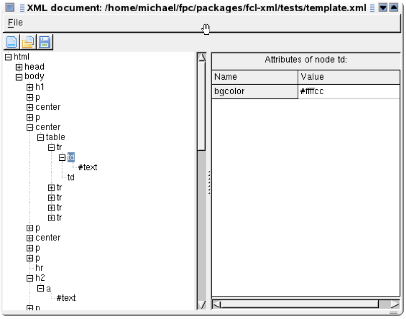
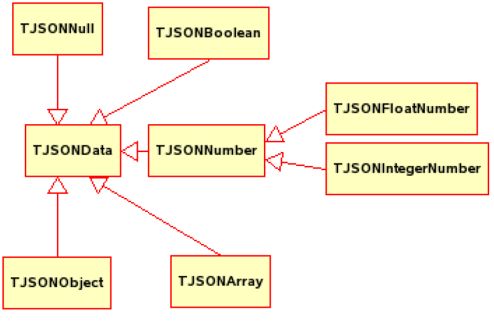
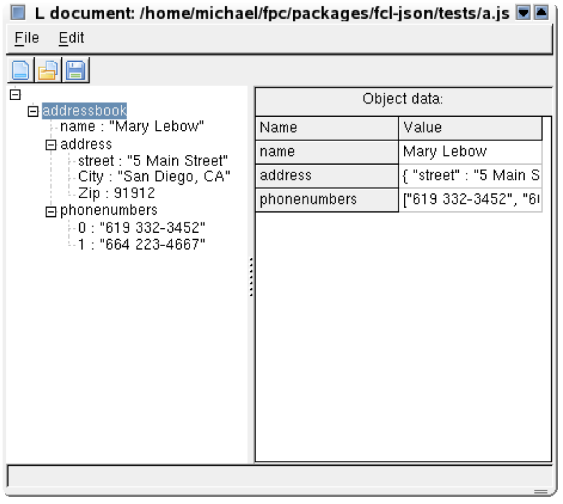

# Форматы веб-данных в Lazarus/FPC.[^1]

Michaël Van Canneyt, 30 июня 2018г.

(перевод Zoltanleo, aka Док)


**Аннотация**. 
В наши дни трудно избежать контакта с популярными форматами веб-данных, такими как XML и - совсем недавно - JSON. К счастью, Lazarus и FPC оснащены набором инструментов для обработки и вывода этих форматов. Обзор.


## Вступление.

В эпоху, когда такие слова, как SOA, Webservices и SOAP и AJAX считаются стандартными инструментами каждого программиста, трудно избежать строительных блоков, на которых построены эти концепции. Формат данных XML является краеугольным камнем, на котором строятся эти технологии: текстовый формат кодирования и структурирования данных. Он сильно стандартизирован консорциумом W3, который сделал его форматом выбора для передачи данных. FPC/Lazarus поставляется с набором инструментов, которые реализуют некоторые стандарты и рекомендации консорциума W3: DOM, XPath.  

По мере того, как стандарты `XML` становятся все более и более сложными - и, следовательно, громоздкими - `JSON` (JavaScript Object Notation) стал вторым стандартом для формата данных: он подходит в первую очередь для передачи данных в веб-браузер, где JavaScript можно легко разобрать и использовать как родной способ чтения данных: сам движок JavaScript может быть использован для анализа данных и преобразования их в javascript.  

В то время как обозначение `JSON` для данных на самом деле бесполезно за пределами браузера, веб-сервер приложение должно быть в состоянии генерировать его, так чтобы браузер мог прочитать его. Помимо (чрезвычайно простых) спецификаций формата, существует немного стандартов, которые должны быть реализованы, поэтому реализация JSON FPC была создана таким образом, чтобы данные, которые необходимо отправить, были просты в создании и обработке.  

В этой статье будут обсуждаться реализации, доступные в FPC/Lazarus для обработки `XML` и `JSON`. Обсуждаться будут не сами форматы XML и JSON, а только как именно эти форматы можно обрабатывать.


## XML: способ DOM.

Консорциум W3 создал спецификацию для представления XML-документа в памяти: `DOM` (^англ.^Document Object Model, или ^рус.^объектная модель документа)[^2] . Free Pascal содержит реализацию DOM Level 1 (с некоторыми расширениями DOM level 2) в модуле `DOM`. Работать с `DOM` легко, но требуется, чтобы документ всегда был полностью в памяти.

DOM представляет документ `XML` в виде дерева узлов (класса `TDomNode`): все части документа описываются с использованием потомков TDOMNode. Какую это часть, видно из свойства `NodeType` класса `TDOMNode`: у каждого потомка есть свое значение `NodeType`. Основные потомки `TDOMNode` с их `NodeTypes` можно найти в таблице 1.

**Таблица 1: Основные типы и их типы узлов**

| **Класс** | **Тип узла** | **Представляемые ими данные** |
| :-------: | :----------: | :---------------------------: |
| **TDOMElement**    | ELEMENT_NODE | тэг XML |
| **TDOMAttr** | ATTRIBUTE_NODE | атрибут тэга XML |
| **TDOMText** | TEXT_NODE | текст, заключенный в тэги XML |
| **TDOMComment** | TEXT_NODE | XML-комментарий |
| **TDOMCDATASection** | CDATA_SECTION_NODE | раздел CDATA |

Каждый узел может иметь несколько дочерних узлов, и дерево узлов можно полностью просмотреть с помощью следующих методов функции `TDOMNode`:
- `FirstChild` возвращает первый дочерний элемент `TDOMNode`.
- `LastChild` возвращает последнего потомка `TDOMNode`.
- `NextSibling` возвращает следующий узел на том же уровне текущего `TDOMNode`.
- `PreviousSibling` возвращает предыдущий узел на том же уровне текущего `TDOMNode`.

Полный документ `XML` представлен классом `TDOMLDocument`. Он содержит свойство `DocumentElement`, которое имеет тип `TDOMElement`, и содержит экземпляр первого элемента в документе XML. Класс `TDOMNode` содержит свойство `OwnerDocument`, которое указывает на экземпляр `TDOMDocument`, частью которого он является. Потомок `TXMLDocumen`t имеет некоторые дополнительные свойства для описания кодировки, таблицы стилей и т. Д. В дальнейшем будет использоваться `TXMLDocument`, но большинство методов фактически определены в `TDOMDocument`.

Поскольку экземпляр `TXMLDocument` является владельцем всех узлов, он также отвечает за создание узлов. Для этого есть следующие методы создания узлов:
```pascal
function CreateElement(const tagName: DOMString): TDOMElement; 
function CreateTextNode(const data: DOMString): TDOMText; 
function CreateComment(const data: DOMString): TDOMComment; 
function CreateCDATASection(const data: DOMString): TDOMCDATASection; 
function CreateAttribute(const name: DOMString): TDOMAttr;
```
После создания узла его можно вставить в дерево документа одним из следующих методов `TDOMNode`:
```pascal
function InsertBefore(NewChild, RefChild: TDOMNode): TDOMNode; 
function ReplaceChild(NewChild, OldChild: TDOMNode): TDOMNode; 
function RemoveChild(OldChild: TDOMNode): TDOMNode; 
function AppendChild(NewChild: TDOMNode): TDOMNode;
```
Вооружившись приведенными выше определениями, можно сделать простое приложение для просмотра и редактирования документа `XML`. Логично представить XML-документ в виде древовидной структуры с элементами и текстами в качестве узлов в дереве.


## Простой просмотрщик XML.

Приложение для просмотра `XML` состоит из единой формы с меню, которое содержит обычные пункты меню файлов (новый, открыть, сохранить и «сохранить как»), и панели инструментов с теми же двумя действиями, что и у меню. Оставшаяся часть формы заполнена экземпляром `TTreeView` (TVXML), который покажет документ `XML`, и экземпляром `TPanel` (PDetails), который будет использоваться для отображения сведений о текущем узле.

Чтобы заполнить древовидную структуру содержимым `TXMLDocument`, воспользуемся следующим кодом:
```pascal
procedure TMainForm.ShowDocument(AXML: TXMLDocument); 
begin 
  with TVXML.Items do 
  begin 
    BeginUpdate; 
    try 
      Clear; 
      if Assigned(AXML.DocumentElement) then 
      begin 
        ShowNode(Nil,AXML.DocumentElement);
        TVXML.Selected:=TVXML.Items.GetFirstNode; 
      end; 
    finally 
      EndUpdate; 
    end;
  end; 
end;
```
Код довольно прост: он очищает древовидную структуру, а затем позволяет методу `ShowNode` выполнять фактическую работу, начиная с узла `DocumentElement`. `ShowNode` - это простая процедура с рекурсией:
```pascal
procedure TMainForm.ShowNode(AParent: TTreeNode; E: TDomNode);
var
  N: TTreeNode;
  D: TDomNode;
begin
  N:= TVXML.Items.AddChild(AParent,E.NodeName);
  N.Data:= E;
  D:= E.FirstChild;

  while (D <> nil) do
  begin
    case D.NodeType of
      ELEMENT_NODE: ShowNode(N,D);
         TEXT_NODE: ShowNode(N,D);
    end;
    D:= D.NextSibling;
  end;
end;
```
Первое, что делается, это создается узел в древовидном представлении для отображения `TDOMNode`. Свойство `NodeName` используется в качестве текста для узла. Для экземпляра `TDOMElement` это имя тега. Для экземпляра `TDOMText` это фиксированный текст `#text`. После этого дочерние узлы просматриваются с помощью `FirstChild` и `NextSibling`, и они добавляются во вновь созданный узел, вызывая `ShowNode`. Обратите внимание, что `ShowNode` вызывается только для дочерних узлов типа `ELEMENT_NODE` и `TEXT_NODE`. Это означает, что атрибуты не отображаются в дереве.

Вышеупомянутых двух коротких процедур достаточно, чтобы отобразить XML-документ в TreeView. Для отображения содержимого узла используется панель. Когда узел выбран в дереве, происходит событие` OnSelectionChanged`:
```pascal
procedure TMainForm.TVXMLSelectionChanged(Sender: TObject);
begin
  ClearNodeData;
  if Assigned(TVXML.Selected) and Assigned(TVXML.Selected.Data) then
    ShowNodeData(TDomNode(TVXML.Selected.Data))
    else
    PDetails.Caption:=SSelectNode;
end;
```
`ClearNodeData` очищает содержимое панели `PDetails`, удаляя все элементы управления в ней:
```pascal
procedure TMainForm.ClearNodeData;
begin
  with PDetails do
    while (ControlCount > 0) do Controls[0].Free;
end;
```
Элементы управления на панели `PDetails` создаются кодом в вызове `ShowNodeData`, где также создается путь к текущему узлу и отображается в строке состояния:
```pascal
procedure TMainForm.ShowNodeData(N: TDomNode);
var
  P: TDomNode;
  S: String;
begin
  PDetails.Caption:= '';
  P:= N;
  S:= '';
  while (P <> nil) and not (P is TXMLDocument) do
  begin
    if S <> '' then S:= '/' + S;
    S:= P.NodeName + S;
    P:= P.ParentNode;
  end;

  SBXML.SimpleText:= Format(SCurrentNode,[S]);

  case N.NodeType of
       TEXT_NODE: ShowTextData(N as TDomText);
    ELEMENT_NODE: ShowElementData(N as TDomElement);
  end;
end;
```
Как видно, для текстового узла реальная работа происходит в вызове `ShowTextData`:  
```pascal
procedure TMainForm.ShowTextData(N: TDomNode);
var
  M: TMemo;
begin
  DataTopLabel(SNodeText);
  M:= TMemo.Create(Self);
  M.Parent:= PDetails;
  M.Lines.Text:= N.NodeValue;
  M.Align:= alClient;
end;
```
Процедура `DataTopLabel` показывает метку, выровненную по верхнему краю панели `PDetail`. Остальная часть кода показывает `TMemo` в остальной части панели и устанавливает его текст в свойстве `NodeValue` `TDOMNode`. Для текстового узла это фактический текст узла.

Вызов `ShowElementData`, используемый для отображения элемента `TDOME`, немного сложнее, поскольку он должен отображать все атрибуты элемента:
```pascal
procedure TMainForm.ShowElementData(E: TDomElement);
var
  L: TLabel;
  G: TStringGrid;
  I: Integer;
  N: TDomNode;
begin
  DataTopLabel(Format(SNodeData,[E.NodeName]));
  G:= TStringGrid.Create(Self);
  G.Parent:= PDetails;
  G.Align:= alClient;
  G.RowCount:= 2;
  G.ColCount:= 2;
  G.Cells[0,0]:= SAttrName;
  G.ColWidths[0]:= 120;
  G.Cells[1,0]:= SAttrValue;
  G.RowCount:= 1 + E.Attributes.Length;
  G.Options:= G.Options + [goColSizing];

  if (G.RowCount>0) then
    G.FixedRows:=1
  else
    G.FixedRows:=0;

  for I:=1 to E.Attributes.Length do
  begin
    N:= E.Attributes[i-1];
    G.Cells[0,I]:= N.NodeName;
    G.Cells[1,I]:= N.NodeValue;
  end;
end;
```
Как видно, он также показывает метку в верхней части панели, а в остальной части панели создается stringgrid с 2 столбцами, которая заполнена атрибутами элемента.

Теперь, когда данные в XML-документе могут быть показаны, все, что нужно сделать - это суметь прочитать их с диска. Спецификация DOM не определяет, как читать XML-документ. Реализация FPC для чтения XML-документа находится в отдельном модуле `XMLRead`. Чтобы прочитать XML-документ полностю, он содержит один перегруженный вызов:
```pascal
procedure ReadXMLFile(out ADoc: TXMLDocument; const AFilename: String);
procedure ReadXMLFile(out ADoc: TXMLDocument; var f: TStream);
```
Как можно видеть, XML-документ можно прочитать из потока, файла или текстового файла паскаля. Параметр `ADoc` должен быть `Nil` при входе. Когда документ будет полностью прочитан, этот параметр будет содержать экземпляр `TXMLDocument`. Программист несет ответственность за освобождение этого экземпляра, когда он закончит работать с ним. Если во время синтаксического анализа документа возникнет ошибка, будет сгенерировано исключение, и документ не будет возвращен.

В случае, если необходимо прочитать не полный XML-документ, а только его часть, следует использовать `ReadXMLFragment`:
```pascal
procedure ReadXMLFragment(AParentNode: TDOMNode; const AFilename: String);
procedure ReadXMLFragment(AParentNode: TDOMNode; var f: TStream);
```
Эти процедуры будут читать фрагмент XML - это должен быть один или несколько полных элементов и все элементы под ним - и вставлять его как дочерние элементы `AParentNode`.

Для вооруженного этими методами код для чтения файла с диска становится довольно простым:
```pascal
procedure TMainForm.OpenFile(AFileName: String);
var
  ADoc: TXMLDocument;
begin
  ReadXMLFile(ADoc,AFileName);
  if Assigned(FXML) then FreeAndNil(FXML);
  FXML:= ADoc;
  SetFileName(AFileName);
  ShowDocument(FXML);
end;
```
Если вызов `ReadXMLFile` был успешным, текущий XML-документ (сохраненный в FXML) освобождается, а затем заменяется вновь прочитанным документом. Наконец, вызов `ShowDocument` используется для отображения документа в дереве. Вызов `SetFileName` сохраняет имя файла и показывает его в строке заголовка формы.

Подобно чтению, `TXMLDocument` может быть записан в файл, используя процедуры в модуле `XMLWrite`:
```pascal
procedure WriteXMLFile(doc: TXMLDocument; const AFileName: String);
procedure WriteXMLFile(doc: TXMLDocument; var AFile: Text);
procedure WriteXMLFile(doc: TXMLDocument; AStream: TStream);
```
Код в проводнике XML представляет собой две простые строки:
```pascal
procedure TMainForm.SaveToFile(AFileName: String);
begin
  WriteXMLFile(FXML,AFileName);
  SetFileName(AFileName);
end;
```
Это все, что нужно для того, чтобы приложение для просмотра XML работало. При запуске он должен выглядеть как на рисунке 1.

| Рисунок 1: Приложение для просмотра XML                      |
| ------------------------------------------------------------ |
|  |

Чтобы продемонстрировать возможности манипулирования моделью DOM, будет добавлен некоторый код для добавления текстовых узлов или узлов элементов в дерево DOM. Для этого создается новый элемент меню и кнопка на панели инструментов, которая создаст новый элемент относительно текущего элемента. Код, выполняемый пунктом меню, будет выглядеть следующим образом:
```pascal
procedure TMainForm.ANewElementExecute(Sender: TObject);
var
  P,N: TDomNode;
  PT: TTreeNode;
begin
  P:= nil;
  PT:= TVXML.Selected;
  if Assigned(PT) then
    P:= TDOMNode(PT.Data)
  else
    P:= FXML;

  N:= NewElement(P,PT);

  if (N <> nil) then
  begin
    ClearNodeData;
    ShowNodeData(N);
  end;
end;
```
Сначала определяется текущий dom-узел. Если ничего не найдено (например, когда документ пуст), то сам документ устанавливается как текущий узел dom (TXMLDocument также является потомком `TDOMNode`). Вызов `NewElement` выполняет реальную работу. Если он возвращает узел, то отображаются данные узла.

Настоящая работа происходит в функции `NewElement`:
```pascal
function TMainForm.NewElement(P: TDomNode; PT: TTreeNode): TDomNode;
var
  N,NN: TDomNode;
  NT: integer;
  NL: TNodeLocation;
  S: String;
  TN: TTreeNode;
begin
  Result:= nil;
  with TNewNodeForm.Create(Self) do
  try
    HaveParent:= P.ParentNode <> nil;
    if (ShowModal <> mrOK) then Exit;

    NT:= NodeType;
    NL:= NodeLocation;
    S:= NodeText;
  finally
    Free;
  end;
end;
```
Эта первая часть только собирает данные: в ней отображается диалоговое окно (`TNewNodeForm`, его детали не имеют отношения к обсуждению), в котором спрашивается, какой тип узла должен быть создан, где он должен быть создан и какой текст он должен содержать. С этими данными фактическая работа сделана. Сначала создается узел. Для этого используется вызов `TXMLDocument`:
```pascal
case NT of
 ELEMENT_NODE: N:= FXML.CreateElement(S);
    TEXT_NODE:
          begin
            N:= FXML.CreateTextNode(S);
            NL:= nlLastChild;
          end;
end;

if (P.NodeType = TEXT_NODE) then nl:= nlReplaceCurrent;
```
Когда узел создается, местоположение узла используется для определения того, где в дереве DOM должен быть вставлен новый узел. Возможны не все комбинации: текстовый узел всегда является листовым узлом (то есть он всегда должен быть единственным дочерним узлом от своего родителя). Некоторые проверки сделаны для этого.

После этого узел вставляется в дерево DOM, и одновременно обновляется древовидная структура:
```pascal
case NL of
     nlFirstChild:
                  begin
                    NN:= P.FirstChild;
                    if (NN <> nil) then
                      P.InsertBefore(N,NN)
                    else
                      P.AppendChild(N);

                    TN:= TVXML.Items.AddChildFirst(PT,N.NodeName);
                  end;
      nlLastChild:
                  begin
                    P.AppendChild(N);
                    TN:= TVXML.Items.AddChild(PT,N.NodeName);
                  end;
  nlBeforeCurrent:
                  begin
                    P.ParentNode.InsertBefore(N,P);
                    TN:= TVXML.Items.Insert(PT,N.NodeName);
                  end;
 nlReplaceCurrent:
                  begin
                    P.ParentNode.ReplaceChild(N,P);
                    PT.Text:= N.NodeName;
                    TN:= PT;
                  end;
  end;{case..of}

  TN.Data:= N;
  TVXML.Selected:= TN;
  Result:= N;
```
Код для изменения свойств узла (текста или атрибутов) оставлен на усмотрение заинтересованного читателя.

Для навигации и поиска узлов в дереве документов XML W3 создал спецификацию `XPath`[^3]. Модуль `XPath`, поставляемый с Free Pascal, содержит реализацию этой спецификации. Основной функцией этого модуля является вызов `EvaluateXPathExpression`:
```pascal
function EvaluateXPathExpression(const AExpressionString: DOMString; AContextNode: TDOMNode): TXPathVariable;
```
Эта функция оценивает выражение `XPath`, начиная с` AContextNode`, и возвращает результат в виде экземпляра `TXPathVariable`. Класс `TXPathVariable` является базовым классом для всех результатов `XPath`, есть много потомков этого класса, каждый из которых представляет возможный результат запроса (который может быть числом, текстом, набором узлов и т. Д.)

Полное обсуждение `XPath` выходит за рамки этой статьи, но будет дан небольшой пример, чтобы показать, как его можно использовать для быстрого поиска узла в дереве: для этого пункт меню `Go to node` («Перейти к узлу») сделано под меню `Edit` («Правка»). При нажатии выполняется следующий код:
```pascal
procedure TMainForm.AGotoExecute(Sender: TObject);
var
  S: String;
  V: TXPathVariable;
  N: TNodeSet;
begin
  if Assigned(FXML.DocumentElement) then
    S:='/' + FXML.DocumentElement.NodeName
  else
    S:= '';

  if InputQuery(SGoto,SSpecifyPath,S) then
  begin
    V:= EvaluateXPathExpression(S,FXML);

    try
    if not (V is TXPathNodeSetVariable) then
      ShowMessage(SErrNotaNode)
    else
      begin
      N:= V.AsNodeSet;

      if (N.Count <> 1) then
        ShowMessage(SErrSingleNode)
      else
        GotoNode(TDOMNode(N.Items[0]));
      end;
    finally
      V.Free;
    end;
  end;
end;
```
Сначала определяется местоположение корневого узла для операции поиска (это может быть расширено, например, для поиска, начинающегося на текущем узле). Это значение используется для запроса пользователя о поиске пути. Затем путь передается вызову `EvaluateXPathExpression` вместе с документом XML в качестве корня операции поиска. Если результат имеет тип `TXPathNodeSetVariable`, то оценка выражения `XPath` привела к одному или нескольким узлам DOM. Набор узлов результата возвращается как свойство `AsNodeSet`, которое представляет собой `TList`. Если список содержит один узел, он передается в вызов `GotoNode`, который отображает узел в дереве.

Средство просмотра XML можно использовать для проверки, например, файла с информацией о проекте Lazarus (`.lpi`) в формате XML. Следующий путь:
```bash
/CONFIG/ProjectOptions/Units/Unit1/Filename
```
Развернется узел, содержащий имя файла первого модуля в проекте. Выражение `XPATH`
```bash
/CONFIG/ProjectOptions/Units/*/Filename
```
Результатом будет набор узлов с именами всех модулей в проекте. Поскольку в дереве может отображаться только один узел, это может привести к сообщению об ошибке.


## JSON: структуры данных.

Спецификация `JSON` (JavaScript Object Notation)[^4] гораздо проще, чем спецификации XML: она помещается на одном листе бумаги. Спецификация ориентирована на использование в браузерах: действительно, JSON был задуман для быстрой отправки структурированных данных в браузер без необходимости сложных структур DOM и парсеров. Вместо этого встроенный механизм `JavaScript` используется для преобразования данных `JSON` в объект `JavaScript`, готовый для использования в браузере. Эта простота и скорость, вероятно, объясняют его быстрое принятие программистами веб-приложений - особенно в не корпоративных условиях.

Ниже приведен пример данных `JSON`:
```json
{
 "addressbook": {"name": "Mary Lebow", 
     "address": {"street": "5 Main Street",  "city": "San Diego, CA", "zip": 91912 }, 
"phoneNumbers": ["619 332-3452","664 223-4667"]} 
}
```
Который в XML будет представлен, например, как:
```xml
<addressbook>
 <name>Mary Lebow</name>
 <address><street>5 Main Street</street>
          <city zip="91912">San Diego, CA</city>
          <phoneNumbers><phone>619 332-3452</phone>
                        <phone>664 223-4667</phone>
          </phoneNumbers>
 </address>
</addressbook>
```
(пример взят [отсюда](https://www.oracle.com/technical-resources/articles/enterprise-architecture/introduction-json.html)(*прим.перев.:* в оригинальном документе [отсюда](https://www.json.org/json-en.html))).

Спецификация `JSON` описывает только текстовый формат данных, но не дает никаких спецификаций о том, как обрабатывать данные. Поскольку это `JavaScript`, в этом нет необходимости, так как данные преобразуются непосредственно в объекты и массивы `JavaScript`. Для других языков, таких как `Object Pascal`, спецификация отсутствует. Следовательно, реализация, предоставляемая Free Pascal, является не реализацией стандарта, а реализацией, которая, как полагают, проста для быстрого создания и проверки данных. Модуль `fpjson` содержит реализацию `JSON` для Free Pascal. Базовая структура объектов для реализации `JSON` показана на рисунке 2.

| Рисунок 2: Структура данных JSON в fpjson                    |
| ------------------------------------------------------------ |
|  |

Базовый класс - `TJSONData`. Он имеет следующие свойства:
- `JSONType` - перечислимый, который содержит тип данных для этого объекта.
- `IsNull` равен `True`, если значение равно `NULL`.
- `AsBoolean` - значение данных как логическое значение.
- `AsInteger` - значение данных в виде целого числа.
- `AsFloat` - значение данных как `double` или `extended`.
- `AsString` - значение данных в виде строки.
- `Count` - количество элементов, содержащихся в этом элементе данных. Очевидно, это будет только ненулевое значение для объектов и массивов.
- `Items` - это свойство массива предоставляет доступ к элементам, содержащимся в этом элементе данных. Каждый элемент является потомком `TJSONData`. Обратите внимание, что элементы могут быть разных типов: массив может содержать смесь целых чисел, строк, нулевых значений.
- `AsJSON` возвращает содержимое значения (и его вложенных значений, если это массив или объект) в виде строки `JSON`.

Потомки этого класса - по одному на тип данных `JSON`, как видно на рис.2, хранят фактические данные. Их конструктор принимает значение данных в качестве параметра. Чтобы создать строковое значение `JSON`, нужно выполнить следующий код:
```pascal
J:=TJSONString.Create('A string');
```
Конструкторы `TJSONObject` и `TJSONArray` опционально принимают массив констант и заполняют объект или массив значениями в массиве.
```pascal
Ja:=TJSONArray.Create([Nil, True, 1, 2.3, 'String']); 
Jo:=TJSONObject.Create(['a',1,'b',ja]);
```
Обратите внимание, что конструктору `TJSONObject` нужны аргументы в парах: `имя` (всегда строка) и `значение` (почти любой допустимый базовый тип `JSON`). Из примера также видно, что массив также может содержать другие экземпляры `TJSONData`.

Тип массива `TJSONArray` также можно манипулировать с помощью простых вызовов `add`:
```pascal
function Add(Item: TJSONData): Integer;
function Add(I: Integer): Integer;
function Add(S: String): Integer;
function Add: Integer;
function Add(F: TJSONFloat): Integer;
function Add(B: Boolean): Integer;
function Add(AnArray: TJSONArray): Integer;
function Add(AnObject: TJSONObject): Integer;
procedure Delete(Index: Integer);
procedure Remove(Item: TJSONData);
```
Вызовы `Add` заботятся о создании правильного потомка `TJSONData`. Значение вызовов `Delete` и `Remove` должно быть ясным. Аналогичные вызовы существуют для класса `TJSONObject`, но они принимают дополнительный аргумент: имя добавляемого элемента. 
Вооружившись всеми этими вызовами, приведенные выше данные `JSON` могут быть сформированы следующим образом:
```pascal
procedure TestLong;
var
  JAB,J,JA: TJSONObject;
  JT: TJSONArray;
begin
  JA:=TJSonObject.Create;
  JA.Add('street','5 Main Street');
  JA.Add('City','San Diego, CA');
  JA.Add('Zip',91912);
  JT:=TJSonArray.Create;
  JT.Add('619 332-3452');
  JT.Add('664 223-4667');

  J:= TJSONObject.Create;
  J.Add('name','Mary Lebow');
  J.Add('address',JA);
  J.Add('phonenumbers',JT);

  JAB:= TJSONObject.Create;
  JAB.Add('addressbook',J);
  Writeln(JAB.AsJSON);
  JAB.Free;
end;
```
Или короче:
```pascal
procedure TestShort;
var
  JAB,J,JA: TJSONObject;
  JT: TJSONArray;
begin
  JA:= TJSonObject.Create(['street','5 Main Street',
                          'City','San Diego, CA',
                          'Zip',91912]);
  JT:= TJSonArray.Create(['619 332-3452','664 223-4667']);
  J:= TJSONObject.Create(['name','Mary Lebow',
                          'address',JA,'phonenumbers',JT]);
  JAB:= TJSONObject.Create(['addressbook',J]);
  Writeln(JAB.AsJSON);
  JAB.Free;
end;
```
Это можно сделать еще короче без вспомогательных переменных, но тогда код становится нечитаемым. Быстрая проверка выходных данных убедит любого, что выходные данные одинаковы в обоих случаях и соответствуют приведенному выше образцу `JSON`.

Обратите внимание, что последнее процедура:
```pascal
JAB.Free
```
освобождает также все другие созданные объекты: `TSJONArray` или `TJSONObject` владеет содержащимися в нем элементами.

Запись `TJSONFile` чрезвычайно проста, как видно из тестового кода выше: метод `AsJSON` возвращает строку, описывающую данные `JSON` в допустимом формате `JSON`. Единственное, что нужно сделать, это записать ее в поток.

Для чтения данных `JSON` модуль `jsonparser` содержит класс `TJSONParser`. Он содержит один вызов: `Parse`, который возвращает экземпляр `TJSONData`, соответствующий данным `JSON`, которые он считывает из строки или потока, который может быть указан в конструкторе класса.


## Просмотрщик данных JSON.

Подобно средству просмотра `XML`, средство просмотра данных `JSON` может быть закодировано. Общий код и логика программы такие же, как у программы просмотра `XML`. Только некоторые подробные процедуры изменены.

Например, вызов для чтения данных `JSON` из файла выглядит следующим образом:
```pascal
procedure TMainForm.OpenFile(AFileName : String);
var
  J: TJSONData;
  F: TFileStream;
begin
  F:= TFileStream.Create(AFileName,fmOpenRead);
  try
    with TJSONParser.Create(F) do
    try
      J:= Parse;
    finally
      Free;
    end;
  finally
    F.FRee;
  end;

  if J.JSONType <> jtObject then
    Raise Exception.Create(SErrNoJSONObject);

  if Assigned(FJSON) then FreeAndNil(FJSON);

  FJSON:= J as TJSONObject;
  SetFileName(AFileName);
  ShowObject(FJSON);
end;
```
Переменная `FXML`, существовавшая в средстве просмотра `XML`, была заменена на переменную `FJSON` типа `TJSONObject`. Обратите внимание на проверку, является ли возвращаемый `TJSONParser` объект `TJSONObject`. Анализатор также может возвращать простой тип, и он не может отображаться в виде дерева.

Вызов для построения дерева очень похож на его XML-сережку - это простой рекурсивный алгоритм:
```pascal
function TMainForm.ShowNode(AParent: TTreeNode; AName: String; J: TJSONData): TTreeNode;
var
  O: TJSONObject;
  I: Integer;
begin
  if not (J.JSONType in [jtArray,jtObject]) then
    AName:= AName+ ' : ' + J.AsJSON;
  Result:= TVJSON.Items.AddChild(AParent,AName);
  Result.Data:= J;

  if (J.Count <> 0) then
  begin
    if (j is TJSONObject) then
      begin
        O:= J as TJSONObject;
        for I:= 0 to O.Count-1 do
        ShowNode(Result,O.Names[i],O.Items[i]);
      end
    else
      if (j is TJSONArray) then
      begin
        for I:= 0 to J.Count-1 do
        ShowNode(Result,IntToStr(I),J.Items[i]);
      end;
  end;
end
```
Обратите внимание, что каждый узел отображается со своим добавленным значением, если это простой тип. Элементы массива отображаются с их индексом в качестве имени узла, а элементы объекта отображаются с их именем.

Отображение данных узла на панели сведений происходит так же, как и для средства просмотра `XML`. Код ниже показывает, как это делается для массива `JSON`:
```pascal
procedure TMainForm.ShowArrayData(A : TJSONArray);
var
  G: TStringGrid;
  I: Integer;
  J: TJSONData;
begin
  DataTopLabel(SArrayData);
  G:= TStringGrid.Create(Self);
  G.Parent:= PDetails;
  G.Align:= alClient;
  G.FixedCols:= 0;
  G.RowCount:= 2;
  G.ColCount:= 1;
  G.Cells[0,0]:= SElementValue;
  G.RowCount:= 1 + A.Count;
  G.Options:= G.Options + [goColSizing];

  if (G.RowCount>0) then
    G.FixedRows:=1
  else
    G.FixedRows:=0;

  for I:= 1 to A.Count do
  begin
    J:= A.Items[i-1];
    if (J.JSONType in [jtArray,jtObject,jtNull]) then
      G.Cells[0,I]:= J.AsJSON
    else
      G.Cells[0,I]:= J.AsString;
  end;
end;
```
Как видно, массив отображается в виде сетки с одним столбцом: каждый элемент массива находится в строке. Если это простой тип (булево, число или строка), то отображается значение. Для сложных типов отображается представление `JSON`.

Для отображения объектов на панели сведений используется та же логика, но сетка содержит 2 столбца: первый содержит имя каждого элемента в объекте, второй отображает значение.

Наконец, что не менее важно, новое значение может быть добавлено в дерево. Метод `NewElement` основной формы позаботится об этом:
```pascal
function TMainForm.NewElement(P: TJSONData; PT: TTreeNode): TJSONData;
var
  NT: TJSonType;
  EN,EV: String;
  TN: TTreeNode;
  I: Integer;
begin
  Result:= nil;

  with TNewElementForm.Create(Self) do
  try
    NeedName:= P is TJSONObject;
    if (ShowModal <> mrOK) then Exit;
    NT:= DataType;
    EN:= ElementName;
    EV:= ElementValue;
  finally
    Free;
  end;
end;
```
В этой первой части отображается диалоговое окно для запроса у пользователя значения, которое следует добавить. Обратите внимание, что свойство `NeedName` `TElementForm` решает, должен ли пользователь вводить имя для значения или нет: в случае добавления нового значения к объекту новое значение также должно получить имя.

После того, как все данные были получены от пользователя, новое значение может быть действительно создано и добавлено в родительский объект. Поскольку модуль `fpjson` содержит 2 типа для числового значения `JSON`, требуется некоторая логика, чтобы увидеть, следует ли создавать число с плавающей запятой или целое число:
```pascal
case NT of
    jtNumber: if TryStrToInt(EV,I) then
                Result:= TJSONIntegerNumber.Create(i)
              else
                Result:= TJSONFloatNumber.Create(StrToFloat(EV));
      jtNull: Result:= TJSONNull.Create;
    jtString: Result:= TJSONString.Create(EV);
   jtBoolean: Result:= TJSONBoolean.Create(StrToBool(EV));
     jtArray: Result:= TJSONArray.Create;
    jtObject: Result:= TJSONObject.Create;
    end;

    if P is TJSONObject then
      (P as TJSONObject).Add(EN,Result)
    else if (P is TJSONArray) then
          (P as TJSONArray).Add(Result);
    TN:= ShowNode(PT,EN,Result);
    TVJSON.Selected:= TN;
```
Приведенный выше код показывает использование конструкторов всех доступных типов `JSON`, последние строки - как и в средстве просмотра `XM`L - просто показывают недавно добавленный узел.

XPATH-сережка для `JSON` отсутствует, поэтому метод перехода к определенному значению `JSON` недоступен, но такой метод может быть легко создан при необходимости. На этом просмотрщик данных `JSON` завершен, и он должен выглядеть более или менее так, как показано на рис. 3, где отображаются примеры данных, представленные выше.

| Рисунок 3: Приложение просмотра JSON                         |
| ------------------------------------------------------------ |
|  |


## Заключение.

Несмотря на то, что Object Pascal не является языком с динамической типизацией и, следовательно, не воспринимается как язык, подходящий для Интернета, существует множество инструментов, доступных для обработки форматов данных, которые обычно используются для передачи данных в веб-приложениях. Инструменты, представленные в этой статье, являются только инструментами, которые поставляются с Free Pascal/Lazarus по умолчанию: доступно много других, каждый со своими акцентами, но все они одинаковы по своей общей структуре. Все эти инструменты показывают, что Object Pascal прекрасно способен обрабатывать динамические данные и обладает дополнительным преимуществом обеспечения безопасности типов в коде - что очень важно для программистов на Паскале.


[^1]: Данная статья является переводом статьи Michaël Van Canneyt "Web data formats in Lazarus/FPC", оригинальный текст которой можно увидеть здесь https://www.freepascal.org/~michael/articles/webdata/webdata.pdf. Автор любезно предоставил свое разрешение на свободное распространение данного перевода при условии предоставлении ему полного текста.
[^2]: https://www.w3.org/TR/REC-DOM-Level-1
[^3]: https://www.w3.org/TR/xpath20
[^4]: https://www.json.org/json-ru.html (в оригинальном документе https://www.json.org/json-en.html)